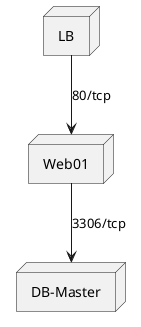

# {{系统/服务}} 运维手册

> **环境类型**：{{开发/测试/生产}} | **维护等级**：SLA {{99.9%/99.99%}}  
> **运维团队**：{{团队名称}} | **最后演练**：{{YYYY-MM-DD}}  

## 1. 系统概况
### 架构拓扑


### 资源清单
| 组件 | 实例数 | 规格 | 部署位置 |
|------|--------|------|----------|
| {{Nginx}} | 2 | 4C8G | {{AZ1}} |
| {{MySQL}} | 3 | 8C16G | {{跨AZ}} |

## 2. 日常运维
### 常用命令
```bash
# {{查看服务状态}}
systemctl status {{服务名}}

# {{日志查看}}
journalctl -u {{服务名}} --since "1 hour ago"
```

### 监控指标
| 指标项 | 采集方式 | 告警阈值 |
|--------|----------|----------|
| {{CPU}} | node_exporter | >90%持续5m |
| {{磁盘}} | telegraf | >85% |

## 3. 应急预案
### 故障处理流程
```mermaid
graph TD
    A[{{故障现象}}] --> B{{诊断步骤}}
    B --> C[{{解决方案A}}]
    B --> D[{{解决方案B}}]
```

### 回滚操作
```bash
# {{版本回退示例}}
ansible-playbook rollback.yml --tags="{{服务}}"
```

## 4. 变更管理
### 发布检查清单
- [ ] 备份数据库
- [ ] 验证配置变更
- [ ] 通知相关方

### 变更记录
| 日期 | 变更内容 | 操作人 | 结果 |
|------|----------|--------|------|
| {{YYYY-MM-DD}} | {{升级MySQL}} | {{姓名}} | {{成功}} |

---
> 💡 此模板适合系统运维文档，包含架构拓扑和应急预案。需要其他模板请告知。
