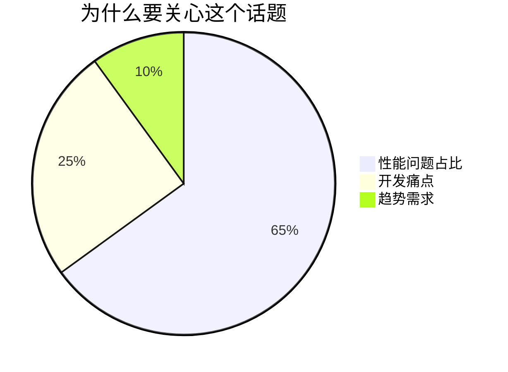

# {{文章标题}}

> **分类**：{{技术干货/经验分享}} | **难度**：{{⭐️⭐️⭐️}}  
> **发布时间**：{{YYYY-MM-DD}} | **预计阅读**：{{X}}分钟  
> **作者**：{{姓名}} | **评论互动**：{{允许/关闭}}  

## 开篇导语
### 背景说明


### 文章价值
✅ 你将学到：  
- {{知识点1}}  
- {{知识点2}}  

## 核心内容
### {{技术点解析}}
```{{语言}}
// 典型代码示例（带注释）
{{关键代码}}
```

### 对比分析
| 方案 | 优点 | 缺点 |
|------|------|------|
| {{A}} | {{高效}} | {{复杂}} |
| {{B}} | {{简单}} | {{性能低}} |

### 可视化辅助
```vega-lite
{
  "data": {"url": "data.json"},
  "mark": "line",
  "encoding": {
    "x": {"field": "date", "type": "temporal"},
    "y": {"field": "value", "type": "quantitative"}
  }
}
```

## 实践建议
### 避坑指南
❌ **常见错误**：  
`{{错误代码}}` → {{问题说明}}  

✅ **最佳实践**：  
`{{优化代码}}` + {{理由}}  

### 性能贴士
```text
💡 当{{条件}}时，建议：
1. {{优化策略1}}
2. {{优化策略2}}
```

## 互动环节
### 讨论问题
1. {{你在实践中遇到过类似问题吗？}}  
2. {{你认为哪种方案更适合你的场景？}}  

### 参考资料
- [{{官方文档}}]({{链接}})  
- {{相关工具}} GitHub仓库  

---
> 💡 此模板适合技术博客写作，平衡技术深度与可读性。需要其他模板请告知。
