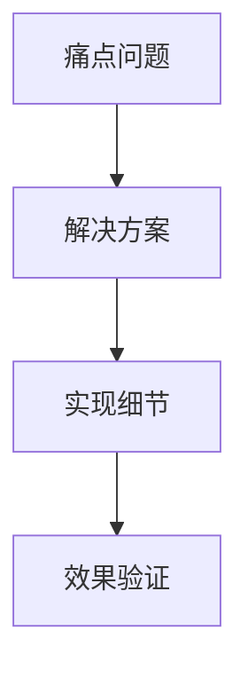
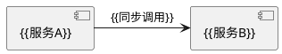

# {{演讲主题}}

> **活动类型**：{{技术大会/内部分享}} | **时长**：{{45}}分钟  
> **目标听众**：{{开发者/架构师}} | **难度**：{{中级}}  
> **演讲者**：{{姓名}} | **日期**：{{YYYY-MM-DD}}  

## 演讲结构
### 内容框架


### 时间分配
| 环节 | 时长 | 重点 |
|------|------|------|
| 问题引入 | 5min | {{引发共鸣}} |
| 技术解析 | 25min | {{核心创新点}} |
| Q&A | 10min | {{答疑}} |

## 演示内容
### 关键图表


### 代码片段
```{{语言}}
// 最核心的20行代码
{{精选代码}}
```

### 效果对比
```vega-lite
{
  "data": {"values": [
    {"方案": "旧版", "值": 120},
    {"方案": "新版", "值": 35}
  ]},
  "mark": "bar"
}
```

## 演讲技巧
### 过渡话术
- "这个问题让我们自然过渡到..."
- "你们可能会好奇..."

### 互动设计
❓ **提问点**：  
1. {{现场举手调查}}  
2. {{选择题投票}}  

### 备用内容
```text
当时间剩余时补充：
- {{扩展案例}}
- {{技术背后故事}}
```

## 资源准备
### 物料清单
- [ ] 演示环境测试
- [ ] 备用激光笔
- [ ] 印刷版FAQ手册

### 会后资料
```markdown
[幻灯片下载]({{链接}})
[示例代码]({{链接}})
```

---
> 💡 此模板适合技术演讲准备，包含内容设计和现场互动建议。需要其他模板请告知。
