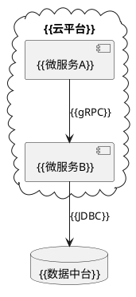

# {{解决方案名称}} 技术白皮书

> **文档类型**：技术方案/可行性分析 | **保密等级**：内部公开/机密  
> **目标读者**：架构师/开发者/决策者 | **版本**：v1.0-draft  
> **编写日期**：{{YYYY-MM-DD}} | **预计有效期**：{{1年}}

## 1. 方案概述
### 业务价值
```mermaid
graph LR
    A[{{痛点问题}}] --> B[{{技术方案}}]
    B --> C[{{预期收益}}]
```

### 技术雷达
| 维度 | 现状 | 改进后 |
|------|------|--------|
| 性能 | {{X}} TPS | {{Y}} TPS |
| 成本 | {{A}} 万元/年 | {{B}} 万元/年 |

## 2. 架构设计
### 技术全景


### 创新点说明
1. {{技术创新1}}（专利号：{{编号}}）
2. {{技术创新2}}（论文引用：{{文献}}）

## 3. 实施路径
### 阶段规划
```gantt
title 实施里程碑
section 基础建设
容器化改造 :done, 2025-01, 2025-03
section 智能升级
AI能力集成 :active, 2025-04, 2025-06
```

### 资源需求
| 角色 | 人月 | 技能要求 |
|------|------|----------|
| {{架构师}} | {{2}} | {{云原生设计}} |

## 4. 风险评估
### 风险矩阵
| 风险项 | 概率 | 影响 | 应对措施 |
|--------|------|------|----------|
| {{技术债}} | 中 | 高 | {{重构计划}} |

### 合规检查
```text
[ ] 符合{{GDPR}}要求
[ ] 通过{{等保2.0}}三级认证
```

## 5. 成功案例
### {{客户名称}}实施效果
```vega-lite
{
  "data": {"values": [
    {"metric": "响应时间", "before": 1200, "after": 350},
    {"metric": "运维成本", "before": 80, "after": 45}
  ]},
  "mark": "bar",
  "encoding": {
    "x": {"field": "metric"},
    "y": {"field": "value"}
  }
}
```

---
> 💡 此模板适合技术方案提案，包含商业价值和技术创新说明。需要其他模板请告知。
