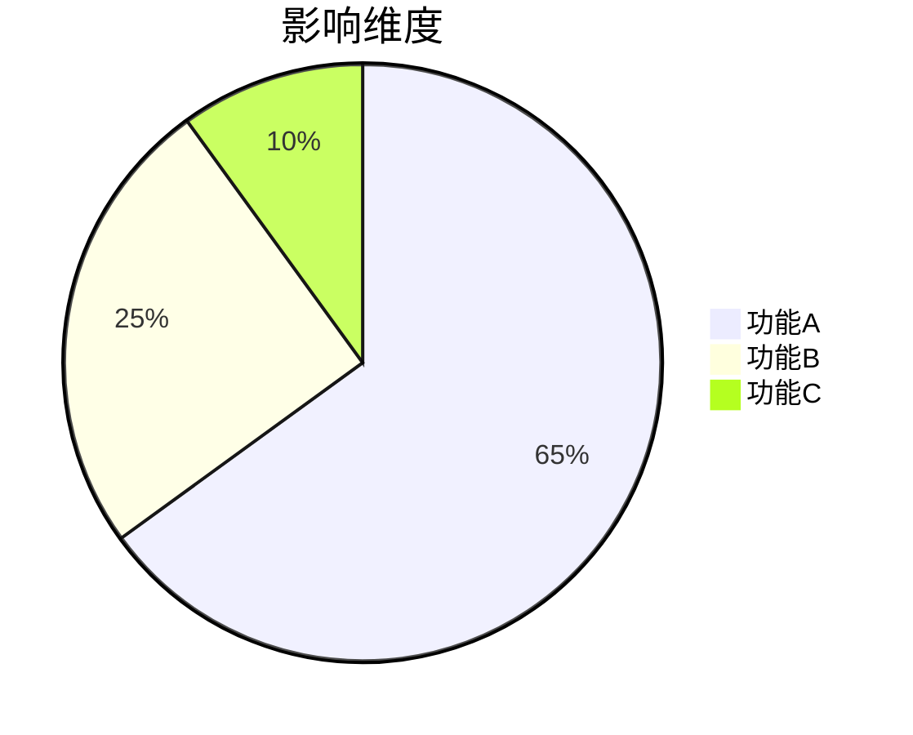

# {{问题类型}} 排查手册

> **适用环境**：{{操作系统/平台版本}} | **相关组件**：{{组件列表}}  
> **严重等级**：P{{0-4}} | **最后更新**：{{YYYY-MM-DD}}  
> **维护团队**：{{团队名称}} | **知识库编号**：KB-{{编号}}

## 1. 问题现象
### 典型表现
```log
{{错误日志片段}}
```

### 影响范围


## 2. 诊断流程
### 排查路线图
```mermaid
graph TD
    A[{{现象确认}}] --> B{{网络层检查}}
    A --> C{{应用层检查}}
    B --> D[{{tcpdump抓包}}]
    C --> E[{{日志分析}}]
```

### 关键检查项
```bash
# {{网络连通性测试}}
ping {{目标IP}} -c 4

# {{进程状态检查}}
ps aux | grep {{服务名}}
```

## 3. 解决方案
### 常规修复
```diff
# 配置修改示例
- {{错误配置项}}=old_value
+ {{正确配置项}}=new_value
```

### 应急措施
```bash
# {{临时规避方案}}
systemctl restart {{服务名}}
```

## 4. 验证方法
### 成功标准
| 检查项 | 预期结果 |
|--------|----------|
| {{API响应}} | HTTP 200 |
| {{数据一致性}} | 差异≤0.1% |

### 监控指标恢复
```vega-lite
{
  "data": {"url": "monitor.json"},
  "mark": "line",
  "encoding": {
    "x": {"field": "time", "type": "temporal"},
    "y": {"field": "success_rate", "scale": {"domain": [0, 100]}}
  }
}
```

## 5. 预防措施
### 配置规范
```yaml
# 必须配置项
{{关键参数}}:
  min_value: {{X}}
  max_value: {{Y}}
```

### 巡检脚本
```python
def check_{{风险点}}():
    {{自动化检查逻辑}}
```

---
> 💡 此模板适合技术问题排查文档，包含诊断流程图和预防措施。需要其他模板请告知。
