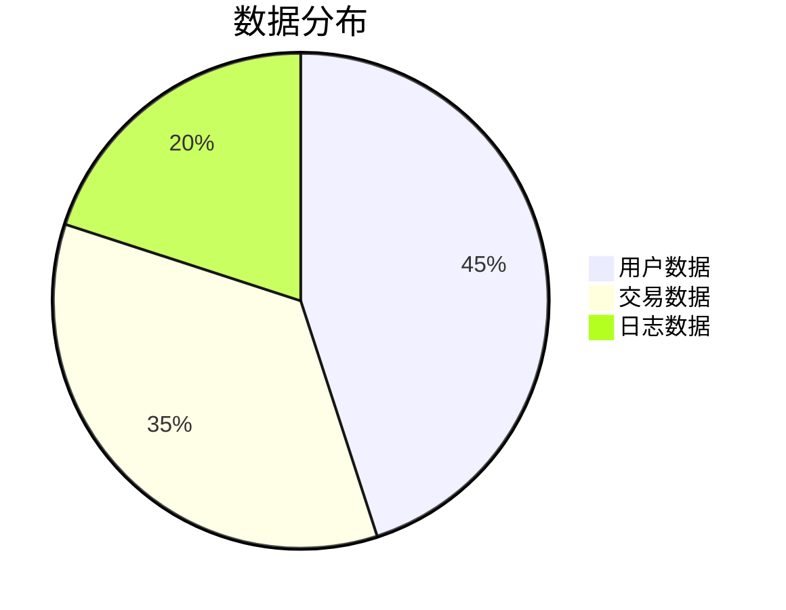
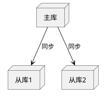

# {{数据库名称}} 设计文档

> **数据库类型**：{{MySQL/PostgreSQL/MongoDB}} | **版本**：{{v1.0}}  
> **字符集**：{{UTF-8}} | **维护者**：{{负责人}}  
> **最后更新**：{{YYYY-MM-DD}} | **数据量**：{{预估规模}}

## 1. 数据库概览
### 设计目标


### 拓扑结构


## 2. 表结构设计
### 核心表说明
```sql
-- {{表名}}（{{功能说明}}）
CREATE TABLE `{{table_name}}` (
    `id` BIGINT UNSIGNED NOT NULL AUTO_INCREMENT COMMENT '主键',
    `{{字段}}` {{类型}} {{约束}} COMMENT '{{说明}}',
    {{更多字段}}
    PRIMARY KEY (`id`),
    {{索引定义}}
) ENGINE={{引擎}} COMMENT='{{表注释}}';
```

### 表关系图
```mermaid
erDiagram
    {{表A}} ||--o{ {{表B}} : "{{关系类型}}"
    {{表A}} }|--|| {{表C}} : "{{关系类型}}"
```

## 3. 性能设计
### 索引策略
| 索引名称 | 字段组合 | 覆盖场景 |
|----------|----------|----------|
| {{idx_1}} | {{字段1,字段2}} | {{场景描述}} |
| {{idx_2}} | {{字段3}} | {{场景描述}} |

### 分库分表
| 策略 | 分片键 | 分片数 | 路由方式 |
|------|--------|--------|----------|
| {{水平分表}} | {{user_id}} | 16 | {{哈希取模}} |

## 4. 维护方案
### 备份策略
```yaml
backup:
  cron: "0 3 * * *"
  retain_days: 30
  storage: "{{OSS路径}}"
```

### 监控指标
| 指标 | 阈值 | 报警方式 |
|------|------|----------|
| {{CPU使用率}} | >80% | {{企业微信}} |
| {{慢查询数}} | >10/分钟 | {{邮件}} |

---
> 💡 此模板适合数据库设计文档，包含表结构、关系图和维护方案。需要其他模板请告知。
