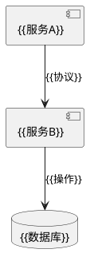

# {{系统名称}} 设计方案

> **版本**：v1.0 | **状态**：草案/审核/发布  
> **负责人**：{{姓名}} | **最后更新**：{{YYYY-MM-DD}}  
> **技术栈**： 

## 1. 设计目标
```mindmap
- 核心指标
  - 吞吐量 ≥ {{X}} TPS
  - 延迟 < {{Y}}ms
- 业务需求
  - {{需求1}}
  - {{需求2}}
```

## 2. 架构设计
### 组件图


### 关键流程
1. {{步骤1}}
2. {{步骤2}}
3. {{步骤3}}

## 3. 技术选型
| 组件 | 候选方案 | 选定方案 | 理由 |
|------|----------|----------|------|
| {{组件1}} | {{A/B}} | {{选择}} | {{原因}} |
| {{组件2}} | {{C/D}} | {{选择}} | {{原因}} |

## 4. 数据设计
### 表结构
```sql
CREATE TABLE {{表名}} (
    {{字段}} {{类型}} {{约束}},
    {{索引定义}}
) {{存储引擎}};
```

### 数据流
```mermaid
graph TD
    A[{{输入}}] --> B[{{处理}}]
    B --> C[{{输出}}]
```

## 5. 部署方案
### 资源需求
| 服务 | 实例数 | 配置 | 备注 |
|------|--------|------|------|
| {{服务}} | {{数量}} | {{CPU/MEM}} | {{特殊要求}} |

## 6. 演进计划
```gantt
title 版本路线
section 核心功能
{{功能A}} :done, {{开始日期}}, {{结束日期}}
{{功能B}} :active, {{开始日期}}, {{结束日期}}
```

---
> 💡 此模板适用于系统/服务设计方案，包含架构图、技术选型和演进规划。需要其他模板请告知。
