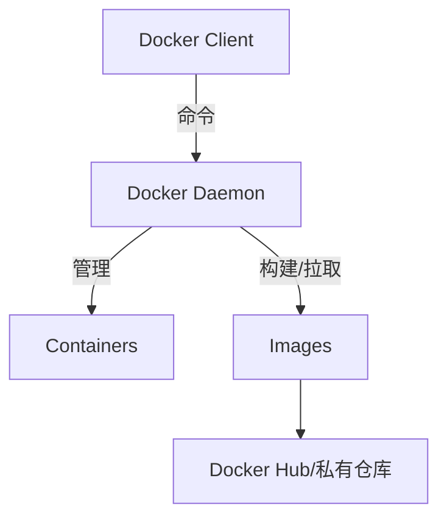

### Docker入门指南

——从零开始掌握容器化技术的核心  

---

## **🚀 1. Docker 的定位：现代软件的"集装箱"**  
**核心价值**：  
- **开发**：解决"环境不一致"问题（"我本地是好的！"）  
- **测试**：确保环境与生产一致（再也不用说"测试通过但线上挂了"）  
- **部署**：实现"一次构建，处处运行"（从笔记本到云服务器无缝迁移）  

**类比**：  
> 传统软件部署 = **搬家时拆散家具再组装**  
> Docker 部署 = **整个房间用集装箱运输，即插即用**  

---

## **🔧 2. Docker 核心原理**  
### **(1) 底层技术**  
Docker 利用 Linux 内核的三大能力：  
1. **Namespaces**（命名空间）→ 实现进程/网络/文件系统隔离  
2. **Cgroups**（控制组）→ 限制 CPU/内存等资源  
3. **UnionFS**（联合文件系统）→ 镜像分层存储，节省空间  

### **(2) 架构图解**  


### **(3) 核心概念**  
| 概念          | 说明                          | 类比              |  
|---------------|-----------------------------|------------------|  
| **镜像(Image)** | 只读模板（含应用+环境）         | 方便面的"调料包"    |  
| **容器(Container)** | 镜像的运行实例               | 泡好的方便面        |  
| **Dockerfile**   | 构建镜像的"菜谱"              | 方便面制作说明书    |  

---

## **💡 3. Docker 的五大优势**  
| 优势                | 说明                          | 传统方式痛点          |  
|---------------------|-----------------------------|---------------------|  
| **环境一致性**       | 开发=测试=生产环境             | "在我机器能跑啊！"    |  
| **秒级启动**         | 容器启动仅需1-2秒             | 虚拟机启动要几分钟    |  
| **资源高效**         | 单机可运行数百容器             | 虚拟机一般不超过20个  |  
| **简化运维**         | 无需手动安装依赖/配置          | 复杂的安装文档        |  
| **跨平台**           | 支持 Linux/Windows/云服务      | 环境适配成本高        |  

**真实案例**：  
- 某公司用 Docker 将部署时间从 **4小时** → **5分钟**  
- 微服务架构下，故障回滚速度提升 **10倍**  

---

## **🛠️ 4. 常用操作（新手必学）**  
### **(1) 基础命令**  
```bash  
# 下载镜像（比如Nginx）  
docker pull nginx  

# 运行容器（-d后台运行，-p端口映射）  
docker run -d -p 80:80 --name my-nginx nginx  

# 查看运行中的容器  
docker ps  

# 进入容器内部（调试用）  
docker exec -it my-nginx bash  

# 停止/删除容器  
docker stop my-nginx  
docker rm my-nginx  
```  

### **(2) 构建自定义镜像**  
**Dockerfile 示例**：  
```dockerfile  
# 使用Python官方镜像  
FROM python:3.9  

# 设置工作目录  
WORKDIR /app  

# 复制代码  
COPY . .  

# 安装依赖  
RUN pip install -r requirements.txt  

# 暴露端口  
EXPOSE 5000  

# 启动命令  
CMD ["python", "app.py"]  
```  

**构建并运行**：  
```bash  
docker build -t my-python-app .  
docker run -d -p 5000:5000 my-python-app  
```  

---

## **🔮 5. Docker 的未来趋势**  
1. **Kubernetes 成为标配** → Docker 是基础，K8s 是编排王者  
2. **Serverless 容器化** → AWS Lambda/云函数也跑在容器里  
3. **边缘计算** → 在树莓派等设备上部署轻量容器  
4. **安全强化** → 镜像扫描、非Root运行、硬件隔离  

> **终极愿景**：**"基础设施即代码"**，用声明式配置（如`docker-compose.yml`）定义整个应用栈！  

---

## **🎯 学习路径建议**  
1. **新手阶段**：掌握`docker run/build/push`基础命令  
2. **进阶实战**：  
   - 编写高效的 Dockerfile（多阶段构建）  
   - 学习 Docker Compose（多容器编排）  
3. **生产级技能**：  
   - 镜像优化（从 1GB 缩减到 50MB）  
   - 容器网络/存储方案  
4. **专家方向**：  
   - Kubernetes 集群管理  
   - 服务网格（Service Mesh）集成  

---

### **🚀 一句话总结**  
> Docker 让软件像乐高积木一样**标准化、可移植、即插即用**，是开发、测试、部署的"终极一致性解决方案"。  

**现在就开始你的容器化之旅吧！**  
```bash  
docker run hello-world  
```