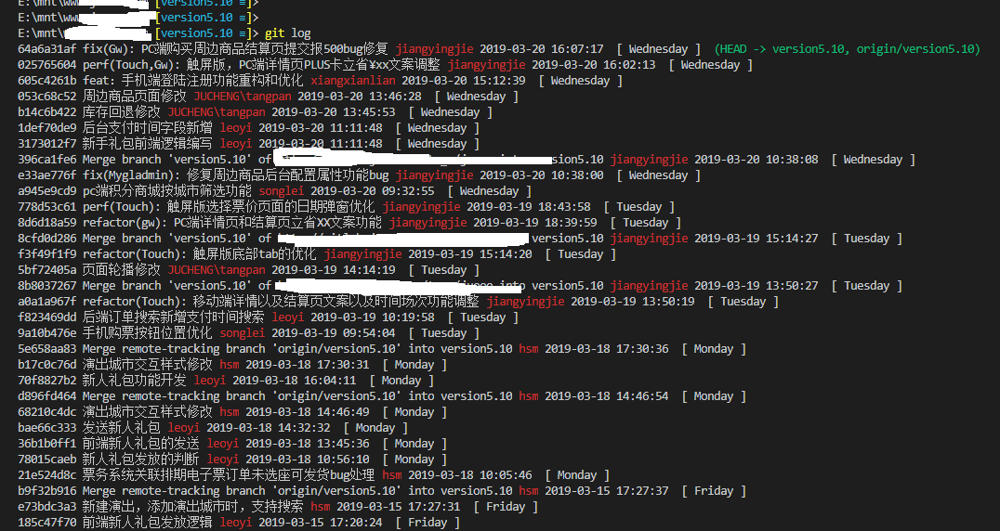

## git 格式化配置

> 影响 git-log, git-show, git-whatchanged 默认格式化  
> 了解更多请查看`git log --help`，`git config --help`

```git
# 永久性生效
git config format.pretty "%h %s %Cred%aN %Creset%cd %Cgreen%d"

# 单条指令生效
git log --pretty=format:"%h %s %Cred%aN %Creset%cd %Cgreen%d"
git show --pretty=format:"%h %s %Cred%aN %Creset%cd %Cgreen%d"
git whatchanged --pretty=format:"%h %s %Cred%aN %Creset%cd %Cgreen%d"
```

效果如下  
