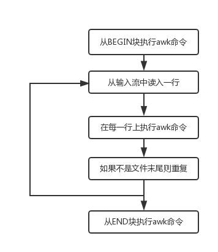

# awk

参考资料

文章出自：<https://cloud.tencent.com/developer/article/1375157>  
其他参考：

- <ttps://www.tutorialspoint.com/awk/index.htm>  
- <ttps://www.gnu.org/software/gawk/manual/gawk.html>  
- <ttps://en.wikipedia.org/wiki/AWK#Sum_last_word>

## awk的用途

- 文本处理。
- 格式化输出文本、报告。
- 数字运算（在我之前的文章中，探讨过整数的算术运算，浮点运算可以使用awk）。
- 执行字符串操作。

## 系统内几个有关awk命令的区别与联系

```bash
ls -l /bin/*awk

- lrwxrwxrwx. 1 root root      4 11月 20 10:41 /bin/awk -> gawk
- -rwxr-xr-x. 1 root root 514136 6月  10 2014 /bin/dgawk
- -rwxr-xr-x. 1 root root 428576 6月  10 2014 /bin/gawk
- -rwxr-xr-x. 1 root root   3188 6月  10 2014 /bin/igawk
- -rwxr-xr-x. 1 root root 428600 6月  10 2014 /bin/pgawk
```

与awk有关的命令竟然有这么多！在用whatis命令看一下这些都是些什么鬼：

```bash
whatis awk gawk dgawk pgawk igawk

- awk (1)              - pattern scanning and processing language
- gawk (1)             - pattern scanning and processing language
- dgawk (1)            - pattern scanning and processing language
- pgawk (1)            - pattern scanning and processing language
- igawk (1)            - gawk with include files
```

不太确信以上结果，我又使用man、info挨个看了一下，结果awk、gawk、dgawk、pgawk都是gawk，在线手册一模一样。唯独igawk与前面四个不太一样，是包含文件的gawk，其实也是gawk。awk是gawk的一个软连接，大家都是gawk！

## awk的使用

### 理解awk的工作原理



**Read**

awk从输入流（文件，管道或者标准输入）中读取一行，然后存储到内存中。

**Execute**

所有的AWK命令都依次在输入文本上执行。默认情况下，awk会对每一行执行命令，可以通过提供模式限制这种行为。

**Repeat**

处理过程不断重复，从首行开始直到到达文件结尾。

创建marks.txt文件备用：

```bash
echo "1)  Amit    Physics  80
> 2)  Rahul   Maths    90
> 3)  Shyam   Biology  87
> 4)  Kedar   English  85
> 5)  Hari    History  89">marks.txt
```

### awk的结构

**BEGIN** 语句块

BEGIN语句块的语法：

```bash
BEGIN {awk-commands}
```

BEGIN语句块在程序开始的使用执行，只执行一次，在这里可以初始化变量。BEGIN是AWK的关键字，因此它必须为大写。  
!> 注意，这个语句块是可选的。

**BODY** 语句块

BODY语句块的语法:

```bash
/pattern/ {awk-commands}
```


BODY语句块中的命令会对输入的每一行执行，也可以通过提供模式来控制这种行为。  
!> 注意，BODY语句块没有关键字。

**END** 语句块

END语句块的语法:

```bash
END {awk-commands}
```

END语句块在程序的最后执行，END是AWK的关键字，因此必须为大写，它也是可选的。

结合以上2点，举个例子来理解一下：

```bash
[awk@GeekDevOps ~]$ awk BEGIN'{printf "Sr NO\tName\tSub\tMarks\n"} {print} END{print "Done!"}' marks.txt
Sr NO   Name    Sub     Marks
1)  Amit    Physics  80
2)  Rahul   Maths    90
3)  Shyam   Biology  87
4)  Kedar   English  85
5)  Hari    History  89
Done!
[awk@GeekDevOps ~]$ awk BEGIN'{printf "Sr NO\tName\tSub\tMarks\n"} END{print "Done!"}' marks.txt
Sr NO   Name    Sub     Marks
Done!
```

在本例中，BEGIN块被执行一次，给文本内容增加了一行标题。body块从文本第一行扫描直至文件末尾。END块也仅仅执行了一次。

### 使用awk

通常情况下，awk命令较简短时我们直接按照以下方式执行awk命令：

```bash
awk 'program' input-file1 input-file2 …
```

如果awk内容较多的话，我们以以下格式来执行awk命令（此处program-file为awk脚本内容）：

```bash
awk -f program-file input-file1 input-file2 …
```

awk是一门解释型的语言，所以也可以像执行bash shell一样执行awk脚本:

```bash
#!/bin/awk -f
BEGIN{print "My name is Ivan Du！"}
```

```bash
[awk@GeekDevOps ~]$ chmod u+x GeekDevOps.awk
[awk@GeekDevOps ~]$ ./GeekDevOps.awk
My name is Ivan Du！
```

### 打印某列或某字段

```bash
[awk@GeekDevOps ~]$ cat best.txt
www     CC      ICBC
[awk@GeekDevOps ~]$ awk '{print $1}' best.txt
www
[awk@GeekDevOps ~]$ awk '{print $3}' best.txt
ICBC
[awk@GeekDevOps ~]$ awk -F "\t" '{print $3}' best.txt
ICBC
```

默认情况下，awk以空格、制表符等符号为分隔符。从每一行的第一个字符串开始扫描，第一个字符串为1,第N个字符串为1,第N个字符串为1,第N个字符串为n，如果首行是空格之类的字符那也算。

### 打印匹配模式的列

当模式匹配成功时，默认情况下awk会打印该行，但是也可以让它只打印指定的字段。例如，下面的例子中，只会打印出匹配模式的第三和第四个字段。

```bash
[awk@GeekDevOps ~]$ awk '/a/ {print $3 " " $4}' marks.txt
Maths 90
Biology 87
English 85
History 89
```

匹配指定文件中带u的行，并打印第四列与第三列，中间以一个横向制表符隔开。

```bash
[awk@GeekDevOps ~]$ awk '/u/ {print $4"\t"$3}' marks.txt
90      Maths
```

### 统计文本总行数

```bash
[awk@GeekDevOps ~]$ awk 'BEGIN{ct=0} {++ct} END{print "Count:",ct}' marks.txt
Count: 5
```

此行命令中，BEGIN部分其实是可以省略的。

### 打印匹配模式的总行数

```bash
[awk@GeekDevOps ~]$ awk '/a/ {++ct} END{print "Count:",ct}' marks.txt
Count: 4
```

此处的BEGIN部分不能出现，否则报错。

### 打印超过指定长度的行

```bash
[awk@GeekDevOps ~]$ awk 'length($0) > 22' marks.txt
1)  Amit    Physics  80
2)  Rahul   Maths    90
3)  Shyam   Biology  87
4)  Kedar   English  85
5)  Hari    History  89
```

mark.txt文件是通过空格来控制对齐的，每一行加上空格一共是22个字符。

### ARGC命令行参数个数

```bash
[awk@GeekDevOps ~]$ awk 'BEGIN{print "Arguments=" ARGC}' One Two Three Four
Arguments=5
```

### ARGV命令行参数数组

```bash
[awk@GeekDevOps ~]$ awk 'BEGIN{for (i=0 ;i<ARGC-1;++i ){printf "ARGC[%d]=%s\n",i,ARGV[i]}}' One Two Three Four
ARGC[0]=awk
ARGC[1]=One
ARGC[2]=Two
ARGC[3]=Three
```

### ENVIRON环境变量

```bash
[awk@GeekDevOps ~]$ awk 'BEGIN{print ENVIRON["PATH"]}'
/usr/local/bin:/usr/bin:/usr/local/sbin:/usr/sbin:/home/awk/.local/bin:/home/awk/bin
```

### FILENAME当前文件名

```bash
[awk@GeekDevOps ~]$ awk 'END{print FILENAME}' marks.txt 
marks.txt
```

!> 注意：此处使用的是END,如果省略则会打印出5个文件名称，这个文件一5行。

### 常用的awk内置变量

| 变量名  | 属性                           |
| ------- | ------------------------------ |
| $0      | 当前记录                       |
| 1−1−1-n | 当前记录的第N个字段            |
| FS      | 读入字段的分隔符，默认为空格   |
| RS      | 读入记录分隔符，默认为换行符   |
| NF      | 列，当前记录中的字段个数       |
| NR      | 行，已经读出的行数，也就是行号 |
| OFS     | 输出字段分隔符，默认为空格     |
| ORS     | 输出记录分隔符，默认为换行符   |

```bash
[awk@GeekDevOps ~]$ awk -F " " '{print $4}' marks.txt 
80
90
87
85
89
[awk@GeekDevOps ~]$ awk '{print $3}' marks.txt 
Physics
Maths
Biology
English
History
[awk@GeekDevOps ~]$ awk 'BEGIN{FS=" "}{print $3}' marks.txt 
Physics
Maths
Biology
English
History
```

以上三种写法都是一样的效果。

```bash
[awk@GeekDevOps ~]$ ls -al | awk 'BEGIN{size=0}{size+=$5}END{print size/1024/1024 "MB"}'
128.017MB
[awk@GeekDevOps ~]$ ls -al|awk 'NR>1{size+=$5} END{print size/1024/1024 "MB"}'
128.017MB
```

```bash
[awk@GeekDevOps ~]$ ls -al|awk 'NR==1{print $2/1024 "MB"}'
128.035MB
```

以上两个代码片中，都是统计当前目录下所有的文件（包括隐藏文件）所占磁盘空间的大小，非常有用。

```bash
[awk@GeekDevOps ~]$ awk 'BEGIN{print "OFS=" OFS}' marks.txt
OFS=
```

### awk中的算术运算

在awk中，支持像C语言中一样的算术运算。在前面的文章中介绍过，Linux系统中无法对非整型数字直接进行算术运算，要对浮点型的数据就行算术运算我们可以使用awk来实现。

```bash
[awk@GeekDevOps ~]$ awk 'BEGIN{A=2.8;B=7;print A/B}'
0.4
```

在这一部分中，awk中的增减运算符、赋值运算符、关系操作符、逻辑运算符、三元操作符等均与C语言类似，不赘述。

### awk中的一元操作符

```bash
[awk@GeekDevOps ~]$ awk 'BEGIN{A=2.8;A=+A;print A}'
2.8
```

### awk中的指数操作符

```bash
[awk@GeekDevOps ~]$ awk 'BEGIN{A=2.8;A=A^3;print A}'
21.952
[awk@GeekDevOps ~]$ awk 'BEGIN{A=2.8;A=A**3;print A}'
21.952
```

### awk中的字符串连接操作符

```bash
[awk@GeekDevOps ~]$ awk 'BEGIN{str1="Hello";str2=",GeekDevOps";str3=str1 str2;print str3}'
Hello,GeekDevOps
```

### awk中的数组

数组的定义与C语言有类似的地方，也有差别，使用的时候需要注意一下，有的资料上说awk中不支持多维数组，通过awk的GUN的文档，我们可以看到，awk也是支持多维数组的。删除数组元素使用delete语句：

```bash
[awk@GeekDevOps ~]$ awk 'BEGIN{array[0][0]=2;array[0][1]=3;array[1][0]=4;array[1][1]=8;for(i=0;i<2;i++){for(j=0;j<2;j++){printf "array[%d][%d]=%d\n",i,j, array[i][j]}}delete array[0][0];print array[0][0] "\t" array[0][0]}'
array[0][0]=2
array[0][1]=3
array[1][0]=4
array[1][1]=8
```

### awk中的控制结构

在awk中，也支持类似C语言一样的程序结构,支持if-else、while、do-while、for、switch、break、continue、nex、nextfile、exit。相信很多小伙伴都学习过C语言，与C语言一样的就不在赘述。

```bash
[awk@GeekDevOps ~]$ awk 'NF != 4 {
    printf("%s:%d: skipped: NF != 4\n", FILENAME, FNR) > "/dev/stderr"
    next
}'

-:1: skipped: NF != 4

-:2: skipped: NF != 4
...
```

```bash
[awk@GeekDevOps ~]$ awk 'BEGIN {
    if (("date" | getline date_now) <= 0) {
        print "Can not get system date" > "/dev/stderr"
        exit 1
    }
    print "Current date is", date_now
    close("date")
}'
Current date is 2018年 02月 28日 星期三 23:05:16 CST
```

### awk中的函数

在awk中，支持内建函数与用户自定义函数。

常用数学计算函数

- atan2(y, x)
- cos(x)
- exp(x)
- int(x)
- log(x)
- rand()
- sin(x)
- sqrt(x)
- srand([x])

字符串函数

- asort(arr [, d [, how] ])
- asorti(arr [, d [, how] ])
- gsub(regex, sub, string)
- index(str, sub)
- length(str)
- match(str, regex)
- split(str, arr, regex)
- sprintf(format, expr-list)
- strtonum(str)
- sub(regex, sub, string)
- substr(str, start, l)
- tolower(str)
- toupper(str)

时间函数

- systime
- mktime(datespec)
- strftime([format [, timestamp[, utc-flag]]])

字节操作函数

- and
- compl
- lshift
- rshift
- or
- xor

自定义函数类似于C语言，参阅GUN网站function部分。

###  awk中的正则表达式

```bash
[awk@GeekDevOps ~]$ echo -e "My name is IVAN DU.\nMy blog is GeekDevOps.\nWelcome to my blog."|awk '/My+/'
My name is IVAN DU.
My blog is GeekDevOps.
[awk@GeekDevOps ~]$ echo -e "My name is IVAN DU.\nMy blog is GeekDevOps.\nWelcome to my blog."|awk '/^W/'
Welcome to my blog.
```


