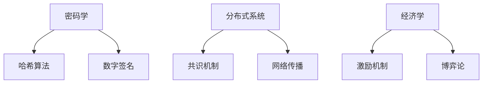

# 区块链技术全景解析

区块链作为分布式账本技术的代表，正在重塑金融、供应链、政务等多个领域的信任机制。以下是区块链技术的体系化解析：

## 1. 区块链核心架构

### 分层模型

```
应用层 (DApps/智能合约)
  ↑
合约层 (EVM/WASM)
  ↑
共识层 (PoW/PoS/PBFT)
  ↑
网络层 (P2P协议)
  ↑
数据层 (区块/默克尔树)
```

### 关键技术组成



## 2. 密码学基础

### 哈希函数特性

$$
\begin{aligned}
&\text{确定性: } H(x) \text{ 始终相同} \\
&\text{雪崩效应: } \Delta x \text{极小} \Rightarrow \Delta H(x) \text{极大} \\
&\text{抗碰撞: } \text{难以找到 } x_1 \neq x_2 \text{ 使 } H(x_1)=H(x_2)
\end{aligned}
$$

### 椭圆曲线数字签名(ECDSA)

签名生成：
1. 选择随机数$k \in [1,n-1]$
2. 计算点$(x_1,y_1)=k \times G$
3. 计算$r=x_1 \mod n$
4. 计算$s=k^{-1}(H(m)+rd_A) \mod n$

验证：
$$
u_1 = H(m) \cdot s^{-1} \mod n \\
u_2 = r \cdot s^{-1} \mod n \\
(x_1,y_1) = u_1 \times G + u_2 \times Q_A \\
\text{验证 } r == x_1 \mod n
$$

## 3. 共识算法比较

### 主流共识机制

| 算法 | 代表实现 | 能源效率 | 吞吐量 | 去中心化程度 |
|------|----------|----------|--------|--------------|
| PoW | Bitcoin | 低 | 7 TPS | 高 |
| PoS | Ethereum 2.0 | 高 | 1000+ TPS | 中 |
| DPoS | EOS | 极高 | 4000+ TPS | 低 |
| PBFT | Hyperledger | 高 | 1000+ TPS | 联盟链 |

### PoS奖励计算公式

$$
\text{奖励} = \frac{\text{质押量}}{\text{总质押量}} \times \text{区块奖励} \times \text{参与率}
$$

## 4. 智能合约开发

### Solidity合约示例

```solidity
// ERC-20代币合约
pragma solidity ^0.8.0;

contract MyToken {
    string public name;
    mapping(address => uint) public balances;
    
    constructor(string memory _name) {
        name = _name;
        balances[msg.sender] = 1000000;
    }
    
    function transfer(address to, uint amount) external {
        require(balances[msg.sender] >= amount);
        balances[msg.sender] -= amount;
        balances[to] += amount;
    }
}
```

### Gas费用计算

$$
\text{Gas Cost} = \text{Gas Used} \times \text{Gas Price (in gwei)}
$$

## 5. 区块链类型对比

### 三大类型特征

| 类型 | 准入机制 | 性能 | 用例 |
|------|----------|------|------|
| 公有链 | 无许可 | 低 | 加密货币 |
| 联盟链 | 许可制 | 中 | 供应链金融 |
| 私有链 | 中心化 | 高 | 企业内部审计 |

## 6. 扩容解决方案

### Layer2技术矩阵

| 方案 | 原理 | 安全性 | 吞吐量提升 |
|------|------|--------|------------|
| Rollup | 链下计算+链上验证 | 高 | 100x |
| Plasma | 子链结构 | 中 | 1000x |
| State Channel | 状态通道 | 高 | 10000x |
| Sidechain | 独立侧链 | 低 | 100x |

### zkRollup工作流程

```
1. 用户交易提交到链下
2. 操作者批量处理交易
3. 生成零知识证明
4. 证明和状态根提交到主链
```

## 7. 跨链技术

### 原子交换协议

```sequence
Participant A->Participant B: 哈希锁定(H)
B->A: 支付币种Y(秘密S)
A->B: 支付币种X(揭示S)
```

### 主流跨链协议

| 协议 | 类型 | 特点 | 代表项目 |
|------|------|------|----------|
| IBC | 链间通信 | 高安全性 | Cosmos |
| XCMP | 平行链通信 | 共享安全 | Polkadot |
| Wormhole | 桥接协议 | 多链支持 | Solana-Ethereum |

## 8. 隐私保护技术

### 零知识证明流程

$$
\exists w : F(x,w)=0 \Rightarrow \text{Prover说服Verifier}
$$

### 混币方案对比

| 方案 | 隐私级别 | 计算复杂度 |
|------|----------|------------|
| CoinJoin | 基础 | 低 |
| zk-SNARKs | 高 | 极高 |
| Mimblewimble | 中 | 中 |

## 9. 区块链治理

### DAO治理模型

```
提案 → 投票 → 执行
  ↑        ↑
 代币质押  智能合约自动执行
```

### 治理代币分配公式

$$
\text{投票权重} = \sqrt{\text{持币量}} \times \text{参与系数}
$$

## 10. 企业级区块链

### Hyperledger Fabric架构

```
Ordering Service (排序节点)
  ↑
Peer Nodes (背书/提交节点)
  ↑
Chaincode (智能合约)
  ↑
CA (身份管理)
```

### 性能优化参数

```yaml
# core.yaml配置
peer:
  gossip:
    state: enabled
    useLeaderElection: true
  executor:
    parallelism: 200
```

## 11. 区块链即服务(BaaS)

### 主流云平台对比

| 提供商 | 支持链 | 特色功能 |
|--------|--------|----------|
| AWS | Ethereum/HLF | 托管节点 |
| Azure | Ethereum/Quorum | 机密计算 |
| 阿里云 | AntChain | 跨链服务 |

## 12. 前沿发展方向

### Web3技术栈

```
用户身份 (DID)
  ↑
数据存储 (IPFS/Arweave)
  ↑
计算平台 (区块链+Layer2)
  ↑
应用协议 (DeFi/NFT/DAO)
```

### 新型共识算法

```
PoH (历史证明) → PoET (时间证明) → 
PoSpace (空间证明) → PoA (权威证明)
```

区块链技术正在经历从1.0（数字货币）到3.0（产业区块链）的演进，呈现出以下趋势：
1. 模块化架构（执行/结算/数据分层）
2. 隐私计算融合（MPC+ZKP）
3. 合规化发展（KYC/AML集成）
4. 绿色转型（PoS替代PoW）

根据Gartner预测，到2025年，企业区块链解决方案的市场规模将达到390亿美元，年复合增长率达60%。技术从业者需要深入理解区块链的底层原理，同时掌握智能合约开发和架构设计能力，才能把握这一波技术革命带来的机遇。