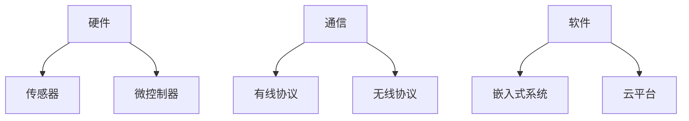

# 物联网（IoT）技术体系全景解析

物联网作为物理世界与数字世界的桥梁，正在构建万物互联的智能生态系统。以下是物联网技术的全面剖析：

## 1. 物联网体系架构

### 四层参考模型

```
应用层 (智能家居/工业物联网/智慧城市)
  ↑
平台层 (数据处理/设备管理/应用支持)
  ↑
网络层 (传输协议/网关/边缘计算)
  ↑
感知层 (传感器/执行器/嵌入式设备)
```

### 技术栈组成



## 2. 感知层技术

### 传感器类型矩阵

| 类别 | 典型传感器 | 测量范围 | 精度 |
|------|----------|----------|------|
| 环境 | 温湿度 | -40~85°C | ±0.5°C |
| 运动 | 加速度计 | ±16g | 0.001g |
| 生物 | 心率 | 30-250bpm | ±1bpm |
| 光学 | 光强 | 1-100klux | ±5% |

### 嵌入式开发示例

```c
// STM32温湿度读取示例
#include "DHT22.h"

int main() {
    DHT22_Init(GPIOA, GPIO_PIN_0);
    while(1) {
        DHT22_Data data = DHT22_Read();
        printf("Temp: %.1f°C, Humi: %.1f%%\n", 
               data.temperature, data.humidity);
        HAL_Delay(2000);
    }
}
```

## 3. 通信协议栈

### 无线技术对比

| 协议 | 频段 | 传输距离 | 功耗 | 数据率 |
|------|------|----------|------|--------|
| BLE | 2.4GHz | 100m | 极低 | 1Mbps |
| Zigbee | 2.4GHz | 100m | 低 | 250kbps |
| LoRa | Sub-GHz | 10km | 中 | 50kbps |
| 5G | mmWave | 1km | 高 | 10Gbps |

### 协议栈分层

```
应用层: MQTT/CoAP/HTTP
  ↑
传输层: TCP/UDP
  ↑
网络层: 6LoWPAN/IPv6
  ↑
MAC层: IEEE 802.15.4
  ↑
物理层: LoRa/NB-IoT
```

## 4. 网络拓扑结构

### 常见组网方式

```
星型网络 ←----→ 网状网络
  ↑                   ↑
 低功耗              高可靠性
 简单架构            自修复能力
```

### 边缘计算架构

```
终端设备 → 边缘网关 → 云数据中心
    ↑         ↑
  实时处理   数据聚合
```

## 5. 物联网平台

### 主流平台功能对比

| 平台 | 设备管理 | 数据分析 | AI集成 | 典型应用 |
|------|----------|----------|--------|----------|
| AWS IoT | √ | √ | √ | 智慧农业 |
| Azure IoT | √ | √ | √ | 工业预测维护 |
| 阿里云IoT | √ | √ | √ | 城市大脑 |
| ThingsBoard | √ | √ | × | 开源解决方案 |

### 设备影子模型

```json
{
  "state": {
    "reported": {"temperature": 25},
    "desired": {"led": "on"}
  },
  "metadata": {
    "reported": {"temperature": {"timestamp": 1630000000}}
  }
}
```

## 6. 数据处理技术

### 时序数据处理

$$
\text{移动平均} = \frac{1}{n}\sum_{i=k-n+1}^k x_i
$$

### 流处理框架

```python
# Apache Kafka流处理示例
from pyflink.datastream import StreamExecutionEnvironment
env = StreamExecutionEnvironment.get_execution_environment()

sensor_data = env.add_source(KafkaSource())
filtered = sensor_data.filter(lambda x: x['temp'] > 30)
filtered.add_sink(KafkaSink())
```

## 7. 安全机制

### 安全防护层级

```
┌─────────────────────┐
│ 应用安全 │ ←─数据加密
├─────────────────────┤
│ 通信安全 │ ←─TLS/DTLS
├─────────────────────┤
│ 设备安全 │ ←─安全启动
└─────────────────────┘
```

### 设备认证流程

```
设备 → 注册请求 → 平台
  ↑                   ↓
  ←── 颁发证书 ──
```

## 8. 典型应用场景

### 工业物联网(IIoT)

```
预测性维护流程：
1. 振动传感器采集数据
2. 边缘节点特征提取
3. 云平台训练故障模型
4. 实时监测预警
```

### 智慧农业方案

```
环境监测系统：
▶ 土壤传感器组网
▶ LoRa无线传输
▶ 云平台数据分析
▶ 自动灌溉控制
```

## 9. 开发工具链

### 嵌入式开发工具

| 工具 | 用途 | 适用平台 |
|------|------|----------|
| Keil | ARM开发 | STM32 |
| ESP-IDF | ESP32开发 | 乐鑫 |
| Arduino IDE | 原型开发 | AVR |

### 调试诊断技术

```
日志分析 → 协议分析仪 → 
OTA远程更新 → 内存诊断工具
```

## 10. 前沿发展趋势

### 关键技术演进

```
低功耗广域网 → 边缘AI → 
数字孪生 → 6G融合
```

### 新型传感器技术

```
柔性电子 ←─→ 自供能传感
  ↑               ↑
可穿戴设备      环境能量采集
```

据IDC预测，到2025年全球物联网设备数将达416亿，年增长率达12%。物联网技术正在与5G、人工智能、区块链等技术深度融合，推动产业数字化转型进入新阶段。开发者需要掌握从嵌入式开发到云平台集成的全栈技能，同时注重数据安全与系统可靠性设计。