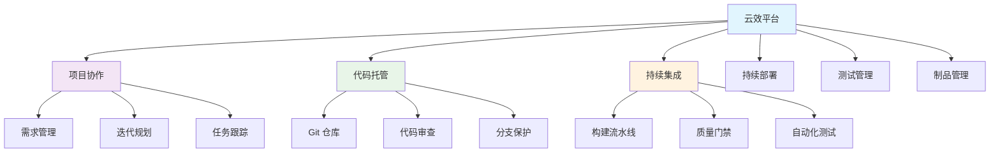

# 阿里云效

## 1. 概述

阿里云效（Alibaba Cloud DevOps）是阿里云提供的一站式企业级 DevOps 平台，涵盖项目管理、代码托管、CI/CD、测试管理、制品管理等功能。它支持从需求到部署的全生命周期管理，特别适合中国企业的开发流程和合规要求。

## 2. 核心概念

### 2.1 平台架构


### 2.2 关键术语
- **企业**: 云效的最高组织单元
- **项目**: 具体的开发项目空间
- **流水线**: CI/CD 自动化流程
- **应用**: 被部署的服务单元
- **制品**: 构建生成的二进制包
- **环境**: 部署目标环境（开发、测试、生产）

## 3. 快速开始

### 3.1 平台初始化
```bash
# 开通云效服务
# 通过阿里云控制台开通云效服务
# 创建企业组织
# 配置企业成员和权限

# 初始化项目
curl -X POST "https://api.aliyun.com/devops/projects" \
  -H "Authorization: Bearer $ACCESS_TOKEN" \
  -d '{
    "name": "my-project",
    "description": "我的项目",
    "organizationIdentifier": "my-org"
  }'
```

### 3.2 基础配置
```yaml
# 项目配置文件 .yunxiao.yaml
version: 1.0
project:
  name: my-application
  language: java
  framework: spring-boot

build:
  image: maven:3.8-openjdk-17
  commands:
    - mvn clean compile
    - mvn package -DskipTests

test:
  commands:
    - mvn test
    - mvn verify

deploy:
  target: ecs
  region: cn-hangzhou
```

## 4. 代码托管

### 4.1 仓库管理
```bash
# 创建代码仓库
curl -X POST "https://code.aliyun.com/api/v4/projects" \
  -H "PRIVATE-TOKEN: $GITLAB_TOKEN" \
  -d '{
    "name": "my-repo",
    "visibility": "private",
    "namespace_id": 123
  }'

# 配置 SSH 密钥
ssh-keygen -t rsa -b 4096 -C "yunxiao@example.com"
cat ~/.ssh/id_rsa.pub >> 云效 SSH 密钥管理

# 克隆仓库
git clone git@code.aliyun.com:my-org/my-repo.git
cd my-repo
```

### 4.2 分支策略
```yaml
# 分支保护规则
branch_rules:
  main:
    protected: true
    push_access: maintainers
    merge_request: true
    required_approvals: 2
    status_checks:
      - build
      - test
      - security_scan

  develop:
    protected: true
    push_access: developers
    merge_request: true
    required_approvals: 1

  feature/*:
    protected: false
    push_access: developers
```

## 5. 持续集成

### 5.1 流水线配置
```yaml
# .yunxiao/pipeline.yaml
version: 2.0
stages:
  - name: build
    steps:
      - name: java-build
        image: maven:3.8-openjdk-17
        commands:
          - mvn clean compile
          - mvn package -DskipTests
        artifacts:
          - target/*.jar

  - name: test
    steps:
      - name: unit-test
        image: maven:3.8-openjdk-17
        commands:
          - mvn test
        timeout: 1800

      - name: integration-test
        image: maven:3.8-openjdk-17
        commands:
          - mvn verify
        timeout: 3600

  - name: security-scan
    steps:
      - name: sonarqube-scan
        image: sonarsource/sonar-scanner-cli:latest
        commands:
          - sonar-scanner -Dsonar.projectKey=my-app

triggers:
  push:
    branches:
      - main
      - develop
  pull_request:
    branches:
      - main
```

### 5.2 构建环境
```yaml
# 多环境配置
environments:
  development:
    variables:
      ENV: development
      DATABASE_URL: jdbc:mysql://dev-db:3306/app
      LOG_LEVEL: DEBUG

  testing:
    variables:
      ENV: testing
      DATABASE_URL: jdbc:mysql://test-db:3306/app
      LOG_LEVEL: INFO

  production:
    variables:
      ENV: production
      DATABASE_URL: jdbc:mysql://prod-db:3306/app
      LOG_LEVEL: WARN

# 资源分配
resources:
  cpu: 2
  memory: 4Gi
  disk: 20Gi
```

## 6. 持续部署

### 6.1 部署配置
```yaml
# .yunxiao/deploy.yaml
deployment:
  strategy: rolling
  health_check:
    path: /health
    port: 8080
    timeout: 30
    interval: 10
    retries: 3

  environments:
    - name: development
      cluster: dev-cluster
      namespace: dev
      replicas: 2
      resources:
        requests:
          cpu: 500m
          memory: 1Gi
        limits:
          cpu: 1
          memory: 2Gi

    - name: production
      cluster: prod-cluster
      namespace: prod
      replicas: 5
      resources:
        requests:
          cpu: 1
          memory: 2Gi
        limits:
          cpu: 2
          memory: 4Gi
```

### 6.2 发布策略
```yaml
# 蓝绿部署
blue_green:
  active: blue
  services:
    blue:
      weight: 100
    green:
      weight: 0
  switch:
    condition: manual
    timeout: 3600

# 金丝雀发布
canary:
  steps:
    - weight: 10
      duration: 300
    - weight: 50
      duration: 600
    - weight: 100
      duration: 1800
  metrics:
    - name: error_rate
      threshold: 0.01
    - name: latency
      threshold: 1000
```

## 7. 测试管理

### 7.1 自动化测试
```yaml
# 测试套件配置
test_suites:
  - name: unit-tests
    type: junit
    pattern: "**/target/surefire-reports/*.xml"
    timeout: 1800

  - name: integration-tests
    type: junit
    pattern: "**/target/failsafe-reports/*.xml"
    timeout: 3600

  - name: e2e-tests
    type: cucumber
    pattern: "**/target/cucumber-reports/*.json"
    timeout: 7200

# 测试环境
test_environment:
  name: test-env
  variables:
    TEST_DATABASE_URL: jdbc:mysql://test-db:3306/test
    TEST_USERNAME: tester
    TEST_PASSWORD: $TEST_DB_PASSWORD
  services:
    - name: mysql
      image: mysql:8.0
      ports:
        - 3306:3306
      environment:
        MYSQL_ROOT_PASSWORD: rootpass
        MYSQL_DATABASE: test
```

## 8. 制品管理

### 8.1 制品仓库
```yaml
# 制品配置
artifacts:
  - name: application-jar
    type: jar
    path: target/*.jar
    version: $CI_COMMIT_TAG
    metadata:
      groupId: com.example
      artifactId: my-app
      version: 1.0.0

  - name: docker-image
    type: docker
    image: registry.cn-hangzhou.aliyuncs.com/my-org/my-app
    tag: $CI_COMMIT_SHA
    platforms:
      - linux/amd64
      - linux/arm64

# 依赖管理
dependencies:
  - name: shared-lib
    type: jar
    groupId: com.example
    artifactId: shared-lib
    version: 2.0.0
    repository: https://maven.aliyun.com/repository/central
```

## 9. 权限与安全

### 9.1 RBAC 配置
```yaml
# 角色权限配置
roles:
  - name: developer
    permissions:
      - code:read
      - code:write
      - build:trigger
      - test:run

  - name: maintainer
    permissions:
      - code:maintain
      - build:manage
      - deploy:staging
      - monitor:view

  - name: admin
    permissions:
      - project:manage
      - user:manage
      - deploy:production
      - security:manage

# 用户组配置
groups:
  - name: backend-team
    roles: [developer, maintainer]
    members: [user1, user2, user3]

  - name: devops-team
    roles: [maintainer, admin]
    members: [admin1, admin2]
```

### 9.2 安全合规
```yaml
# 安全扫描
security_scan:
  enabled: true
  tools:
    - name: sonarqube
      server_url: https://sonar.example.com
      token: $SONAR_TOKEN
      quality_gate: true

    - name: dependency-check
      format: html
      fail_on_cvss: 8.0

    - name: container-scan
      image: my-app:latest
      fail_on: high

# 合规检查
compliance:
  license_check: true
  allowed_licenses:
    - MIT
    - Apache-2.0
    - BSD-3-Clause
  banned_licenses:
    - GPL-3.0
    - AGPL-3.0
```

## 10. 监控与运维

### 10.1 监控配置
```yaml
# 应用监控
monitoring:
  metrics:
    - name: cpu_usage
      query: 'container_cpu_usage_seconds_total'
      threshold: 80
      duration: 5m

    - name: memory_usage
      query: 'container_memory_usage_bytes'
      threshold: 90
      duration: 5m

    - name: error_rate
      query: 'rate(http_requests_total{status=~"5.."}[5m])'
      threshold: 0.01
      duration: 10m

# 告警配置
alerts:
  - name: high-cpu-usage
    condition: cpu_usage > 80
    severity: warning
    duration: 5m
    notifications:
      - email: devops@example.com
      - sms: +8613800138000

  - name: deployment-failure
    condition: deployment_status == "failed"
    severity: critical
    notifications:
      - phone_call: +8613800138000
```

### 10.2 运维自动化
```yaml
# 运维脚本
maintenance:
  scripts:
    - name: database-backup
      schedule: "0 2 * * *"
      commands:
        - mysqldump -u root -p$DB_PASSWORD mydb > backup.sql
        - aliyun oss cp backup.sql oss://my-bucket/backups/

    - name: log-cleanup
      schedule: "0 0 * * 0"
      commands:
        - find /var/log -name "*.log" -mtime +30 -delete

# 自动扩缩容
autoscaling:
  enabled: true
  min_replicas: 2
  max_replicas: 10
  metrics:
    - type: cpu
      target: 70
    - type: memory
      target: 80
    - type: custom
      metric: http_requests_per_second
      target: 1000
```