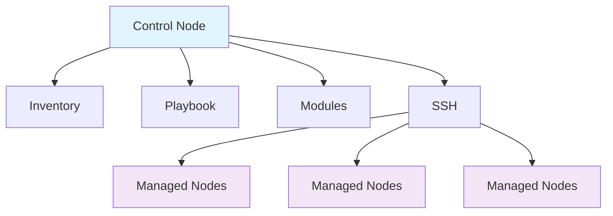

# Ansible

## 1. 概述

Ansible 是一个开源的自动化工具，用于配置管理、应用部署和任务自动化。它采用无代理架构，通过 SSH 协议进行通信，使用 YAML 语言编写 playbook，使得自动化脚本易于理解和维护。Ansible 是 DevOps 和基础设施即代码（IaC）实践中的重要工具。

## 2. 核心概念

### 2.1 架构组件


### 2.2 关键术语
- **Inventory**: 被管理节点的列表和分组
- **Playbook**: YAML 文件，描述自动化任务
- **Module**: 执行特定任务的代码单元（如 copy、service、yum）
- **Task**: 调用模块执行的具体操作
- **Role**: 可重用的任务集合和组织结构
- **Handler**: 由任务触发执行的特殊任务
- **Fact**: 从被管理节点收集的系统信息

## 3. 快速开始

### 3.1 安装和配置
```bash
# 在控制节点安装 Ansible
# Ubuntu/Debian
sudo apt update
sudo apt install ansible

# CentOS/RHEL
sudo yum install epel-release
sudo yum install ansible

# 使用 pip 安装
pip install ansible

# 验证安装
ansible --version

# 配置 SSH 密钥认证
ssh-keygen -t rsa -b 4096
ssh-copy-id user@target-host
```

### 3.2 基础命令
```bash
# 测试节点连通性
ansible all -m ping

# 执行临时命令
ansible web-servers -a "uptime"
ansible db-servers -a "df -h"

# 使用模块
ansible all -m copy -a "src=/tmp/file dest=/tmp/file"
ansible web-servers -m service -a "name=nginx state=started"

# 查看可用模块
ansible-doc -l
ansible-doc copy
```

## 4. Inventory 管理

### 4.1 静态 Inventory
```ini
# inventory.ini
[web-servers]
web1.example.com ansible_user=ubuntu
web2.example.com ansible_user=ubuntu
web3.example.com ansible_user=ubuntu

[db-servers]
db1.example.com ansible_user=centos
db2.example.com ansible_user=centos

[production:children]
web-servers
db-servers

[production:vars]
ansible_ssh_private_key_file=~/.ssh/production_key
ansible_python_interpreter=/usr/bin/python3

[local]
localhost ansible_connection=local
```

### 4.2 动态 Inventory
```yaml
# aws_ec2.yml
plugin: aws_ec2
regions:
  - us-east-1
  - us-west-2
filters:
  tag:Environment: production
keyed_groups:
  - key: tags.Role
    prefix: role_
  - key: tags.Environment
    prefix: env_
```

### 4.3 Inventory 使用
```bash
# 指定自定义 inventory
ansible -i custom-inventory.ini all -m ping

# 使用动态 inventory
ansible-inventory -i aws_ec2.yml --list
ansible -i aws_ec2.yml role_web -m ping

# 分组执行
ansible web-servers:db-servers -m ping
ansible 'production:!db-servers' -m ping
```

## 5. Playbook 开发

### 5.1 基础 Playbook
```yaml
# site.yml
- name: Configure web servers
  hosts: web-servers
  become: yes
  vars:
    http_port: 80
    max_clients: 200
  tasks:
    - name: Ensure nginx is installed
      apt:
        name: nginx
        state: present
        update_cache: yes
      when: ansible_os_family == "Debian"

    - name: Ensure nginx is installed on RedHat
      yum:
        name: nginx
        state: present
      when: ansible_os_family == "RedHat"

    - name: Copy nginx configuration
      template:
        src: templates/nginx.conf.j2
        dest: /etc/nginx/nginx.conf
        owner: root
        group: root
        mode: '0644'
      notify:
        - Restart nginx

    - name: Ensure nginx is running
      service:
        name: nginx
        state: started
        enabled: yes

  handlers:
    - name: Restart nginx
      service:
        name: nginx
        state: restarted
```

### 5.2 变量管理
```yaml
# group_vars/all.yml
http_port: 80
https_port: 443
app_version: "2.0.0"

# group_vars/web-servers.yml
nginx_worker_processes: 4
nginx_worker_connections: 1024

# host_vars/web1.example.com.yml
server_name: web1.example.com
max_clients: 500

# 在 playbook 中使用变量
vars_files:
  - vars/main.yml

vars:
  deployment_env: "{{ DEPLOYMENT_ENV | default('production') }}"

tasks:
  - name: Create application directory
    file:
      path: "/app/{{ app_version }}"
      state: directory
      owner: "{{ app_user }}"
      group: "{{ app_group }}"
```

## 6. Role 开发

### 6.1 Role 结构
```
roles/
└── nginx/
    ├── defaults/
    │   └── main.yml      # 默认变量
    ├── vars/
    │   └── main.yml       # 角色变量
    ├── tasks/
    │   └── main.yml       # 主要任务
    ├── handlers/
    │   └── main.yml       # 处理器
    ├── templates/
    │   └── nginx.conf.j2  # 模板文件
    ├── files/
    │   └── index.html     # 静态文件
    └── meta/
        └── main.yml       # 角色依赖
```

### 6.2 Role 任务文件
```yaml
# roles/nginx/tasks/main.yml
- name: Install nginx package
  package:
    name: nginx
    state: present
  tags: install

- name: Configure nginx
  template:
    src: nginx.conf.j2
    dest: /etc/nginx/nginx.conf
    owner: root
    group: root
    mode: '0644'
  notify: restart nginx
  tags: config

- name: Ensure nginx is running
  service:
    name: nginx
    state: started
    enabled: yes
  tags: service
```

### 6.3 使用 Roles
```yaml
# site.yml
- name: Configure infrastructure
  hosts: all
  roles:
    - role: common
      tags: common

- name: Deploy web application
  hosts: web-servers
  roles:
    - role: nginx
      vars:
        nginx_port: 80
    - role: app
      app_version: "2.0.0"

- name: Database setup
  hosts: db-servers
  roles:
    - role: postgresql
      postgresql_version: "13"
```

## 7. 高级功能

### 7.1 条件执行和循环
```yaml
tasks:
  - name: Install packages
    package:
      name: "{{ item }}"
      state: present
    loop:
      - nginx
      - postgresql
      - redis
    when: ansible_os_family == "Debian"

  - name: Create user accounts
    user:
      name: "{{ item.name }}"
      uid: "{{ item.uid }}"
      group: "{{ item.group }}"
    loop:
      - { name: 'john', uid: 1001, group: 'users' }
      - { name: 'jane', uid: 1002, group: 'users' }
    loop_control:
      label: "{{ item.name }}"

  - name: Process multiple files
    copy:
      src: "{{ item.src }}"
      dest: "{{ item.dest }}"
    with_fileglob:
      - "/tmp/files/*.conf"
```

### 7.2 错误处理和验证
```yaml
tasks:
  - name: Attempt risky operation
    command: /usr/bin/risky-command
    ignore_errors: yes
    register: result

  - name: Check if operation succeeded
    fail:
      msg: "Risky operation failed"
    when: result.rc != 0

  - name: Validate configuration
    block:
      - name: Check config syntax
        command: nginx -t
        register: nginx_test
        changed_when: false

      - name: Fail if config is invalid
        fail:
          msg: "Nginx configuration is invalid"
        when: nginx_test.rc != 0

    always:
      - name: Always cleanup
        file:
          path: /tmp/temp-config
          state: absent
```

### 7.3 异步任务和轮询
```yaml
tasks:
  - name: Run long-running task
    command: /usr/bin/long-running-process
    async: 3600  # 最大运行时间（秒）
    poll: 30     # 轮询间隔（秒）
    register: long_task

  - name: Check async task status
    async_status:
      jid: "{{ long_task.ansible_job_id }}"
    register: job_result
    until: job_result.finished
    retries: 30
    delay: 10
```

## 8. CI/CD 集成

### 8.1 Ansible in Pipeline
```yaml
# .github/workflows/ansible.yml
name: Ansible Deployment

on:
  push:
    branches: [ main ]

jobs:
  deploy:
    runs-on: ubuntu-latest
    steps:
    - uses: actions/checkout@v4
    
    - name: Set up Ansible
      run: |
        sudo apt update
        sudo apt install -y ansible
        
    - name: Configure SSH
      run: |
        mkdir -p ~/.ssh
        echo "${{ secrets.SSH_PRIVATE_KEY }}" > ~/.ssh/id_rsa
        chmod 600 ~/.ssh/id_rsa
        ssh-keyscan -H ${{ secrets.TARGET_HOST }} >> ~/.ssh/known_hosts
        
    - name: Run Ansible playbook
      run: |
        ansible-playbook -i production-inventory.ini site.yml \
          --extra-vars "deployment_version=${{ github.sha }}"
```

### 8.2 安全最佳实践
```yaml
# 使用 ansible-vault 加密敏感数据
ansible-vault create secrets.yml
ansible-vault edit secrets.yml
ansible-vault view secrets.yml

# 在 playbook 中使用加密文件
vars_files:
  - secrets.yml

# 运行加密的 playbook
ansible-playbook site.yml --ask-vault-pass
ansible-playbook site.yml --vault-password-file vault.txt

# 使用环境变量
ansible-playbook site.yml --extra-vars "db_password=$DB_PASSWORD"
```

## 9. 运维和监控

### 9.1 执行和调试
```bash
# 检查语法
ansible-playbook site.yml --syntax-check

# 试运行（dry-run）
ansible-playbook site.yml --check

# 显示详细输出
ansible-playbook site.yml -v
ansible-playbook site.yml -vvv

# 限制执行范围
ansible-playbook site.yml --limit web1.example.com
ansible-playbook site.yml --tags config

# 收集 facts
ansible all -m setup
ansible all -m setup -a "filter=ansible_distribution*"
```

### 9.2 性能优化
```bash
# 并行执行
ansible-playbook site.yml -f 10

# 使用 pipelining
# 在 ansible.cfg 中设置:
# [ssh_connection]
# pipelining = True

# 使用 fact 缓存
# [defaults]
# gathering = smart
# fact_caching = jsonfile
# fact_caching_connection = /tmp/ansible_facts

# 使用策略插件
ansible-playbook site.yml --forks 50 -f 50
```

### 9.3 监控和日志
```yaml
# 添加日志记录
- name: Record deployment
  local_action:
    module: uri
    url: "https://monitoring.example.com/api/deploy"
    method: POST
    body: "{{ ansible_date_time.iso8601 }} - Deployment completed"
    status_code: 200

# 使用 callback 插件
# 在 ansible.cfg 中设置:
# [defaults]
# stdout_callback = yaml
# bin_ansible_callbacks = True
```
