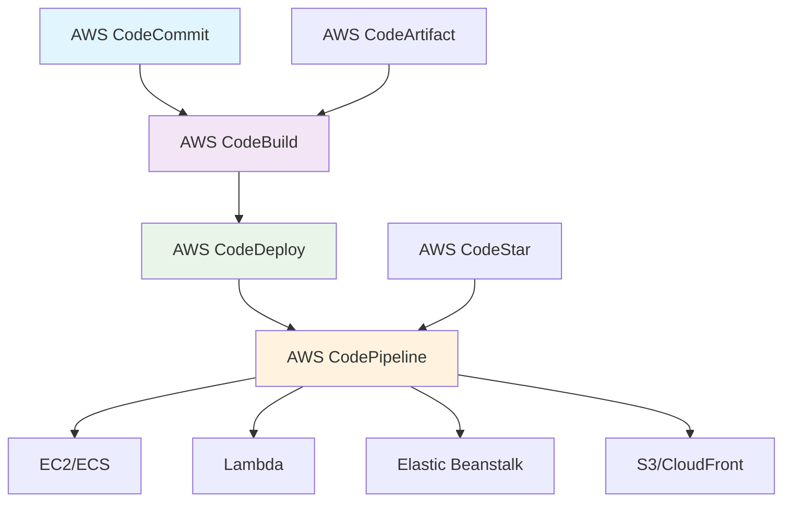

# AWS Code系列

## 1. 概述

AWS Code系列是一套完全托管的 DevOps 工具集，用于在 AWS 云上实现完整的 CI/CD 流水线。它提供源代码管理、构建、测试和部署的集成解决方案，与 AWS 服务深度集成，支持从代码提交到生产部署的完整生命周期管理。

## 2. 核心服务

### 2.1 架构组成


### 2.2 服务概览
- **AWS CodeCommit**: 托管的 Git 版本控制服务
- **AWS CodeBuild**: 全托管的持续集成服务
- **AWS CodeDeploy**: 自动化部署服务
- **AWS CodePipeline**: 可视化 CI/CD 流水线服务
- **AWS CodeStar**: 项目管理和协作平台
- **AWS CodeArtifact**: 托管的软件制品仓库

## 3. AWS CodeCommit

### 3.1 仓库管理
```bash
# 创建代码仓库
aws codecommit create-repository \
  --repository-name my-app \
  --repository-description "My application repository"

# 克隆仓库
git clone codecommit::us-east-1://my-app
git config --global credential.helper '!aws codecommit credential-helper $@'
git config --global credential.UseHttpPath true

# 管理分支
aws codecommit create-branch \
  --repository-name my-app \
  --branch-name develop \
  --commit-id HEAD

# 设置触发规则
aws codecommit put-repository-triggers \
  --repository-name my-app \
  --triggers file://triggers.json
```

### 3.2 权限配置
```json
// IAM Policy for CodeCommit
{
  "Version": "2012-10-17",
  "Statement": [
    {
      "Effect": "Allow",
      "Action": [
        "codecommit:GitPull",
        "codecommit:GitPush"
      ],
      "Resource": "arn:aws:codecommit:us-east-1:123456789012:my-app"
    },
    {
      "Effect": "Allow",
      "Action": "codecommit:ListRepositories",
      "Resource": "*"
    }
  ]
}
```

## 4. AWS CodeBuild

### 4.1 构建配置
```yaml
# buildspec.yml
version: 0.2

phases:
  install:
    runtime-versions:
      java: corretto17
      nodejs: 18
    commands:
      - echo "Installing dependencies..."
      - npm install -g aws-cdk

  pre_build:
    commands:
      - echo "Running pre-build steps..."
      - aws codeartifact login --tool npm --repository my-repo --domain my-domain

  build:
    commands:
      - echo "Building the application..."
      - mvn clean compile
      - npm run build

  post_build:
    commands:
      - echo "Running post-build steps..."
      - aws s3 cp target/my-app.jar s3://my-build-bucket/
      - echo "Build completed on `date`"

artifacts:
  files:
    - target/**/*
    - build/**/*
  discard-paths: no

cache:
  paths:
    - '/root/.m2/**/*'
    - 'node_modules/**/*'
```

### 4.2 项目配置
```bash
# 创建构建项目
aws codebuild create-project \
  --name my-app-build \
  --source type=CODECOMMIT,location=my-app \
  --artifacts type=S3,location=my-build-bucket \
  --environment file://environment.json \
  --service-role arn:aws:iam::123456789012:role/CodeBuildServiceRole

# 启动构建
aws codebuild start-build \
  --project-name my-app-build \
  --source-version refs/heads/main

# 批量构建
aws codebuild start-build-batch \
  --project-name my-app-build \
  --source-version refs/heads/main
```

## 5. AWS CodeDeploy

### 5.1 部署配置
```yaml
# appspec.yml
version: 0.0
os: linux

files:
  - source: /
    destination: /var/www/html

hooks:
  ApplicationStop:
    - location: scripts/stop_server.sh
      timeout: 300
  BeforeInstall:
    - location: scripts/before_install.sh
      timeout: 300
  AfterInstall:
    - location: scripts/after_install.sh
      timeout: 300
  ApplicationStart:
    - location: scripts/start_server.sh
      timeout: 300
  ValidateService:
    - location: scripts/validate_service.sh
      timeout: 300
```

### 5.2 部署策略
```bash
# 创建部署组
aws deploy create-deployment-group \
  --application-name my-app \
  --deployment-group-name production \
  --service-role-arn arn:aws:iam::123456789012:role/CodeDeployServiceRole \
  --deployment-config-name CodeDeployDefault.AllAtOnce \
  --ec2-tag-filters Key=Environment,Value=production,Type=KEY_AND_VALUE

# 蓝绿部署配置
aws deploy create-deployment-config \
  --deployment-config-name BlueGreen \
  --compute-platform EC2/ECS \
  --traffic-routing-config file://traffic-routing.json

# 开始部署
aws deploy create-deployment \
  --application-name my-app \
  --deployment-config-name CodeDeployDefault.AllAtOnce \
  --deployment-group-name production \
  --revision file://revision.json
```

## 6. AWS CodePipeline

### 6.1 流水线定义
```json
{
  "pipeline": {
    "name": "my-app-pipeline",
    "roleArn": "arn:aws:iam::123456789012:role/CodePipelineServiceRole",
    "artifactStore": {
      "type": "S3",
      "location": "my-pipeline-bucket"
    },
    "stages": [
      {
        "name": "Source",
        "actions": [
          {
            "name": "Source",
            "actionTypeId": {
              "category": "Source",
              "owner": "AWS",
              "provider": "CodeCommit",
              "version": "1"
            },
            "configuration": {
              "RepositoryName": "my-app",
              "BranchName": "main"
            },
            "outputArtifacts": [
              {
                "name": "SourceOutput"
              }
            ]
          }
        ]
      },
      {
        "name": "Build",
        "actions": [
          {
            "name": "Build",
            "actionTypeId": {
              "category": "Build",
              "owner": "AWS",
              "provider": "CodeBuild",
              "version": "1"
            },
            "configuration": {
              "ProjectName": "my-app-build"
            },
            "inputArtifacts": [
              {
                "name": "SourceOutput"
              }
            ],
            "outputArtifacts": [
              {
                "name": "BuildOutput"
              }
            ]
          }
        ]
      },
      {
        "name": "Deploy",
        "actions": [
          {
            "name": "Deploy",
            "actionTypeId": {
              "category": "Deploy",
              "owner": "AWS",
              "provider": "CodeDeploy",
              "version": "1"
            },
            "configuration": {
              "ApplicationName": "my-app",
              "DeploymentGroupName": "production"
            },
            "inputArtifacts": [
              {
                "name": "BuildOutput"
              }
            ]
          }
        ]
      }
    ]
  }
}
```

### 6.2 高级流水线
```json
{
  "stages": [
    {
      "name": "Test",
      "actions": [
        {
          "name": "UnitTests",
          "actionTypeId": {
            "category": "Test",
            "owner": "AWS",
            "provider": "CodeBuild",
            "version": "1"
          },
          "configuration": {
            "ProjectName": "my-app-tests"
          }
        },
        {
          "name": "SecurityScan",
          "actionTypeId": {
            "category": "Test",
            "owner": "AWS",
            "provider": "CodeBuild",
            "version": "1"
          },
          "configuration": {
            "ProjectName": "my-app-security"
          }
        }
      ]
    },
    {
      "name": "Approval",
      "actions": [
        {
          "name": "ManualApproval",
          "actionTypeId": {
            "category": "Approval",
            "owner": "AWS",
            "provider": "Manual",
            "version": "1"
          },
          "configuration": {
            "CustomData": "Please review before production deployment",
            "NotificationArn": "arn:aws:sns:us-east-1:123456789012:approval-topic"
          }
        }
      ]
    }
  ]
}
```

## 7. AWS CodeArtifact

### 7.1 包管理
```bash
# 创建制品仓库
aws codeartifact create-repository \
  --repository-name my-repo \
  --domain my-domain \
  --description "My package repository"

# 配置 npm 客户端
aws codeartifact login --tool npm \
  --repository my-repo \
  --domain my-domain \
  --domain-owner 123456789012

# 配置 Maven 客户端
aws codeartifact login --tool maven \
  --repository my-repo \
  --domain my-domain

# 发布包
npm publish
mvn deploy
```

### 7.2 依赖管理
```xml
<!-- Maven settings.xml -->
<settings>
  <servers>
    <server>
      <id>codeartifact</id>
      <username>aws</username>
      <password>${env.CODEARTIFACT_AUTH_TOKEN}</password>
    </server>
  </servers>
</settings>
```

```json
// package.json
{
  "publishConfig": {
    "registry": "https://my-domain-123456789012.d.codeartifact.us-east-1.amazonaws.com/npm/my-repo/"
  }
}
```

## 8. AWS CodeStar

### 8.1 项目管理
```bash
# 创建 CodeStar 项目
aws codestar create-project \
  --name my-app-project \
  --id my-app-project \
  --description "My application project" \
  --toolchain file://toolchain-template.json

# 管理团队成员
aws codestar associate-team-member \
  --project-id my-app-project \
  --user-arn arn:aws:iam::123456789012:user/developer \
  --project-role Contributor

# 配置通知
aws codestar update-project \
  --id my-app-project \
  --notification-arns arn:aws:sns:us-east-1:123456789012:project-notifications
```

### 8.2 集成仪表板
```json
{
  "dashboard": {
    "projectArn": "arn:aws:codestar:us-east-1:123456789012:project/my-app-project",
    "resources": [
      {
        "type": "CODE_COMMIT",
        "id": "my-app-repo"
      },
      {
        "type": "CODE_BUILD",
        "id": "my-app-build"
      },
      {
        "type": "CODE_PIPELINE",
        "id": "my-app-pipeline"
      }
    ],
    "status": {
      "current": "SUCCEEDED",
      "lastUpdated": "2024-01-15T10:30:00Z"
    }
  }
}
```

## 9. 安全与监控

### 9.1 IAM 策略
```json
{
  "Version": "2012-10-17",
  "Statement": [
    {
      "Effect": "Allow",
      "Action": [
        "codebuild:StartBuild",
        "codebuild:BatchGetBuilds",
        "codecommit:GetBranch",
        "codecommit:GetCommit",
        "codedeploy:CreateDeployment",
        "codepipeline:StartPipelineExecution"
      ],
      "Resource": "*"
    },
    {
      "Effect": "Allow",
      "Action": "codestar-connections:UseConnection",
      "Resource": "arn:aws:codestar-connections:us-east-1:123456789012:connection/*"
    }
  ]
}
```

### 9.2 监控和告警
```bash
# CloudWatch 告警
aws cloudwatch put-metric-alarm \
  --alarm-name CodeBuild-Failures \
  --metric-name FailedBuilds \
  --namespace AWS/CodeBuild \
  --statistic Sum \
  --period 300 \
  --evaluation-periods 1 \
  --threshold 1 \
  --comparison-operator GreaterThanOrEqualToThreshold \
  --alarm-actions arn:aws:sns:us-east-1:123456789012:build-alerts

# EventBridge 规则
aws events put-rule \
  --name CodePipeline-Failures \
  --event-pattern file://event-pattern.json \
  --state ENABLED

# 配置日志
aws codebuild update-project \
  --name my-app-build \
  --logs-config file://logs-config.json
```

### 9.3 最佳实践
```yaml
# buildspec.yml 最佳实践
version: 0.2

phases:
  install:
    commands:
      - apt-get update -y
      - apt-get install -y jq awscli

  pre_build:
    commands:
      - echo "Setting up environment..."
      - export ENVIRONMENT=$(echo $CODEBUILD_BUILD_REF | cut -d'/' -f3)

  build:
    commands:
      - echo "Building for environment: $ENVIRONMENT"
      - make build

  post_build:
    commands:
      - echo "Running security scan..."
      - make security-scan
      - echo "Generating reports..."
      - aws s3 cp reports/ s3://my-reports-bucket/$ENVIRONMENT/ --recursive

cache:
  paths:
    - '/root/.cache/**/*'
    - 'vendor/**/*'

artifacts:
  files:
    - '**/*'
  base-directory: 'dist'
```