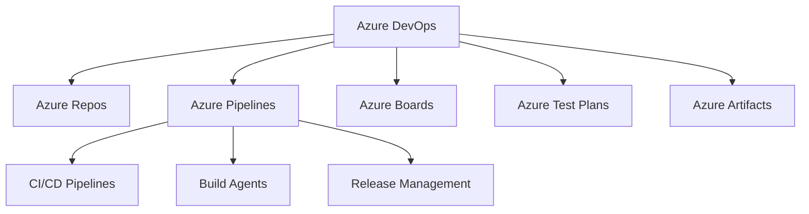

# Azure DevOps

## 1. 概述

Azure DevOps 是微软提供的全功能 DevOps 平台，提供端到端的软件开发生命周期管理。它集成了版本控制、CI/CD、项目管理、测试管理和制品管理等功能，支持在 Azure、多云和本地环境中进行自动化部署。

## 2. 核心特性

### 2.1 主要优势
- **全栈解决方案**: 提供从需求管理到部署监控的完整工具链
- **多云支持**: 支持 Azure、AWS、GCP 和本地环境部署
- **灵活部署**: YAML 流水线和经典编辑器两种配置方式
- **企业级安全**: Azure Active Directory 集成和细粒度权限控制
- **无缝集成**: 与 Visual Studio、Azure 服务深度集成

### 2.2 服务组件


## 3. 快速开始

### 3.1 YAML 流水线配置
在项目根目录创建 `azure-pipelines.yml` 文件：

```yaml
name: $(Date:yyyyMMdd).$(Rev:r)

trigger:
  branches:
    include:
      - main
      - develop
  paths:
    exclude:
      - README.md

pool:
  vmImage: 'ubuntu-latest'

variables:
  buildConfiguration: 'Release'
  nodeVersion: '18.x'

stages:
- stage: Build
  jobs:
  - job: BuildAndTest
    steps:
    - task: NodeTool@0
      inputs:
        versionSpec: '$(nodeVersion)'
      displayName: 'Install Node.js'
    
    - script: npm ci
      displayName: 'Install dependencies'
    
    - script: npm run build
      displayName: 'Build project'
    
    - script: npm test
      displayName: 'Run tests'
    
    - task: PublishBuildArtifacts@1
      inputs:
        PathtoPublish: '$(System.DefaultWorkingDirectory)/dist'
        ArtifactName: 'drop'
        publishLocation: 'Container'
```

### 3.2 多阶段流水线
```yaml
stages:
- stage: Build
  jobs:
  - job: Build
    steps:
    - script: echo "Building application..."
    
- stage: Test
  dependsOn: Build
  jobs:
  - job: UnitTests
    steps:
    - script: echo "Running unit tests..."
    
  - job: IntegrationTests
    steps:
    - script: echo "Running integration tests..."
    
- stage: Deploy
  dependsOn: Test
  condition: succeeded()
  jobs:
  - job: DeployToStaging
    steps:
    - script: echo "Deploying to staging..."
    
  - job: DeployToProduction
    dependsOn: DeployToStaging
    steps:
    - script: echo "Deploying to production..."
```

## 4. 流水线配置详解

### 4.1 代理和池配置
```yaml
pool:
  name: 'Default'
  demands:
    - agent.name -equals $(agentName)
    - npm

resources:
  repositories:
    - repository: self
      type: git
      ref: main
    
  containers:
    - container: node
      image: node:18-alpine
    
  pipelines:
    - pipeline: myOtherPipeline
      source: 'OtherProject-CI'
      branch: main
```

### 4.2 作业和步骤配置
```yaml
jobs:
- job: WindowsBuild
  pool:
    vmImage: 'windows-latest'
  steps:
  - task: NuGetCommand@2
    inputs:
      command: 'restore'
      restoreSolution: '**/*.sln'
  
  - task: VSBuild@1
    inputs:
      solution: '**/*.sln'
      platform: 'Any CPU'
      configuration: '$(buildConfiguration)'

- job: LinuxBuild
  pool:
    vmImage: 'ubuntu-latest'
  steps:
  - script: dotnet restore
    displayName: 'Restore dependencies'
  
  - script: dotnet build --configuration $(buildConfiguration)
    displayName: 'Build solution'
```

### 4.3 变量和参数
```yaml
variables:
  - group: ProductionVariables
  - name: buildConfiguration
    value: 'Release'
  - name: isMain
    value: $[eq(variables['Build.SourceBranch'], 'refs/heads/main')]

parameters:
  - name: environment
    displayName: 'Deployment Environment'
    type: string
    default: 'staging'
    values:
      - staging
      - production
  - name: deploy
    displayName: 'Perform Deployment'
    type: boolean
    default: false

steps:
- ${{ if eq(parameters.deploy, true) }}:
  - script: echo "Deploying to ${{ parameters.environment }}"
```

## 5. 部署策略

### 5.1 多环境部署
```yaml
environments:
  - name: staging
    resourceType: VirtualMachine
    resources:
      - name: web-server
        type: VirtualMachine
        tags: web
  - name: production
    resourceType: Kubernetes
    resources:
      - name: production-cluster
        namespace: default

jobs:
- deployment: DeployWeb
  environment: staging
  strategy:
    runOnce:
      deploy:
        steps:
        - download: current
          artifact: drop
        - script: ./deploy-to-vm.sh
```

### 5.2 蓝绿部署
```yaml
strategy:
  canary:
    increments: [25, 50, 100]
    preDeploy:
      steps:
      - script: echo "Pre-deployment steps"
    deploy:
      steps:
      - script: echo "Deploying canary"
    routeTraffic:
      steps:
      - script: echo "Routing traffic"
    postRouteTraffic:
      steps:
      - script: echo "Monitoring deployment"
    on:
      failure:
        steps:
        - script: echo "Rollback deployment"
      success:
        steps:
        - script: echo "Complete deployment"
```

### 5.3 Kubernetes 部署
```yaml
- task: KubernetesManifest@0
  inputs:
    action: 'deploy'
    namespace: 'default'
    manifests: |
      $(Build.ArtifactStagingDirectory)/manifests/*
    imagePullSecrets: |
      $(imagePullSecret)
    containers: |
      $(containerRegistry)/$(imageRepository):$(tag)

- task: Kubernetes@1
  inputs:
    command: 'rollout'
    arguments: 'status deployment/my-app'
    namespace: 'default'
```

## 6. 集成功能

### 6.1 Azure 服务集成
```yaml
- task: AzureWebApp@1
  inputs:
    azureSubscription: '$(azureServiceConnection)'
    appType: 'webAppLinux'
    appName: '$(webAppName)'
    package: '$(Build.ArtifactStagingDirectory)/**/*.zip'
    runtimeStack: 'NODE|18-lts'

- task: AzureFunctionApp@1
  inputs:
    azureSubscription: '$(azureServiceConnection)'
    appType: 'functionAppLinux'
    appName: '$(functionAppName)'
    package: '$(Build.ArtifactStagingDirectory)/**/*.zip'
    deploymentMethod: 'auto'
```

### 6.2 安全扫描集成
```yaml
- task: SecurityAnalysis@1
  inputs:
    buildConfiguration: '$(buildConfiguration)'
    enableDependencyScan: true
    enableContainerScan: true

- task: WhiteSource@21
  inputs:
    projectName: '$(Build.DefinitionName)'
    scanMode: 'Orchestrator'

- task: SnykSecurityScan@1
  inputs:
    serviceConnectionEndpoint: 'Snyk'
    testType: 'app'
    monitorWhen: 'always'
```

### 6.3 制品管理
```yaml
- task: PublishBuildArtifacts@1
  inputs:
    PathtoPublish: '$(Build.ArtifactStagingDirectory)'
    ArtifactName: 'drop'
    publishLocation: 'Container'

- task: DownloadBuildArtifacts@0
  inputs:
    buildType: 'current'
    downloadType: 'single'
    artifactName: 'drop'
    downloadPath: '$(System.ArtifactsDirectory)'

- task: NuGetCommand@2
  inputs:
    command: 'push'
    packagesToPush: '**/*.nupkg'
    nuGetFeedType: 'internal'
    publishVstsFeed: '$(buildFeed)'
```

## 7. 最佳实践

### 7.1 流水线优化
```yaml
# 使用模板重用配置
resources:
  repositories:
    - repository: templates
      type: git
      name: DevOpsTemplates
      ref: main

extends:
  template: azure-pipelines-template.yml@templates
  parameters:
    environment: production
    deploy: true

# 并行执行作业
jobs:
- job: Test
  strategy:
    matrix:
      linux:
        image: 'ubuntu-latest'
      windows:
        image: 'windows-latest'
      mac:
        image: 'macos-latest'
  steps:
  - script: npm test
```

### 7.2 安全实践
```yaml
# 使用变量组管理机密
variables:
  - group: ProductionSecrets
  - group: DatabaseCredentials

# 服务连接管理
- task: AzureResourceManagerTemplateDeployment@3
  inputs:
    deploymentScope: 'Resource Group'
    azureResourceManagerConnection: '$(azureServiceConnection)'
    subscriptionId: '$(subscriptionId)'
    action: 'Create Or Update Resource Group'
    resourceGroupName: '$(resourceGroup)'
    location: 'East US'
    templateLocation: 'Linked artifact'
    csmFile: '$(Build.SourcesDirectory)/azuredeploy.json'
    overrideParameters: '-environment $(environment)'
```

### 7.3 监控和报告
```yaml
- task: PublishTestResults@2
  inputs:
    testResultsFormat: 'JUnit'
    testResultsFiles: '**/test-results.xml'
    testRunTitle: 'Unit Tests'

- task: PublishCodeCoverageResults@1
  inputs:
    codeCoverageTool: 'Cobertura'
    summaryFileLocation: '$(Build.SourcesDirectory)/**/coverage.xml'
    reportDirectory: '$(Build.SourcesDirectory)/**/coverage'

- task: AzureMonitor@0
  inputs:
    azureSubscription: '$(azureServiceConnection)'
    resourceGroup: '$(resourceGroup)'
    resourceType: 'Microsoft.Insights/components'
    resourceName: '$(appInsightsName)'
    operation: 'RunQuery'
    query: 'requests | where timestamp > ago(24h)'
```

## 8. 自托管代理

### 8.1 代理配置
```yaml
pool:
  name: 'MySelfHostedPool'
  demands:
    - agent.os -equals Linux
    - docker
    - npm

steps:
- script: |
    echo "Running on self-hosted agent"
    docker --version
    node --version
  displayName: 'Check agent capabilities'
```

### 8.2 容器作业
```yaml
resources:
  containers:
    - container: build
      image: node:18-alpine
    - container: test
      image: node:18-chromium

jobs:
- job: BuildInContainer
  container: build
  steps:
  - script: npm ci && npm run build

- job: TestInContainer
  container: test
  steps:
  - script: npm test -- --browser chromium
```

## 9. 故障排除

### 9.1 调试和日志
```yaml
steps:
- script: |
    echo "Build details:"
    echo "Build ID: $(Build.BuildId)"
    echo "Build Number: $(Build.BuildNumber)"
    echo "Source Branch: $(Build.SourceBranch)"
    echo "Agent OS: $(Agent.OS)"
    env | sort
  displayName: 'Debug information'

- task: PowerShell@2
  inputs:
    targetType: 'inline'
    script: |
      Write-Host "Azure DevOps Variables:"
      Get-ChildItem Env: | Where-Object Name -like "*AZURE*" | Format-Table
    pwsh: true
```

### 9.2 性能监控
```yaml
- task: AzureCLI@2
  inputs:
    azureSubscription: '$(azureServiceConnection)'
    scriptType: 'pscore'
    scriptLocation: 'inlineScript'
    inlineScript: |
      az monitor metrics list \
        --resource $(resourceId) \
        --metric "Percentage CPU" \
        --interval PT1H
```
