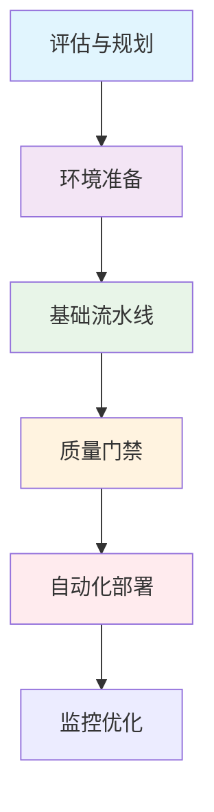

# CI/CD 实施指南

## 1. 概述

CI/CD（持续集成/持续交付）是现代软件开发的核心实践，通过自动化构建、测试和部署流程，实现快速、可靠且高质量的软件交付。本指南提供从零开始实施 CI/CD 的完整框架和最佳实践。

## 2. 实施路线图

### 2.1 阶段规划


### 2.2 实施阶段
| 阶段 | 目标 | 关键活动 | 时间预估 |
|------|------|----------|----------|
| 评估规划 | 确定需求和目标 | 现状分析、目标设定、工具选型 | 2-4周 |
| 环境准备 | 建立基础设施 | 环境搭建、权限配置、网络规划 | 4-6周 |
| 基础流水线 | 实现自动化构建 | 代码编译、单元测试、基础扫描 | 4-8周 |
| 质量门禁 | 确保代码质量 | 代码审查、安全扫描、测试覆盖 | 8-12周 |
| 自动化部署 | 实现自动发布 | 环境部署、发布策略、回滚机制 | 12-16周 |
| 监控优化 | 持续改进 | 性能监控、反馈循环、流程优化 | 持续进行 |

## 3. 环境准备

### 3.1 基础设施规划
```yaml
# infrastructure-as-code.yaml
environments:
  development:
    compute: 
      type: kubernetes
      nodes: 3
      cpu: 8 cores
      memory: 16GB
    storage:
      database: mysql-5.7
      cache: redis-6.0
    network:
      vpc: 10.0.0.0/16
      subnets: [10.0.1.0/24, 10.0.2.0/24]

  staging:
    compute:
      type: kubernetes
      nodes: 5
      cpu: 16 cores
      memory: 32GB
    storage:
      database: mysql-8.0
      cache: redis-6.0
    network:
      vpc: 10.1.0.0/16
      subnets: [10.1.1.0/24, 10.1.2.0/24]

  production:
    compute:
      type: kubernetes
      nodes: 10
      cpu: 32 cores
      memory: 64GB
    storage:
      database: mysql-8.0-cluster
      cache: redis-6.0-cluster
    network:
      vpc: 10.2.0.0/16
      subnets: [10.2.1.0/24, 10.2.2.0/24, 10.2.3.0/24]
```

### 3.2 工具链配置
```bash
#!/bin/bash
# setup-ci-cd-toolchain.sh

# 版本控制工具
git config --global user.name "CI/CD Bot"
git config --global user.email "ci-cd@example.com"
git config --global core.autocrlf input

# 配置 SSH 密钥
ssh-keygen -t rsa -b 4096 -C "ci-cd@example.com" -f ~/.ssh/ci_cd_key

# 安装构建工具
curl -sSL https://get.docker.com | sh
curl -sSL https://deb.nodesource.com/setup_18.x | bash
apt-get install -y maven gradle python3-pip

# 配置容器 registry
docker login -u $REGISTRY_USER -p $REGISTRY_PASSWORD registry.example.com

# 设置环境变量
echo "export CI=true" >> ~/.bashrc
echo "export BUILD_NUMBER=\${BUILD_NUMBER:-0}" >> ~/.bashrc
source ~/.bashrc
```

## 4. 流水线设计

### 4.1 基础流水线模板
```yaml
# .ci/base-pipeline.yaml
name: CI/CD Base Pipeline

on:
  push:
    branches: [main, develop]
  pull_request:
    branches: [main]

jobs:
  code-quality:
    runs-on: ubuntu-latest
    steps:
      - name: Checkout code
        uses: actions/checkout@v4
        with:
          fetch-depth: 0

      - name: Code linting
        run: |
          npm run lint
          pylint src/
          checkstyle -c config/checkstyle.xml src/

      - name: Static analysis
        uses: sonarsource/sonarcloud-github-action@master
        with:
          args: >
            -Dsonar.projectKey=my-project
            -Dsonar.organization=my-org

  unit-tests:
    runs-on: ubuntu-latest
    needs: code-quality
    steps:
      - name: Checkout code
        uses: actions/checkout@v4

      - name: Run unit tests
        run: |
          npm test -- --coverage
          pytest tests/unit --cov=src
          mvn test -Dtest=**/*Test

      - name: Upload coverage
        uses: codecov/codecov-action@v3
        with:
          file: ./coverage.xml

  build-artifacts:
    runs-on: ubuntu-latest
    needs: unit-tests
    steps:
      - name: Build application
        run: |
          npm run build
          mvn package -DskipTests
          docker build -t my-app:$GITHUB_SHA .

      - name: Push artifacts
        run: |
          docker push my-app:$GITHUB_SHA
          aws s3 cp target/*.jar s3://artifacts-bucket/
```

### 4.2 多环境部署流水线
```yaml
# .ci/deployment-pipeline.yaml
name: Deployment Pipeline

on:
  push:
    tags: ['v*']

jobs:
  deploy-staging:
    environment: staging
    runs-on: ubuntu-latest
    steps:
      - name: Deploy to staging
        uses: azure/k8s-deploy@v1
        with:
          namespace: staging
          manifests: |
            k8s/staging/deployment.yaml
            k8s/staging/service.yaml
          images: |
            my-app:${{ github.sha }}

      - name: Run integration tests
        run: |
          curl -f http://staging.my-app.com/health
          npm run test:integration -- --base-url http://staging.my-app.com

      - name: Performance test
        uses: artem-solovev/load-test@v1
        with:
          target: http://staging.my-app.com
          duration: 300
          users: 100

  deploy-production:
    environment: production
    needs: deploy-staging
    runs-on: ubuntu-latest
    steps:
      - name: Approve production deployment
        uses: trstringer/manual-approval@v1
        with:
          secret: ${{ secrets.APPROVAL_SECRET }}
          approvers: admin1,admin2

      - name: Deploy to production
        uses: azure/k8s-deploy@v1
        with:
          namespace: production
          manifests: |
            k8s/production/deployment.yaml
            k8s/production/service.yaml
          images: |
            my-app:${{ github.sha }}

      - name: Verify deployment
        run: |
          curl -f https://my-app.com/health
          npx playwright test --config=playwright.prod.config.ts
```

## 5. 质量门禁

### 5.1 代码质量标准
```yaml
# quality-gates.yaml
quality_gates:
  code_coverage:
    minimum: 80%
    enforcement: fail
    files:
      - src/**/*.js
      - src/**/*.ts
      - src/**/*.java

  static_analysis:
    maximum_critical: 0
    maximum_major: 5
    maximum_minor: 20
    tools:
      - sonarqube
      - eslint
      - checkstyle

  security_scan:
    maximum_critical: 0
    maximum_high: 0
    maximum_medium: 5
    tools:
      - snyk
      - dependency-check
      - trivy

  performance:
    maximum_response_time: 1000ms
    maximum_memory_usage: 512MB
    maximum_cpu_usage: 70%

  accessibility:
    wcag_level: AA
    tools:
      - axe-core
      - lighthouse
```

### 5.2 自动化检查脚本
```bash
#!/bin/bash
# quality-check.sh

set -e  # 出现错误立即退出

# 代码覆盖率检查
COVERAGE=$(npm test -- --coverage --json | jq '.total.lines.pct')
if (( $(echo "$COVERAGE < 80" | bc -l) )); then
  echo "代码覆盖率不足80%，当前：$COVERAGE%"
  exit 1
fi

# 安全漏洞检查
snyk test --severity-threshold=high
if [ $? -ne 0 ]; then
  echo "发现高危安全漏洞"
  exit 1
fi

# 依赖许可证检查
license-checker --onlyAllow "MIT;Apache-2.0;BSD-3-Clause"
if [ $? -ne 0 ]; then
  echo "存在不允许的许可证"
  exit 1
fi

# 构建大小检查
SIZE=$(du -sh dist/ | cut -f1)
if [[ "$SIZE" > "50M" ]]; then
  echo "构建产物过大：$SIZE"
  exit 1
fi

echo "所有质量检查通过"
```

## 6. 部署策略

### 6.1 发布策略选择
```yaml
# deployment-strategies.yaml
strategies:
  blue-green:
    description: 蓝绿部署，零停机时间
    requirements:
      - 两套完整环境
      - 负载均衡器支持
    steps:
      - 部署新版本到绿色环境
      - 运行健康检查
      - 切换流量到绿色环境
      - 蓝色环境作为备用

  canary:
    description: 金丝雀发布，逐步放量
    requirements:
      - 流量控制能力
      - 监控告警系统
    steps:
      - 部署新版本到少量节点
      - 监控关键指标
      - 逐步增加流量比例
      - 全量发布或回滚

  rolling:
    description: 滚动更新，逐步替换
    requirements:
      - 容器编排平台
      - 健康检查配置
    steps:
      - 逐个替换实例
      - 确保服务可用性
      - 自动回滚机制

  feature-flags:
    description: 功能开关，可控发布
    requirements:
      - 功能开关系统
      - 配置管理平台
    steps:
      - 代码中包含功能开关
      - 逐步启用新功能
      - 根据反馈调整
```

### 6.2 部署清单模板
```yaml
# k8s/deployment.yaml
apiVersion: apps/v1
kind: Deployment
metadata:
  name: my-app
  namespace: production
  annotations:
    deployment.strategy: rolling
    deployment.maxUnavailable: 25%
    deployment.maxSurge: 25%
spec:
  replicas: 5
  selector:
    matchLabels:
      app: my-app
  template:
    metadata:
      labels:
        app: my-app
        version: {{ .Values.version }}
    spec:
      containers:
      - name: app
        image: {{ .Values.image.repository }}:{{ .Values.image.tag }}
        imagePullPolicy: Always
        ports:
        - containerPort: 8080
        livenessProbe:
          httpGet:
            path: /health
            port: 8080
          initialDelaySeconds: 30
          periodSeconds: 10
        readinessProbe:
          httpGet:
            path: /ready
            port: 8080
          initialDelaySeconds: 5
          periodSeconds: 5
        resources:
          requests:
            cpu: 500m
            memory: 1Gi
          limits:
            cpu: 1
            memory: 2Gi
```

## 7. 监控与告警

### 7.1 关键指标监控
```yaml
# monitoring/metrics.yaml
metrics:
  deployment:
    - name: deployment_duration
      query: histogram_quantile(0.95, rate(deployment_duration_seconds_bucket[5m]))
      threshold: 300
      description: 部署耗时

    - name: deployment_success_rate
      query: rate(deployment_success_total[5m]) / rate(deployment_attempts_total[5m])
      threshold: 0.95
      description: 部署成功率

  application:
    - name: application_availability
      query: rate(http_requests_total{status!~"5.."}[5m]) / rate(http_requests_total[5m])
      threshold: 0.99
      description: 应用可用性

    - name: response_time_p95
      query: histogram_quantile(0.95, rate(http_request_duration_seconds_bucket[5m]))
      threshold: 1000
      description: 95%响应时间

  infrastructure:
    - name: cpu_utilization
      query: rate(container_cpu_usage_seconds_total[5m])
      threshold: 80
      description: CPU使用率

    - name: memory_utilization
      query: container_memory_usage_bytes / container_spec_memory_limit_bytes
      threshold: 85
      description: 内存使用率
```

### 7.2 告警配置
```yaml
# alerts/ci-cd-alerts.yaml
alerts:
  - name: deployment-failure
    condition: deployment_success_rate < 0.95
    severity: critical
    duration: 5m
    annotations:
      summary: "部署失败率超过阈值"
      description: "最近5分钟内部署成功率低于95%"
    labels:
      team: devops
      service: ci-cd

  - name: high-cpu-usage
    condition: cpu_utilization > 80
    severity: warning
    duration: 10m
    annotations:
      summary: "CPU使用率过高"
      description: "容器CPU使用率持续超过80%"
    labels:
      team: devops
      service: infrastructure

  - name: application-down
    condition: application_availability < 0.99
    severity: critical
    duration: 2m
    annotations:
      summary: "应用不可用"
      description: "应用可用性低于99%"
    labels:
      team: development
      service: application
```

## 8. 安全与合规

### 8.1 安全最佳实践
```yaml
# security/ci-cd-security.yaml
security:
  access_control:
    principle_of_least_privilege: true
    role_based_access: true
    audit_logging: true

  secrets_management:
    encrypted_secrets: true
    rotation_period: 90 days
    access_logging: true

  network_security:
    network_policies: true
    private_registry: true
    vpn_required: true

  compliance:
    regulatory_requirements:
      - gdpr
      - hipaa
      - soc2
    audit_trail: true
    regular_audits: quarterly

  scanning:
    frequency: on_every_push
    tools:
      - type: static_analysis
        tools: [sonarqube, checkmarx]
      - type: dependency_scanning
        tools: [snyk, dependency-check]
      - type: container_scanning
        tools: [trivy, aqua]
      - type: infrastructure_scanning
        tools: [tfsec, checkov]
```

## 9. 组织与流程

### 9.1 团队协作规范
```yaml
# process/collaboration.yaml
code_review:
  required: true
  minimum_approvals: 2
  required_approvers:
    - senior_developers
    - domain_experts
  time_limit: 48 hours

branch_strategy:
  type: gitflow
  branches:
    main: 
      protection: strict
      required_checks: [build, test, security]
    develop:
      protection: medium
      required_checks: [build, test]
    feature:
      protection: minimal
      naming_pattern: feature/*
    release:
      protection: high
      naming_pattern: release/*

release_process:
  versioning: semantic
  changelog: required
  release_notes: required
  approval_workflow:
    - development_lead
    - product_owner
    - security_team

incident_management:
  on_call_rotation: true
  escalation_policy: defined
  postmortem_required: true
```

### 9.2 培训与文档
```markdown
# CI/CD 培训计划

## 新成员入职培训
1. **基础概念** (2小时)
   - CI/CD 核心概念
   - 工具链介绍
   - 基本工作流程

2. **实践操作** (4小时)
   - 代码提交与审查
   - 流水线触发与监控
   - 问题排查与修复

3. **高级主题** (4小时)
   - 部署策略选择
   - 安全最佳实践
   - 性能优化技巧

## 定期培训主题
- 每月技术分享会
- 季度最佳实践更新
- 年度工具链评估

## 文档要求
- 所有流程必须有文档
- 文档随代码版本更新
- 定期审查和更新文档
```
