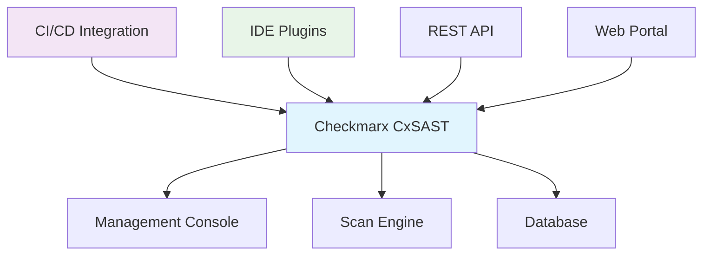

# Checkmarx

## 1. 概述

Checkmarx 是一个企业级静态应用安全测试（SAST）平台，专注于源代码安全分析。它通过深度代码扫描识别安全漏洞、合规性问题和代码质量缺陷，支持多种编程语言和框架，为开发团队提供详细的安全评估和修复指导。

## 2. 核心概念

### 2.1 架构组件


### 2.2 关键术语
- **Project**: 被扫描的代码项目
- **Scan**: 一次安全扫描执行
- **Query**: 安全检测规则（CxQL）
- **Finding**: 检测到的安全问题
- **Triage**: 问题分类和处理
- **Preset**: 扫描配置模板
- **Engine**: 扫描执行引擎

## 3. 快速开始

### 3.1 安装和配置
```bash
# 使用 Docker 部署（开发环境）
docker run -d --name checkmarx \
  -p 8080:8080 \
  -p 8443:8443 \
  -e CX_DB_URL=jdbc:postgresql://db:5432/checkmarx \
  -e CX_DB_USERNAME=checkmarx \
  -e CX_DB_PASSWORD=password \
  checkmarx/cxsast:latest

# 配置 CLI 工具
export CX_BASE_URL=https://checkmarx.example.com
export CX_USERNAME=admin
export CX_PASSWORD=admin123
export CX_TENANT=default

# 验证连接
cx scan list
```

### 3.2 基础命令
```bash
# 创建项目
cx project create --name "my-app" --branch "main"

# 执行扫描
cx scan create --project "my-app" --sources ./src

# 查看扫描结果
cx scan results --scan-id <scan-id>

# 列出项目
cx project list

# 获取扫描历史
cx scan history --project "my-app"

# 生成报告
cx scan report --scan-id <scan-id> --format PDF
```

## 4. 扫描配置

### 4.1 配置文件
```xml
<!-- CxScanConfig.xml -->
<CxScanConfig>
  <ProjectName>my-application</ProjectName>
  <ProjectType>Java</ProjectType>
  <SourceCode>
    <Path>./src</Path>
    <Exclusions>
      <Exclude>**/test/**</Exclude>
      <Exclude>**/generated/**</Exclude>
      <Exclude>**/node_modules/**</Exclude>
    </Exclusions>
  </SourceCode>
  <ScanSettings>
    <Preset>Default</Preset>
    <Incremental>false</Incremental>
    <ForceScan>true</ForceScan>
    <ScanTimeout>7200</ScanTimeout>
  </ScanSettings>
  <EmailNotifications>
    <OnScanCompletion>true</OnScanCompletion>
    <OnScanFailure>true</OnScanFailure>
  </EmailNotifications>
</CxScanConfig>
```

### 4.2 多语言配置
```bash
# Java 项目扫描
cx scan create --project "java-app" \
  --sources ./src \
  --preset "Java Default" \
  --file-filter "*.java,*.jsp,*.xml"

# JavaScript 项目扫描
cx scan create --project "node-app" \
  --sources . \
  --preset "JavaScript Default" \
  --file-filter "*.js,*.ts,*.jsx,*.tsx"

# .NET 项目扫描
cx scan create --project "dotnet-app" \
  --sources ./src \
  --preset "C# Default" \
  --file-filter "*.cs,*.aspx,*.ascx"

# Python 项目扫描
cx scan create --project "python-app" \
  --sources . \
  --preset "Python Default" \
  --file-filter "*.py"

# 多语言混合项目
cx scan create --project "multi-language-app" \
  --sources . \
  --preset "All" \
  --file-filter "**/*.java,**/*.js,**/*.py,**/*.cs"
```

## 5. 集成配置

### 5.1 CI/CD 集成
```yaml
# Jenkins Pipeline
pipeline {
  agent any
  environment {
    CX_BASE_URL = 'https://checkmarx.example.com'
    CX_USERNAME = credentials('checkmarx-user')
    CX_PASSWORD = credentials('checkmarx-password')
    CX_TENANT = 'default'
  }
  stages {
    stage('Checkmarx Scan') {
      steps {
        script {
          // 创建项目
          sh '''
            cx project create \
              --name "${env.JOB_NAME}" \
              --branch "${env.GIT_BRANCH}"
          '''
          
          // 执行扫描
          sh '''
            cx scan create \
              --project "${env.JOB_NAME}" \
              --sources "." \
              --preset "Default" \
              --incremental \
              --async
          '''
          
          // 等待扫描完成
          sh '''
            cx scan wait-for-scan \
              --project "${env.JOB_NAME}" \
              --timeout 3600
          '''
          
          // 检查质量门
          sh '''
            cx scan quality-gate \
              --project "${env.JOB_NAME}" \
              --high-threshold 0 \
              --medium-threshold 5 \
              --low-threshold 10
          '''
        }
      }
    }
  }
  post {
    failure {
      emailext body: 'Checkmarx scan failed or quality gate not passed',
               subject: 'Security Scan Alert',
               to: 'security-team@example.com'
    }
  }
}
```

### 5.2 GitHub Actions 集成
```yaml
name: Checkmarx SAST Scan

on:
  push:
    branches: [ main, develop ]
  pull_request:
    branches: [ main ]

jobs:
  checkmarx-sast:
    runs-on: ubuntu-latest
    steps:
    - uses: actions/checkout@v4
      with:
        fetch-depth: 0
        
    - name: Set up Checkmarx CLI
      run: |
        curl -LO https://checkmarx.com/cli/latest/cx-linux
        chmod +x cx-linux
        sudo mv cx-linux /usr/local/bin/cx
        
    - name: Configure Checkmarx
      run: |
        cx config set --base-url ${{ secrets.CX_BASE_URL }}
        cx config set --username ${{ secrets.CX_USERNAME }}
        cx config set --password ${{ secrets.CX_PASSWORD }}
        cx config set --tenant ${{ secrets.CX_TENANT }}
        
    - name: Run Checkmarx Scan
      run: |
        cx scan create \
          --project "${{ github.repository }}" \
          --sources "." \
          --preset "Default" \
          --branch "${{ github.ref_name }}" \
          --incremental \
          --async
          
        cx scan wait-for-scan \
          --project "${{ github.repository }}" \
          --timeout 3600
          
        cx scan quality-gate \
          --project "${{ github.repository }}" \
          --high-threshold 0 \
          --medium-threshold 3 \
          --low-threshold 10
          
    - name: Upload Results
      uses: actions/upload-artifact@v3
      with:
        name: checkmarx-results
        path: checkmarx-report.xml
```

## 6. 自定义规则

### 6.1 CxQL 查询示例
```sql
// SQL 注入检测
CxQL Query: SQL_Injection

Result Source: 
  Method method = 
    Find_Methods().WithNameLike("executeQuery")
    .Or.WithNameLike("prepareStatement")
    .Or.WithNameLike("createStatement");

Result Condition:
  method.GetParameter(0).IsTainted() 
  AND method.GetParameter(0).IsUserInput()
  AND NOT method.GetParameter(0).IsSanitized();

// XSS 检测
CxQL Query: XSS_Reflected

Result Source:
  Method method = 
    Find_Methods().WithNameLike("write")
    .Or.WithNameLike("print")
    .Or.WithNameLike("println");

Result Condition:
  method.GetParameter(0).IsTainted()
  AND method.GetParameter(0).IsUserInput()
  AND NOT method.GetParameter(0).IsSanitized();

// 硬编码密码检测
CxQL Query: Hardcoded_Password

Result Source:
  Variable passwordVar = 
    Find_Variables().WithNameLike("password")
    .Or.WithNameLike("pwd")
    .Or.WithNameLike("pass");

Result Condition:
  passwordVar.GetInitializer().IsConstant()
  AND passwordVar.GetInitializer().ToString().Length > 3;
```

### 6.2 自定义查询包
```xml
<!-- CustomQueries.xml -->
<QueryPack>
  <Name>Custom Security Rules</Name>
  <Version>1.0.0</Version>
  <Queries>
    <Query>
      <Name>Custom SQL Injection</Name>
      <Language>Java</Language>
      <Group>Security</Group>
      <Severity>High</Severity>
      <Code>
        // Custom SQL injection detection logic
        Method method = Find_Methods().WithName("customQuery");
        ResultCondition: method.GetParameter(0).IsTainted();
      </Code>
    </Query>
    <Query>
      <Name>API Key Exposure</Name>
      <Language>JavaScript</Language>
      <Group>Security</Group>
      <Severity>Medium</Severity>
      <Code>
        // API key exposure detection
        Variable apiKey = Find_Variables().WithNameLike("apiKey");
        ResultCondition: apiKey.GetInitializer().IsConstant();
      </Code>
    </Query>
  </Queries>
</QueryPack>
```

## 7. 结果处理

### 7.1 问题分类
```bash
# 查看扫描结果
cx results show --scan-id <scan-id> --format table

# 筛选结果
cx results show --scan-id <scan-id> --severity High
cx results show --scan-id <scan-id> --state New
cx results show --scan-id <scan-id> --query "SQL_Injection"

# 导出结果
cx results export --scan-id <scan-id> --format XML
cx results export --scan-id <scan-id> --format JSON
cx results export --scan-id <scan-id> --format CSV

# 标记问题状态
cx results triage --scan-id <scan-id> --result-id <result-id> --state Confirmed
cx results triage --scan-id <scan-id> --result-id <result-id> --state FalsePositive
cx results triage --scan-id <scan-id> --result-id <result-id> --state NotExploitable
```

### 7.2 质量门配置
```bash
# 设置质量门限
cx quality-gate set --project "my-app" \
  --high-threshold 0 \
  --medium-threshold 5 \
  --low-threshold 10 \
  --new-threshold 3

# 检查质量门
cx quality-gate check --scan-id <scan-id>

# 自定义质量规则
cx quality-gate custom --project "my-app" \
  --rule "Critical vulnerabilities must be zero" \
  --condition "high_vulns == 0" \
  --action "fail"
```

## 8. 高级功能

### 8.1 API 集成
```bash
# 获取项目列表
curl -X GET \
  -H "Authorization: Bearer $CX_TOKEN" \
  "$CX_BASE_URL/projects"

# 创建扫描
curl -X POST \
  -H "Authorization: Bearer $CX_TOKEN" \
  -H "Content-Type: application/json" \
  -d '{
    "projectId": "123456",
    "isIncremental": true,
    "forceScan": false,
    "comment": "Nightly scan"
  }' \
  "$CX_BASE_URL/scans"

# 获取扫描结果
curl -X GET \
  -H "Authorization: Bearer $CX_TOKEN" \
  "$CX_BASE_URL/scans/789/results"

# 管理问题状态
curl -X PATCH \
  -H "Authorization: Bearer $CX_TOKEN" \
  -H "Content-Type: application/json" \
  -d '{
    "state": "FalsePositive",
    "comment": "Not exploitable in our context"
  }' \
  "$CX_BASE_URL/results/456/triage"
```

### 8.2 自定义预设
```xml
<!-- CustomPreset.xml -->
<Preset>
  <Name>Strict Security</Name>
  <Description>Strict security scanning preset</Description>
  <QueryList>
    <Query id="SQL_Injection" severity="High" enabled="true"/>
    <Query id="XSS_Reflected" severity="High" enabled="true"/>
    <Query id="Hardcoded_Password" severity="Medium" enabled="true"/>
    <Query id="CSRF" severity="Medium" enabled="true"/>
    <Query id="Path_Traversal" severity="High" enabled="true"/>
    <Query id="Code_Quality" severity="Low" enabled="false"/>
  </QueryList>
  <Settings>
    <ScanTimeout>7200</ScanTimeout>
    <MaxConcurrentScanners>4</MaxConcurrentScanners>
    <SourceCodeAnalysis>true</SourceCodeAnalysis>
    <DependencyScanning>true</DependencyScanning>
  </Settings>
</Preset>
```

## 9. 运维和监控

### 9.1 系统管理
```bash
# 监控扫描队列
cx scan queue

# 查看系统状态
cx system status

# 管理用户和权限
cx user list
cx user create --username "dev-user" --role "Scanner"
cx user permission --username "dev-user" --project "my-app" --role "Viewer"

# 备份和恢复
cx system backup --output backup.zip
cx system restore --input backup.zip

# 日志管理
cx log download --type application --days 7
cx log tail --follow
```

### 9.2 性能优化
```bash
# 增量扫描
cx scan create --project "my-app" --sources . --incremental

# 并行扫描
cx scan create --project "my-app" --sources . --engine-count 4

# 扫描优化
cx scan create --project "my-app" --sources . \
  --file-exclusions "**/test/**,**/node_modules/**,**/vendor/**"

# 缓存管理
cx scan create --project "my-app" --sources . --use-cache
cx cache clear --project "my-app"

# 资源限制
cx scan create --project "my-app" --sources . \
  --timeout 3600 \
  --memory-limit 8192
```

### 9.3 报告和分析
```bash
# 生成综合报告
cx report generate --project "my-app" --period "last-30-days" \
  --format PDF --output security-report.pdf

# 趋势分析
cx report trends --project "my-app" --metrics vulnerabilities,fixes

# 对比报告
cx report compare --scan-id-1 123 --scan-id-2 456

# 导出统计数据
cx stats export --project "my-app" --format CSV

# 自定义仪表板
cx dashboard create --name "Security Overview" \
  --widgets "vulnerability_trend,scan_coverage,fix_rate"
```
