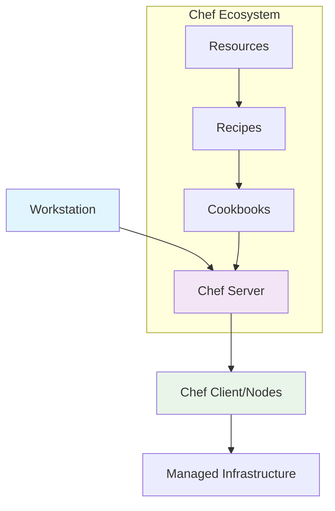

# Chef

## 1. 概述

Chef 是一个强大的基础设施自动化平台，采用基于 Ruby 的领域特定语言（DSL）来定义系统配置。它遵循"基础设施即代码"理念，通过声明式配置实现服务器的自动化配置、部署和管理。Chef 采用客户端-服务器架构，适合大规模环境的管理。

## 2. 核心概念

### 2.1 架构组件


### 2.2 关键术语
- **Cookbook**: 配置的基础单元，包含相关配置的集合
- **Recipe**: Cookbook 中的具体配置脚本
- **Resource**: 描述系统组件的抽象（包、服务、文件等）
- **Attribute**: 节点的配置数据
- **Node**: 被管理的主机
- **Chef Server**: 中央配置存储和管理点
- **Chef Client**: 在节点上运行的代理

## 3. 快速开始

### 3.1 安装和配置
```bash
# 安装 Chef Workstation
# Ubuntu/Debian
curl -L https://omnitruck.chef.io/install.sh | sudo bash -s -- -P chef-workstation

# CentOS/RHEL
curl -L https://omnitruck.chef.io/install.sh | sudo bash -s -- -P chef-workstation

# 验证安装
chef --version
knife --version

# 配置 knife（Chef 命令行工具）
mkdir ~/.chef
cat > ~/.chef/knife.rb << EOF
current_dir = File.dirname(__FILE__)
log_level                :info
log_location             STDOUT
node_name                "your-username"
client_key               "#{current_dir}/your-username.pem"
chef_server_url          "https://chef-server.example.com/organizations/your-org"
cookbook_path            ["#{current_dir}/../cookbooks"]
EOF
```

### 3.2 基础命令
```bash
# 创建 Cookbook
chef generate cookbook my_cookbook

# 上传 Cookbook 到 Chef Server
knife cookbook upload my_cookbook

# 引导新节点
knife bootstrap node.example.com -x username -P password --node-name node1

# 运行 Chef Client
sudo chef-client

# 查看节点信息
knife node list
knife node show node1
```

## 4. Cookbook 开发

### 4.1 Cookbook 结构
```
my_cookbook/
├── metadata.rb          # Cookbook 元数据
├── recipes/
│   └── default.rb       # 默认配方
├── attributes/
│   └── default.rb       # 默认属性
├── templates/
│   └── default/
│       └── config.erb    # 模板文件
├── files/
│   └── default/
│       └── script.sh     # 静态文件
├── test/
│   └── integration/
│       └── default/
│           └── default_test.rb
└── spec/
    └── unit/
        └── recipes/
            └── default_spec.rb
```

### 4.2 Recipe 开发
```ruby
# recipes/default.rb
# 安装包
package 'nginx' do
  action :install
end

# 创建目录
directory '/var/www/html' do
  owner 'www-data'
  group 'www-data'
  mode '0755'
  recursive true
  action :create
end

# 使用模板创建配置文件
template '/etc/nginx/nginx.conf' do
  source 'nginx.conf.erb'
  owner 'root'
  group 'root'
  mode '0644'
  variables(
    worker_processes: node['nginx']['worker_processes'],
    worker_connections: node['nginx']['worker_connections']
  )
  notifies :reload, 'service[nginx]', :delayed
end

# 管理服务
service 'nginx' do
  supports status: true, restart: true, reload: true
  action [:enable, :start]
end

# 执行命令
execute 'setup_firewall' do
  command 'ufw allow 80/tcp'
  not_if 'ufw status | grep 80/tcp'
end

# 使用条件执行
if platform?('ubuntu')
  package 'apt-transport-https' do
    action :install
  end
end
```

### 4.3 属性管理
```ruby
# attributes/default.rb
default['my_cookbook']['version'] = '2.0.0'
default['my_cookbook']['listen_port'] = 8080
default['my_cookbook']['database']['host'] = 'localhost'
default['my_cookbook']['database']['port'] = 5432

# 平台特定属性
case node['platform']
when 'ubuntu'
  default['my_cookbook']['package_manager'] = 'apt'
when 'centos', 'redhat'
  default['my_cookbook']['package_manager'] = 'yum'
end

# 环境特定属性
if node.chef_environment == 'production'
  default['my_cookbook']['log_level'] = 'warn'
else
  default['my_cookbook']['log_level'] = 'debug'
end
```

## 5. 资源详解

### 5.1 常用资源类型
```ruby
# 包管理
package 'apache2' do
  action :install
  version '2.4.29'
end

# 服务管理
service 'apache2' do
  action [:enable, :start]
end

# 文件管理
file '/tmp/hello.txt' do
  content 'Hello, Chef!'
  owner 'root'
  group 'root'
  mode '0644'
end

# 目录管理
directory '/opt/myapp' do
  owner 'appuser'
  group 'appgroup'
  mode '0755'
  recursive true
end

# 模板管理
template '/etc/myapp/config.conf' do
  source 'config.conf.erb'
  variables(config: node['myapp']['config'])
  sensitive true
end

# 执行命令
execute 'update_package_index' do
  command 'apt-get update'
  action :run
end

# 用户管理
user 'appuser' do
  comment 'Application User'
  uid 1001
  home '/home/appuser'
  shell '/bin/bash'
end

# 组管理
group 'appgroup' do
  members ['appuser']
  append true
end
```

### 5.2 高级资源用法
```ruby
# 使用通知
template '/etc/nginx/nginx.conf' do
  notifies :reload, 'service[nginx]', :immediately
end

# 使用守卫条件
package 'mysql-server' do
  only_if { ::File.exist?('/etc/mysql/mysql.conf') }
end

execute 'cleanup_tmp' do
  command 'rm -rf /tmp/*'
  only_if { node['cleanup']['enabled'] }
end

# 使用资源集合
%w[git curl wget].each do |pkg|
  package pkg do
    action :install
  end
end

# 使用延迟评估
ruby_block 'calculate_value' do
  block do
    node.default['computed_value'] = Math.sqrt(100)
  end
  action :run
end
```

## 6. 模板和文件

### 6.1 模板开发
```erb
# templates/default/nginx.conf.erb
user www-data;
worker_processes <%= @worker_processes %>;
pid /run/nginx.pid;

events {
    worker_connections <%= @worker_connections %>;
}

http {
    sendfile on;
    tcp_nopush on;
    tcp_nodelay on;
    keepalive_timeout 65;
    types_hash_max_size 2048;

    include /etc/nginx/mime.types;
    default_type application/octet-stream;

    access_log /var/log/nginx/access.log;
    error_log /var/log/nginx/error.log;

    server {
        listen 80;
        server_name <%= @server_name %>;
        root /var/www/html;

        location / {
            index index.html index.htm;
        }
    }
}
```

### 6.2 文件管理
```ruby
# 使用 cookbook_file 分发静态文件
cookbook_file '/usr/local/bin/my_script.sh' do
  source 'my_script.sh'
  owner 'root'
  group 'root'
  mode '0755'
end

# 使用 remote_file 下载远程文件
remote_file '/tmp/downloaded_file.tar.gz' do
  source 'https://example.com/file.tar.gz'
  owner 'root'
  group 'root'
  mode '0644'
  checksum 'abc123...'
end

# 使用 line 编辑文件
file '/etc/hosts' do
  content <<-EOF
127.0.0.1 localhost
::1 localhost ip6-localhost ip6-loopback
EOF
end
```

## 7. 高级功能

### 7.1 自定义资源
```ruby
# resources/myapp.rb
property :name, String, name_property: true
property :version, String, default: 'latest'
property :config, Hash, default: {}

action :install do
  package new_resource.name do
    version new_resource.version
  end

  directory "/etc/#{new_resource.name}" do
    recursive true
  end

  template "/etc/#{new_resource.name}/config.yml" do
    source 'config.yml.erb'
    variables config: new_resource.config
    notifies :restart, "service[#{new_resource.name}]"
  end

  service new_resource.name do
    action :enable
  end
end
```

### 7.2 数据包和搜索
```ruby
# 使用数据包
db_config = data_bag_item('database', 'production')

template '/app/database.yml' do
  source 'database.yml.erb'
  variables(
    host: db_config['host'],
    port: db_config['port'],
    username: db_config['username']
  )
end

# 使用搜索
web_servers = search(:node, 'role:web_server AND chef_environment:production')

web_servers.each do |server|
  template "/etc/loadbalancer/backends/#{server['hostname']}.conf" do
    source 'backend.conf.erb'
    variables ip: server['ipaddress']
  end
end
```

### 7.3 测试和验证
```ruby
# test/integration/default/default_test.rb
describe package('nginx') do
  it { should be_installed }
end

describe service('nginx') do
  it { should be_enabled }
  it { should be_running }
end

describe port(80) do
  it { should be_listening }
end

describe file('/etc/nginx/nginx.conf') do
  its('content') { should match(/worker_processes 4/) }
end
```

## 8. CI/CD 集成

### 8.1 Chef in Pipeline
```yaml
# .github/workflows/chef.yml
name: Chef Cookbook CI

on:
  push:
    branches: [ main ]
  pull_request:
    branches: [ main ]

jobs:
  test:
    runs-on: ubuntu-latest
    strategy:
      matrix:
        ruby: [2.7, 3.0]
    steps:
    - uses: actions/checkout@v4
    
    - name: Set up Ruby
      uses: ruby/setup-ruby@v1
      with:
        ruby-version: ${{ matrix.ruby }}
        
    - name: Install dependencies
      run: |
        gem install chef
        gem install cookstyle
        gem install foodcritic
        
    - name: Run syntax check
      run: cookstyle .
      
    - name: Run foodcritic
      run: foodcritic .
      
    - name: Run ChefSpec
      run: rspec spec/
      
    - name: Upload to Chef Server
      if: github.ref == 'refs/heads/main'
      run: knife cookbook upload my_cookbook
      env:
        CHEF_SERVER_URL: ${{ secrets.CHEF_SERVER_URL }}
        CHEF_CLIENT_KEY: ${{ secrets.CHEF_CLIENT_KEY }}
```

### 8.2 安全最佳实践
```ruby
# 使用加密数据包
secret = data_bag_item('secrets', 'database', secret_file)

# 使用环境变量
db_password = ENV['DB_PASSWORD'] || node['database']['password']

# 使用敏感资源
template '/etc/secrets.conf' do
  source 'secrets.conf.erb'
  sensitive true
  variables(api_key: node['secrets']['api_key'])
end
```

## 9. 运维和监控

### 9.1 节点管理
```bash
# 管理节点
knife node list
knife node show node1
knife node edit node1
knife node delete node1

# 管理运行列表
knife node run_list add node1 "recipe[my_cookbook]"
knife node run_list remove node1 "recipe[old_cookbook]"

# 批量操作
knife ssh "role:web_server" "sudo chef-client"
knife ssh "chef_environment:production" "apt-get update"

# 备份和恢复
knife download /
knife upload /
```

### 9.2 监控和日志
```bash
# 查看 Chef Client 日志
tail -f /var/log/chef/client.log

# 调试模式运行
sudo chef-client -l debug

# 为什么运行模式
sudo chef-client --why-run

# 使用报告处理程序
# 在 client.rb 中配置:
# report_handlers << MyCustomHandler
```

### 9.3 性能优化
```ruby
# 使用延迟通知
template '/etc/nginx/nginx.conf' do
  notifies :reload, 'service[nginx]', :delayed
end

# 使用批量资源处理
with_run_context :root do
  edit_resource(:package, 'common-packages') do
    action :nothing
  end
end

# 优化资源收集
ohai_plugin 'custom' do
  action :nothing
  compile_time false
end
```
