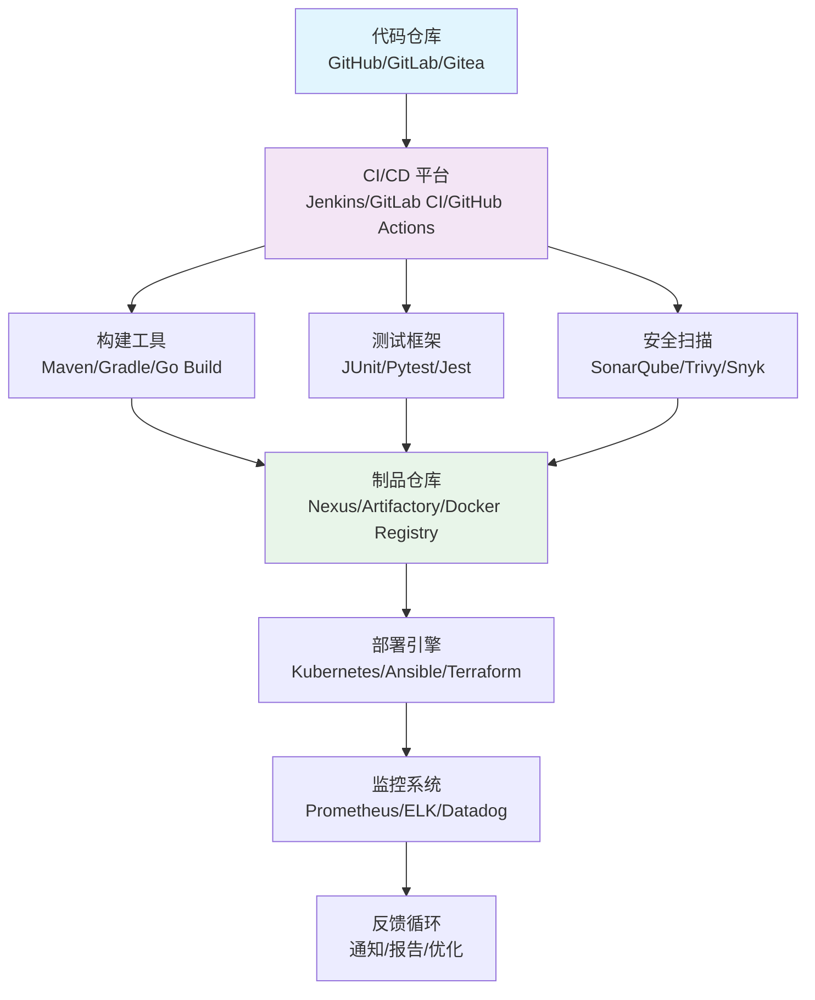
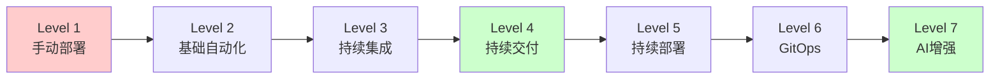

# CI/CD 工具与技术全景解析

## 1. 概述

CI/CD（持续集成/持续部署）是现代软件开发的核心实践，通过自动化流程实现快速、可靠的软件交付。本指南全面解析主流 CI/CD 工具链和技术栈。

## 2. 技术架构全景



## 3. 工具链分类与选择

### 3.1 CI/CD 平台对比

| 工具 | 类型 | 优势 | 适用场景 |
|------|------|------|----------|
| **Jenkins** | 自托管 | 插件丰富，高度可定制 | 企业级复杂流水线 |
| **GitLab CI** | 集成式 | 与GitLab深度集成 | 一体化DevOps平台 |
| **GitHub Actions** | 云原生 | 与GitHub无缝集成 | 开源项目/云原生应用 |
| **CircleCI** | 云服务 | 配置简单，性能优秀 | 初创公司/中型团队 |
| **Drone** | 轻量级 | 容器原生，简单易用 | 容器化环境 |

### 3.2 编程语言特化工具

**Go 语言工具链**：
```bash
# 完整Go CI/CD工具链
go test -race -cover ./...          # 测试覆盖
golangci-lint run                  # 代码检查
goreleaser release                 # 自动化发布
staticcheck ./...                  # 静态分析
trivy image your-app:latest        # 安全扫描
```

**Java 工具链**：
```bash
mvn clean package -DskipTests      # 构建打包
jacoco:report                      # 覆盖率报告
spotbugs:check                     # 代码质量
dependency-check:check             # 依赖安全
```

**JavaScript/Node.js 工具链**：
```bash
npm test --coverage                # 测试覆盖
eslint .                           # 代码检查
audit-ci                           # 安全审计
webpack --mode production          # 构建优化
```

## 4. 核心组件详解

### 4.1 代码质量管理

**SonarQube 配置**：
```yaml
# sonar-project.properties
sonar.projectKey=your-project
sonar.projectName=Your Project
sonar.projectVersion=1.0
sonar.sources=src
sonar.tests=test
sonar.sourceEncoding=UTF-8
sonar.host.url=http://sonarqube:9000
sonar.login=${SONAR_TOKEN}

# 质量阈配置
sonar.qualitygate.wait=true
sonar.qualitygate.timeout=300
```

**代码检查流水线**：
```yaml
# .gitlab-ci.yml
stages:
  - test
  - quality

code_quality:
  stage: quality
  image: sonarsource/sonar-scanner-cli:latest
  script:
    - sonar-scanner
  only:
    - main
    - develop
```

### 4.2 安全扫描集成

**多工具安全扫描**：
```yaml
# security-scan.yml
security:
  - name: dependency-scan
    tool: snyk
    args: test --all-projects
  - name: container-scan
    tool: trivy
    args: image your-app:latest
  - name: code-scan
    tool: gitleaks
    args: detect --source . --verbose
  - name: infra-scan
    tool: checkov
    args: -d .
```

### 4.3 部署策略模式

**蓝绿部署配置**：
```yaml
# blue-green-deployment.yml
apiVersion: apps/v1
kind: Deployment
metadata:
  name: app-blue
spec:
  replicas: 3
  selector:
    matchLabels:
      app: app
      version: blue
  template:
    metadata:
      labels:
        app: app
        version: blue
    spec:
      containers:
      - name: app
        image: your-app:blue
        ports:
        - containerPort: 8080

---
apiVersion: v1
kind: Service
metadata:
  name: app-service
spec:
  selector:
    app: app
    version: blue  # 控制流量指向
  ports:
  - port: 80
    targetPort: 8080
```

## 5. 现代 CI/CD 实践

### 5.1 GitOps 工作流

**ArgoCD 配置**：
```yaml
# application.yaml
apiVersion: argoproj.io/v1alpha1
kind: Application
metadata:
  name: production-app
spec:
  project: default
  source:
    repoURL: https://github.com/your-org/your-app
    targetRevision: HEAD
    path: k8s/production
  destination:
    server: https://kubernetes.default.svc
    namespace: production
  syncPolicy:
    automated:
      selfHeal: true
      prune: true
```

### 5.2 不可变基础设施

**Terraform 部署**：
```hcl
# main.tf
resource "aws_eks_cluster" "production" {
  name     = "production-cluster"
  role_arn = aws_iam_role.eks.arn

  vpc_config {
    subnet_ids = [aws_subnet.main.id]
  }
}

resource "kubernetes_deployment" "app" {
  metadata {
    name = "app-deployment"
  }

  spec {
    replicas = 3

    selector {
      match_labels = {
        app = "application"
      }
    }

    template {
      metadata {
        labels = {
          app = "application"
        }
      }

      spec {
        container {
          image = "your-app:${var.image_tag}"
          name  = "app"
        }
      }
    }
  }
}
```

## 6. 监控与可观测性

### 6.1 流水线监控

**Prometheus 指标收集**：
```yaml
# pipeline-metrics.yml
metrics:
  - name: pipeline_duration
    help: "CI/CD pipeline duration in seconds"
    type: histogram
    buckets: [30, 60, 120, 300, 600]
    labels: [stage, status]

  - name: test_coverage
    help: "Code test coverage percentage"
    type: gauge
    labels: [language, module]

  - name: deployment_frequency
    help: "Deployment frequency per day"
    type: counter
    labels: [environment]
```

### 6.2 日志聚合

**ELK Stack 配置**：
```yaml
# filebeat.yml
filebeat.inputs:
- type: filestream
  paths:
    - /var/log/ci/*.log
  fields:
    type: "ci-pipeline"

output.elasticsearch:
  hosts: ["elasticsearch:9200"]
  indices:
    - index: "ci-logs-%{+yyyy.MM.dd}"
```

## 7. 安全与合规

### 7.1 安全流水线

**DevSecOps 集成**：
```yaml
# devsecops-pipeline.yml
stages:
  - saast            # 静态应用安全测试
  - dast            # 动态应用安全测试
  - sca             # 软件成分分析
  - compliance      # 合规检查

sast:
  script:
    - semgrep scan --config=p/ci
    - bandit -r .

dast:
  script:
    - zap-baseline.py -t https://your-app.com

sca:
  script:
    - trivy fs .
    - grype your-app:latest

compliance:
  script:
    - checkov -d .
    - tfsec .
```

### 7.2 密钥管理

**HashiCorp Vault 集成**：
```yaml
# vault-integration.yml
secrets:
  engine: vault
  path: kv/ci-cd
  policies:
    - ci-reader
    - deployment-writer

env:
  DB_PASSWORD: vault:kv/ci-cd#db_password
  API_KEY: vault:kv/ci-cd#api_key
  SSL_CERT: vault:kv/ci-cd#ssl_cert
```

## 8. 性能优化策略

### 8.1 构建缓存优化

**分布式缓存配置**：
```yaml
# cache-optimization.yml
cache:
  strategy: distributed
  backend: s3
  paths:
    - /root/.m2/repository
    - /root/.cache/go-build
    - /root/.npm
    - /tmp/gradle-cache

  retention:
    policy: lru
    max_size: 10GB
    ttl: 7d

  compression:
    enabled: true
    algorithm: zstd
```

### 8.2 并行执行优化

**流水线并行化**：
```yaml
# parallel-execution.yml
stages:
  - name: quality-checks
    parallel: true
    steps:
      - name: unit-tests
        matrix: [go, java, node]
      - name: linting
        matrix: [golangci-lint, checkstyle, eslint]
      - name: security-scan
        matrix: [trivy, snyk, bandit]

  - name: build-artifacts
    parallel: true
    steps:
      - name: docker-build
        platforms: [amd64, arm64]
      - name: package-build
        targets: [deb, rpm, tar]
```

## 9. 多云与混合云部署

### 9.1 跨云部署策略

**Terraform 多云配置**：
```hcl
# multi-cloud.tf
# AWS 部署
module "aws_deployment" {
  source = "./modules/aws"
  region = "us-west-2"
  instance_type = "t3.medium"
}

# Azure 部署
module "azure_deployment" {
  source = "./modules/azure"
  location = "eastus"
  vm_size = "Standard_B2s"
}

# GCP 部署
module "gcp_deployment" {
  source = "./modules/gcp"
  region = "us-central1"
  machine_type = "e2-medium"
}
```

### 9.2 混合云连接

**VPN 与网络配置**：
```yaml
# hybrid-cloud.yml
networking:
  vpn:
    type: wireguard
    peers:
      - aws_vpc_cidr: "10.0.0.0/16"
      - azure_vnet_cidr: "10.1.0.0/16"
      - on_premise_cidr: "192.168.0.0/24"

  dns:
    strategy: consul
    zones:
      - "internal.example.com"
      - "cloud.example.com"
```

## 10. 未来趋势与演进

### 10.1 AI 增强的 CI/CD

**智能优化预测**：
```yaml
# ai-enhanced-ci.yml
features:
  - name: test_selection
    ai_model: test-impact-analysis
    predicts: affected_tests

  - name: build_optimization
    ai_model: build-cache-prediction
    suggests: optimal_cache_strategy

  - name: deployment_risk
    ai_model: risk-assessment
    predicts: deployment_success_probability
```

### 10.2 无服务器 CI/CD

**Serverless 运行器**：
```yaml
# serverless-ci.yml
runners:
  type: lambda
  config:
    memory: 2048
    timeout: 900
    concurrency: 100

  triggers:
    - event: push
      filters: [branch, path]
    - event: pr
      filters: [label, milestone]

  scaling:
    min: 0
    max: 1000
    metrics: [cpu, memory, duration]
```

## 11. 实施路线图

### 11.1 成熟度模型



### 11.2 迁移策略

**渐进式迁移计划**：
```yaml
# migration-plan.yml
phases:
  - name: assessment
    duration: 2w
    activities: [inventory, analysis, planning]

  - name: foundation
    duration: 4w
    activities: [tooling, environment, training]

  - name: pilot
    duration: 6w
    activities: [select_team, implement, measure]

  - name: expansion
    duration: 8w
    activities: [scale, optimize, automate]

  - name: optimization
    duration: ongoing
    activities: [monitor, improve, innovate]
```
