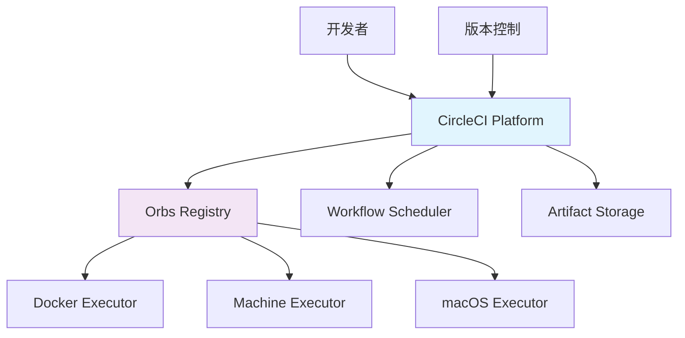

# CircleCI

## 1. 概述

CircleCI 是一个云原生的持续集成和持续交付平台，支持快速的构建、测试和部署流程。它提供强大的编排能力、丰富的集成选项和灵活的配置方式，适合各种规模的项目。

## 2. 核心概念

### 2.1 架构组件


### 2.2 关键特性
- **云原生架构**: 基于容器和云基础设施
- **强大的 Orbs**: 可重用的配置包生态系统
- **灵活的执行器**: Docker, VM, macOS, Windows 支持
- **工作流编排**: 复杂的管道依赖和并行执行
- **丰富的集成**: 与主流云服务和开发工具集成

## 3. 配置基础

### 3.1 基础配置文件
```yaml
# .circleci/config.yml
version: 2.1

# 可重用的配置片段
commands:
  setup-environment:
    steps:
      - checkout
      - run:
          name: Setup environment
          command: |
            echo "Setting up build environment"
            export NODE_ENV=test
            npm ci

  run-tests:
    steps:
      - run:
          name: Run tests
          command: npm test -- --coverage
      - store_test_results:
          path: test-results
      - store_artifacts:
          path: coverage

# 可重用的任务
jobs:
  test:
    docker:
      - image: cimg/node:18.17
    steps:
      - setup-environment
      - run-tests

  build:
    docker:
      - image: cimg/node:18.17
    steps:
      - setup-environment
      - run:
          name: Build application
          command: npm run build
      - store_artifacts:
          path: dist

# 工作流定义
workflows:
  version: 2
  test-and-build:
    jobs:
      - test
      - build:
          requires:
            - test
          filters:
            branches:
              only: main
```

### 3.2 Orbs 使用配置
```yaml
# .circleci/config.yml
version: 2.1

# 声明使用的 orbs
orbs:
  node: circleci/node@5.1.0
  aws-cli: circleci/aws-cli@3.1.0
  aws-ecr: circleci/aws-ecr@8.1.0
  aws-eks: circleci/aws-eks@2.2.0
  slack: circleci/slack@4.10.1

# 工作流配置
workflows:
  deploy-pipeline:
    jobs:
      - node/test:
          version: '18.17'
          app-dir: ~/project
      
      - aws-ecr/build-and-push-image:
          name: build-docker-image
          account-url: AWS_ECR_ACCOUNT_URL
          repo: my-app
          tag: latest,${CIRCLE_SHA1}
          requires:
            - node/test
          
      - aws-eks/update-container-image:
          name: deploy-to-eks
          cluster-name: my-cluster
          container-image-updates: |
            - container-name: my-app
              value: ${AWS_ECR_ACCOUNT_URL}/my-app:${CIRCLE_SHA1}
          requires:
            - build-docker-image
          
      - slack/notify:
          event: pass
          template: basic_success_1
          requires:
            - deploy-to-eks
```

## 4. 高级配置

### 4.1 多环境工作流
```yaml
# .circleci/config.yml
version: 2.1

orbs:
  aws: circleci/aws-cli@3.1.0
  kubernetes: circleci/kubernetes@2.4.0

jobs:
  deploy:
    parameters:
      environment:
        type: string
        default: staging
      version:
        type: string
        default: latest
    docker:
      - image: cimg/base:2023.09
    steps:
      - checkout
      - aws/install
      - kubernetes/install
      - run:
          name: Deploy to << parameters.environment >>
          command: |
            aws eks update-kubeconfig --name my-cluster
            kubectl set image deployment/my-app \
              my-app=my-registry/my-app:<< parameters.version >> \
              -n << parameters.environment >>
            kubectl rollout status deployment/my-app \
              -n << parameters.environment >> --timeout=300s

workflows:
  deployment:
    jobs:
      - deploy:
          name: deploy-staging
          environment: staging
          version: ${CIRCLE_SHA1}
          filters:
            branches:
              only: develop
      
      - deploy:
          name: deploy-production
          environment: production
          version: ${CIRCLE_TAG}
          requires:
            - deploy-staging
          filters:
            branches:
              ignore: /.*/
            tags:
              only: /^v\d+\.\d+\.\d+$/
```

### 4.2 矩阵构建配置
```yaml
# .circleci/config.yml
version: 2.1

jobs:
  test-matrix:
    parameters:
      node-version:
        type: string
      os:
        type: string
    machine:
      image: << parameters.os >>
    steps:
      - checkout
      - run:
          name: Setup Node.js << parameters.node-version >>
          command: |
            curl -fsSL https://fnm.vercel.app/install | bash
            export PATH="/root/.local/share/fnm:$PATH"
            fnm install << parameters.node-version >>
            fnm use << parameters.node-version >>
      - run:
          name: Run tests
          command: npm test

workflows:
  matrix-test:
    jobs:
      - test-matrix:
          matrix:
            parameters:
              node-version: ["16", "18", "20"]
              os: ["ubuntu-2004", "ubuntu-2204"]
          filters:
            branches:
              only: main
```

## 5. 缓存和优化

### 5.1 缓存策略配置
```yaml
# .circleci/config.yml
version: 2.1

jobs:
  install-dependencies:
    docker:
      - image: cimg/node:18.17
    steps:
      - checkout
      - restore_cache:
          keys:
            - node-deps-{{ checksum "package-lock.json" }}
            - node-deps-
      - run:
          name: Install dependencies
          command: npm ci
      - save_cache:
          paths:
            - node_modules
          key: node-deps-{{ checksum "package-lock.json" }}
  
  build:
    docker:
      - image: cimg/node:18.17
    steps:
      - checkout
      - restore_cache:
          keys:
            - node-deps-{{ checksum "package-lock.json" }}
      - run:
          name: Build application
          command: npm run build
      - save_cache:
          paths:
            - dist
          key: build-{{ .Environment.CIRCLE_SHA1 }}

workflows:
  cached-build:
    jobs:
      - install-dependencies
      - build:
          requires:
            - install-dependencies
```

### 5.2 资源优化配置
```yaml
# .circleci/config.yml
version: 2.1

jobs:
  optimized-build:
    resource_class: medium
    docker:
      - image: cimg/node:18.17
    steps:
      - checkout
      - restore_cache:
          keys:
            - node-deps-{{ checksum "package-lock.json" }}
      - run:
          name: Install with memory optimization
          command: |
            node --max-old-space-size=4096 npm ci
      - run:
          name: Build with concurrency
          command: |
            npm run build -- --parallel
      - store_artifacts:
          path: dist
      - store_test_results:
          path: test-results

workflows:
  optimized:
    jobs:
      - optimized-build:
          context: org-global
```

## 6. 安全扫描

### 6.1 安全扫描配置
```yaml
# .circleci/config.yml
version: 2.1

orbs:
  security: circleci/security@1.0.0

jobs:
  security-scan:
    docker:
      - image: cimg/base:2023.09
    steps:
      - checkout
      - security/scan:
          type: all
          fail-on-severity: high
          include-tools: [snyk, trivy, bandit]
  
  dependency-scan:
    docker:
      - image: cimg/node:18.17
    steps:
      - checkout
      - run:
          name: Audit dependencies
          command: |
            npm audit --audit-level=high
            npm outdated
      - run:
          name: Check licenses
          command: npx license-checker --summary

workflows:
  security:
    jobs:
      - security-scan
      - dependency-scan
```

## 7. 部署策略

### 7.1 蓝绿部署配置
```yaml
# .circleci/config.yml
version: 2.1

orbs:
  aws: circleci/aws-cli@3.1.0
  kubernetes: circleci/kubernetes@2.4.0

jobs:
  blue-deploy:
    docker:
      - image: cimg/base:2023.09
    steps:
      - checkout
      - aws/install
      - kubernetes/install
      - run:
          name: Deploy blue environment
          command: ./scripts/deploy-blue.sh
  
  green-deploy:
    docker:
      - image: cimg/base:2023.09
    steps:
      - checkout
      - aws/install
      - kubernetes/install
      - run:
          name: Deploy green environment
          command: ./scripts/deploy-green.sh
  
  switch-traffic:
    docker:
      - image: cimg/base:2023.09
    steps:
      - checkout
      - aws/install
      - kubernetes/install
      - run:
          name: Switch traffic
          command: ./scripts/switch-traffic.sh

workflows:
  blue-green:
    jobs:
      - blue-deploy
      - green-deploy:
          requires:
            - blue-deploy
      - switch-traffic:
          requires:
            - green-deploy
          filters:
            branches:
              only: main
```

### 7.2 金丝雀部署配置
```yaml
# .circleci/config.yml
version: 2.1

jobs:
  canary-deploy:
    docker:
      - image: cimg/base:2023.09
    steps:
      - checkout
      - run:
          name: Deploy canary
          command: |
            # 部署金丝雀版本
            kubectl set image deployment/my-app-canary \
              my-app=my-registry/my-app:${CIRCLE_SHA1}
            kubectl scale deployment/my-app-canary --replicas=1
            
            # 等待金丝雀就绪
            kubectl rollout status deployment/my-app-canary --timeout=300s
            
            # 运行金丝雀测试
            ./scripts/canary-test.sh
  
  full-deploy:
    docker:
      - image: cimg/base:2023.09
    steps:
      - checkout
      - run:
          name: Full deployment
          command: |
            kubectl set image deployment/my-app \
              my-app=my-registry/my-app:${CIRCLE_SHA1}
            kubectl rollout status deployment/my-app --timeout=300s

workflows:
  canary:
    jobs:
      - canary-deploy
      - full-deploy:
          requires:
            - canary-deploy
          filters:
            branches:
              only: main
```

## 8. 监控和通知

### 8.1 监控配置
```yaml
# .circleci/config.yml
version: 2.1

orbs:
  prometheus: circleci/prometheus@1.0.0
  datadog: circleci/datadog@1.5.0

jobs:
  monitor-build:
    docker:
      - image: cimg/base:2023.09
    steps:
      - checkout
      - prometheus/push-metrics:
          job: circleci
          instance: ${CIRCLE_PROJECT_REPONAME}
          metrics:
            - name: build_duration_seconds
              value: ${CIRCLE_BUILD_DURATION}
            - name: test_coverage_percent
              value: ${COVERAGE_PERCENT}
      
      - datadog/send-metrics:
          metrics:
            - name: circleci.build.success
              value: 1
              tags:
                - project:${CIRCLE_PROJECT_REPONAME}
                - branch:${CIRCLE_BRANCH}
          
      - run:
          name: Generate build report
          command: ./scripts/generate-report.sh

workflows:
  monitoring:
    jobs:
      - monitor-build:
          post-steps:
            - store_artifacts:
                path: build-report.html
```

### 8.2 通知配置
```yaml
# .circleci/config.yml
version: 2.1

orbs:
  slack: circleci/slack@4.10.1
  email: circleci/email@1.0.0

jobs:
  notify:
    docker:
      - image: cimg/base:2023.09
    steps:
      - slack/notify:
          event: always
          template: basic_success_1
          channel: deployments
      
      - email/send:
          to: team@example.com
          subject: "Build ${CIRCLE_BUILD_NUM} ${CIRCLE_JOB}"
          body: |
            Build ${CIRCLE_BUILD_NUM} for ${CIRCLE_PROJECT_REPONAME}
            Status: ${CIRCLE_JOB}
            Branch: ${CIRCLE_BRANCH}
            Commit: ${CIRCLE_SHA1}

workflows:
  notification:
    jobs:
      - notify:
          context: org-global
          filters:
            branches:
              only: main
```

## 9. 故障排除

### 9.1 调试配置
```yaml
# .circleci/config.yml
version: 2.1

jobs:
  debug-build:
    docker:
      - image: cimg/base:2023.09
    steps:
      - checkout
      - run:
          name: Debug information
          command: |
            echo "Build information:"
            echo "Project: ${CIRCLE_PROJECT_REPONAME}"
            echo "Branch: ${CIRCLE_BRANCH}"
            echo "SHA: ${CIRCLE_SHA1}"
            echo "Workflow: ${CIRCLE_WORKFLOW_ID}"
            
            echo "Environment:"
            env | sort
            
            echo "Disk usage:"
            df -h
            
            echo "Memory info:"
            free -h
      
      - run:
          name: Network diagnostics
          command: |
            ping -c 3 google.com
            curl -I https://circleci.com
            nslookup circleci.com
            
      - store_artifacts:
          path: debug.log

workflows:
  debug:
    jobs:
      - debug-build:
          context: org-global
```

### 9.2 重试策略配置
```yaml
# .circleci/config.yml
version: 2.1

jobs:
  flaky-test:
    docker:
      - image: cimg/node:18.17
    steps:
      - checkout
      - run:
          name: Run flaky tests
          command: npm run test:flaky
          # 自动重试配置
          no_output_timeout: 30m
          # 失败时重试
          when: on_fail
  
  reliable-build:
    docker:
      - image: cimg/node:18.17
    # 任务级别重试
    resource_class: medium
    steps:
      - checkout
      - run:
          name: Build with retry
          command: |
            # 自定义重试逻辑
            for i in {1..3}; do
              npm run build && break
              sleep 5
            done

workflows:
  retry-strategy:
    jobs:
      - flaky-test:
          # 工作流级别重试
          post-steps:
            - when: on_fail
              steps:
                - run: echo "Build failed, investigating..."
      - reliable-build:
          requires:
            - flaky-test
```
