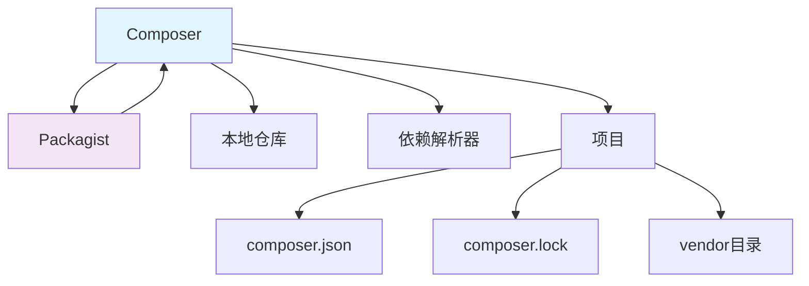

# Composer

## 1. 概述

Composer 是 PHP 的依赖管理工具，用于管理 PHP 项目的库依赖关系。它允许开发者声明项目所依赖的库，并自动处理这些库的安装和更新。

## 2. 核心概念

### 2.1 架构组件


### 2.2 关键特性
- **依赖管理**: 自动处理包依赖关系
- **自动加载**: 生成优化的自动加载文件
- **版本控制**: 支持语义化版本控制
- **包仓库**: 与 Packagist 等包仓库集成
- **脚本支持**: 支持预定义和自定义脚本

## 3. 安装与配置

### 3.1 全局安装
```bash
#!/bin/bash
# install-composer.sh

# 下载安装脚本
php -r "copy('https://getcomposer.org/installer', 'composer-setup.php');"

# 验证安装脚本
php -r "if (hash_file('sha384', 'composer-setup.php') === '$(curl -s https://composer.github.io/installer.sig)') { echo 'Installer verified'; } else { echo 'Installer corrupt'; unlink('composer-setup.php'); } echo PHP_EOL;"

# 安装 Composer
php composer-setup.php --install-dir=/usr/local/bin --filename=composer

# 删除安装脚本
php -r "unlink('composer-setup.php');"

# 验证安装
composer --version

# 配置中国镜像（可选）
composer config -g repo.packagist composer https://mirrors.aliyun.com/composer/
```

### 3.2 项目初始化
```bash
#!/bin/bash
# init-composer.sh

# 创建新项目
composer init \
  --name="vendor/project-name" \
  --description="My awesome project" \
  --author="Your Name <your.email@example.com>" \
  --type="project" \
  --homepage="https://example.com" \
  --require="php:^8.1" \
  --require-dev="phpunit/phpunit:^9.0" \
  --stability="stable" \
  --license="MIT"

# 或者使用现有模板
composer create-project laravel/laravel my-project
composer create-project symfony/website-skeleton my-symfony-project

# 安装依赖
composer install

# 更新依赖
composer update
```

## 4. 配置文件

### 4.1 composer.json 详解
```json
{
  "name": "vendor/project-name",
  "description": "My awesome PHP project",
  "type": "project",
  "keywords": ["framework", "mvc", "php"],
  "homepage": "https://example.com",
  "license": "MIT",
  "authors": [
    {
      "name": "Your Name",
      "email": "your.email@example.com",
      "homepage": "https://yourwebsite.com",
      "role": "Developer"
    }
  ],
  "require": {
    "php": "^8.1",
    "ext-json": "*",
    "ext-pdo": "*",
    "guzzlehttp/guzzle": "^7.0",
    "monolog/monolog": "^2.0",
    "symfony/http-foundation": "^6.0"
  },
  "require-dev": {
    "phpunit/phpunit": "^9.0",
    "mockery/mockery": "^1.0",
    "fakerphp/faker": "^1.9"
  },
  "autoload": {
    "psr-4": {
      "App\\": "src/",
      "Database\\Factories\\": "database/factories/",
      "Database\\Seeders\\": "database/seeders/"
    },
    "files": [
      "src/helpers.php"
    ]
  },
  "autoload-dev": {
    "psr-4": {
      "Tests\\": "tests/"
    }
  },
  "scripts": {
    "post-autoload-dump": [
      "Illuminate\\Foundation\\ComposerScripts::postAutoloadDump",
      "@php artisan package:discover --ansi"
    ],
    "post-update-cmd": [
      "@php artisan vendor:publish --tag=laravel-assets --ansi --force"
    ],
    "post-install-cmd": [
      "@php artisan storage:link"
    ],
    "test": "@php vendor/bin/phpunit",
    "lint": "@php vendor/bin/php-cs-fixer fix --allow-risky=yes"
  },
  "scripts-descriptions": {
    "test": "Run PHPUnit tests",
    "lint": "Fix code style issues"
  },
  "config": {
    "preferred-install": "dist",
    "sort-packages": true,
    "optimize-autoloader": true,
    "platform-check": true,
    "allow-plugins": {
      "pakyow/pakyow": true
    }
  },
  "minimum-stability": "stable",
  "prefer-stable": true,
  "repositories": [
    {
      "type": "vcs",
      "url": "https://github.com/vendor/private-package"
    },
    {
      "type": "composer",
      "url": "https://packages.example.com"
    }
  ],
  "extra": {
    "laravel": {
      "dont-discover": []
    },
    "branch-alias": {
      "dev-main": "1.0-dev"
    }
  }
}
```

### 4.2 环境特定配置
```bash
#!/bin/bash
# environment-config.sh

# 设置生产环境配置
composer config extra-branch-alias.dev-main "1.0-dev"
composer config platform.php 8.1.0
composer config platform.ext-mbstring 8.1.0

# 设置安装路径
composer config vendor-dir "vendor"
composer config bin-dir "vendor/bin"

# 设置HTTP基本认证
composer config http-basic.example.com username password

# 设置GitHub token
composer config github-oauth.github.com your-github-token

# 查看当前配置
composer config --list

# 编辑配置文件
composer config --editor
```

## 5. 依赖管理

### 5.1 包操作命令
```bash
#!/bin/bash
# package-operations.sh

# 安装包
composer require laravel/framework
composer require guzzlehttp/guzzle --with-all-dependencies
composer require phpunit/phpunit --dev

# 移除包
composer remove vendor/package-name
composer remove vendor/dev-package --dev

# 更新包
composer update
composer update vendor/package-name
composer update --with-dependencies
composer update --with-all-dependencies

# 查看包信息
composer show
composer show vendor/package-name
composer show --tree
composer show --latest
composer show --outdated

# 搜索包
composer search package-name
composer search --only-name package-name

# 检查依赖问题
composer check-platform-reqs
composer validate
composer diagnose
```

### 5.2 版本约束
```bash
#!/bin/bash
# version-constraints.sh

# 精确版本
composer require vendor/package:1.2.3

# 版本范围
composer require vendor/package:">=1.0 <1.5"
composer require vendor/package:"1.0.*"

# 语义化版本
composer require vendor/package:"^1.2"   # >=1.2.0 <2.0.0
composer require vendor/package:"~1.2.3" # >=1.2.3 <1.3.0

# 开发版本
composer require vendor/package:"dev-main"
composer require vendor/package:"@dev"

# 稳定性标志
composer require vendor/package:"^1.0@alpha"
composer require vendor/package:"^2.0@beta"
composer require vendor/package:"^3.0@RC"
composer require vendor/package:"^4.0@stable"
```

## 6. 自动加载优化

### 6.1 自动加载配置
```bash
#!/bin/bash
# autoload-optimization.sh

# 生成自动加载文件
composer dump-autoload
composer dump-autoload --optimize
composer dump-autoload --classmap-authoritative
composer dump-autoload --apcu

# 清除缓存
composer clear-cache
composer clear-cache --all

# 生成类映射
composer dump-autoload --classmap-only

# 检查自动加载
composer dump-autoload --verbose
```

### 6.2 自定义自动加载
```json
{
  "autoload": {
    "psr-4": {
      "App\\": "src/",
      "Library\\": "lib/"
    },
    "psr-0": {
      "": "src/",
      "Custom_": "src/"
    },
    "classmap": [
      "database/",
      "app/Models/"
    ],
    "files": [
      "src/helpers.php",
      "src/functions.php"
    ],
    "exclude-from-classmap": [
      "**/Tests/",
      "**/test/",
      "**/fixtures/",
      "**/Feature/"
    ]
  }
}
```

## 7. 脚本和插件

### 7.1 自定义脚本
```json
{
  "scripts": {
    "pre-install-cmd": [
      "echo 'Starting installation'"
    ],
    "post-install-cmd": [
      "php artisan optimize:clear"
    ],
    "pre-update-cmd": [
      "php artisan down"
    ],
    "post-update-cmd": [
      "php artisan up",
      "php artisan migrate --force"
    ],
    "pre-autoload-dump": [
      "rm -rf var/cache/*"
    ],
    "post-autoload-dump": [
      "php artisan package:discover"
    ],
    "test": [
      "phpunit --colors=always"
    ],
    "test:coverage": [
      "phpunit --coverage-html coverage/"
    ],
    "lint": [
      "php-cs-fixer fix --dry-run --diff"
    ],
    "lint:fix": [
      "php-cs-fixer fix"
    ],
    "security-check": [
      "local-php-security-checker --path=."
    ],
    "deploy": [
      "@lint",
      "@test",
      "php artisan deploy"
    ]
  },
  "scripts-descriptions": {
    "test": "Run the test suite",
    "lint": "Check code style",
    "deploy": "Deploy the application"
  }
}
```

### 7.2 插件开发
```php
<?php
// composer-plugin.php

namespace Vendor\ComposerPlugin;

use Composer\Composer;
use Composer\IO\IOInterface;
use Composer\Plugin\PluginInterface;
use Composer\EventDispatcher\EventSubscriberInterface;
use Composer\Script\Event;
use Composer\Installer\PackageEvent;

class ComposerPlugin implements PluginInterface, EventSubscriberInterface
{
    public function activate(Composer $composer, IOInterface $io)
    {
        // 插件激活逻辑
    }

    public function deactivate(Composer $composer, IOInterface $io)
    {
        // 插件停用逻辑
    }

    public function uninstall(Composer $composer, IOInterface $io)
    {
        // 插件卸载逻辑
    }

    public static function getSubscribedEvents()
    {
        return [
            'post-install-cmd' => 'onPostInstall',
            'post-update-cmd' => 'onPostUpdate',
            'pre-package-install' => 'onPrePackageInstall',
            'post-package-install' => 'onPostPackageInstall',
        ];
    }

    public function onPostInstall(Event $event)
    {
        // 安装后处理
    }

    public function onPostUpdate(Event $event)
    {
        // 更新后处理
    }

    public function onPrePackageInstall(PackageEvent $event)
    {
        // 包安装前处理
    }

    public function onPostPackageInstall(PackageEvent $event)
    {
        // 包安装后处理
    }
}
```

## 8. 私有包和仓库

### 8.1 私有仓库配置
```json
{
  "repositories": [
    {
      "type": "vcs",
      "url": "git@github.com:vendor/private-package.git"
    },
    {
      "type": "composer",
      "url": "https://packages.vendor.com",
      "options": {
        "ssl": {
          "verify_peer": true,
          "verify_peer_name": true
        }
      }
    },
    {
      "type": "artifact",
      "url": "path/to/local/artifacts/"
    },
    {
      "type": "path",
      "url": "../local-package/"
    }
  ],
  "config": {
    "http-basic": {
      "packages.vendor.com": {
        "username": "your-username",
        "password": "your-password"
      }
    },
    "github-oauth": {
      "github.com": "your-github-token"
    }
  }
}
```

### 8.2 Satis 私有仓库
```bash
#!/bin/bash
# setup-satis.sh

# 安装 Satis
composer create-project composer/satis:dev-main satis --stability=dev

# 创建 Satis 配置
cat > satis.json << EOF
{
  "name": "My Private Repository",
  "homepage": "https://packages.example.com",
  "repositories": [
    {
      "type": "vcs",
      "url": "git@github.com:vendor/private-package.git"
    }
  ],
  "require": {
    "vendor/private-package": "*",
    "vendor/another-package": "*"
  },
  "require-dependencies": true,
  "require-dev-dependencies": true,
  "archive": {
    "directory": "dist",
    "format": "tar",
    "prefix-url": "https://packages.example.com",
    "skip-dev": false
  }
}
EOF

# 构建仓库
php bin/satis build satis.json public/

# 配置 Web 服务器
# 将 public 目录配置为可通过 Web 访问
```

## 9. 故障排除和优化

### 9.1 常见问题解决
```bash
#!/bin/bash
# troubleshooting.sh

# 内存限制问题
COMPOSER_MEMORY_LIMIT=-1 composer install

# 超时问题
COMPOSER_PROCESS_TIMEOUT=0 composer update

# 网络问题
composer install --prefer-dist --no-dev --optimize-autoloader

# 版本冲突
composer why vendor/conflicting-package
composer why-not vendor/required-package:desired-version

# 清理缓存
composer clear-cache
rm -rf vendor composer.lock
composer install

# 诊断问题
composer diagnose
composer validate

# 详细输出
composer install -v
composer update -vvv

# 忽略平台要求
composer install --ignore-platform-reqs
composer update --ignore-platform-reqs
```

### 9.2 性能优化
```bash
#!/bin/bash
# performance-optimization.sh

# 使用分布式安装
composer install --prefer-dist

# 优化自动加载
composer dump-autoload --optimize
composer dump-autoload --classmap-authoritative
composer dump-autoload --apcu

# 并行安装
composer install --prefer-dist --ansi --no-interaction --optimize-autoloader --no-dev

# 跳过开发依赖
composer install --no-dev
composer update --no-dev

# 使用缓存
composer install --no-cache
composer clear-cache

# 平台优化
composer check-platform-reqs
composer install --ignore-platform-reqs
```