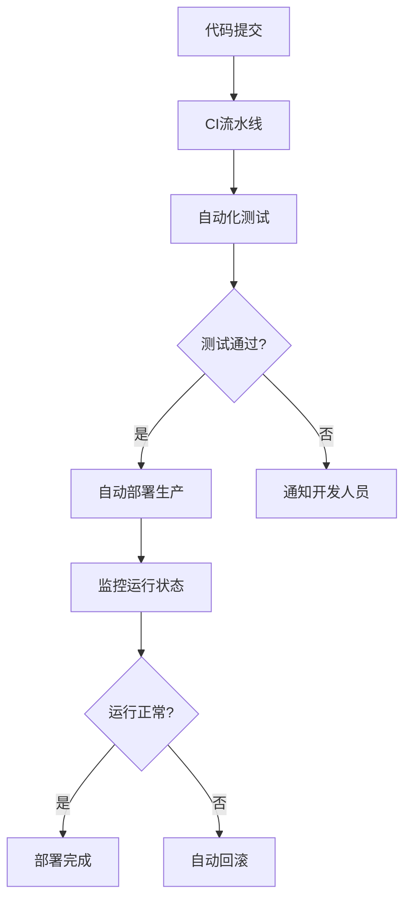

# CI/CD 核心概念

## 1. 持续集成 (Continuous Integration)

### 1.1 基本概念
持续集成是一种软件开发实践，要求开发人员频繁地将代码变更集成到共享代码库中。每次集成都会触发自动化构建和测试流程，旨在快速发现和修复集成问题。

### 1.2 核心组件
- **版本控制系统**: Git、SVN等代码管理工具
- **构建服务器**: Jenkins、GitLab CI、GitHub Actions等
- **自动化测试**: 单元测试、集成测试、端到端测试
- **构建工具**: Maven、Gradle、NPM等

### 1.3 工作流程
```yaml
# 典型的CI流水线配置
stages:
  - code_checkout
  - dependency_install
  - build
  - test
  - artifact_generate

steps:
  - name: 代码检出
    uses: actions/checkout@v3
    
  - name: 依赖安装
    run: npm install
    
  - name: 代码构建
    run: npm run build
    
  - name: 运行测试
    run: npm test
    
  - name: 生成制品
    run: npm run package
```

## 2. 持续交付 (Continuous Delivery)

### 2.1 核心定义
持续交付是CI的延伸，确保代码变更能够快速、可靠地部署到生产环境。它要求代码库始终处于可部署状态，但部署到生产环境需要人工审批。

### 2.2 关键特征
- 自动化部署流水线
- 环境一致性管理
- 部署审批流程
- 回滚机制

### 2.3 部署策略
```bash
# 部署脚本示例
#!/bin/bash
# 部署到预生产环境
deploy_staging() {
    echo "部署到预生产环境..."
    kubectl apply -f deployment-staging.yaml
}

# 人工审批后部署生产
deploy_production() {
    echo "部署到生产环境..."
    kubectl apply -f deployment-production.yaml
}

# 回滚操作
rollback() {
    echo "执行回滚..."
    kubectl rollout undo deployment/app-deployment
}
```

## 3. 持续部署 (Continuous Deployment)

### 3.1 概念区分
持续部署是持续交付的自动化版本，所有通过测试的变更都会自动部署到生产环境，无需人工干预。

### 3.2 实现要求
- 完整的自动化测试覆盖
- 可靠的监控和告警系统
- 自动化的回滚机制
- 渐进式发布能力

### 3.3 技术栈示例


## 4. CI/CD工具链

### 4.1 版本控制工具
- Git (GitHub, GitLab, Bitbucket)
- SVN
- Mercurial

### 4.2 CI服务器
- Jenkins
- GitLab CI/CD
- GitHub Actions
- CircleCI
- Travis CI

### 4.3 部署工具
- Kubernetes
- Docker
- Ansible
- Terraform
- Helm

### 4.4 监控工具
- Prometheus
- Grafana
- ELK Stack (Elasticsearch, Logstash, Kibana)
- Datadog

## 5. 最佳实践

### 5.1 基础设施即代码 (IaC)
使用代码定义和管理基础设施，确保环境一致性。

```terraform
# Terraform配置示例
resource "aws_instance" "app_server" {
  ami           = "ami-0c55b159cbfafe1f0"
  instance_type = "t2.micro"

  tags = {
    Name = "AppServer"
  }
}
```

### 5.2 测试策略
建立分层的自动化测试体系：
- 单元测试（70%）
- 集成测试（20%）
- 端到端测试（10%）

### 5.3 部署策略
- 蓝绿部署
- 金丝雀发布
- 滚动更新
- 功能开关

### 5.4 监控和告警
建立完整的监控体系，包括：
- 应用性能监控
- 基础设施监控
- 业务指标监控
- 自动化告警机制

## 6. 常见问题及解决方案

### 6.1 环境不一致
**问题**: 开发、测试、生产环境配置差异
**解决方案**: 使用Docker容器化和环境配置文件管理

### 6.2 测试覆盖率不足
**问题**: 自动化测试覆盖不全导致部署风险
**解决方案**: 实施测试驱动开发(TDD)，建立质量门禁

### 6.3 部署失败处理
**问题**: 部署过程中出现故障
**解决方案**: 建立完善的回滚机制和监控告警
