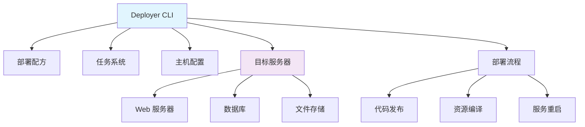

# Deployer

## 1. 概述

Deployer 是一个基于 PHP 的部署工具，用于自动化应用程序的部署流程。它支持多种框架和语言，提供零停机部署、并行执行、回滚等功能，是现代 DevOps 工作流的重要组成部分。

## 2. 核心概念

### 2.1 架构组件


### 2.2 关键特性
- **零停机部署**: 支持原子部署和热切换
- **多服务器支持**: 同时部署到多台服务器
- **并行执行**: 支持并行任务执行
- **回滚功能**: 一键回滚到之前的版本
- **配方系统**: 丰富的预定义部署配方
- **易于扩展**: 支持自定义任务和配方

## 3. 安装与配置

### 3.1 安装 Deployer
```bash
#!/bin/bash
# install-deployer.sh

# 方法1: 作为项目依赖安装
composer require --dev deployer/deployer

# 方法2: 全局安装
curl -LO https://deployer.org/deployer.phar
sudo mv deployer.phar /usr/local/bin/dep
sudo chmod +x /usr/local/bin/dep

# 方法3: 使用 Composer 全局安装
composer global require deployer/deployer

# 验证安装
./vendor/bin/dep --version
dep --version

# 安装扩展配方
composer require --dev deployer/recipes

# 创建部署配置
./vendor/bin/dep init
```

### 3.2 基础配置文件
```php
<?php
// deploy.php

namespace Deployer;

require 'recipe/common.php';

// 项目名称
set('application', 'my_project');

// 项目仓库
set('repository', 'git@github.com:username/repository.git');

// [可选] 共享文件/目录
set('shared_files', []);
set('shared_dirs', []);

// [可选] 可写目录
set('writable_dirs', []);

// 主机配置
host('production')
    ->set('hostname', 'server1.example.com')
    ->set('remote_user', 'deploy')
    ->set('deploy_path', '/var/www/{{application}}')
    ->set('branch', 'main')
    ->set('labels', ['stage' => 'production']);

host('staging')
    ->set('hostname', 'server2.example.com')
    ->set('remote_user', 'deploy')
    ->set('deploy_path', '/var/www/staging/{{application}}')
    ->set('branch', 'develop')
    ->set('labels', ['stage' => 'staging']);

// 任务配置
task('deploy', [
    'deploy:info',
    'deploy:setup',
    'deploy:lock',
    'deploy:release',
    'deploy:update_code',
    'deploy:shared',
    'deploy:writable',
    'deploy:vendors',
    'deploy:clear_paths',
    'deploy:symlink',
    'deploy:unlock',
    'cleanup',
    'success'
]);

// [可选] 如果部署失败自动解锁
after('deploy:failed', 'deploy:unlock');
```

## 4. 主机和库存配置

### 4.1 多环境配置
```php
<?php
// deploy.php

namespace Deployer;

// 库存文件配置
inventory('hosts.yml');

// 或者直接配置主机
host('web01.prod')
    ->set('hostname', '192.168.1.10')
    ->set('remote_user', 'deploy')
    ->set('deploy_path', '/var/www/prod')
    ->set('labels', ['role' => 'web', 'env' => 'production']);

host('web02.prod')
    ->set('hostname', '192.168.1.11')
    ->set('remote_user', 'deploy')
    ->set('deploy_path', '/var/www/prod')
    ->set('labels', ['role' => 'web', 'env' => 'production']);

host('db.prod')
    ->set('hostname', '192.168.1.20')
    ->set('remote_user', 'deploy')
    ->set('deploy_path', '/var/www/prod')
    ->set('labels', ['role' => 'db', 'env' => 'production']);

host('staging')
    ->set('hostname', 'staging.example.com')
    ->set('remote_user', 'deploy')
    ->set('deploy_path', '/var/www/staging')
    ->set('labels', ['env' => 'staging']);

// 按角色分组
task('deploy:web', function () {
    on(roles('web'), function () {
        // Web 服务器特定任务
    });
});

task('deploy:db', function () {
    on(roles('db'), function () {
        // 数据库服务器特定任务
    });
});

// 按环境分组
task('deploy:production', function () {
    on(hosts('production'), function () {
        run('echo "Deploying to production"');
    });
});

task('deploy:staging', function () {
    on(hosts('staging'), function () {
        run('echo "Deploying to staging"');
    });
});
```

### 4.2 库存文件配置
```yaml
# hosts.yml
production:
  - hostname: web01.example.com
    remote_user: deploy
    deploy_path: /var/www/production
    labels:
      role: web
      env: production
  
  - hostname: web02.example.com
    remote_user: deploy
    deploy_path: /var/www/production
    labels:
      role: web
      env: production
  
  - hostname: db01.example.com
    remote_user: deploy
    deploy_path: /var/www/production
    labels:
      role: db
      env: production

staging:
  - hostname: staging.example.com
    remote_user: deploy
    deploy_path: /var/www/staging
    labels:
      env: staging

development:
  - hostname: localhost
    remote_user: deploy
    deploy_path: /var/www/development
    labels:
      env: development
```

## 5. 任务和配方

### 5.1 自定义任务
```php
<?php
// deploy.php

namespace Deployer;

// 基础部署任务
task('deploy', [
    'deploy:info',
    'deploy:setup',
    'deploy:lock',
    'deploy:release',
    'deploy:update_code',
    'deploy:shared',
    'deploy:writable',
    'deploy:vendors',
    'deploy:clear_paths',
    'deploy:symlink',
    'deploy:unlock',
    'cleanup',
    'success'
]);

// 自定义任务
task('build:assets', function () {
    run('cd {{release_path}} && npm install');
    run('cd {{release_path}} && npm run build');
});

task('database:migrate', function () {
    run('cd {{release_path}} && php artisan migrate --force');
});

task('cache:clear', function () {
    run('cd {{release_path}} && php artisan cache:clear');
    run('cd {{release_path}} && php artisan view:clear');
    run('cd {{release_path}} && php artisan route:clear');
    run('cd {{release_path}} && php artisan config:clear');
});

task('optimize', function () {
    run('cd {{release_path}} && php artisan optimize');
});

// 任务钩子
before('deploy:symlink', 'build:assets');
before('deploy:symlink', 'database:migrate');
after('deploy:symlink', 'cache:clear');
after('deploy:symlink', 'optimize');

// 条件任务
task('deploy:test', function () {
    if (input()->getOption('skip-tests')) {
        return;
    }
    run('cd {{release_path}} && phpunit');
});

// 并行任务
task('deploy:parallel', function () {
    parallel(
        function () { run('task1'); },
        function () { run('task2'); },
        function () { run('task3'); }
    );
});
```

### 5.2 框架特定配方
```php
<?php
// deploy.php

namespace Deployer;

// Laravel 配方
require 'recipe/laravel.php';

// Symfony 配方
require 'recipe/symfony.php';

// WordPress 配方
require 'recipe/wordpress.php';

// Drupal 配方
require 'recipe/drupal.php';

// Magento 配方
require 'recipe/magento2.php';

// CakePHP 配方
require 'recipe/cakephp.php';

// Yii 配方
require 'recipe/yii.php';

// 自定义应用配方
require 'recipe/custom.php';

// Laravel 特定配置
set('laravel_version', function () {
    $result = run('{{bin/php}} {{release_path}}/artisan --version');
    preg_match('/\d+\.\d+\.\d+/', $result, $matches);
    return $matches[0] ?? '5.0';
});

// Symfony 特定配置
set('symfony_env', 'prod');
set('symfony_console', 'bin/console');

// 共享文件和目录
set('shared_files', [
    '.env',
    'config/database.php',
    'config/redis.php'
]);

set('shared_dirs', [
    'storage',
    'bootstrap/cache',
    'public/uploads'
]);

set('writable_dirs', [
    'bootstrap/cache',
    'storage',
    'storage/app',
    'storage/framework',
    'storage/logs'
]);
```

## 6. 部署策略

### 6.1 零停机部署配置
```php
<?php
// deploy.php

namespace Deployer;

// 原子部署配置
set('atomic_symlink', true);
set('use_atomic_symlink', true);

// 发布保留数量
set('keep_releases', 5);

// 零停机部署任务
task('deploy:zero_downtime', [
    'deploy:info',
    'deploy:setup',
    'deploy:lock',
    'deploy:release',
    'deploy:update_code',
    'deploy:shared',
    'deploy:writable',
    'deploy:vendors',
    
    // 预热缓存和优化
    'deploy:cache:warmup',
    'deploy:optimize',
    
    // 数据库迁移（不影响运行中版本）
    'deploy:database:migrate',
    
    // 切换符号链接（原子操作）
    'deploy:symlink',
    
    'deploy:unlock',
    'cleanup',
    'success'
]);

// 预热缓存
task('deploy:cache:warmup', function () {
    run('cd {{release_path}} && php artisan config:cache');
    run('cd {{release_path}} && php artisan route:cache');
    run('cd {{release_path}} && php artisan view:cache');
});

// 安全数据库迁移
task('deploy:database:migrate', function () {
    if (has('previous_release')) {
        $previousRelease = get('previous_release');
        run("cd $previousRelease && php artisan migrate --force");
    }
});

// 健康检查
task('deploy:healthcheck', function () {
    $healthUrl = get('health_check_url', '/health');
    $maxAttempts = 10;
    $attempt = 0;
    
    while ($attempt < $maxAttempts) {
        $result = run("curl -s -o /dev/null -w '%{http_code}' {{hostname}}$healthUrl || true");
        
        if ($result === '200') {
            writeln('Health check passed');
            return;
        }
        
        $attempt++;
        sleep(5);
    }
    
    throw new \Exception('Health check failed after ' . $maxAttempts . ' attempts');
});

after('deploy:symlink', 'deploy:healthcheck');
```

### 6.2 蓝绿部署策略
```php
<?php
// deploy.php

namespace Deployer;

// 蓝绿部署配置
set('blue_green', true);
set('blue_green_dir', '{{deploy_path}}/blue_green');

task('deploy:blue_green', [
    'deploy:info',
    'deploy:setup',
    'deploy:lock',
    
    // 确定当前环境（蓝或绿）
    'deploy:blue_green:detect',
    
    // 部署到非活动环境
    'deploy:blue_green:deploy',
    
    // 测试新部署
    'deploy:blue_green:test',
    
    // 切换环境
    'deploy:blue_green:switch',
    
    'deploy:unlock',
    'cleanup',
    'success'
]);

task('deploy:blue_green:detect', function () {
    $currentEnv = run('readlink {{deploy_path}}/current || echo "blue"');
    $nextEnv = $currentEnv === 'blue' ? 'green' : 'blue';
    set('next_env', $nextEnv);
});

task('deploy:blue_green:deploy', function () {
    $nextEnv = get('next_env');
    set('release_path', '{{blue_green_dir}}/{{next_env}}/releases/{{release_name}}');
    
    run('mkdir -p {{blue_green_dir}}/{{next_env}}/releases');
    run('mkdir -p {{blue_green_dir}}/{{next_env}}/shared');
    
    // 执行标准部署步骤到新环境
    invoke('deploy:update_code');
    invoke('deploy:shared');
    invoke('deploy:writable');
    invoke('deploy:vendors');
});

task('deploy:blue_green:test', function () {
    $nextEnv = get('next_env');
    $testUrl = "http://{{hostname}}:8080/health"; // 测试端口
    
    run("php -S {{hostname}}:8080 -t {{blue_green_dir}}/{{next_env}}/current/public &");
    
    $healthy = false;
    for ($i = 0; $i < 10; $i++) {
        $result = run("curl -s -o /dev/null -w '%{http_code}' $testUrl || true");
        if ($result === '200') {
            $healthy = true;
            break;
        }
        sleep(2);
    }
    
    run('pkill -f "php -S" || true');
    
    if (!$healthy) {
        throw new \Exception('Blue-green deployment test failed');
    }
});

task('deploy:blue_green:switch', function () {
    $nextEnv = get('next_env');
    run('ln -sfn {{blue_green_dir}}/{{next_env}}/current {{deploy_path}}/current');
});
```

## 7. 钩子和事件

### 7.1 部署钩子配置
```php
<?php
// deploy.php

namespace Deployer;

// 部署前钩子
before('deploy', 'deploy:prepare');
before('deploy:update_code', 'deploy:git:check');
before('deploy:vendors', 'deploy:composer:check');

// 部署后钩子
after('deploy', 'deploy:success');
after('deploy:symlink', 'deploy:restart_services');
after('deploy:failed', 'deploy:cleanup');

// 任务特定钩子
before('deploy:symlink', 'database:migrate');
after('deploy:symlink', 'cache:clear');
after('deploy:symlink', 'queue:restart');

// 自定义钩子任务
task('deploy:prepare', function () {
    writeln('Preparing deployment...');
    run('mkdir -p {{deploy_path}}/releases');
    run('mkdir -p {{deploy_path}}/shared');
});

task('deploy:git:check', function () {
    $branch = get('branch', 'main');
    $currentBranch = run('git rev-parse --abbrev-ref HEAD');
    
    if ($currentBranch !== $branch) {
        writeln("<comment>Warning: Current branch ($currentBranch) differs from deployment branch ($branch)</comment>");
    }
});

task('deploy:composer:check', function () {
    if (!commandExist('composer')) {
        warning('Composer not found, skipping vendor installation');
        return;
    }
});

task('deploy:restart_services', function () {
    run('sudo systemctl reload php-fpm');
    run('sudo systemctl reload nginx');
});

task('deploy:cleanup', function () {
    writeln('<error>Deployment failed!</error>');
    run('rm -rf {{release_path}}');
});

// 事件监听器
on('deploy:start', function () {
    writeln('Starting deployment...');
});

on('deploy:success', function () {
    writeln('<info>Deployment successful!</info>');
});

on('deploy:failed', function () {
    writeln('<error>Deployment failed!</error>');
    
    // 发送通知
    invoke('notify:failure');
});
```

## 8. 持续集成配置

### 8.1 GitHub Actions 集成
```yaml
# .github/workflows/deploy.yml
name: Deploy with Deployer

on:
  push:
    branches: [ main ]
  pull_request:
    branches: [ main ]

jobs:
  test:
    runs-on: ubuntu-latest
    steps:
    - uses: actions/checkout@v3
    - name: Setup PHP
      uses: shivammathur/setup-php@v2
      with:
        php-version: '8.2'
        extensions: mbstring, xml, json
    - name: Install dependencies
      run: composer install --no-interaction --no-progress
    - name: Run tests
      run: vendor/bin/phpunit

  deploy:
    runs-on: ubuntu-latest
    needs: test
    if: github.ref == 'refs/heads/main'
    environment: production
    
    steps:
    - uses: actions/checkout@v3
      with:
        fetch-depth: 0
    
    - name: Setup PHP
      uses: shivammathur/setup-php@v2
      with:
        php-version: '8.2'
        extensions: mbstring, xml, json
    
    - name: Install Deployer
      run: composer require --dev deployer/deployer
    
    - name: Setup SSH
      uses: webfactory/ssh-agent@v0.7.0
      with:
        ssh-private-key: ${{ secrets.SSH_PRIVATE_KEY }}
    
    - name: Deploy to production
      run: vendor/bin/dep deploy production --branch=main
      env:
        DEPLOYER_HOST: ${{ secrets.DEPLOYER_HOST }}
        DEPLOYER_USER: ${{ secrets.DEPLOYER_USER }}
        DEPLOYER_PATH: ${{ secrets.DEPLOYER_PATH }}
    
    - name: Notify success
      if: success()
      run: |
        curl -X POST -H "Content-Type: application/json" \
        -d '{"text":"Deployment to production completed successfully!"}' \
        ${{ secrets.SLACK_WEBHOOK }}
    
    - name: Notify failure
      if: failure()
      run: |
        curl -X POST -H "Content-Type: application/json" \
        -d '{"text":"Deployment to production failed!"}' \
        ${{ secrets.SLACK_WEBHOOK }}
```

### 8.2 GitLab CI 集成
```yaml
# .gitlab-ci.yml
stages:
  - test
  - deploy

test:
  stage: test
  image: php:8.2
  script:
    - apt-get update && apt-get install -y git unzip
    - curl -sS https://getcomposer.org/installer | php -- --install-dir=/usr/local/bin --filename=composer
    - composer install --no-interaction --no-progress
    - vendor/bin/phpunit

deploy_production:
  stage: deploy
  image: php:8.2
  only:
    - main
  environment: production
  before_script:
    - apt-get update && apt-get install -y git unzip openssh-client
    - curl -sS https://getcomposer.org/installer | php -- --install-dir=/usr/local/bin --filename=composer
    - composer require --dev deployer/deployer
    - mkdir -p ~/.ssh
    - echo "$SSH_PRIVATE_KEY" > ~/.ssh/id_rsa
    - chmod 600 ~/.ssh/id_rsa
    - ssh-keyscan -H $DEPLOYER_HOST >> ~/.ssh/known_hosts
  script:
    - vendor/bin/dep deploy production --branch=main
  after_script:
    - rm -f ~/.ssh/id_rsa
```

## 9. 高级技巧和优化

### 9.1 性能优化配置
```php
<?php
// deploy.php

namespace Deployer;

// 性能优化配置
set('ssh_multiplexing', true);
set('ssh_timeout', 300);
set('default_timeout', 600);

// 并行执行配置
set('parallel', true);
set('parallel_chunk_size', 5);

// 缓存优化
set('cache_ttl', 3600);
set('use_relative_symlink', false);

// 资源优化任务
task('deploy:optimize', [
    'deploy:optimize:composer',
    'deploy:optimize:npm',
    'deploy:optimize:assets',
]);

task('deploy:optimize:composer', function () {
    run('cd {{release_path}} && composer install --no-dev --optimize-autoloader --prefer-dist');
});

task('deploy:optimize:npm', function () {
    if (commandExist('npm')) {
        run('cd {{release_path}} && npm install --production');
        run('cd {{release_path}} && npm run build --production');
    }
});

task('deploy:optimize:assets', function () {
    run('cd {{release_path}} && php artisan config:cache');
    run('cd {{release_path}} && php artisan route:cache');
    run('cd {{release_path}} && php artisan view:cache');
    run('cd {{release_path}} && php artisan event:cache');
});

// 增量部署优化
task('deploy:incremental', function () {
    if (has('previous_release')) {
        $previous = get('previous_release');
        
        // 只同步变化的文件
        run("rsync -av --delete --exclude='vendor/' --exclude='node_modules/' $previous/ {{release_path}}/");
        
        // 优化 composer 安装
        run('cd {{release_path}} && composer install --no-dev --optimize-autoloader');
    } else {
        invoke('deploy:update_code');
    }
});

// 数据库优化
task('deploy:database:optimize', function () {
    run('cd {{release_path}} && php artisan db:optimize');
    run('cd {{release_path}} && php artisan db:vacuum');
});
```

### 9.2 监控和日志
```php
<?php
// deploy.php

namespace Deployer;

// 部署监控配置
set('deploy_monitoring', true);
set('monitoring_url', 'https://monitoring.example.com/api/deployments');

task('deploy:monitor:start', function () {
    if (get('deploy_monitoring')) {
        $payload = [
            'application' => get('application'),
            'environment' => get('stage', 'production'),
            'started_at' => date('c'),
            'commit' => run('git rev-parse HEAD'),
        ];
        
        run("curl -X POST -H 'Content-Type: application/json' -d '" . json_encode($payload) . "' {{monitoring_url}}/start");
    }
});

task('deploy:monitor:end', function () {
    if (get('deploy_monitoring')) {
        $payload = [
            'application' => get('application'),
            'environment' => get('stage', 'production'),
            'ended_at' => date('c'),
            'status' => 'success',
            'duration' => time() - get('start_time'),
        ];
        
        run("curl -X POST -H 'Content-Type: application/json' -d '" . json_encode($payload) . "' {{monitoring_url}}/end");
    }
});

task('deploy:monitor:fail', function () {
    if (get('deploy_monitoring')) {
        $payload = [
            'application' => get('application'),
            'environment' => get('stage', 'production'),
            'ended_at' => date('c'),
            'status' => 'failed',
            'error' => get('last_error', 'Unknown error'),
        ];
        
        run("curl -X POST -H 'Content-Type: application/json' -d '" . json_encode($payload) . "' {{monitoring_url}}/fail");
    }
});

// 日志记录
task('deploy:log', function () {
    $logFile = '{{deploy_path}}/deploy.log';
    $logEntry = sprintf(
        "[%s] %s deployed %s to %s\n",
        date('Y-m-d H:i:s'),
        get('user', 'unknown'),
        get('branch', 'unknown'),
        get('stage', 'unknown')
    );
    
    run("echo '$logEntry' >> $logFile");
});

// 钩子集成
before('deploy', 'deploy:monitor:start');
after('deploy:success', 'deploy:monitor:end');
after('deploy:success', 'deploy:log');
after('deploy:failed', 'deploy:monitor:fail');
```
