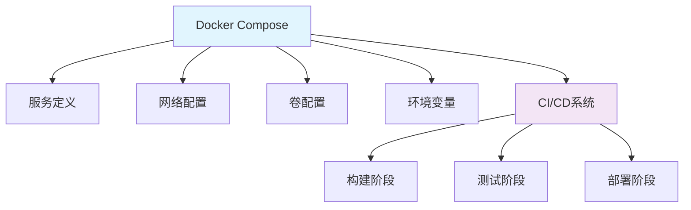

# Docker Compose CI/CD 集成指南

## 1. 概述

Docker Compose 是一个用于定义和运行多容器 Docker 应用程序的工具，在 CI/CD 流程中可用于构建、测试和部署多服务应用。

## 2. 核心概念

### 2.1 架构组件


### 2.2 关键特性
- **多服务编排**: 同时管理多个关联容器
- **环境隔离**: 独立的环境配置
- **依赖管理**: 自动处理服务依赖关系
- **快速重建**: 一键重建整个环境
- **CI/CD友好**: 易于集成到自动化流程

## 3. 基础配置

### 3.1 docker-compose.yml 示例
```yaml
version: '3.8'

services:
  web:
    image: nginx:alpine
    build:
      context: .
      dockerfile: Dockerfile.web
    ports:
      - "80:80"
    volumes:
      - ./static:/usr/share/nginx/html
    environment:
      - NGINX_ENV=production
    depends_on:
      - app
    networks:
      - frontend

  app:
    image: your-app:latest
    build:
      context: .
      dockerfile: Dockerfile.app
    ports:
      - "3000:3000"
    environment:
      - DB_HOST=db
      - DB_PORT=5432
    volumes:
      - ./logs:/app/logs
    networks:
      - frontend
      - backend

  db:
    image: postgres:13
    environment:
      POSTGRES_PASSWORD: example
      POSTGRES_DB: yourdb
    volumes:
      - pgdata:/var/lib/postgresql/data
    networks:
      - backend
    healthcheck:
      test: ["CMD-SHELL", "pg_isready -U postgres"]
      interval: 5s
      timeout: 5s
      retries: 5

networks:
  frontend:
  backend:

volumes:
  pgdata:
```

### 3.2 多环境配置
```yaml
# docker-compose.override.yml (开发环境)
version: '3.8'

services:
  web:
    ports:
      - "8080:80"
    volumes:
      - ./src:/usr/share/nginx/html
    environment:
      - NGINX_ENV=development

  app:
    environment:
      - DEBUG=true
    ports:
      - "9229:9229"
    command: npm run dev

  db:
    ports:
      - "5432:5432"
```

```yaml
# docker-compose.prod.yml (生产环境)
version: '3.8'

services:
  web:
    restart: always
    deploy:
      replicas: 3
      update_config:
        parallelism: 2
        delay: 10s
      restart_policy:
        condition: on-failure

  app:
    restart: always
    deploy:
      replicas: 4
    environment:
      - NODE_ENV=production
    command: npm start

  db:
    deploy:
      placement:
        constraints:
          - node.role == manager
    environment:
      POSTGRES_PASSWORD: ${DB_PASSWORD}
```

## 4. CI/CD 集成

### 4.1 GitHub Actions 集成
```yaml
# .github/workflows/docker-compose-ci.yml
name: Docker Compose CI

on: [push, pull_request]

env:
  COMPOSE_PROJECT_NAME: ci-${{ github.run_id }}

jobs:
  build:
    runs-on: ubuntu-latest
    steps:
      - uses: actions/checkout@v3
      
      - name: Set up Docker
        uses: docker/setup-buildx-action@v2
      
      - name: Login to Docker Hub
        uses: docker/login-action@v2
        with:
          username: ${{ secrets.DOCKER_HUB_USERNAME }}
          password: ${{ secrets.DOCKER_HUB_TOKEN }}
      
      - name: Build with Docker Compose
        run: |
          docker-compose -f docker-compose.yml -f docker-compose.ci.yml build
      
      - name: Push images
        run: |
          docker-compose -f docker-compose.yml -f docker-compose.ci.yml push

  test:
    needs: build
    runs-on: ubuntu-latest
    services:
      postgres:
        image: postgres:13
        env:
          POSTGRES_PASSWORD: test
          POSTGRES_DB: testdb
        ports:
          - 5432:5432
        options: --health-cmd pg_isready --health-interval 10s --health-timeout 5s --health-retries 5
    
    steps:
      - uses: actions/checkout@v3
      
      - name: Set up Docker
        uses: docker/setup-buildx-action@v2
      
      - name: Start services
        run: |
          docker-compose -f docker-compose.yml -f docker-compose.test.yml up -d
          docker-compose ps
      
      - name: Run tests
        run: |
          docker-compose exec -T app npm test
          docker-compose exec -T app npm run lint
      
      - name: Stop services
        if: always()
        run: docker-compose down -v
```

### 4.2 GitLab CI 集成
```yaml
# .gitlab-ci.yml
stages:
  - build
  - test
  - deploy

variables:
  COMPOSE_PROJECT_NAME: $CI_PROJECT_NAME-$CI_PIPELINE_ID
  DOCKER_HOST: tcp://docker:2375
  DOCKER_DRIVER: overlay2

services:
  - docker:dind

build:
  stage: build
  script:
    - docker login -u $CI_REGISTRY_USER -p $CI_REGISTRY_PASSWORD $CI_REGISTRY
    - docker-compose build
    - docker-compose push

test:
  stage: test
  script:
    - docker-compose -f docker-compose.yml -f docker-compose.test.yml up -d
    - docker-compose exec -T app npm test
    - docker-compose exec -T app npm run lint
  after_script:
    - docker-compose down -v

deploy:
  stage: deploy
  environment: production
  only:
    - main
  script:
    - docker-compose -f docker-compose.yml -f docker-compose.prod.yml up -d --force-recreate
    - docker-compose ps
```

## 5. 高级配置

### 5.1 多阶段构建配置
```yaml
# docker-compose.build.yml
version: '3.8'

services:
  builder:
    image: golang:1.20
    volumes:
      - .:/go/src/app
    working_dir: /go/src/app
    command: go build -o /go/bin/app

  app:
    build:
      context: .
      dockerfile: Dockerfile.app
      args:
        - BUILD_FROM=builder
    depends_on:
      - builder

  web:
    build:
      context: .
      dockerfile: Dockerfile.web
      target: production
```

### 5.2 健康检查与依赖
```yaml
services:
  app:
    depends_on:
      db:
        condition: service_healthy
      redis:
        condition: service_started

  db:
    healthcheck:
      test: ["CMD-SHELL", "pg_isready -U postgres"]
      interval: 5s
      timeout: 5s
      retries: 5

  redis:
    healthcheck:
      test: ["CMD", "redis-cli", "ping"]
      interval: 10s
      timeout: 5s
      retries: 3
```

## 6. 安全最佳实践

### 6.1 安全配置示例
```yaml
services:
  app:
    security_opt:
      - no-new-privileges:true
    cap_drop:
      - ALL
    read_only: true
    user: "1000:1000"
    tmpfs:
      - /tmp:rw,noexec,nosuid,size=100m

  db:
    environment:
      POSTGRES_PASSWORD_FILE: /run/secrets/db_password
    secrets:
      - db_password
    ulimits:
      nproc: 65535
      nofile:
        soft: 20000
        hard: 40000

secrets:
  db_password:
    file: ./secrets/db_password.txt
```

### 6.2 资源限制
```yaml
services:
  app:
    deploy:
      resources:
        limits:
          cpus: '0.50'
          memory: 500M
        reservations:
          cpus: '0.25'
          memory: 200M

  db:
    deploy:
      resources:
        limits:
          cpus: '1'
          memory: 1G
        reservations:
          cpus: '0.5'
          memory: 500M
```

## 7. 测试策略

### 7.1 测试环境配置
```yaml
# docker-compose.test.yml
version: '3.8'

services:
  app:
    environment:
      - NODE_ENV=test
      - DB_HOST=db-test
      - DB_PORT=5432
    command: ["npm", "test"]

  db-test:
    image: postgres:13
    environment:
      POSTGRES_PASSWORD: test
      POSTGRES_DB: testdb
    ports:
      - "5433:5432"
    volumes:
      - pgtest:/var/lib/postgresql/data

  mock-api:
    image: mockserver/mockserver
    ports:
      - "1080:1080"
    command: -serverPort 1080

volumes:
  pgtest:
```

### 7.2 集成测试流程
```bash
#!/bin/bash
# run-tests.sh

# 启动测试环境
docker-compose -f docker-compose.yml -f docker-compose.test.yml up -d

# 等待服务就绪
docker-compose exec app wait-for-it db-test:5432 --timeout=30

# 运行测试
docker-compose exec app npm test
TEST_EXIT_CODE=$?

# 收集日志
docker-compose logs app > test.logs

# 清理环境
docker-compose -f docker-compose.yml -f docker-compose.test.yml down -v

exit $TEST_EXIT_CODE
```

## 8. 部署策略

### 8.1 蓝绿部署配置
```yaml
# docker-compose.prod.yml
version: '3.8'

services:
  app-blue:
    image: your-app:${BLUE_VERSION}
    deploy:
      replicas: 3
      update_config:
        parallelism: 1
        delay: 10s
      restart_policy:
        condition: on-failure
    networks:
      - app-network

  app-green:
    image: your-app:${GREEN_VERSION}
    deploy:
      replicas: 0
    networks:
      - app-network

  router:
    image: nginx:alpine
    ports:
      - "80:80"
    volumes:
      - ./nginx.conf:/etc/nginx/nginx.conf
    depends_on:
      - app-blue
      - app-green
    networks:
      - app-network

networks:
  app-network:
```

### 8.2 滚动更新策略
```yaml
services:
  app:
    image: your-app:latest
    deploy:
      replicas: 5
      update_config:
        parallelism: 2
        delay: 10s
        order: start-first
      rollback_config:
        parallelism: 0
        order: stop-first
      restart_policy:
        condition: on-failure
        delay: 5s
        max_attempts: 3
        window: 120s
```

## 9. 监控与日志

### 9.1 监控配置
```yaml
services:
  prometheus:
    image: prom/prometheus
    ports:
      - "9090:9090"
    volumes:
      - ./prometheus.yml:/etc/prometheus/prometheus.yml
    command:
      - '--config.file=/etc/prometheus/prometheus.yml'

  grafana:
    image: grafana/grafana
    ports:
      - "3000:3000"
    volumes:
      - grafana-storage:/var/lib/grafana
    depends_on:
      - prometheus

  node-exporter:
    image: prom/node-exporter
    restart: unless-stopped
    ports:
      - "9100:9100"

volumes:
  grafana-storage:
```

### 9.2 日志收集
```yaml
services:
  fluentd:
    image: fluent/fluentd
    volumes:
      - ./fluent.conf:/fluentd/etc/fluent.conf
    ports:
      - "24224:24224"

  app:
    logging:
      driver: fluentd
      options:
        fluentd-address: "fluentd:24224"
        tag: "app.{{.Name}}"

  web:
    logging:
      driver: fluentd
      options:
        fluentd-address: "fluentd:24224"
        tag: "web.{{.Name}}"
```

## 10. 最佳实践

### 10.1 多环境管理
```bash
#!/bin/bash
# deploy.sh

ENV=${1:-dev}

case $ENV in
  prod)
    COMPOSE_FILES="-f docker-compose.yml -f docker-compose.prod.yml"
    ;;
  staging)
    COMPOSE_FILES="-f docker-compose.yml -f docker-compose.staging.yml"
    ;;
  *)
    COMPOSE_FILES="-f docker-compose.yml -f docker-compose.override.yml"
    ;;
esac

docker-compose $COMPOSE_FILES down
docker-compose $COMPOSE_FILES build
docker-compose $COMPOSE_FILES up -d
docker-compose $COMPOSE_FILES ps
```

### 10.2 资源清理
```bash
#!/bin/bash
# cleanup.sh

# 停止并删除所有容器
docker-compose down -v --rmi local

# 清理未使用的资源
docker system prune -af

# 清理特定项目的资源
docker images -a | grep "your-project" | awk '{print $3}' | xargs docker rmi -f
docker volume ls | grep "your-project" | awk '{print $2}' | xargs docker volume rm
```
