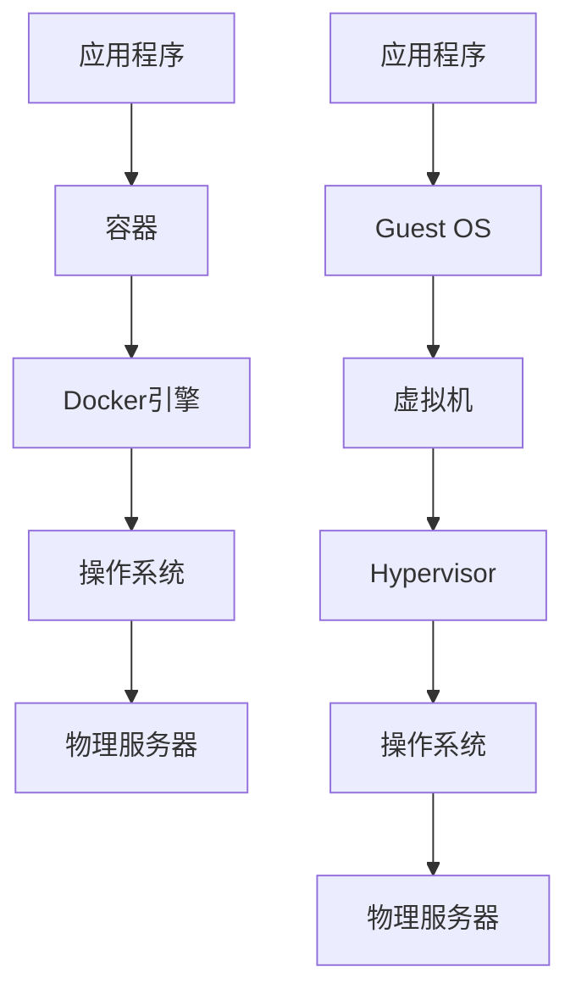

# Docker

## 1. 概述

Docker 是一个开源的容器化平台，用于开发、交付和运行应用程序。它通过容器技术将应用程序及其依赖项打包在一起，确保应用在任何环境中都能一致运行。Docker 是现代化 CI/CD 流程的核心技术之一。

## 2. 核心概念

### 2.1 容器与虚拟机的区别


### 2.2 关键组件
- **Docker Image**: 只读模板，包含运行应用所需的所有内容
- **Docker Container**: 镜像的运行实例
- **Dockerfile**: 用于构建镜像的文本文件
- **Docker Engine**: 核心运行时环境
- **Docker Registry**: 镜像存储和分发服务

## 3. 快速开始

### 3.1 基础命令
```bash
# 运行一个容器
docker run -d -p 80:80 --name my-nginx nginx:alpine

# 查看运行中的容器
docker ps

# 查看所有容器
docker ps -a

# 停止容器
docker stop my-nginx

# 删除容器
docker rm my-nginx

# 查看镜像
docker images

# 拉取镜像
docker pull nginx:alpine
```

### 3.2 Dockerfile 示例
```dockerfile
# 使用官方 Node.js 运行时作为基础镜像
FROM node:18-alpine

# 设置工作目录
WORKDIR /app

# 复制 package.json 和 package-lock.json
COPY package*.json ./

# 安装依赖
RUN npm ci --only=production

# 复制应用代码
COPY . .

# 暴露端口
EXPOSE 3000

# 定义环境变量
ENV NODE_ENV=production

# 启动应用
CMD ["node", "server.js"]
```

## 4. Dockerfile 详解

### 4.1 指令说明
```dockerfile
# 基础镜像选择
FROM ubuntu:20.04

# 元数据信息
LABEL maintainer="dev@example.com"
LABEL version="1.0"
LABEL description="My Application"

# 设置环境变量
ENV APP_HOME=/app
ENV NODE_ENV=production

# 工作目录设置
WORKDIR $APP_HOME

# 复制文件
COPY package.json package-lock.json ./
COPY src/ ./src
COPY --from=builder /app/dist ./dist

# 运行命令
RUN apt-get update && apt-get install -y curl
RUN npm install

# 暴露端口
EXPOSE 3000 8080

# 健康检查
HEALTHCHECK --interval=30s --timeout=3s \
  CMD curl -f http://localhost:3000/health || exit 1

# 启动命令
ENTRYPOINT ["node"]
CMD ["server.js"]
```

### 4.2 多阶段构建
```dockerfile
# 第一阶段：构建阶段
FROM node:18-alpine AS builder
WORKDIR /app
COPY package*.json ./
RUN npm ci
COPY . .
RUN npm run build

# 第二阶段：运行阶段
FROM node:18-alpine AS runtime
WORKDIR /app
COPY --from=builder /app/dist ./dist
COPY --from=builder /app/node_modules ./node_modules
COPY --from=builder /app/package.json ./

# 使用非root用户运行
RUN addgroup -g 1001 -S nodejs
RUN adduser -S nextjs -u 1001
USER nextjs

EXPOSE 3000
CMD ["node", "dist/server.js"]
```

## 5. 容器管理

### 5.1 网络配置
```bash
# 创建自定义网络
docker network create my-network

# 运行容器并连接到网络
docker run -d --name web --network my-network nginx
docker run -d --name app --network my-network my-app

# 查看网络信息
docker network ls
docker network inspect my-network

# 端口映射
docker run -d -p 8080:80 -p 443:443 nginx
docker run -d -p 127.0.0.1:8080:80 nginx  # 绑定特定IP
```

### 5.2 数据管理
```bash
# 创建数据卷
docker volume create my-data

# 使用数据卷
docker run -d -v my-data:/data --name db postgres:13

# 挂载主机目录
docker run -d -v /host/path:/container/path nginx

# 查看数据卷
docker volume ls
docker volume inspect my-data

# 备份数据卷
docker run --rm -v my-data:/source -v /backup:/backup alpine \
  tar czf /backup/backup.tar.gz -C /source .
```

### 5.3 资源限制
```bash
# 内存限制
docker run -d --memory=512m --memory-swap=1g my-app

# CPU限制
docker run -d --cpus=1.5 my-app
docker run -d --cpuset-cpus="0,2" my-app

# 重启策略
docker run -d --restart=always my-app
docker run -d --restart=on-failure:5 my-app
```

## 6. Docker Compose

### 6.1 多容器应用配置
```yaml
version: '3.8'

services:
  web:
    image: nginx:alpine
    ports:
      - "80:80"
    volumes:
      - ./nginx.conf:/etc/nginx/nginx.conf
    depends_on:
      - app
    networks:
      - app-network

  app:
    build: .
    ports:
      - "3000:3000"
    environment:
      - NODE_ENV=production
      - DATABASE_URL=postgres://db:5432/mydb
    volumes:
      - app-data:/app/data
    networks:
      - app-network

  db:
    image: postgres:13-alpine
    environment:
      POSTGRES_DB: mydb
      POSTGRES_USER: user
      POSTGRES_PASSWORD: password
    volumes:
      - postgres-data:/var/lib/postgresql/data
    networks:
      - app-network

volumes:
  app-data:
  postgres-data:

networks:
  app-network:
    driver: bridge
```

### 6.2 环境变量管理
```yaml
version: '3.8'

services:
  app:
    build: .
    env_file:
      - .env
    environment:
      - NODE_ENV=${NODE_ENV:-development}
      - DATABASE_HOST=${DATABASE_HOST:-db}
      - DATABASE_PORT=${DATABASE_PORT:-5432}
    ports:
      - "${APP_PORT:-3000}:3000"
```

## 7. 最佳实践

### 7.1 镜像优化
```dockerfile
# 使用合适的基础镜像
FROM node:18-alpine

# 多阶段构建减少镜像大小
FROM builder AS build
# ... 构建步骤

FROM alpine:3.16
COPY --from=build /app/dist /app

# 合并RUN命令减少层数
RUN apt-get update && apt-get install -y \
    curl \
    git \
    && rm -rf /var/lib/apt/lists/*

# 使用.dockerignore文件
# .dockerignore内容：
node_modules
npm-debug.log
.git
.DS_Store
```

### 7.2 安全实践
```dockerfile
# 使用非root用户
RUN adduser -D myuser
USER myuser

# 定期更新基础镜像
FROM node:18-alpine@sha256:abc123...

# 扫描安全漏洞
# 使用docker scan或第三方工具

# 最小化安装
RUN apk add --no-cache curl
```

### 7.3 生产环境配置
```bash
# 使用编排工具
docker swarm init
docker stack deploy -c docker-compose.yml myapp

# 日志管理
docker run -d --log-driver=json-file --log-opt max-size=10m nginx

# 监控和健康检查
docker stats
docker logs -f container_name
```

## 8. CI/CD 集成

### 8.1 Docker in CI Pipeline
```yaml
# GitHub Actions 示例
name: Docker Build and Push

on:
  push:
    branches: [ main ]

jobs:
  build:
    runs-on: ubuntu-latest
    steps:
    - uses: actions/checkout@v4
    
    - name: Build Docker image
      run: docker build -t myapp:${{ github.sha }} .
      
    - name: Run tests in container
      run: docker run myapp:${{ github.sha }} npm test
      
    - name: Push to Docker Hub
      run: |
        echo "${{ secrets.DOCKER_PASSWORD }}" | docker login -u "${{ secrets.DOCKER_USERNAME }}" --password-stdin
        docker tag myapp:${{ github.sha }} myapp:latest
        docker push myapp:latest
```

### 8.2 多架构构建
```bash
# 使用Buildx构建多平台镜像
docker buildx create --use
docker buildx build --platform linux/amd64,linux/arm64 -t myapp:latest . --push

# 查看多平台镜像
docker buildx imagetools inspect myapp:latest
```

## 9. 故障排除

### 9.1 常用诊断命令
```bash
# 查看容器日志
docker logs container_name
docker logs -f container_name  # 实时日志

# 进入容器调试
docker exec -it container_name sh
docker exec -it container_name bash

# 查看容器信息
docker inspect container_name
docker stats container_name

# 资源使用情况
docker system df
docker system prune  # 清理资源

# 网络诊断
docker network inspect network_name
```

### 9.2 性能问题排查
```bash
# 监控容器性能
docker top container_name
docker stats --all

# 分析镜像层
docker history image_name
docker image inspect image_name

# 检查存储驱动
docker info | grep Storage
```
