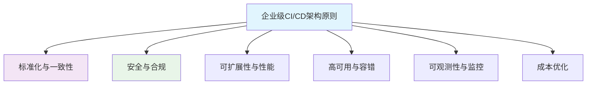

# 企业级 CI/CD 架构

## 1. 概述

企业级 CI/CD 架构是为大型组织设计的规模化、安全、可靠的持续集成和持续交付平台。它需要支持多团队协作、多环境管理、高可用性、安全合规和可扩展性，同时保持开发团队的自主性和交付速度。

## 2. 架构原则

### 2.1 设计原则


### 2.2 架构特性
| 特性 | 描述 | 实现要求 |
|------|------|----------|
| **多租户支持** | 支持多个团队/项目独立运作 | 命名空间隔离、资源配额、权限控制 |
| **环境隔离** | 开发、测试、预生产、生产环境严格隔离 | 网络隔离、凭证分离、访问控制 |
| **高可用性** | 7x24小时服务可用性 | 多可用区部署、自动故障转移 |
| **安全合规** | 满足企业安全标准和法规要求 | 加密传输、审计日志、合规扫描 |
| **性能可扩展** | 支持大规模并发构建 | 弹性伸缩、负载均衡、缓存优化 |
| **成本可控** | 资源使用优化和成本管理 | 资源监控、自动伸缩、成本分析 |

## 3. 整体架构

### 3.1 逻辑架构
```yaml
# architecture/enterprise-ci-cd-architecture.yaml
architecture:
  version: "2.0"
  components:
    control_plane:
      - ci_cd_orchestrator
      - policy_engine
      - audit_logging
      - monitoring_dashboard
    
    execution_plane:
      - build_workers
      - test_executors
      - deployment_agents
      - security_scanners
    
    data_plane:
      - artifact_registry
      - configuration_store
      - secrets_manager
      - cache_service
    
    integration_plane:
      - version_control
      - issue_tracking
      - chat_ops
      - notification_service
    
    security_plane:
      - identity_provider
      - access_controller
      - network_policies
      - compliance_checker

  connectivity:
    internal_network: "10.0.0.0/16"
    dmz_network: "192.168.0.0/24"
    internet_egress: "controlled-nat-gateways"
    vpc_peering: "cross-account-connectivity"
```

### 3.2 物理部署架构
```yaml
# infrastructure/deployment-topology.yaml
deployment:
  regions:
    - name: us-east-1
      availability_zones:
        - us-east-1a
        - us-east-1b
        - us-east-1c
      components:
        - control_plane_primary
        - execution_workers
        - artifact_registry
    
    - name: eu-west-1
      availability_zones:
        - eu-west-1a
        - eu-west-1b
      components:
        - control_plane_secondary
        - execution_workers
        - disaster_recovery
    
    - name: ap-northeast-1
      availability_zones:
        - ap-northeast-1a
      components:
        - edge_cache
        - cdn_services

  networking:
    vpc_config:
      - region: us-east-1
        cidr: "10.0.0.0/16"
        subnets:
          - "10.0.1.0/24"  # public
          - "10.0.2.0/24"  # private
          - "10.0.3.0/24"  # isolated
    
    connectivity:
      - type: transit_gateway
        regions: [us-east-1, eu-west-1]
      - type: vpc_peering
        between: [us-east-1, ap-northeast-1]
    
    security_groups:
      - name: ci-cd-workers
        rules:
          - protocol: tcp
            ports: [443, 80]
            sources: ["10.0.0.0/16"]
```

## 4. 核心组件设计

### 4.1 控制平面
```yaml
# components/control-plane.yaml
control_plane:
  ci_cd_orchestrator:
    type: "argo-workflows"
    version: "3.4"
    configuration:
      workflow_ttl: 720h
      parallelism: 100
      resource_quotas:
        cpu: "100"
        memory: "200Gi"
    
  policy_engine:
    type: "opa"
    version: "0.45"
    policies:
      - name: "build-policy"
        rules:
          - must_use_approved_base_images
          - maximum_build_timeout: 3600
          - require_security_scan
    
  audit_logging:
    type: "elasticsearch"
    version: "8.6"
    retention: "365d"
    indexes:
      - audit_events
      - pipeline_executions
      - access_logs
    
  monitoring_dashboard:
    type: "grafana"
    version: "9.3"
    datasources:
      - prometheus
      - loki
      - tempo
```

### 4.2 执行平面
```yaml
# components/execution-plane.yaml
execution_plane:
  build_workers:
    type: "kubernetes-pods"
    configuration:
      node_pools:
        - name: "general-purpose"
          instance_type: "m5.2xlarge"
          min_size: 3
          max_size: 50
          labels: {pool: general}
        
        - name: "memory-optimized"
          instance_type: "r5.4xlarge"
          min_size: 2
          max_size: 20
          labels: {pool: memory}
        
        - name: "gpu-accelerated"
          instance_type: "p3.2xlarge"
          min_size: 1
          max_size: 10
          labels: {pool: gpu}
    
  test_executors:
    type: "jenkins-agents"
    configuration:
      executors: 10
      labels: [linux, windows, macos]
      tools:
        - jdk: [8, 11, 17]
        - nodejs: [16, 18, 20]
        - python: [3.8, 3.9, 3.10]
    
  deployment_agents:
    type: "spinnaker"
    version: "1.29"
    features:
      - blue_green_deployment
      - canary_releases
      - automated_rollbacks
    
  security_scanners:
    tools:
      - name: "sonarqube"
        version: "9.9"
        features: [code_quality, security]
      
      - name: "snyk"
        version: "latest"
        features: [vulnerability_scanning, license_compliance]
      
      - name: "trivy"
        version: "0.38"
        features: [container_scanning, config_scanning]
```

## 5. 多租户设计

### 5.1 租户隔离策略
```yaml
# multi-tenancy/tenant-isolation.yaml
tenancy:
  isolation_level: "hard"
  strategies:
    namespace_isolation:
      enabled: true
      pattern: "team-{tenant}-{environment}"
      resources:
        - pods
        - services
        - configmaps
    
    network_isolation:
      enabled: true
      policies:
        - deny_all_egress
        - allow_specific_ingress
        - intra_tenant_communication: allowed
    
    storage_isolation:
      enabled: true
      backends:
        - type: "efs"
          quota: "100Gi"
        - type: "ebs"
          quota: "500Gi"
    
    resource_quotas:
      enabled: true
      limits:
        cpu: "20"
        memory: "40Gi"
        pods: "100"
        services: "20"

  tenant_configuration:
    teams:
      - name: "team-alpha"
        environments: [dev, staging, prod]
        repositories: ["github.com/alpha/*"]
        access_level: "admin"
      
      - name: "team-beta"
        environments: [dev, staging]
        repositories: ["github.com/beta/*"]
        access_level: "developer"
      
      - name: "team-gamma"
        environments: [dev]
        repositories: ["github.com/gamma/*"]
        access_level: "readonly"
```

### 5.2 权限管理
```yaml
# rbac/access-control.yaml
rbac:
  roles:
    - name: "ci-cd-admin"
      permissions:
        - "pipeline:create"
        - "pipeline:delete"
        - "pipeline:modify"
        - "secret:manage"
        - "user:manage"
    
    - name: "team-lead"
      permissions:
        - "pipeline:view"
        - "pipeline:execute"
        - "pipeline:modify:own"
        - "secret:view:own"
    
    - name: "developer"
      permissions:
        - "pipeline:view:own"
        - "pipeline:execute:own"
        - "artifact:push"
        - "artifact:pull"
    
    - name: "auditor"
      permissions:
        - "log:view"
        - "audit:read"
        - "report:generate"

  role_bindings:
    - role: "ci-cd-admin"
      groups: ["devops-admins"]
    
    - role: "team-lead"
      groups: ["team-leads", "engineering-managers"]
    
    - role: "developer"
      groups: ["developers", "qa-engineers"]
    
    - role: "auditor"
      groups: ["security-team", "compliance-auditors"]
```

## 6. 安全架构

### 6.1 安全控制层
```yaml
# security/security-controls.yaml
security:
  identity_and_access:
    identity_provider: "azure-ad"
    mfa_required: true
    session_timeout: "8h"
    password_policy:
      min_length: 12
      require_complexity: true
      rotation_days: 90
    
  network_security:
    network_policies:
      - deny_all_default: true
      - allow_egress_to_registry: true
      - allow_ingress_from_vpn: true
    
    encryption_in_transit:
      tls_1.3_required: true
      certificate_rotation: "90d"
    
  data_security:
    encryption_at_rest:
      enabled: true
      kms_key_rotation: "365d"
    
    secrets_management:
      vault: "hashicorp-vault"
      rotation_policy: "30d"
      access_logging: true
    
  compliance:
    standards:
      - "soc2"
      - "iso27001"
      - "hipaa"
      - "gdpr"
    
    auditing:
      log_retention: "7years"
      audit_trail: "immutable"
      regular_assessments: "quarterly"
```

### 6.2 安全扫描流水线
```yaml
# security/security-pipeline.yaml
security_scanning:
  pre_commit:
    tools:
      - name: "gitleaks"
        pattern: "**/*"
        rules: "custom-rules.toml"
      
      - name: "trivy-config"
        targets: [".github/", "Dockerfile", "**/*.yaml"]
  
  pre_build:
    tools:
      - name: "dependency-check"
        ecosystems: [npm, maven, go, python]
        fail_on: "high"
      
      - name: "checkov"
        targets: ["terraform/", "cloudformation/"]
        skip_checks: [CKV_AWS_1]
  
  post_build:
    tools:
      - name: "trivy"
        targets: ["container-images"]
        severity: ["CRITICAL", "HIGH"]
      
      - name: "zap"
        targets: ["web-applications"]
        scan_type: "active"
  
  deployment:
    tools:
      - name: "kube-bench"
        targets: ["kubernetes-nodes"]
        checks: ["cis-1.6"]
      
      - name: "kube-hunter"
        mode: "remote"
        reporting: "full"
```

## 7. 高可用设计

### 7.1 高可用架构
```yaml
# availability/ha-architecture.yaml
high_availability:
  strategy: "multi-active"
  regions: 3
  availability_zones: 6
  
  components:
    control_plane:
      replication: "active-active"
      failover: "automatic"
      recovery_time_objective: "5 minutes"
    
    data_store:
      replication: "multi-master"
      consistency: "eventual"
      recovery_point_objective: "1 minute"
    
    execution_workers:
      distribution: "regional"
      auto_scaling: true
      min_capacity: 3
      max_capacity: 100
    
  health_checks:
    liveness_probes:
      interval: "30s"
      timeout: "10s"
      failure_threshold: 3
    
    readiness_probes:
      interval: "10s"
      timeout: "5s"
      failure_threshold: 1
    
  disaster_recovery:
    backup_strategy: "daily-snapshots"
    retention_period: "35 days"
    recovery_procedure: "automated"
```

### 7.2 容错机制
```yaml
# resilience/fault-tolerance.yaml
resilience:
  retry_strategies:
    exponential_backoff:
      initial_delay: "1s"
      max_delay: "60s"
      max_attempts: 5
    
    circuit_breaker:
      failure_threshold: 5
      reset_timeout: "300s"
    
  timeout_management:
    global_timeout: "3600s"
    step_timeouts:
      build: "1800s"
      test: "2700s"
      deploy: "900s"
    
  resource_management:
    memory_limits: "4Gi"
    cpu_limits: "2"
    ephemeral_storage: "20Gi"
    
  graceful_degradation:
    features:
      - build_caching: "optional"
      - parallel_execution: "optional"
      - realtime_logging: "optional"
    
  fallback_strategies:
    - on_build_failure: "retry_then_notify"
    - on_test_failure: "continue_with_warning"
    - on_deploy_failure: "automatic_rollback"
```

## 8. 监控与可观测性

### 8.1 监控体系
```yaml
# monitoring/monitoring-stack.yaml
monitoring:
  metrics_collection:
    agent: "prometheus"
    scrape_interval: "15s"
    retention: "30d"
    
    key_metrics:
      - pipeline_duration_seconds
      - build_success_rate
      - test_coverage_percentage
      - deployment_frequency
      - lead_time_changes
      - mean_time_to_recovery
    
  logging:
    backend: "loki"
    retention: "90d"
    log_levels: [info, warn, error]
    
    structured_logging:
      enabled: true
      fields: [timestamp, level, component, trace_id]
    
  tracing:
    backend: "jaeger"
    sampling_rate: "0.1"
    
    spans:
      - http_requests
      - database_queries
      - external_calls
    
  alerting:
    routes:
      - critical: "pagerduty"
      - warning: "slack"
      - info: "email"
    
    alert_rules:
      - name: "high_failure_rate"
        condition: "build_success_rate < 0.95"
        duration: "5m"
        
      - name: "slow_pipelines"
        condition: "pipeline_duration > 3600"
        duration: "10m"
```

### 8.2 性能指标
```yaml
# performance/performance-metrics.yaml
performance:
  sla_targets:
    pipeline_execution_time: "95% < 30min"
    build_time: "95% < 15min"
    test_execution_time: "95% < 10min"
    deployment_time: "95% < 5min"
    
  resource_utilization:
    cpu_utilization: "target: 70%"
    memory_utilization: "target: 80%"
    disk_utilization: "target: 85%"
    network_throughput: "target: 1Gbps"
    
  scalability:
    max_concurrent_pipelines: 1000
    max_concurrent_builds: 500
    max_concurrent_tests: 200
    max_concurrent_deployments: 100
    
  cost_efficiency:
    cost_per_build: "target: $0.50"
    cost_per_deployment: "target: $0.20"
    resource_waste_percentage: "target: < 5%"
    
  quality_metrics:
    test_coverage: "target: > 80%"
    security_issues: "target: 0 critical"
    compliance_violations: "target: 0"
```

## 9. 成本优化

### 9.1 成本管理策略
```yaml
# cost/cost-optimization.yaml
cost_optimization:
  resource_rightsizing:
    enabled: true
    analysis_interval: "24h"
    adjustment_cooldown: "1h"
    
    recommendations:
      - downsize_overprovisioned_pods
      - remove_unused_resources
      - optimize_storage_class
    
  spot_instance_usage:
    enabled: true
    max_price: "on-demand price"
    interruption_handling: "graceful"
    
    suitable_workloads:
      - build_jobs
      - test_executions
      - batch_processing
    
  auto_scaling:
    scale_down_delay: "300s"
    scale_up_delay: "60s"
    cool_down_period: "300s"
    
    metrics:
      - cpu_utilization: "70%"
      - memory_utilization: "80%"
      - queue_length: "100"
    
  scheduling_optimization:
    bin_packing: true
    affinity_rules: true
    taint_tolerations: true
    
    time_based_scheduling:
      off_hours_scaling: "50%"
      weekend_scaling: "30%"
```

### 9.2 成本监控
```yaml
# cost/cost-monitoring.yaml
cost_monitoring:
  budget_alerts:
    monthly_budget: "$10,000"
    alert_thresholds: [80%, 90%, 100%]
    notification_channels: [slack, email, sms]
    
  cost_allocation:
    tags:
      - "team"
      - "project"
      - "environment"
      - "cost-center"
    
    showback_charges:
      - "compute_costs"
      - "storage_costs"
      - "network_costs"
      - "license_costs"
    
  optimization_recommendations:
    - "reserve_instances_for_steady_workloads"
    - "use_commitment_discounts"
    - "cleanup_unused_resources"
    - "optimize_data_transfer_costs"
    
  reporting:
    frequency: "daily"
    granularity: "hourly"
    export_format: [csv, json, pdf]
    destinations: [s3, bigquery, tableaux]
```
