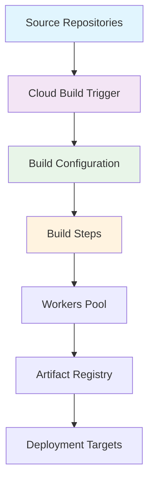

# Google Cloud Build

## 1. 概述

Google Cloud Build 是 Google Cloud Platform (GCP) 提供的全托管持续集成和持续交付 (CI/CD) 平台。它支持从源代码到制品的自动化构建、测试和部署，与 Google Cloud 服务深度集成，提供可扩展且安全的构建环境。

## 2. 核心概念

### 2.1 架构组件


### 2.2 关键术语
- **Build Trigger**: 自动触发构建的事件条件
- **Build Step**: 构建过程中的单个任务单元
- **Build Configuration**: 定义构建过程的 YAML 文件
- **Artifact Registry**: 托管的制品存储仓库
- **Worker Pool**: 构建执行环境
- **Build History**: 构建执行记录和日志

## 3. 快速开始

### 3.1 基本配置
```bash
# 启用 Cloud Build API
gcloud services enable cloudbuild.googleapis.com

# 设置项目配置
gcloud config set project my-project-id
gcloud config set compute/region us-central1

# 验证配置
gcloud builds list
```

### 3.2 基础命令
```bash
# 提交构建任务
gcloud builds submit --tag=gcr.io/my-project/my-app

# 查看构建历史
gcloud builds list --limit=10

# 查看构建详情
gcloud builds describe BUILD_ID

# 查看构建日志
gcloud builds log BUILD_ID

# 取消运行中的构建
gcloud builds cancel BUILD_ID
```

## 4. 构建配置

### 4.1 cloudbuild.yaml 基础
```yaml
# 基础构建配置
steps:
  # 构建 Docker 镜像
  - name: 'gcr.io/cloud-builders/docker'
    args: ['build', '-t', 'gcr.io/$PROJECT_ID/my-app', '.']
  
  # 推送镜像到 Artifact Registry
  - name: 'gcr.io/cloud-builders/docker'
    args: ['push', 'gcr.io/$PROJECT_ID/my-app']

  # 运行测试
  - name: 'gcr.io/cloud-builders/npm'
    args: ['test']
    env:
      - 'NODE_ENV=test'

  # 部署到 Cloud Run
  - name: 'gcr.io/cloud-builders/gcloud'
    args: ['run', 'deploy', 'my-app', '--image', 'gcr.io/$PROJECT_ID/my-app', '--region', 'us-central1']

# 制品定义
images:
  - 'gcr.io/$PROJECT_ID/my-app'

# 超时设置
timeout: 1200s

# 机器类型配置
options:
  machineType: 'E2_HIGHCPU_8'
  diskSizeGb: 100
```

### 4.2 多阶段构建
```yaml
steps:
  # 阶段1: 依赖安装和构建
  - name: 'gcr.io/cloud-builders/npm'
    args: ['ci']
    id: 'install-dependencies'

  - name: 'gcr.io/cloud-builders/npm'
    args: ['run', 'build']
    id: 'build-app'
    waitFor: ['install-dependencies']

  # 阶段2: 测试
  - name: 'gcr.io/cloud-builders/npm'
    args: ['run', 'test:unit']
    id: 'unit-tests'
    waitFor: ['build-app']

  - name: 'gcr.io/cloud-builders/npm'
    args: ['run', 'test:integration']
    id: 'integration-tests'
    waitFor: ['build-app']

  # 阶段3: 安全扫描
  - name: 'gcr.io/cloud-builders/gcloud'
    args: ['container', 'scan', 'gcr.io/$PROJECT_ID/my-app']
    id: 'security-scan'
    waitFor: ['build-app']

  # 阶段4: 部署
  - name: 'gcr.io/cloud-builders/gcloud'
    args: ['run', 'deploy', 'my-app', '--image', 'gcr.io/$PROJECT_ID/my-app']
    id: 'deploy'
    waitFor: ['unit-tests', 'integration-tests', 'security-scan']
```

## 5. 触发器配置

### 5.1 自动触发器
```yaml
# cloudbuild-trigger.yaml
triggerTemplate:
  projectId: my-project-id
  repoName: my-repo
  branchName: main

build:
  steps:
    - name: 'gcr.io/cloud-builders/docker'
      args: ['build', '-t', 'gcr.io/$PROJECT_ID/my-app', '.']
    - name: 'gcr.io/cloud-builders/docker'
      args: ['push', 'gcr.io/$PROJECT_ID/my-app']

images:
  - 'gcr.io/$PROJECT_ID/my-app'

substitutions:
  _ENVIRONMENT: production
  _REGION: us-central1
```

### 5.2 GitHub 触发器
```bash
# 创建 GitHub 触发器
gcloud beta builds triggers create github \
  --name="my-github-trigger" \
  --repository="github.com/my-org/my-repo" \
  --branch-pattern="^main$" \
  --build-config="cloudbuild.yaml" \
  --include-logs-with-status

# 使用 Pull Request 触发器
gcloud beta builds triggers create github \
  --name="pr-trigger" \
  --pull-request-pattern="^feature/.*$" \
  --comment-control="COMMENTS_ENABLED" \
  --build-config="cloudbuild-pr.yaml"
```

### 5.3 手动触发器
```bash
# 使用替代变量启动构建
gcloud builds submit --config=cloudbuild.yaml \
  --substitutions=_ENVIRONMENT=staging,_VERSION=1.2.3

# 使用特定提交构建
gcloud builds submit --config=cloudbuild.yaml \
  --commit-sha=abc123def456

# 使用标签构建
gcloud builds submit --config=cloudbuild.yaml \
  --tag=git-tag-v1.0
```

## 6. 高级配置

### 6.1 自定义构建步骤
```yaml
steps:
  # 使用自定义容器
  - name: 'gcr.io/my-project/custom-builder:latest'
    args: ['build', '--target=production']
    entrypoint: 'bash'
    env:
      - 'CUSTOM_ENV=value'

  # 并行执行步骤
  - name: 'gcr.io/cloud-builders/npm'
    args: ['run', 'test:unit']
    id: 'unit-tests'

  - name: 'gcr.io/cloud-builders/npm'
    args: ['run', 'test:integration']
    id: 'integration-tests'

  # 依赖管理
  - name: 'gcr.io/cloud-builders/npm'
    args: ['run', 'build']
    waitFor: ['unit-tests', 'integration-tests']

  # 文件操作
  - name: 'gcr.io/cloud-builders/gcs'
    args: ['cp', 'dist/*', 'gs://my-bucket/']
    waitFor: ['build']
```

### 6.2 密钥管理
```yaml
steps:
  # 使用 Secret Manager
  - name: 'gcr.io/cloud-builders/gcloud'
    args:
      - 'secrets'
      - 'versions'
      - 'access'
      - 'latest'
      - '--secret=my-api-key'
    entrypoint: 'bash'
    secretEnv: ['API_KEY']

  # 使用加密的密钥
  - name: 'gcr.io/cloud-builders/npm'
    args: ['run', 'deploy']
    env:
      - 'API_KEY=${API_KEY}'

availableSecrets:
  secretManager:
    - versionName: projects/my-project/secrets/my-api-key/versions/latest
      env: 'API_KEY'
```

### 6.3 工作器池配置
```yaml
options:
  # 自定义工作器池
  workerPool: 'projects/my-project/locations/us-central1/workerPools/my-pool'
  
  # 机器类型选择
  machineType: 'N1_HIGHCPU_8'
  
  # 磁盘配置
  diskSizeGb: 200
  diskType: 'pd-ssd'
  
  # 网络配置
  logging: 'CLOUD_LOGGING_ONLY'
  substitutionOption: 'ALLOW_LOOSE'
  
  # 资源限制
  resourceLimits:
    - resourceType: 'CPU'
      limit: '8.0'
    - resourceType: 'MEMORY'
      limit: '32G'
```

## 7. 集成部署

### 7.1 Cloud Run 部署
```yaml
steps:
  # 构建和推送镜像
  - name: 'gcr.io/cloud-builders/docker'
    args: ['build', '-t', 'us-central1-docker.pkg.dev/$PROJECT_ID/my-repo/my-app', '.']
  
  - name: 'gcr.io/cloud-builders/docker'
    args: ['push', 'us-central1-docker.pkg.dev/$PROJECT_ID/my-repo/my-app']
  
  # 部署到 Cloud Run
  - name: 'gcr.io/cloud-builders/gcloud'
    args:
      - 'run'
      - 'deploy'
      - 'my-service'
      - '--image'
      - 'us-central1-docker.pkg.dev/$PROJECT_ID/my-repo/my-app'
      - '--region'
      - 'us-central1'
      - '--platform'
      - 'managed'
      - '--allow-unauthenticated'

images:
  - 'us-central1-docker.pkg.dev/$PROJECT_ID/my-repo/my-app'
```

### 7.2 GKE 部署
```yaml
steps:
  # 构建镜像
  - name: 'gcr.io/cloud-builders/docker'
    args: ['build', '-t', 'gcr.io/$PROJECT_ID/my-app', '.']
  
  - name: 'gcr.io/cloud-builders/docker'
    args: ['push', 'gcr.io/$PROJECT_ID/my-app']
  
  # 部署到 GKE
  - name: 'gcr.io/cloud-builders/gke-deploy'
    args:
      - 'run'
      - '--filename=k8s/'
      - '--image=gcr.io/$PROJECT_ID/my-app'
      - '--location=us-central1'
      - '--cluster=my-cluster'

images:
  - 'gcr.io/$PROJECT_ID/my-app'
```

### 7.3 多环境部署
```yaml
steps:
  # 构建基础镜像
  - name: 'gcr.io/cloud-builders/docker'
    args: ['build', '-t', 'gcr.io/$PROJECT_ID/my-app:$COMMIT_SHA', '.']
  
  - name: 'gcr.io/cloud-builders/docker'
    args: ['push', 'gcr.io/$PROJECT_ID/my-app:$COMMIT_SHA']
  
  # 部署到测试环境
  - name: 'gcr.io/cloud-builders/gcloud'
    args:
      - 'run'
      - 'deploy'
      - 'my-app-staging'
      - '--image'
      - 'gcr.io/$PROJECT_ID/my-app:$COMMIT_SHA'
      - '--region'
      - 'us-central1'
      - '--no-traffic'
    id: 'deploy-staging'
  
  # 测试验证
  - name: 'gcr.io/cloud-builders/curl'
    args: ['-f', 'https://my-app-staging.a.run.app/health']
    waitFor: ['deploy-staging']
  
  # 部署到生产环境
  - name: 'gcr.io/cloud-builders/gcloud'
    args:
      - 'run'
      - 'deploy'
      - 'my-app-production'
      - '--image'
      - 'gcr.io/$PROJECT_ID/my-app:$COMMIT_SHA'
      - '--region'
      - 'us-central1'
    waitFor: ['test-validation']
```

## 8. 监控和日志

### 8.1 构建监控
```bash
# 实时日志监控
gcloud builds log --stream BUILD_ID

# 过滤构建状态
gcloud builds list --filter="status=SUCCESS"
gcloud builds list --filter="status=FAILURE"

# 查看构建统计
gcloud builds list --filter="createTime>=2024-01-01T00:00:00Z"

# 导出构建历史
gcloud builds list --format="json" > builds-history.json
```

### 8.2 告警配置
```bash
# 创建构建失败告警
gcloud alpha monitoring policies create \
  --policy-from-file=build-failure-policy.yaml

# 构建时长告警
gcloud alpha monitoring policies create \
  --policy-from-file=build-timeout-policy.yaml
```

### 8.3 日志分析
```bash
# 查询构建日志
gcloud logging read "resource.type=build" --limit=10

# 过滤特定项目的构建
gcloud logging read "resource.type=build AND resource.labels.project_id=my-project"

# 导出日志到 BigQuery
gcloud logging sinks create build-logs-sink \
  bigquery.googleapis.com/projects/my-project/datasets/build_logs \
  --log-filter="resource.type=build"
```

## 9. 最佳实践

### 9.1 性能优化
```yaml
options:
  # 使用高速机器类型
  machineType: 'E2_HIGHCPU_8'
  
  # 优化磁盘配置
  diskSizeGb: 100
  diskType: 'pd-ssd'
  
  # 启用缓存
  - name: 'gcr.io/cloud-builders/npm'
    args: ['ci']
    volumes:
      - name: 'npm-cache'
        path: '/root/.npm'
  
  # 并行执行
  - name: 'gcr.io/cloud-builders/npm'
    args: ['run', 'test:unit']
    id: 'unit-tests'
  
  - name: 'gcr.io/cloud-builders/npm'
    args: ['run', 'test:integration']
    id: 'integration-tests'
```

### 9.2 安全实践
```yaml
steps:
  # 使用最小权限原则
  - name: 'gcr.io/cloud-builders/docker'
    args: ['build', '--security-opt=no-new-privileges', '.']
  
  # 安全扫描
  - name: 'gcr.io/cloud-builders/gcloud'
    args: ['container', 'scan', 'gcr.io/$PROJECT_ID/my-app']
  
  # 密钥安全管理
  - name: 'gcr.io/cloud-builders/gcloud'
    args:
      - 'secrets'
      - 'versions'
      - 'access'
      - 'latest'
      - '--secret=deploy-key'
    secretEnv: ['DEPLOY_KEY']

availableSecrets:
  secretManager:
    - versionName: projects/my-project/secrets/deploy-key/versions/latest
      env: 'DEPLOY_KEY'
```

### 9.3 成本优化
```yaml
options:
  # 选择合适的机器类型
  machineType: 'E2_MICRO'  # 用于简单构建
  machineType: 'E2_HIGHCPU_4'  # 用于中等构建
  machineType: 'E2_HIGHCPU_8'  # 用于复杂构建
  
  # 优化构建时长
  timeout: 600s  # 设置合理的超时时间
  
  # 使用构建缓存
  - name: 'gcr.io/cloud-builders/npm'
    args: ['ci']
    volumes:
      - name: 'cache'
        path: '/cache'
  
  # 清理不必要的文件
  - name: 'gcr.io/cloud-builders/docker'
    args: ['builder', 'prune', '-f']
```
