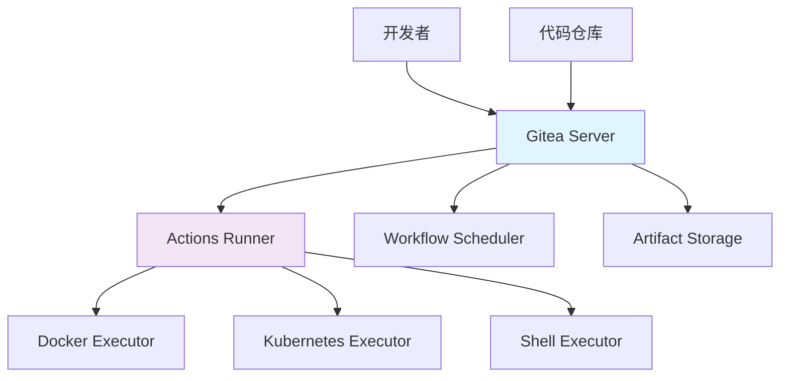

# Gitea Actions

## 1. 概述

Gitea Actions 是 Gitea 的 CI/CD 解决方案，兼容 GitHub Actions 的工作流格式。它允许在 Gitea 实例中直接运行自动化工作流，提供与 GitHub Actions 类似的体验和功能。

## 2. 核心概念

### 2.1 架构组件


### 2.2 关键特性
- **兼容 GitHub Actions**: 支持相同的 YAML 工作流格式
- **自托管运行器**: 完全控制运行环境和资源
- **事件驱动**: 基于 Git 事件触发工作流
- **多平台支持**: Linux, Windows, macOS 运行环境
- **安全可靠**: 在自有基础设施中运行

## 3. 安装与配置

### 3.1 启用 Gitea Actions
```ini
# app.ini - Gitea 配置文件
[actions]
ENABLED = true
LOG_INTERVAL = 1m
DEFAULT_ACTIONS_URL = https://gitea.com

[actions.workflow]
DEFAULT_WORKFLOW_URL = https://gitea.com

[actions.runner]
DEFAULT_RUNNER_URL = https://gitea.com
```

### 3.2 安装 Actions Runner
```bash
#!/bin/bash
# install-gitea-runner.sh

# 下载最新版 Gitea Runner
RUNNER_VERSION=$(curl -s https://api.github.com/repos/go-gitea/act_runner/releases/latest | grep '"tag_name":' | sed -E 's/.*"([^"]+)".*/\1/')
wget "https://gitea.com/gitea/act_runner/releases/download/${RUNNER_VERSION}/act_runner-${RUNNER_VERSION}-linux-amd64" -O act_runner
chmod +x act_runner
sudo mv act_runner /usr/local/bin/

# 创建运行器用户
sudo useradd -m -d /home/gitea-runner -s /bin/bash gitea-runner
sudo mkdir -p /home/gitea-runner
sudo chown gitea-runner:gitea-runner /home/gitea-runner

# 初始化运行器
sudo -u gitea-runner act_runner register \
  --instance "https://gitea.example.com" \
  --token "YOUR_RUNNER_TOKEN" \
  --name "linux-runner" \
  --labels "ubuntu-latest,docker" \
  --no-interactive

# 创建 systemd 服务
sudo tee /etc/systemd/system/gitea-runner.service << 'EOF'
[Unit]
Description=Gitea Actions Runner
After=network.target

[Service]
User=gitea-runner
Group=gitea-runner
WorkingDirectory=/home/gitea-runner
ExecStart=/usr/local/bin/act_runner daemon
Restart=always
RestartSec=5
Environment=GITEA_DEBUG=true

[Install]
WantedBy=multi-user.target
EOF

# 启动服务
sudo systemctl daemon-reload
sudo systemctl enable gitea-runner
sudo systemctl start gitea-runner
```

### 3.3 Docker Runner 配置
```yaml
# .runner - 运行器配置文件
root = "/home/gitea-runner"
log_level = "info"

[runner]
token = "YOUR_RUNNER_TOKEN"
capacity = 10

[container]
network_mode = "bridge"
privileged = false
options = ["--add-host=host.docker.internal:host-gateway"]

[cache]
enabled = true
dir = "/home/gitea-runner/.cache"

[labels]
ubuntu-latest = "ubuntu:22.04"
ubuntu-20.04 = "ubuntu:20.04"
docker = "docker:dind"
```

## 4. 工作流配置

### 4.1 基础工作流模板
```yaml
# .gitea/workflows/ci.yml
name: CI Pipeline

on:
  push:
    branches: [ main, develop ]
    tags: [ 'v*.*.*' ]
  pull_request:
    branches: [ main ]

env:
  GOLANG_VERSION: '1.20'
  NODE_VERSION: '18'
  DOCKER_REGISTRY: 'registry.example.com'
  IMAGE_NAME: '${{ gitea.repository }}'

jobs:
  code-quality:
    name: Code Quality
    runs-on: ubuntu-latest
    steps:
      - name: Checkout code
        uses: actions/checkout@v4
        with:
          fetch-depth: 0

      - name: Setup Go
        uses: actions/setup-go@v4
        with:
          go-version: ${{ env.GOLANG_VERSION }}
          cache: true

      - name: Run golangci-lint
        run: |
          go install github.com/golangci/golangci-lint/cmd/golangci-lint@latest
          golangci-lint run --timeout 5m

      - name: Run tests
        run: go test -v ./... -coverprofile=coverage.out

      - name: Upload coverage
        uses: actions/upload-artifact@v3
        with:
          name: coverage-report
          path: coverage.out

  build:
    name: Build Artifacts
    runs-on: ubuntu-latest
    needs: code-quality
    steps:
      - name: Checkout code
        uses: actions/checkout@v4

      - name: Setup Go
        uses: actions/setup-go@v4
        with:
          go-version: ${{ env.GOLANG_VERSION }}
          cache: true

      - name: Build binary
        run: |
          go build -o bin/app ./cmd/main.go
          tar -czf app.tar.gz bin/app

      - name: Upload artifacts
        uses: actions/upload-artifact@v3
        with:
          name: app-binary
          path: app.tar.gz

  docker-build:
    name: Build Docker Image
    runs-on: ubuntu-latest
    needs: build
    steps:
      - name: Checkout code
        uses: actions/checkout@v4

      - name: Download artifacts
        uses: actions/download-artifact@v3
        with:
          name: app-binary
          path: .

      - name: Setup Docker Buildx
        uses: docker/setup-buildx-action@v2

      - name: Login to registry
        uses: docker/login-action@v2
        with:
          registry: ${{ env.DOCKER_REGISTRY }}
          username: ${{ secrets.REGISTRY_USERNAME }}
          password: ${{ secrets.REGISTRY_PASSWORD }}

      - name: Build and push
        uses: docker/build-push-action@v4
        with:
          context: .
          push: true
          tags: |
            ${{ env.DOCKER_REGISTRY }}/${{ env.IMAGE_NAME }}:${{ gitea.sha }}
            ${{ env.DOCKER_REGISTRY }}/${{ env.IMAGE_NAME }}:latest
          labels: |
            org.opencontainers.image.source=${{ gitea.server_url }}/${{ gitea.repository }}
```

### 4.2 多环境部署工作流
```yaml
# .gitea/workflows/deploy.yml
name: Deployment Pipeline

on:
  workflow_dispatch:
    inputs:
      environment:
        description: 'Target environment'
        required: true
        type: choice
        options:
          - staging
          - production
      version:
        description: 'Version to deploy'
        required: false
        type: string

env:
  KUBE_NAMESPACE: '${{ github.event.inputs.environment }}'
  KUBE_CONTEXT: 'production-cluster'

jobs:
  deploy:
    name: Deploy to ${{ github.event.inputs.environment }}
    runs-on: ubuntu-latest
    environment: ${{ github.event.inputs.environment }}
    
    steps:
      - name: Checkout code
        uses: actions/checkout@v4

      - name: Setup Kubernetes tools
        uses: azure/setup-kubectl@v3
        with:
          version: 'latest'

      - name: Configure kubeconfig
        uses: azure/k8s-set-context@v3
        with:
          method: kubeconfig
          kubeconfig: ${{ secrets.KUBECONFIG }}
          context: ${{ env.KUBE_CONTEXT }}

      - name: Deploy application
        run: |
          kubectl apply -f kubernetes/deployment.yaml -n ${{ env.KUBE_NAMESPACE }}
          kubectl rollout status deployment/app -n ${{ env.KUBE_NAMESPACE }} --timeout=300s

      - name: Run smoke tests
        run: |
          ./scripts/smoke-test.sh ${{ env.KUBE_NAMESPACE }}

      - name: Notify deployment status
        uses: 8398a7/action-slack@v3
        with:
          status: ${{ job.status }}
          channel: '#deployments'
        env:
          SLACK_WEBHOOK_URL: ${{ secrets.SLACK_WEBHOOK_URL }}
```

## 5. 自定义 Actions

### 5.1 创建自定义 Action
```yaml
# .gitea/actions/golangci-lint/action.yml
name: 'GolangCI Lint'
description: 'Run golangci-lint on Go code'
author: 'Your Name'

inputs:
  go-version:
    description: 'Go version to use'
    required: false
    default: '1.20'
  timeout:
    description: 'Timeout for linting'
    required: false
    default: '5m'

runs:
  using: 'composite'
  steps:
    - name: Setup Go
      uses: actions/setup-go@v4
      with:
        go-version: ${{ inputs.go-version }}

    - name: Install golangci-lint
      shell: bash
      run: |
        go install github.com/golangci/golangci-lint/cmd/golangci-lint@latest

    - name: Run golangci-lint
      shell: bash
      run: |
        golangci-lint run --timeout ${{ inputs.timeout }}
```

### 5.2 使用自定义 Action
```yaml
# .gitea/workflows/custom-action.yml
name: Custom Action Demo

on: [push, pull_request]

jobs:
  lint:
    runs-on: ubuntu-latest
    steps:
      - name: Checkout code
        uses: actions/checkout@v4

      - name: Run custom golangci-lint
        uses: ./.gitea/actions/golangci-lint
        with:
          go-version: '1.20'
          timeout: '10m'
```

## 6. 安全扫描集成

### 6.1 安全扫描工作流
```yaml
# .gitea/workflows/security.yml
name: Security Scanning

on:
  push:
    branches: [ main ]
  pull_request:
    branches: [ main ]
  schedule:
    - cron: '0 0 * * 0'  # 每周日运行

jobs:
  sast:
    name: Static Application Security Testing
    runs-on: ubuntu-latest
    steps:
      - name: Checkout code
        uses: actions/checkout@v4

      - name: Run Semgrep SAST
        uses: returntocorp/semgrep-action@v1
        with:
          config: p/security-audit

      - name: Run Gosec
        run: |
          go install github.com/securego/gosec/v2/cmd/gosec@latest
          gosec ./...

  dependency-scan:
    name: Dependency Scanning
    runs-on: ubuntu-latest
    steps:
      - name: Checkout code
        uses: actions/checkout@v4

      - name: Run OWASP Dependency Check
        uses: dependency-check/DependencyCheck@main
        with:
          project: 'My Project'
          path: .
          format: 'HTML'
          out: reports/

  container-scan:
    name: Container Scanning
    runs-on: ubuntu-latest
    steps:
      - name: Build Docker image
        run: docker build -t my-app:latest .

      - name: Run Trivy scan
        uses: aquasecurity/trivy-action@master
        with:
          image-ref: 'my-app:latest'
          format: 'table'
          exit-code: '1'
          severity: 'CRITICAL,HIGH'
```

## 7. 矩阵构建和并行任务

### 7.1 多平台矩阵构建
```yaml
# .gitea/workflows/matrix-build.yml
name: Matrix Build

on: [push, pull_request]

jobs:
  build-test:
    name: Build and Test
    runs-on: ${{ matrix.os }}
    strategy:
      matrix:
        os: [ubuntu-latest, windows-latest]
        go-version: [1.19, 1.20]
        include:
          - os: ubuntu-latest
            platform: linux/amd64
          - os: windows-latest
            platform: windows/amd64
        exclude:
          - os: windows-latest
            go-version: 1.19

    steps:
      - name: Checkout code
        uses: actions/checkout@v4

      - name: Setup Go ${{ matrix.go-version }}
        uses: actions/setup-go@v4
        with:
          go-version: ${{ matrix.go-version }}
          cache: true

      - name: Run tests
        run: go test -v ./... -coverprofile=coverage-${{ matrix.os }}-${{ matrix.go-version }}.out

      - name: Upload coverage
        uses: actions/upload-artifact@v3
        with:
          name: coverage-${{ matrix.os }}-${{ matrix.go-version }}
          path: coverage-${{ matrix.os }}-${{ matrix.go-version }}.out
```

### 7.2 并行部署任务
```yaml
# .gitea/workflows/parallel-deploy.yml
name: Parallel Deployment

on:
  workflow_dispatch:

jobs:
  deploy-staging:
    name: Deploy to Staging
    runs-on: ubuntu-latest
    environment: staging
    steps:
      - name: Deploy to staging
        run: ./scripts/deploy.sh staging

  deploy-production:
    name: Deploy to Production
    runs-on: ubuntu-latest
    environment: production
    steps:
      - name: Deploy to production
        run: ./scripts/deploy.sh production

  notify-teams:
    name: Notify Teams
    runs-on: ubuntu-latest
    needs: [deploy-staging, deploy-production]
    steps:
      - name: Send notification
        uses: 8398a7/action-slack@v3
        with:
          status: ${{ job.status }}
          channel: '#deployments'
        env:
          SLACK_WEBHOOK_URL: ${{ secrets.SLACK_WEBHOOK_URL }}
```

## 8. 监控和优化

### 8.1 性能监控工作流
```yaml
# .gitea/workflows/performance.yml
name: Performance Monitoring

on:
  schedule:
    - cron: '0 8 * * 1-5'  # 工作日早上8点
  workflow_dispatch:

jobs:
  performance-test:
    name: Performance Testing
    runs-on: ubuntu-latest
    steps:
      - name: Checkout code
        uses: actions/checkout@v4

      - name: Run benchmarks
        run: |
          go test -bench=. -benchmem -cpuprofile=cpu.pprof -memprofile=mem.pprof

      - name: Analyze performance
        run: |
          go tool pprof -top cpu.pprof
          go tool pprof -top mem.pprof

      - name: Upload profiles
        uses: actions/upload-artifact@v3
        with:
          name: performance-profiles
          path: '*.pprof'
```

### 8.2 资源优化工作流
```yaml
# .gitea/workflows/optimize.yml
name: Resource Optimization

on:
  schedule:
    - cron: '0 0 * * 0'  # 每周日运行

jobs:
  cleanup:
    name: Cleanup Resources
    runs-on: ubuntu-latest
    steps:
      - name: Cleanup old artifacts
        uses: actions/delete-artifact@v3
        with:
          name: app-binary
          retention-days: 30

      - name: Cleanup Docker resources
        run: |
          docker system prune -af
          docker volume prune -f

      - name: Cleanup cache
        run: |
          rm -rf ~/.cache/go-build
          rm -rf ~/.npm/_cacache
```

## 9. 故障排除和调试

### 9.1 调试工作流
```yaml
# .gitea/workflows/debug.yml
name: Debug Workflow

on:
  workflow_dispatch:

jobs:
  debug:
    name: Debug Information
    runs-on: ubuntu-latest
    steps:
      - name: Checkout code
        uses: actions/checkout@v4

      - name: Show environment variables
        run: |
          echo "Gitea variables:"
          env | grep GITEA_ | sort
          echo "Runner information:"
          uname -a
          docker info

      - name: Debug network connectivity
        run: |
          ping -c 3 gitea.example.com
          curl -I https://gitea.example.com

      - name: Check disk space
        run: df -h

      - name: Upload debug information
        uses: actions/upload-artifact@v3
        with:
          name: debug-info
          path: debug.log
        if: always()
```

### 9.2 日志收集工作流
```yaml
# .gitea/workflows/logs.yml
name: Log Collection

on:
  workflow_run:
    workflows: ["CI Pipeline"]
    types: [completed]

jobs:
  collect-logs:
    name: Collect Logs
    runs-on: ubuntu-latest
    steps:
      - name: Download workflow logs
        uses: actions/github-script@v6
        with:
          script: |
            const runs = await github.rest.actions.listWorkflowRuns({
              owner: context.repo.owner,
              repo: context.repo.repo,
              workflow_id: 'ci.yml',
              status: 'completed'
            })
            
            for (const run of runs.data.workflow_runs.slice(0, 5)) {
              const logs = await github.rest.actions.downloadWorkflowRunLogs({
                owner: context.repo.owner,
                repo: context.repo.repo,
                run_id: run.id
              })
              // 处理日志数据
            }

      - name: Archive logs
        run: |
          tar -czf workflow-logs.tar.gz *.log
          
      - name: Upload logs archive
        uses: actions/upload-artifact@v3
        with:
          name: workflow-logs
          path: workflow-logs.tar.gz
```
