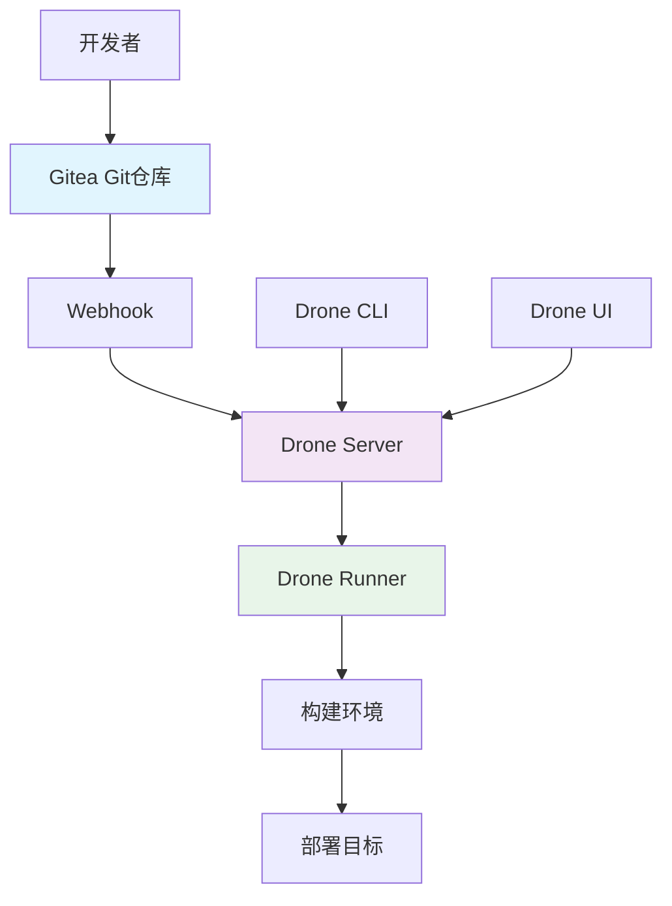

# Gitea + Drone CI/CD 实践指南

## 1. 概述

Gitea 是一个轻量级的代码托管解决方案，Drone 是一个基于容器技术的持续集成平台。两者结合可以提供完整的自托管 GitOps 工作流。

## 2. 架构设计

### 2.1 系统架构


### 2.2 核心组件
- **Gitea**: 轻量级 Git 服务，提供代码托管和 Webhook
- **Drone Server**: 中央调度器，处理 Webhook 和流水线管理
- **Drone Runner**: 执行器，支持 Docker、SSH、Kubernetes 等多种运行环境
- **Drone CLI**: 命令行工具，管理流水线和密钥
- **Drone UI**: Web 界面，查看构建状态和日志

## 3. 环境部署

### 3.1 Docker Compose 部署
```yaml
# docker-compose.yml
version: '3.8'

services:
  # Gitea 服务
  gitea:
    image: gitea/gitea:1.20
    container_name: gitea
    environment:
      - USER_UID=1000
      - USER_GID=1000
      - GITEA__database__DB_TYPE=postgres
      - GITEA__database__HOST=db:5432
      - GITEA__database__NAME=gitea
      - GITEA__database__USER=gitea
      - GITEA__database__PASSWD=gitea
    volumes:
      - ./gitea:/data
      - /etc/timezone:/etc/timezone:ro
      - /etc/localtime:/etc/localtime:ro
    ports:
      - "3000:3000"
      - "2222:22"
    depends_on:
      - db
    restart: unless-stopped

  # 数据库
  db:
    image: postgres:14
    container_name: gitea_db
    environment:
      - POSTGRES_USER=gitea
      - POSTGRES_PASSWORD=gitea
      - POSTGRES_DB=gitea
    volumes:
      - ./postgres:/var/lib/postgresql/data
    restart: unless-stopped

  # Drone Server
  drone-server:
    image: drone/drone:2.0
    container_name: drone-server
    environment:
      - DRONE_GITEA_SERVER=http://gitea:3000
      - DRONE_GITEA_CLIENT_ID=${DRONE_GITEA_CLIENT_ID}
      - DRONE_GITEA_CLIENT_SECRET=${DRONE_GITEA_CLIENT_SECRET}
      - DRONE_RPC_SECRET=${DRONE_RPC_SECRET}
      - DRONE_SERVER_HOST=${DRONE_SERVER_HOST}
      - DRONE_SERVER_PROTO=http
      - DRONE_USER_CREATE=username:admin,admin:true
    volumes:
      - ./drone:/data
    ports:
      - "8000:80"
    depends_on:
      - gitea
    restart: unless-stopped

  # Drone Runner
  drone-runner:
    image: drone/drone-runner-docker:1.0
    container_name: drone-runner
    environment:
      - DRONE_RPC_PROTO=http
      - DRONE_RPC_HOST=drone-server:80
      - DRONE_RPC_SECRET=${DRONE_RPC_SECRET}
      - DRONE_RUNNER_CAPACITY=2
      - DRONE_RUNNER_NAME=drone-runner
    volumes:
      - /var/run/docker.sock:/var/run/docker.sock
    depends_on:
      - drone-server
    restart: unless-stopped

volumes:
  gitea:
  postgres:
  drone:
```

### 3.2 环境变量配置
```bash
#!/bin/bash
# setup-environment.sh

# 生成随机密钥
export DRONE_RPC_SECRET=$(openssl rand -hex 16)

# Gitea OAuth 应用配置
export DRONE_GITEA_CLIENT_ID="your-client-id"
export DRONE_GITEA_CLIENT_SECRET="your-client-secret"

# Drone 服务器地址
export DRONE_SERVER_HOST="drone.yourdomain.com"

# 初始化环境文件
cat > .env << EOF
DRONE_RPC_SECRET=${DRONE_RPC_SECRET}
DRONE_GITEA_CLIENT_ID=${DRONE_GITEA_CLIENT_ID}
DRONE_GITEA_CLIENT_SECRET=${DRONE_GITEA_CLIENT_SECRET}
DRONE_SERVER_HOST=${DRONE_SERVER_HOST}
EOF

# 启动服务
docker-compose up -d
```

## 4. Gitea 配置

### 4.1 OAuth 应用配置
1. 访问 Gitea 管理界面 (`http://localhost:3000`)
2. 进入 `设置` -> `应用`
3. 创建新的 OAuth2 应用：
   - 应用名称: `Drone CI`
   - 重定向 URI: `http://drone.yourdomain.com/login`
4. 获取 Client ID 和 Client Secret

### 4.2 Webhook 配置
```yaml
# Gitea 的 app.ini 配置
[webhook]
ALLOWED_HOST_LIST = *
SKIP_TLS_VERIFY = true
```

## 5. Drone 流水线配置

### 5.1 基础流水线配置
```yaml
# .drone.yml
kind: pipeline
type: docker
name: default

steps:
  - name: test
    image: golang:1.20
    commands:
      - go version
      - go mod download
      - go test ./... -v

  - name: build
    image: golang:1.20
    commands:
      - go build -o app ./cmd/main.go
    when:
      branch:
        - main
        - develop

  - name: docker-build
    image: docker:20.10
    commands:
      - docker build -t your-app:${DRONE_COMMIT_SHA:0:8} .
    when:
      branch:
        - main
        - develop

  - name: deploy-staging
    image: alpine/k8s:1.25
    commands:
      - kubectl set image deployment/your-app your-app=your-app:${DRONE_COMMIT_SHA:0:8} -n staging
    when:
      branch: develop
      status: success

  - name: deploy-production
    image: alpine/k8s:1.25
    commands:
      - kubectl set image deployment/your-app your-app=your-app:${DRONE_COMMIT_SHA:0:8} -n production
    when:
      branch: main
      status: success

trigger:
  branch:
    - main
    - develop
    - feature/*
```

### 5.2 多环境流水线
```yaml
# .drone.yml
kind: pipeline
type: docker
name: staging

steps:
  - name: test
    image: node:16-alpine
    commands:
      - npm install
      - npm test

  - name: build
    image: node:16-alpine
    commands:
      - npm run build

  - name: docker-build
    image: docker:20.10
    commands:
      - docker build -t your-app-staging:${DRONE_COMMIT_SHA:0:8} .

  - name: deploy
    image: alpine/k8s:1.25
    commands:
      - kubectl apply -f k8s/staging.yaml
      - kubectl set image deployment/your-app your-app=your-app-staging:${DRONE_COMMIT_SHA:0:8} -n staging

trigger:
  branch: develop

---
kind: pipeline
type: docker
name: production

steps:
  - name: test
    image: node:16-alpine
    commands:
      - npm install
      - npm test

  - name: build
    image: node:16-alpine
    commands:
      - npm run build

  - name: security-scan
    image: aquasec/trivy:latest
    commands:
      - trivy image your-app:${DRONE_COMMIT_SHA:0:8}

  - name: docker-build
    image: docker:20.10
    commands:
      - docker build -t your-app-prod:${DRONE_COMMIT_SHA:0:8} .

  - name: deploy
    image: alpine/k8s:1.25
    commands:
      - kubectl apply -f k8s/production.yaml
      - kubectl set image deployment/your-app your-app=your-app-prod:${DRONE_COMMIT_SHA:0:8} -n production

trigger:
  branch: main
```

## 6. 高级功能配置

### 6.1 密钥管理
```bash
# 使用 Drone CLI 管理密钥
drone secret add --repository your-username/your-repo --name DOCKER_USERNAME --value your-username
drone secret add --repository your-username/your-repo --name DOCKER_PASSWORD --value your-password
drone secret add --repository your-username/your-repo --name KUBECONFIG --value @kubeconfig.yaml

# 查看密钥列表
drone secret ls --repository your-username/your-repo

# 流水线中使用密钥
```yaml
steps:
  - name: docker-login
    image: docker:20.10
    environment:
      DOCKER_USERNAME:
        from_secret: DOCKER_USERNAME
      DOCKER_PASSWORD:
        from_secret: DOCKER_PASSWORD
    commands:
      - echo $DOCKER_PASSWORD | docker login -u $DOCKER_USERNAME --password-stdin
```

### 6.2 缓存优化
```yaml
# 使用缓存卷提高构建性能
kind: pipeline
type: docker
name: cached-build

volumes:
  - name: cache
    temp: {}

steps:
  - name: restore-cache
    image: drillster/drone-volume-cache
    settings:
      restore: true
      mount:
        - ./node_modules
    volumes:
      - name: cache
        path: /cache

  - name: install-dependencies
    image: node:16-alpine
    commands:
      - npm install
    volumes:
      - name: cache
        path: /cache

  - name: rebuild-cache
    image: drillster/drone-volume-cache
    settings:
      rebuild: true
      mount:
        - ./node_modules
    volumes:
      - name: cache
        path: /cache
```

## 7. Kubernetes Runner 配置

### 7.1 Kubernetes Runner 部署
```yaml
# drone-runner-kubernetes.yaml
apiVersion: apps/v1
kind: Deployment
metadata:
  name: drone-runner
  namespace: drone
spec:
  replicas: 2
  selector:
    matchLabels:
      app: drone-runner
  template:
    metadata:
      labels:
        app: drone-runner
    spec:
      serviceAccountName: drone-runner
      containers:
      - name: runner
        image: drone/drone-runner-kube:1.0
        env:
        - name: DRONE_RPC_HOST
          value: "drone-server.drone.svc.cluster.local:80"
        - name: DRONE_RPC_SECRET
          valueFrom:
            secretKeyRef:
              name: drone-secrets
              key: rpc-secret
        - name: DRONE_NAMESPACE_DEFAULT
          value: drone-pipelines
        resources:
          requests:
            memory: "128Mi"
            cpu: "100m"
          limits:
            memory: "256Mi"
            cpu: "200m"
---
apiVersion: v1
kind: ServiceAccount
metadata:
  name: drone-runner
  namespace: drone
---
apiVersion: rbac.authorization.k8s.io/v1
kind: ClusterRoleBinding
metadata:
  name: drone-runner
subjects:
  - kind: ServiceAccount
    name: drone-runner
    namespace: drone
roleRef:
  kind: ClusterRole
  name: cluster-admin
  apiGroup: rbac.authorization.k8s.io
```

### 7.2 Kubernetes 流水线
```yaml
kind: pipeline
type: kubernetes
name: kubernetes-pipeline

steps:
  - name: test
    image: golang:1.20
    commands:
      - go test ./...

  - name: build
    image: golang:1.20
    commands:
      - go build -o app .

  - name: deploy
    image: alpine/k8s:1.25
    commands:
      - kubectl apply -f deployment.yaml
```

## 8. 监控与日志

### 8.1 监控配置
```yaml
# Prometheus 监控配置
scrape_configs:
  - job_name: 'drone'
    static_configs:
      - targets: ['drone-server:80']
    metrics_path: /metrics

  - job_name: 'gitea'
    static_configs:
      - targets: ['gitea:3000']
    metrics_path: /metrics
```

### 8.2 日志收集
```yaml
# Fluentd 配置
<source>
  @type forward
  port 24224
</source>

<match drone.**>
  @type elasticsearch
  host elasticsearch
  port 9200
  index_name drone-logs
  type_name log
</match>

<match gitea.**>
  @type elasticsearch
  host elasticsearch
  port 9200
  index_name gitea-logs
  type_name log
</match>
```

## 9. 备份与恢复

### 9.1 备份脚本
```bash
#!/bin/bash
# backup.sh

# 备份 Gitea 数据
docker exec gitea bash -c 'cd /data && tar czf /tmp/gitea-backup.tar.gz .'
docker cp gitea:/tmp/gitea-backup.tar.gz ./backup/gitea-$(date +%Y%m%d).tar.gz

# 备份数据库
docker exec gitea_db pg_dump -U gitea gitea > ./backup/gitea-db-$(date +%Y%m%d).sql

# 备份 Drone 数据
docker exec drone-server bash -c 'cd /data && tar czf /tmp/drone-backup.tar.gz .'
docker cp drone-server:/tmp/drone-backup.tar.gz ./backup/drone-$(date +%Y%m%d).tar.gz

# 上传到云存储
aws s3 cp ./backup/ s3://your-backup-bucket/ --recursive

# 清理旧备份
find ./backup -name "*.tar.gz" -mtime +7 -delete
find ./backup -name "*.sql" -mtime +7 -delete
```

### 9.2 恢复脚本
```bash
#!/bin/bash
# restore.sh

# 恢复 Gitea 数据
docker cp ./backup/gitea-backup.tar.gz gitea:/tmp/
docker exec gitea bash -c 'cd /data && tar xzf /tmp/gitea-backup.tar.gz'

# 恢复数据库
docker exec -i gitea_db psql -U gitea gitea < ./backup/gitea-db-backup.sql

# 恢复 Drone 数据
docker cp ./backup/drone-backup.tar.gz drone-server:/tmp/
docker exec drone-server bash -c 'cd /data && tar xzf /tmp/drone-backup.tar.gz'

# 重启服务
docker-compose restart
```

## 10. 安全最佳实践

### 10.1 安全加固
```yaml
# 网络安全配置
version: '3.8'

services:
  gitea:
    networks:
      - internal
    labels:
      - "traefik.enable=true"
      - "traefik.http.routers.gitea.rule=Host(`gitea.yourdomain.com`)"
      - "traefik.http.routers.gitea.entrypoints=websecure"
      - "traefik.http.routers.gitea.tls.certresolver=myresolver"

  drone-server:
    networks:
      - internal
    labels:
      - "traefik.enable=true"
      - "traefik.http.routers.drone.rule=Host(`drone.yourdomain.com`)"
      - "traefik.http.routers.drone.entrypoints=websecure"
      - "traefik.http.routers.drone.tls.certresolver=myresolver"

networks:
  internal:
    internal: true
```

### 10.2 访问控制
```bash
# 配置防火墙规则
ufw allow 22
ufw allow 80
ufw allow 443
ufw allow 3000
ufw enable

# 配置 SSH 密钥认证
echo "PasswordAuthentication no" >> /etc/ssh/sshd_config
echo "PubkeyAuthentication yes" >> /etc/ssh/sshd_config
systemctl restart sshd
```
