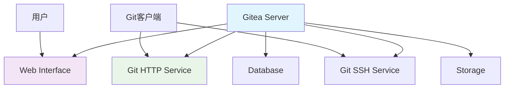

# Gitea

## 1. 概述

Gitea 是一个轻量级、开源的 Git 服务，采用 Go 语言编写。它提供了类似 GitHub 的功能，包括代码托管、Pull Request、Issue 跟踪、Wiki 等，适合中小团队和企业自建 Git 服务。

## 2. 核心概念

### 2.1 架构组件


### 2.2 关键特性
- **轻量级**: 资源占用低，单二进制文件部署
- **开源**: MIT 许可证，完全免费
- **多平台**: 支持 Linux、Windows、macOS
- **多数据库**: 支持 MySQL、PostgreSQL、SQLite
- **扩展性**: 支持 Webhook、API、第三方集成

## 3. 安装与配置

### 3.1 Docker 安装
```yaml
# docker-compose.yml
version: '3'

services:
  server:
    image: gitea/gitea:latest
    container_name: gitea
    environment:
      - USER_UID=1000
      - USER_GID=1000
      - GITEA__database__DB_TYPE=postgres
      - GITEA__database__HOST=db:5432
      - GITEA__database__NAME=gitea
      - GITEA__database__USER=gitea
      - GITEA__database__PASSWD=gitea
    restart: always
    volumes:
      - ./gitea:/data
      - /etc/timezone:/etc/timezone:ro
      - /etc/localtime:/etc/localtime:ro
    ports:
      - "3000:3000"
      - "222:22"
    depends_on:
      - db

  db:
    image: postgres:13
    container_name: gitea_db
    environment:
      - POSTGRES_USER=gitea
      - POSTGRES_PASSWORD=gitea
      - POSTGRES_DB=gitea
    restart: always
    volumes:
      - ./postgres:/var/lib/postgresql/data
```

### 3.2 二进制安装
```bash
#!/bin/bash
# install-gitea.sh

# 下载最新版 Gitea
wget -O gitea https://dl.gitea.io/gitea/latest/gitea-linux-amd64
chmod +x gitea

# 创建系统用户
sudo adduser \
   --system \
   --shell /bin/bash \
   --gecos 'Git Version Control' \
   --group \
   --disabled-password \
   --home /home/git \
   git

# 创建目录结构
sudo mkdir -p /var/lib/gitea/{custom,data,log}
sudo chown -R git:git /var/lib/gitea
sudo chmod -R 750 /var/lib/gitea
sudo mkdir /etc/gitea
sudo chown -R root:git /etc/gitea
sudo chmod -R 770 /etc/gitea

# 移动二进制文件
sudo mv gitea /usr/local/bin/gitea

# 创建 systemd 服务
sudo tee /etc/systemd/system/gitea.service << EOF
[Unit]
Description=Gitea
After=syslog.target
After=network.target

[Service]
RestartSec=2s
Type=simple
User=git
Group=git
WorkingDirectory=/var/lib/gitea/
ExecStart=/usr/local/bin/gitea web --config /etc/gitea/app.ini
Restart=always
Environment=USER=git HOME=/home/git

[Install]
WantedBy=multi-user.target
EOF

# 启动服务
sudo systemctl enable gitea
sudo systemctl start gitea
```

### 3.3 配置文件
```ini
# app.ini
APP_NAME = Gitea
RUN_USER = git
RUN_MODE = prod

[server]
APP_DATA_PATH    = /data/gitea
HTTP_PORT        = 3000
ROOT_URL         = https://git.example.com/
DISABLE_SSH      = false
SSH_PORT         = 22
SSH_DOMAIN       = git.example.com
LFS_START_SERVER = true
LFS_CONTENT_PATH = /data/git/lfs

[database]
DB_TYPE  = postgres
HOST     = db:5432
NAME     = gitea
USER     = gitea
PASSWD   = gitea
SSL_MODE = disable

[repository]
ROOT = /data/git/repositories

[session]
PROVIDER = file

[picture]
AVATAR_UPLOAD_PATH = /data/gitea/avatars

[attachment]
PATH = /data/gitea/attachments

[log]
ROOT_PATH = /data/gitea/log
MODE      = file
LEVEL     = Info

[security]
INSTALL_LOCK   = true
SECRET_KEY     = your-secret-key
INTERNAL_TOKEN = your-internal-token
```

## 4. 基本操作

### 4.1 管理员操作
```bash
# 创建管理员用户
gitea admin user create --username admin --password admin123 --email admin@example.com --admin

# 修改用户权限
gitea admin user change-username --old-username user1 --new-username user2
gitea admin user delete --username user1

# 管理仓库
gitea admin repo list --user user1
gitea admin repo delete --owner user1 --repo-name project1

# 备份和恢复
gitea dump -c /etc/gitea/app.ini -f backup.zip
gitea restore -c /etc/gitea/app.ini -f backup.zip
```

### 4.2 用户管理
```bash
# 创建用户
curl -X POST "https://git.example.com/api/v1/admin/users" \
  -H "Authorization: token your-access-token" \
  -H "Content-Type: application/json" \
  -d '{
    "username": "newuser",
    "email": "newuser@example.com",
    "password": "password123",
    "must_change_password": false,
    "send_notify": true
  }'

# 获取用户列表
curl -X GET "https://git.example.com/api/v1/admin/users?page=1&limit=10" \
  -H "Authorization: token your-access-token"

# 删除用户
curl -X DELETE "https://git.example.com/api/v1/admin/users/newuser" \
  -H "Authorization: token your-access-token"
```

## 5. 仓库管理

### 5.1 创建和管理仓库
```bash
# 创建仓库
curl -X POST "https://git.example.com/api/v1/user/repos" \
  -H "Authorization: token your-access-token" \
  -H "Content-Type: application/json" \
  -d '{
    "name": "my-project",
    "description": "My awesome project",
    "private": false,
    "auto_init": true,
    "gitignores": "Node",
    "license": "MIT",
    "readme": "Default"
  }'

# 获取仓库列表
curl -X GET "https://git.example.com/api/v1/user/repos?page=1&limit=10" \
  -H "Authorization: token your-access-token"

# 迁移外部仓库
curl -X POST "https://git.example.com/api/v1/repos/migrate" \
  -H "Authorization: token your-access-token" \
  -H "Content-Type: application/json" \
  -d '{
    "clone_addr": "https://github.com/username/repo.git",
    "auth_username": "username",
    "auth_password": "password",
    "uid": 1,
    "repo_name": "migrated-repo",
    "mirror": false,
    "private": false
  }'
```

### 5.2 Webhook 配置
```bash
# 创建 Webhook
curl -X POST "https://git.example.com/api/v1/repos/username/reponame/hooks" \
  -H "Authorization: token your-access-token" \
  -H "Content-Type: application/json" \
  -d '{
    "type": "gitea",
    "config": {
      "url": "https://ci.example.com/webhook",
      "content_type": "json",
      "secret": "webhook-secret"
    },
    "events": [
      "push",
      "pull_request"
    ],
    "active": true
  }'

# 测试 Webhook
curl -X POST "https://git.example.com/api/v1/repos/username/reponame/hooks/1/test" \
  -H "Authorization: token your-access-token"
```

## 6. 集成与扩展

### 6.1 OAuth2 配置
```ini
# app.ini
[oauth2]
ENABLED = true
JWT_SECRET = your-jwt-secret
ACCESS_TOKEN_EXPIRATION_TIME = 3600
REFRESH_TOKEN_EXPIRATION_TIME = 730
MAX_TOKEN_LENGTH = 50

[oauth2_client]
REGISTER_EMAIL_CONFIRM = false
REGISTER_MANUAL_CONFIRM = false
```

### 6.2 LDAP 集成
```ini
# app.ini
[service]
DISABLE_REGISTRATION = true
REQUIRE_SIGNIN_VIEW = true

[auth]
REQUIRE_EMAIL_CONFIRMATION = false

[ldap]
ENABLED = true
SECURITY_PROTOCOL = unencrypted
HOST = ldap://ldap.example.com:389
USER_FILTER = (&(objectClass=person)(uid=%s))
ADMIN_FILTER = (memberOf=cn=admin,ou=groups,dc=example,dc=com)
```

## 7. 备份与恢复

### 7.1 自动备份脚本
```bash
#!/bin/bash
# gitea-backup.sh

set -e

# 配置变量
GITEA_BACKUP_DIR="/backup/gitea"
GITEA_DATA_DIR="/data/gitea"
RETENTION_DAYS=30
TIMESTAMP=$(date +%Y%m%d_%H%M%S)
BACKUP_FILE="${GITEA_BACKUP_DIR}/gitea-backup-${TIMESTAMP}.zip"

# 创建备份目录
mkdir -p "${GITEA_BACKUP_DIR}"

# 执行备份
echo "开始备份 Gitea..."
gitea dump -c /etc/gitea/app.ini -f "${BACKUP_FILE}"

# 备份数据库（可选）
# pg_dump -U gitea -h localhost gitea > "${GITEA_BACKUP_DIR}/gitea-db-${TIMESTAMP}.sql"

# 清理旧备份
find "${GITEA_BACKUP_DIR}" -name "gitea-backup-*.zip" -mtime +${RETENTION_DAYS} -delete
find "${GITEA_BACKUP_DIR}" -name "gitea-db-*.sql" -mtime +${RETENTION_DAYS} -delete

echo "备份完成: ${BACKUP_FILE}"

# 上传到云存储（可选）
# aws s3 cp "${BACKUP_FILE}" "s3://my-backup-bucket/gitea/"

# 发送通知
echo "Gitea 备份成功完成于 $(date)" | mail -s "Gitea 备份通知" admin@example.com
```

### 7.2 恢复脚本
```bash
#!/bin/bash
# gitea-restore.sh

set -e

# 配置变量
BACKUP_FILE="/backup/gitea/gitea-backup-20230101_120000.zip"
GITEA_DATA_DIR="/data/gitea"

# 停止 Gitea 服务
systemctl stop gitea

# 执行恢复
echo "开始恢复 Gitea..."
gitea restore -c /etc/gitea/app.ini -f "${BACKUP_FILE}"

# 恢复数据库（如果单独备份了）
# psql -U gitea -h localhost gitea < /backup/gitea/gitea-db-20230101_120000.sql

# 设置权限
chown -R git:git "${GITEA_DATA_DIR}"
chmod -R 750 "${GITEA_DATA_DIR}"

# 启动 Gitea 服务
systemctl start gitea

echo "恢复完成"
```

## 8. 高可用配置

### 8.1 数据库高可用
```ini
# app.ini
[database]
DB_TYPE  = postgres
HOST     = pgpool:5432
NAME     = gitea
USER     = gitea
PASSWD   = gitea
SSL_MODE = disable
```

### 8.2 会话存储配置
```ini
# app.ini
[session]
PROVIDER = redis
PROVIDER_CONFIG = network=tcp,addr=redis:6379,password=redis-password,db=0
```

## 9. 监控与维护

### 9.1 健康检查
```bash
#!/bin/bash
# gitea-healthcheck.sh

# 检查服务状态
if ! systemctl is-active --quiet gitea; then
    echo "Gitea 服务未运行"
    exit 1
fi

# 检查端口监听
if ! netstat -tln | grep -q :3000; then
    echo "Gitea 未监听端口 3000"
    exit 1
fi

# 检查 API 访问
if ! curl -f http://localhost:3000/api/v1/version > /dev/null 2>&1; then
    echo "Gitea API 不可访问"
    exit 1
fi

# 检查磁盘空间
DISK_USAGE=$(df /data | awk 'NR==2 {print $5}' | sed 's/%//')
if [ "$DISK_USAGE" -gt 90 ]; then
    echo "磁盘空间不足: ${DISK_USAGE}%"
    exit 1
fi

echo "Gitea 健康状态正常"
exit 0
```

### 9.2 日志监控
```bash
#!/bin/bash
# gitea-log-monitor.sh

# 监控错误日志
tail -f /var/lib/gitea/log/gitea.log | grep -E "(ERROR|FATAL)"

# 监控访问日志
tail -f /var/lib/gitea/log/access.log | grep -E "(5[0-9]{2}|4[0-9]{2})"

# 自动日志轮转
cat > /etc/logrotate.d/gitea << EOF
/var/lib/gitea/log/*.log {
    daily
    missingok
    rotate 30
    compress
    delaycompress
    notifempty
    create 640 git git
    sharedscripts
    postrotate
        systemctl reload gitea > /dev/null 2>&1 || true
    endscript
}
EOF
```
