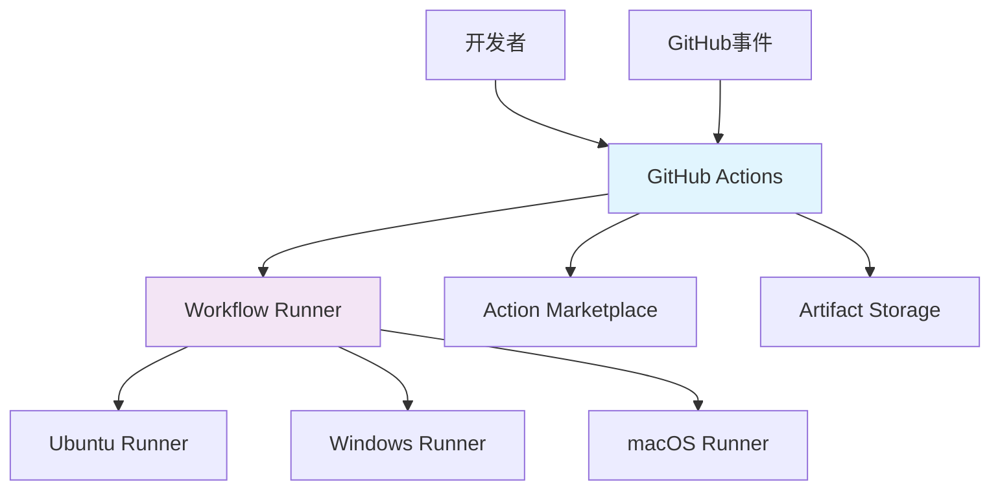

# GitHub Actions

## 1. 概述

GitHub Actions 是 GitHub 提供的持续集成和持续交付平台，允许直接在 GitHub 仓库中自动化工作流程。它提供事件驱动的流水线，支持丰富的预构建动作和自定义工作流。

## 2. 核心概念

### 2.1 架构组件


### 2.2 关键特性
- **事件驱动**: 基于 GitHub 事件触发工作流
- **多平台支持**: Ubuntu, Windows, macOS 运行环境
- **丰富的 Actions**: 官方和社区维护的预构建动作
- **矩阵构建**: 支持多配置并行测试
- **安全可靠**: 与 GitHub 生态系统深度集成

## 3. 基础工作流配置

### 3.1 基础工作流模板
```yaml
# .github/workflows/ci-cd.yml
name: CI/CD Pipeline

on:
  push:
    branches: [ main, develop ]
    tags: [ 'v*.*.*' ]
  pull_request:
    branches: [ main ]
  schedule:
    - cron: '0 0 * * 0'  # 每周日运行

env:
  NODE_VERSION: '18'
  PYTHON_VERSION: '3.10'
  DOCKER_REGISTRY: ghcr.io
  DOCKER_IMAGE: ${{ github.repository }}

jobs:
  # 代码质量检查
  code-quality:
    name: Code Quality
    runs-on: ubuntu-latest
    steps:
      - uses: actions/checkout@v4
      
      - name: Setup Node.js
        uses: actions/setup-node@v3
        with:
          node-version: ${{ env.NODE_VERSION }}
          cache: 'npm'
      
      - name: Install dependencies
        run: npm ci
      
      - name: Run linting
        run: npm run lint
      
      - name: Run type checking
        run: npm run type-check

  # 测试任务
  test:
    name: Run Tests
    runs-on: ubuntu-latest
    needs: code-quality
    strategy:
      matrix:
        node-version: [16, 18, 20]
        os: [ubuntu-latest, windows-latest]
    steps:
      - uses: actions/checkout@v4
      
      - name: Setup Node.js ${{ matrix.node-version }}
        uses: actions/setup-node@v3
        with:
          node-version: ${{ matrix.node-version }}
          cache: 'npm'
      
      - name: Install dependencies
        run: npm ci
      
      - name: Run tests
        run: npm test -- --coverage
      
      - name: Upload coverage
        uses: codecov/codecov-action@v3
        with:
          file: ./coverage/lcov.info

  # 构建任务
  build:
    name: Build Artifacts
    runs-on: ubuntu-latest
    needs: test
    steps:
      - uses: actions/checkout@v4
      
      - name: Setup Node.js
        uses: actions/setup-node@v3
        with:
          node-version: ${{ env.NODE_VERSION }}
          cache: 'npm'
      
      - name: Install dependencies
        run: npm ci
      
      - name: Build project
        run: npm run build
      
      - name: Upload artifacts
        uses: actions/upload-artifact@v3
        with:
          name: dist
          path: dist/

  # 部署任务
  deploy:
    name: Deploy to Production
    runs-on: ubuntu-latest
    needs: build
    if: github.ref == 'refs/heads/main'
    environment: production
    steps:
      - uses: actions/checkout@v4
      
      - name: Download artifacts
        uses: actions/download-artifact@v3
        with:
          name: dist
          path: dist/
      
      - name: Deploy to production
        run: ./deploy.sh
        env:
          DEPLOY_TOKEN: ${{ secrets.DEPLOY_TOKEN }}
```

### 3.2 多环境工作流
```yaml
# .github/workflows/deploy.yml
name: Multi-Environment Deployment

on:
  workflow_dispatch:
    inputs:
      environment:
        description: 'Deployment environment'
        required: true
        default: 'staging'
        type: choice
        options:
          - staging
          - production
      version:
        description: 'Version to deploy'
        required: false
        type: string

env:
  REGISTRY: ghcr.io
  IMAGE_NAME: ${{ github.repository }}

jobs:
  deploy:
    runs-on: ubuntu-latest
    environment: ${{ github.event.inputs.environment || 'staging' }}
    steps:
      - uses: actions/checkout@v4
      
      - name: Log in to GitHub Container Registry
        uses: docker/login-action@v2
        with:
          registry: ${{ env.REGISTRY }}
          username: ${{ github.actor }}
          password: ${{ secrets.GITHUB_TOKEN }}
      
      - name: Extract metadata for Docker
        id: meta
        uses: docker/metadata-action@v4
        with:
          images: ${{ env.REGISTRY }}/${{ env.IMAGE_NAME }}
          tags: |
            type=sha,prefix=
            type=ref,event=branch
            type=ref,event=tag
      
      - name: Build and push Docker image
        uses: docker/build-push-action@v4
        with:
          context: .
          push: true
          tags: ${{ steps.meta.outputs.tags }}
          labels: ${{ steps.meta.outputs.labels }}
      
      - name: Deploy to environment
        run: |
          echo "Deploying to ${{ github.event.inputs.environment || 'staging' }}"
          ./scripts/deploy.sh ${{ github.event.inputs.environment || 'staging' }}
        env:
          KUBECONFIG: ${{ secrets.KUBECONFIG }}
          ENVIRONMENT: ${{ github.event.inputs.environment || 'staging' }}
```

## 4. 高级工作流功能

### 4.1 矩阵构建和并行任务
```yaml
# .github/workflows/matrix-build.yml
name: Matrix Build and Test

on: [push, pull_request]

jobs:
  build-test:
    name: Build and Test
    runs-on: ${{ matrix.os }}
    strategy:
      matrix:
        os: [ubuntu-latest, windows-latest, macos-latest]
        node-version: [16, 18, 20]
        include:
          - os: ubuntu-latest
            browser: chrome
          - os: windows-latest
            browser: firefox
          - os: macos-latest
            browser: safari
        exclude:
          - os: windows-latest
            node-version: 16
    steps:
      - uses: actions/checkout@v4
      
      - name: Setup Node.js ${{ matrix.node-version }}
        uses: actions/setup-node@v3
        with:
          node-version: ${{ matrix.node-version }}
          cache: 'npm'
      
      - name: Install dependencies
        run: npm ci
      
      - name: Run tests with ${{ matrix.browser }}
        run: npm test -- --browser=${{ matrix.browser }}
      
      - name: Upload test results
        uses: actions/upload-artifact@v3
        with:
          name: test-results-${{ matrix.os }}-${{ matrix.node-version }}
          path: test-results/

  # 依赖矩阵任务
  dependent-job:
    name: Dependent Job
    runs-on: ubuntu-latest
    needs: build-test
    steps:
      - name: Process matrix results
        run: |
          echo "Processing results from ${{ needs.build-test.result }}"
          # 处理矩阵构建结果

  # 手动审批部署
  deploy-approval:
    name: Deployment Approval
    runs-on: ubuntu-latest
    needs: build-test
    environment: production
    steps:
      - name: Wait for manual approval
        uses: trstringer/manual-approval@v1
        with:
          secret: ${{ secrets.APPROVAL_SECRET }}
          approvers: 'user1,user2'
          minimum-approvals: 1
```

### 4.2 可重用工作流
```yaml
# .github/workflows/reusable-ci.yml
name: Reusable CI Workflow

on:
  workflow_call:
    inputs:
      node-version:
        required: false
        type: string
        default: '18'
      test-command:
        required: false
        type: string
        default: 'npm test'
      build-command:
        required: false
        type: string
        default: 'npm run build'

jobs:
  test:
    runs-on: ubuntu-latest
    steps:
      - uses: actions/checkout@v4
      
      - name: Setup Node.js ${{ inputs.node-version }}
        uses: actions/setup-node@v3
        with:
          node-version: ${{ inputs.node-version }}
          cache: 'npm'
      
      - name: Install dependencies
        run: npm ci
      
      - name: Run tests
        run: ${{ inputs.test-command }}

  build:
    runs-on: ubuntu-latest
    needs: test
    steps:
      - uses: actions/checkout@v4
      
      - name: Setup Node.js ${{ inputs.node-version }}
        uses: actions/setup-node@v3
        with:
          node-version: ${{ inputs.node-version }}
          cache: 'npm'
      
      - name: Install dependencies
        run: npm ci
      
      - name: Build project
        run: ${{ inputs.build-command }}
      
      - name: Upload artifacts
        uses: actions/upload-artifact@v3
        with:
          name: dist
          path: dist/
```

## 5. 安全扫描和合规

### 5.1 安全扫描工作流
```yaml
# .github/workflows/security.yml
name: Security Scanning

on:
  push:
    branches: [ main ]
  pull_request:
    branches: [ main ]
  schedule:
    - cron: '0 0 * * 0'  # 每周日运行

jobs:
  code-scan:
    name: Code Security Scan
    runs-on: ubuntu-latest
    steps:
      - uses: actions/checkout@v4
      
      - name: Run CodeQL Analysis
        uses: github/codeql-action/analyze@v2
        with:
          languages: javascript, typescript, python
          queries: security-extended
      
      - name: Run Semgrep SAST
        uses: returntocorp/semgrep-action@v1
        with:
          config: p/security-audit
      
      - name: Run TruffleHog secrets scan
        uses: trufflesecurity/trufflehog@main
        with:
          path: ./
          base: ${{ github.base_ref }}
          head: ${{ github.ref }}

  dependency-scan:
    name: Dependency Security Scan
    runs-on: ubuntu-latest
    steps:
      - uses: actions/checkout@v4
      
      - name: Setup Node.js
        uses: actions/setup-node@v3
        with:
          node-version: '18'
          cache: 'npm'
      
      - name: Run npm audit
        run: npm audit --audit-level=high
      
      - name: Run Snyk security scan
        uses: snyk/actions/node@master
        with:
          command: monitor
          args: --severity-threshold=high
        env:
          SNYK_TOKEN: ${{ secrets.SNYK_TOKEN }}
      
      - name: Run OWASP Dependency Check
        uses: dependency-check/DependencyCheck@main
        with:
          project: 'My Project'
          path: .
          format: 'HTML'
          out: reports/

  container-scan:
    name: Container Security Scan
    runs-on: ubuntu-latest
    steps:
      - uses: actions/checkout@v4
      
      - name: Build Docker image
        run: docker build -t my-app:latest .
      
      - name: Run Trivy container scan
        uses: aquasecurity/trivy-action@master
        with:
          image-ref: 'my-app:latest'
          format: 'table'
          exit-code: '1'
          severity: 'CRITICAL,HIGH'
          ignore-unfixed: true
      
      - name: Run Grype container scan
        uses: anchore/scan-action@v3
        with:
          image: my-app:latest
          fail-build: true
          severity-cutoff: high

  # 安全报告汇总
  security-report:
    name: Generate Security Report
    runs-on: ubuntu-latest
    needs: [code-scan, dependency-scan, container-scan]
    steps:
      - name: Generate security report
        run: |
          echo "# Security Scan Report" > security-report.md
          echo "Generated on $(date)" >> security-report.md
          echo "" >> security-report.md
          echo "## Summary" >> security-report.md
          echo "- Code Scan: ${{ needs.code-scan.result }}" >> security-report.md
          echo "- Dependency Scan: ${{ needs.dependency-scan.result }}" >> security-report.md
          echo "- Container Scan: ${{ needs.container-scan.result }}" >> security-report.md
      
      - name: Upload security report
        uses: actions/upload-artifact@v3
        with:
          name: security-report
          path: security-report.md
```

### 5.2 合规性检查
```yaml
# .github/workflows/compliance.yml
name: Compliance Checks

on:
  push:
    branches: [ main ]
  pull_request:
    branches: [ main ]

jobs:
  license-check:
    name: License Compliance
    runs-on: ubuntu-latest
    steps:
      - uses: actions/checkout@v4
      
      - name: Check license headers
        uses: apache/skywalking-eyes@main
        with:
          config: .github/license-check.yml
      
      - name: Run FOSSA license scan
        uses: fossas/fossa-action@v1
        with:
          fossa-api-key: ${{ secrets.FOSSA_API_KEY }}

  code-style:
    name: Code Style Compliance
    runs-on: ubuntu-latest
    steps:
      - uses: actions/checkout@v4
      
      - name: Check code formatting
        run: npm run format:check
      
      - name: Run ESLint
        run: npm run lint
      
      - name: Check commit messages
        uses: wagoid/commitlint-github-action@v5

  accessibility:
    name: Accessibility Compliance
    runs-on: ubuntu-latest
    steps:
      - uses: actions/checkout@v4
      
      - name: Run accessibility tests
        uses: pa11y/pa11y-ci@master
        with:
          config: .pa11yci.json
      
      - name: Run Lighthouse CI
        uses: treosh/lighthouse-ci-action@v9
        with:
          uploadArtifacts: true
          temporaryPublicStorage: true
```

## 6. 部署策略

### 6.1 多环境部署
```yaml
# .github/workflows/deploy-environments.yml
name: Multi-Environment Deployment

on:
  workflow_dispatch:
    inputs:
      environment:
        description: 'Target environment'
        required: true
        type: choice
        options:
          - development
          - staging
          - production
      version:
        description: 'Deployment version'
        required: false
        type: string

env:
  REGISTRY: ghcr.io
  IMAGE_NAME: ${{ github.repository }}

jobs:
  deploy:
    name: Deploy to ${{ github.event.inputs.environment }}
    runs-on: ubuntu-latest
    environment: ${{ github.event.inputs.environment }}
    
    steps:
      - uses: actions/checkout@v4
      
      - name: Setup deployment environment
        run: |
          echo "Deploying to ${{ github.event.inputs.environment }} environment"
          echo "Version: ${{ github.event.inputs.version || 'latest' }}"
      
      - name: Configure AWS credentials
        uses: aws-actions/configure-aws-credentials@v2
        with:
          aws-access-key-id: ${{ secrets.AWS_ACCESS_KEY_ID }}
          aws-secret-access-key: ${{ secrets.AWS_SECRET_ACCESS_KEY }}
          aws-region: us-east-1
      
      - name: Deploy to EKS
        run: |
          aws eks update-kubeconfig --name my-cluster --region us-east-1
          kubectl set image deployment/my-app \
            my-app=${{ env.REGISTRY }}/${{ env.IMAGE_NAME }}:${{ github.event.inputs.version || 'latest' }}
          kubectl rollout status deployment/my-app
        env:
          KUBECONFIG: ${{ secrets.KUBECONFIG }}
      
      - name: Run smoke tests
        run: |
          ./scripts/smoke-test.sh ${{ github.event.inputs.environment }}
      
      - name: Notify deployment status
        uses: 8398a7/action-slack@v3
        with:
          status: ${{ job.status }}
          channel: '#deployments'
        env:
          SLACK_WEBHOOK_URL: ${{ secrets.SLACK_WEBHOOK_URL }}

  # 蓝绿部署策略
  blue-green-deploy:
    name: Blue-Green Deployment
    runs-on: ubuntu-latest
    environment: production
    if: github.event.inputs.environment == 'production'
    
    steps:
      - uses: actions/checkout@v4
      
      - name: Deploy blue environment
        run: ./scripts/deploy-blue.sh
        env:
          ENVIRONMENT: blue
          VERSION: ${{ github.event.inputs.version }}
      
      - name: Run canary tests
        run: ./scripts/canary-test.sh
      
      - name: Switch traffic to blue
        run: ./scripts/switch-traffic.sh blue
        if: success()
      
      - name: Cleanup green environment
        run: ./scripts/cleanup-green.sh
        if: success()
```

### 6.2 回滚策略
```yaml
# .github/workflows/rollback.yml
name: Rollback Deployment

on:
  workflow_dispatch:
    inputs:
      environment:
        description: 'Environment to rollback'
        required: true
        type: choice
        options:
          - staging
          - production
      version:
        description: 'Version to rollback to'
        required: false
        type: string

jobs:
  rollback:
    name: Rollback ${{ github.event.inputs.environment }}
    runs-on: ubuntu-latest
    environment: ${{ github.event.inputs.environment }}
    
    steps:
      - uses: actions/checkout@v4
      
      - name: Get previous deployment version
        id: get-version
        run: |
          if [ -z "${{ github.event.inputs.version }}" ]; then
            PREVIOUS_VERSION=$(kubectl get deployment my-app -o jsonpath='{.spec.template.spec.containers[0].image}' | cut -d: -f2)
            echo "previous_version=$PREVIOUS_VERSION" >> $GITHUB_OUTPUT
          else
            echo "previous_version=${{ github.event.inputs.version }}" >> $GITHUB_OUTPUT
          fi
      
      - name: Rollback deployment
        run: |
          kubectl rollout undo deployment/my-app
          kubectl rollout status deployment/my-app --timeout=300s
        env:
          KUBECONFIG: ${{ secrets.KUBECONFIG }}
      
      - name: Verify rollback
        run: |
          CURRENT_VERSION=$(kubectl get deployment my-app -o jsonpath='{.spec.template.spec.containers[0].image}' | cut -d: -f2)
          echo "Rolled back to version: $CURRENT_VERSION"
          if [ "$CURRENT_VERSION" != "${{ steps.get-version.outputs.previous_version }}" ]; then
            echo "Rollback failed: version mismatch"
            exit 1
          fi
      
      - name: Notify rollback status
        uses: 8398a7/action-slack@v3
        with:
          status: ${{ job.status }}
          channel: '#alerts'
          fields: job_status,commit
        env:
          SLACK_WEBHOOK_URL: ${{ secrets.SLACK_WEBHOOK_URL }}
```

## 7. 监控和优化

### 7.1 性能监控工作流
```yaml
# .github/workflows/performance.yml
name: Performance Monitoring

on:
  schedule:
    - cron: '0 8 * * 1-5'  # 工作日早上8点
  workflow_dispatch:

jobs:
  performance-test:
    name: Performance Testing
    runs-on: ubuntu-latest
    steps:
      - uses: actions/checkout@v4
      
      - name: Run Lighthouse CI
        uses: treosh/lighthouse-ci-action@v9
        with:
          uploadArtifacts: true
          temporaryPublicStorage: true
          configPath: .lighthouserc.js
      
      - name: Run WebPageTest
        uses: actions-hub/webpagetest@2.0
        with:
          server: 'www.webpagetest.org'
          key: ${{ secrets.WEBPAGETEST_API_KEY }}
          url: 'https://example.com'
          location: 'Dulles:Chrome'
          runs: 3
      
      - name: Analyze performance metrics
        run: |
          ./scripts/analyze-performance.js
      
      - name: Upload performance report
        uses: actions/upload-artifact@v3
        with:
          name: performance-report
          path: performance-results/

  resource-monitoring:
    name: Resource Monitoring
    runs-on: ubuntu-latest
    steps:
      - name: Check application health
        run: |
          curl -s -o /dev/null -w "%{http_code}" https://api.example.com/health
          
      - name: Monitor resource usage
        run: |
          ./scripts/monitor-resources.sh
      
      - name: Generate performance report
        run: |
          echo "# Performance Report" > report.md
          echo "Generated on $(date)" >> report.md
          echo "" >> report.md
          echo "## Response Times" >> report.md
          echo "- API: $(curl -s -o /dev/null -w "%{time_total}" https://api.example.com/health)s" >> report.md
      
      - name: Send performance alerts
        if: failure()
        uses: 8398a7/action-slack@v3
        with:
          status: custom
          channel: '#performance'
          custom_payload: |
            {
              "text": "Performance degradation detected",
              "blocks": [
                {
                  "type": "section",
                  "text": {
                    "type": "mrkdwn",
                    "text": "*Performance Alert* \n Response time exceeded threshold"
                  }
                }
              ]
            }
        env:
          SLACK_WEBHOOK_URL: ${{ secrets.SLACK_WEBHOOK_URL }}
```

### 7.2 成本优化工作流
```yaml
# .github/workflows/cost-optimization.yml
name: Cost Optimization

on:
  schedule:
    - cron: '0 0 * * 0'  # 每周日运行

jobs:
  cost-analysis:
    name: Cost Analysis
    runs-on: ubuntu-latest
    steps:
      - name: Analyze AWS costs
        uses: aws-actions/configure-aws-credentials@v2
        with:
          aws-access-key-id: ${{ secrets.AWS_ACCESS_KEY_ID }}
          aws-secret-access-key: ${{ secrets.AWS_SECRET_ACCESS_KEY }}
          aws-region: us-east-1
      
      - name: Get cost reports
        run: |
          aws ce get-cost-and-usage \
            --time-period Start=$(date -d "30 days ago" +%Y-%m-%d),End=$(date +%Y-%m-%d) \
            --granularity MONTHLY \
            --metrics BlendedCost \
            --group-by Type=DIMENSION,Key=SERVICE \
            --output json > cost-report.json
      
      - name: Analyze resource utilization
        run: |
          ./scripts/analyze-utilization.sh
      
      - name: Generate optimization recommendations
        run: |
          ./scripts/generate-recommendations.js
      
      - name: Upload cost report
        uses: actions/upload-artifact@v3
        with:
          name: cost-report
          path: cost-report.json

  resource-cleanup:
    name: Resource Cleanup
    runs-on: ubuntu-latest
    steps:
      - name: Cleanup unused resources
        run: |
          ./scripts/cleanup-resources.sh
      
      - name: Delete old artifacts
        uses: actions/delete-artifact@v3
        with:
          name: dist
          retention-days: 30
      
      - name: Optimize storage
        run: |
          docker system prune -af
          rm -rf node_modules/ .cache/
```
