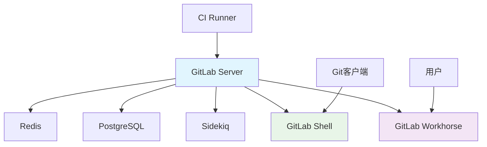

# GitLab CE

## 1. 概述

GitLab Community Edition (CE) 是一个开源的 DevOps 平台，提供完整的软件开发生命周期管理。它集成了代码托管、CI/CD、项目管理、监控等功能，是企业级的一站式 DevOps 解决方案。

## 2. 核心概念

### 2.1 架构组件


### 2.2 关键特性
- **完整DevOps平台**: 从计划到监控的全流程支持
- **内置CI/CD**: 强大的流水线功能
- **容器注册表**: 集成的Docker镜像仓库
- **代码质量**: 内置代码审查和质量检查
- **多项目管理**: 支持大规模团队协作

## 3. 安装与配置

### 3.1 Omnibus 包安装 (Ubuntu)
```bash
#!/bin/bash
# install-gitlab-ce.sh

# 安装依赖
sudo apt-get update
sudo apt-get install -y curl openssh-server ca-certificates tzdata perl

# 添加 GitLab 仓库
curl -sS https://packages.gitlab.com/install/repositories/gitlab/gitlab-ce/script.deb.sh | sudo bash

# 安装 GitLab CE
sudo EXTERNAL_URL="https://gitlab.example.com" apt-get install gitlab-ce

# 配置并启动
sudo gitlab-ctl reconfigure

# 查看初始密码
sudo cat /etc/gitlab/initial_root_password
```

### 3.2 Docker 安装
```yaml
# docker-compose.yml
version: '3.6'
services:
  web:
    image: 'gitlab/gitlab-ce:latest'
    restart: always
    hostname: 'gitlab.example.com'
    environment:
      GITLAB_OMNIBUS_CONFIG: |
        external_url 'https://gitlab.example.com'
        # 其他配置
    ports:
      - '80:80'
      - '443:443'
      - '22:22'
    volumes:
      - './gitlab/config:/etc/gitlab'
      - './gitlab/logs:/var/log/gitlab'
      - './gitlab/data:/var/opt/gitlab'
    networks:
      - gitlab-network

  runner:
    image: 'gitlab/gitlab-runner:latest'
    restart: always
    depends_on:
      - web
    volumes:
      - './runner/config:/etc/gitlab-runner'
      - '/var/run/docker.sock:/var/run/docker.sock'
    networks:
      - gitlab-network

networks:
  gitlab-network:
    driver: bridge
```

### 3.3 配置文件
```ruby
# /etc/gitlab/gitlab.rb
external_url 'https://gitlab.example.com'

# 数据库配置
gitlab_rails['db_adapter'] = 'postgresql'
gitlab_rails['db_encoding'] = 'unicode'
gitlab_rails['db_host'] = 'localhost'
gitlab_rails['db_port'] = 5432
gitlab_rails['db_username'] = 'gitlab'
gitlab_rails['db_password'] = 'your_password'

# Redis配置
redis['bind'] = '127.0.0.1'
redis['port'] = 6379

# 邮箱配置
gitlab_rails['smtp_enable'] = true
gitlab_rails['smtp_address'] = "smtp.gmail.com"
gitlab_rails['smtp_port'] = 587
gitlab_rails['smtp_user_name'] = "your_email@gmail.com"
gitlab_rails['smtp_password'] = "your_password"
gitlab_rails['smtp_domain'] = "gmail.com"
gitlab_rails['smtp_authentication'] = "login"
gitlab_rails['smtp_enable_starttls_auto'] = true

# 备份配置
gitlab_rails['backup_path'] = "/var/opt/gitlab/backups"
gitlab_rails['backup_keep_time'] = 604800

# 性能优化
puma['worker_processes'] = 4
sidekiq['max_concurrency'] = 20
```

## 4. 基本操作

### 4.1 管理员操作
```bash
# GitLab 服务管理
sudo gitlab-ctl start          # 启动所有服务
sudo gitlab-ctl stop           # 停止所有服务
sudo gitlab-ctl restart        # 重启所有服务
sudo gitlab-ctl status         # 查看服务状态

# 管理控制台
sudo gitlab-rake gitlab:check          # 系统检查
sudo gitlab-rake gitlab:env:info       # 环境信息
sudo gitlab-rake cache:clear           # 清理缓存

# 用户管理
sudo gitlab-rake gitlab:import:users["filename.csv"]  # 导入用户
```

### 4.2 API 操作
```bash
# 获取访问令牌
curl --request POST --data "grant_type=password&username=root&password=your_password" \
  "https://gitlab.example.com/oauth/token"

# 创建用户
curl --request POST --header "PRIVATE-TOKEN: your_access_token" \
  --data "email=user@example.com&password=password&username=user&name=User Name" \
  "https://gitlab.example.com/api/v4/users"

# 创建项目
curl --request POST --header "PRIVATE-TOKEN: your_access_token" \
  --data "name=my-project&visibility=private" \
  "https://gitlab.example.com/api/v4/projects"

# 获取项目列表
curl --header "PRIVATE-TOKEN: your_access_token" \
  "https://gitlab.example.com/api/v4/projects"
```

## 5. 仓库管理

### 5.1 项目配置
```bash
# 创建项目组
curl --request POST --header "PRIVATE-TOKEN: your_access_token" \
  --data "name=development&path=dev&visibility=private" \
  "https://gitlab.example.com/api/v4/groups"

# 配置 Webhook
curl --request POST --header "PRIVATE-TOKEN: your_access_token" \
  --header "Content-Type: application/json" \
  --data '{
    "url": "https://ci.example.com/webhook",
    "push_events": true,
    "merge_requests_events": true,
    "token": "secret_token"
  }' \
  "https://gitlab.example.com/api/v4/projects/1/hooks"

# 配置部署密钥
curl --request POST --header "PRIVATE-TOKEN: your_access_token" \
  --data "key=ssh-rsa your_public_key&title=My Deployment Key" \
  "https://gitlab.example.com/api/v4/projects/1/deploy_keys"
```

### 5.2 仓库维护
```bash
# 仓库垃圾回收
sudo gitlab-rake gitlab:cleanup:repos

# 检查仓库完整性
sudo gitlab-rake gitlab:git:fsck

# 迁移仓库
sudo gitlab-rake gitlab:import:repos["/path/to/old/repos"]

# 清理过期工件
sudo gitlab-rake gitlab:cleanup:artifacts
```

## 6. CI/CD 配置

### 6.1 Runner 注册
```bash
# 注册共享 Runner
sudo gitlab-runner register \
  --url "https://gitlab.example.com/" \
  --registration-token "PROJECT_REGISTRATION_TOKEN" \
  --description "docker-shared-runner" \
  --executor "docker" \
  --docker-image "alpine:latest" \
  --docker-volumes "/var/run/docker.sock:/var/run/docker.sock"

# 注册特定 Runner
sudo gitlab-runner register \
  --url "https://gitlab.example.com/" \
  --registration-token "PROJECT_SPECIFIC_TOKEN" \
  --description "shell-specific-runner" \
  --executor "shell" \
  --tag-list "shell,linux"

# 查看 Runner 状态
sudo gitlab-runner list
sudo gitlab-runner verify
```

### 6.2 .gitlab-ci.yml 配置
```yaml
# .gitlab-ci.yml
stages:
  - test
  - build
  - deploy

variables:
  DOCKER_HOST: tcp://docker:2375
  DOCKER_TLS_CERTDIR: ""

before_script:
  - apt-get update -qq && apt-get install -y -qq curl
  - docker info

test:
  stage: test
  script:
    - echo "Running tests..."
    - docker run --rm alpine echo "Tests completed"
  only:
    - branches

build:
  stage: build
  script:
    - docker build -t my-app:$CI_COMMIT_SHA .
    - docker tag my-app:$CI_COMMIT_SHA my-app:latest
  only:
    - main

deploy:
  stage: deploy
  script:
    - echo "Deploying to production..."
    - curl -X POST -H "Content-Type: application/json" -d '{"image":"my-app:latest"}' https://deploy.example.com
  environment:
    name: production
    url: https://my-app.example.com
  only:
    - main
  when: manual
```

## 7. 备份与恢复

### 7.1 自动备份配置
```bash
#!/bin/bash
# gitlab-backup.sh

# 配置变量
BACKUP_DIR="/var/opt/gitlab/backups"
RETENTION_DAYS=7
TIMESTAMP=$(date +%Y%m%d_%H%M%S)

# 创建备份
sudo gitlab-backup create

# 备份配置文件
sudo tar -czf ${BACKUP_DIR}/config_${TIMESTAMP}.tar.gz -C /etc/gitlab .

# 清理旧备份
find ${BACKUP_DIR} -name "*gitlab_backup.tar" -mtime +${RETENTION_DAYS} -delete
find ${BACKUP_DIR} -name "config_*.tar.gz" -mtime +${RETENTION_DAYS} -delete

# 上传到云存储（可选）
aws s3 sync ${BACKUP_DIR} s3://gitlab-backups/ --delete
```

### 7.2 恢复操作
```bash
#!/bin/bash
# gitlab-restore.sh

# 停止服务
sudo gitlab-ctl stop puma
sudo gitlab-ctl stop sidekiq

# 恢复备份
sudo gitlab-backup restore BACKUP=timestamp_of_backup

# 恢复配置文件
sudo tar -xzf config_timestamp.tar.gz -C /etc/gitlab

# 重新配置
sudo gitlab-ctl reconfigure
sudo gitlab-ctl restart

# 检查状态
sudo gitlab-rake gitlab:check SANITIZE=true
```

## 8. 高可用配置

### 8.1 数据库高可用
```ruby
# /etc/gitlab/gitlab.rb
# PostgreSQL 高可用
postgresql['listen_address'] = '0.0.0.0'
postgresql['port'] = 5432
postgresql['max_connections'] = 200
postgresql['shared_buffers'] = '256MB'

# 配置流复制
postgresql['wal_level'] = 'hot_standby'
postgresql['max_wal_senders'] = 5
postgresql['wal_keep_segments'] = 32
postgresql['hot_standby'] = 'on'
```

### 8.2 Redis 高可用
```ruby
# /etc/gitlab/gitlab.rb
# Redis 哨兵配置
redis['master_name'] = 'gitlab-redis'
redis['master_password'] = 'redis-password'
redis['sentinel_password'] = 'sentinel-password'

redis['sentinels'] = [
  { 'host' => 'redis1.example.com', 'port' => 26379 },
  { 'host' => 'redis2.example.com', 'port' => 26379 },
  { 'host' => 'redis3.example.com', 'port' => 26379 }
]
```

## 9. 监控与维护

### 9.1 健康检查
```bash
#!/bin/bash
# gitlab-healthcheck.sh

# 检查服务状态
services=("puma" "sidekiq" "postgresql" "redis" "nginx")
for service in "${services[@]}"; do
    if ! sudo gitlab-ctl status ${service} | grep -q "run"; then
        echo "服务 ${service} 异常"
        exit 1
    fi
done

# 检查端口监听
ports=("80" "443" "22" "8080")
for port in "${ports[@]}"; do
    if ! netstat -tln | grep -q ":${port}"; then
        echo "端口 ${port} 未监听"
        exit 1
    fi
done

# 检查API访问
if ! curl -f https://gitlab.example.com/api/v4/version > /dev/null 2>&1; then
    echo "GitLab API 不可访问"
    exit 1
fi

echo "GitLab 健康状态正常"
```

### 9.2 性能监控
```bash
#!/bin/bash
# gitlab-monitor.sh

# 监控资源使用
echo "CPU 使用率: $(top -bn1 | grep "Cpu(s)" | awk '{print $2}')%"
echo "内存使用: $(free -m | awk '/Mem:/ {print $3 "MB used / " $2 "MB total"}')"
echo "磁盘使用: $(df -h / | awk 'NR==2 {print $3 " used / " $2 " total"}')"

# 监控GitLab服务
sudo gitlab-ctl tail puma     # 查看Puma日志
sudo gitlab-ctl tail sidekiq  # 查看Sidekiq日志

# 监控队列长度
sudo gitlab-rake gitlab:sidekiq:monitor

# 清理日志文件
find /var/log/gitlab -name "*.log" -mtime +7 -delete
```

### 9.3 安全加固
```bash
#!/bin/bash
# gitlab-security.sh

# 更新系统
sudo apt-get update && sudo apt-get upgrade -y

# 配置防火墙
sudo ufw allow ssh
sudo ufw allow http
sudo ufw allow https
sudo ufw enable

# 配置SSL
sudo mkdir -p /etc/gitlab/ssl
sudo chmod 700 /etc/gitlab/ssl

# 生成自签名证书（生产环境建议使用Let's Encrypt）
sudo openssl req -x509 -nodes -days 365 -newkey rsa:2048 \
  -keyout /etc/gitlab/ssl/gitlab.example.com.key \
  -out /etc/gitlab/ssl/gitlab.example.com.crt

# 配置定期安全扫描
cat > /etc/cron.daily/gitlab-security << 'EOF'
#!/bin/bash
# 定期安全扫描
sudo gitlab-rake gitlab:check
sudo gitlab-rake gitlab:doctor:secrets
EOF

chmod +x /etc/cron.daily/gitlab-security
```
