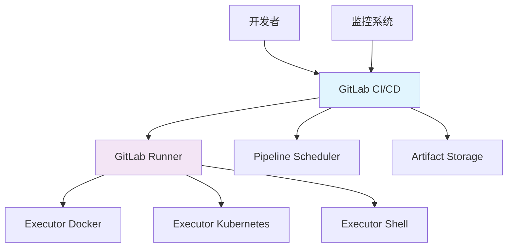

# GitLab CI/CD

## 1. 概述

GitLab CI/CD 是 GitLab 内置的持续集成和持续交付工具，提供从代码提交到生产部署的全流程自动化。它使用基于 YAML 的配置文件 `.gitlab-ci.yml` 来定义流水线，支持 Docker、Kubernetes 等多种运行环境。

## 2. 核心概念

### 2.1 架构组件


### 2.2 关键特性
- **内置集成**: 与 GitLab 代码仓库无缝集成
- **多 Runner 支持**: Docker, Kubernetes, Shell, SSH 等执行器
- **灵活流水线**: 多阶段、并行执行、手动触发
- **安全扫描**: 内置 SAST、DAST、依赖扫描
- **环境管理**: 多环境部署、变量管理、权限控制

## 3. Runner 配置

### 3.1 Docker Runner 注册
```bash
#!/bin/bash
# register-docker-runner.sh

# 安装 GitLab Runner
curl -L https://packages.gitlab.com/install/repositories/runner/gitlab-runner/script.deb.sh | sudo bash
sudo apt-get install gitlab-runner

# 注册 Docker Runner
sudo gitlab-runner register \
  --non-interactive \
  --url "https://gitlab.example.com/" \
  --registration-token "PROJECT_REGISTRATION_TOKEN" \
  --executor "docker" \
  --docker-image "alpine:latest" \
  --description "docker-runner" \
  --tag-list "docker,linux" \
  --run-untagged="true" \
  --locked="false"

# 配置 Docker 权限
sudo usermod -aG docker gitlab-runner

# 重启服务
sudo systemctl restart gitlab-runner
```

### 3.2 Kubernetes Runner 配置
```yaml
# values.yaml
gitlabUrl: https://gitlab.example.com/
runnerRegistrationToken: "PROJECT_REGISTRATION_TOKEN"
concurrent: 10
checkInterval: 30
rbac:
  create: true
metrics:
  enabled: true
runners:
  config: |
    [[runners]]
      [runners.kubernetes]
        namespace = "gitlab-runner"
        image = "alpine:3.12"
        privileged = true
        [[runners.kubernetes.volumes]]
          name = "docker-sock"
          mount_path = "/var/run/docker.sock"
          read_only = true
        [[runners.kubernetes.volumes]]
          name = "build-cache"
          mount_path = "/cache"
  cache:
    secretName: gitlab-runner-cache
  tags: "kubernetes,docker"
```

## 4. 流水线配置

### 4.1 基础流水线模板
```yaml
# .gitlab-ci.yml
image: alpine:3.14

stages:
  - test
  - build
  - deploy
  - cleanup

variables:
  DOCKER_HOST: tcp://docker:2375
  DOCKER_TLS_CERTDIR: ""
  MAVEN_OPTS: "-Dmaven.repo.local=.m2/repository"

before_script:
  - echo "Starting pipeline for $CI_PROJECT_NAME"
  - export PIPELINE_ID=$CI_PIPELINE_ID

after_script:
  - echo "Cleaning up resources"
  - docker system prune -f || true

.test_template: &test_template
  stage: test
  tags:
    - docker
  script:
    - echo "Running tests for $CI_PROJECT_NAME"
    - docker run --rm alpine echo "Test completed"
  artifacts:
    when: always
    reports:
      junit: test-results.xml
    paths:
      - test-results/
    expire_in: 1 week

.build_template: &build_template
  stage: build
  tags:
    - docker
  script:
    - echo "Building project $CI_PROJECT_NAME"
    - docker build -t $CI_REGISTRY_IMAGE:$CI_COMMIT_SHA .
  artifacts:
    paths:
      - target/
      - docker/
    expire_in: 2 weeks

.deploy_template: &deploy_template
  stage: deploy
  tags:
    - kubernetes
  environment:
    name: production
    url: https://$CI_PROJECT_NAME.example.com
  script:
    - echo "Deploying to $CI_ENVIRONMENT_NAME"
    - kubectl set image deployment/$CI_PROJECT_NAME $CI_PROJECT_NAME=$CI_REGISTRY_IMAGE:$CI_COMMIT_SHA
  when: manual
  only:
    - main
```

### 4.2 多项目流水线
```yaml
# .gitlab-ci.yml
include:
  - project: 'devops/ci-templates'
    file: '/templates/docker-build.yml'
    ref: main
  - project: 'devops/ci-templates'
    file: '/templates/kubernetes-deploy.yml'
    ref: main
  - local: '/templates/security-scan.yml'

stages:
  - pre-test
  - test
  - build
  - security-scan
  - deploy
  - post-deploy

variables:
  GROUP_VAR: "group-value"
  PROJECT_VAR: "project-value"

workflow:
  rules:
    - if: $CI_COMMIT_TAG
      variables:
        DEPLOY_ENV: "production"
    - if: $CI_COMMIT_BRANCH == "main"
      variables:
        DEPLOY_ENV: "staging"
    - if: $CI_COMMIT_BRANCH =~ /^feature/
      variables:
        DEPLOY_ENV: "development"

default:
  image: docker:20.10
  services:
    - docker:20.10-dind
  before_script:
    - docker info
    - echo "Running job $CI_JOB_NAME"
```

## 5. 高级流水线功能

### 5.1 动态环境创建
```yaml
# .gitlab-ci.yml
deploy_review:
  stage: deploy
  script:
    - echo "Deploying review app for $CI_COMMIT_REF_SLUG"
    - ./deploy-review.sh
  environment:
    name: review/$CI_COMMIT_REF_SLUG
    url: https://$CI_COMMIT_REF_SLUG.$KUBE_INGRESS_BASE_DOMAIN
    on_stop: stop_review
  rules:
    - if: $CI_COMMIT_BRANCH =~ /^feature/
      when: manual

stop_review:
  stage: deploy
  script:
    - echo "Stopping review app for $CI_COMMIT_REF_SLUG"
    - ./stop-review.sh
  environment:
    name: review/$CI_COMMIT_REF_SLUG
    action: stop
  when: manual
  rules:
    - if: $CI_COMMIT_BRANCH =~ /^feature/
      when: manual
```

### 5.2 父子流水线
```yaml
# .gitlab-ci.yml
trigger_job:
  stage: test
  trigger:
    include: child-pipeline.yml
    strategy: depend
  rules:
    - if: $CI_COMMIT_BRANCH == "main"

# child-pipeline.yml
stages:
  - build
  - test

build_job:
  stage: build
  script: echo "Building in child pipeline"

test_job:
  stage: test
  script: echo "Testing in child pipeline"
```

## 6. 安全扫描集成

### 6.1 安全扫描配置
```yaml
# .gitlab-ci.yml
include:
  - template: Security/SAST.gitlab-ci.yml
  - template: Security/DAST.gitlab-ci.yml
  - template: Security/Dependency-Scanning.gitlab-ci.yml
  - template: Security/Container-Scanning.gitlab-ci.yml

variables:
  SAST_EXCLUDED_PATHS: "spec, test, tests, tmp"
  DAST_WEBSITE: "https://example.com"
  DS_EXCLUDED_PATHS: "vendor, node_modules"
  CS_IMAGE: "$CI_REGISTRY_IMAGE:$CI_COMMIT_SHA"

sast:
  stage: test
  rules:
    - if: $CI_COMMIT_BRANCH == "main"

dast:
  stage: test
  rules:
    - if: $CI_COMMIT_BRANCH == "main"

dependency_scanning:
  stage: test
  rules:
    - if: $CI_COMMIT_BRANCH == "main"

container_scanning:
  stage: test
  rules:
    - if: $CI_COMMIT_BRANCH == "main"
```

### 6.2 自定义安全规则
```yaml
# security-rules.yml
sast:
  variables:
    SAST_BANDIT_EXCLUDED_PATHS: "tests,test"
    SAST_EXCLUDED_PATHS: "vendor,node_modules"
  script:
    - echo "Running custom SAST scan"
    - bandit -r . -x tests/

custom_scan:
  stage: test
  image: python:3.9
  script:
    - pip install safety bandit
    - safety check --full-report
    - bandit -r . -f json -o bandit-report.json
  artifacts:
    reports:
      sast: bandit-report.json
    paths:
      - safety-report.txt
  rules:
    - if: $CI_COMMIT_BRANCH == "main"
```

## 7. 部署策略

### 7.1 Kubernetes 部署
```yaml
# .gitlab-ci.yml
deploy_production:
  stage: deploy
  image: bitnami/kubectl:latest
  script:
    - |
      kubectl apply -f - <<EOF
      apiVersion: apps/v1
      kind: Deployment
      metadata:
        name: $CI_PROJECT_NAME
        namespace: production
      spec:
        replicas: 3
        selector:
          matchLabels:
            app: $CI_PROJECT_NAME
        template:
          metadata:
            labels:
              app: $CI_PROJECT_NAME
          spec:
            containers:
            - name: $CI_PROJECT_NAME
              image: $CI_REGISTRY_IMAGE:$CI_COMMIT_SHA
              ports:
              - containerPort: 8080
              resources:
                requests:
                  cpu: 100m
                  memory: 128Mi
                limits:
                  cpu: 500m
                  memory: 512Mi
      EOF
    - kubectl rollout status deployment/$CI_PROJECT_NAME -n production
  environment:
    name: production
    url: https://$CI_PROJECT_NAME.example.com
  only:
    - main
```

### 7.2 蓝绿部署
```yaml
# .gitlab-ci.yml
deploy_blue:
  stage: deploy
  script:
    - ./deploy-blue.sh
  environment:
    name: blue
    url: https://blue.example.com

deploy_green:
  stage: deploy
  script:
    - ./deploy-green.sh
  environment:
    name: green
    url: https://green.example.com

switch_traffic:
  stage: deploy
  script:
    - ./switch-traffic.sh
  environment:
    name: production
    url: https://example.com
  when: manual
```

## 8. 监控与优化

### 8.1 性能监控
```yaml
# .gitlab-ci.yml
monitor_performance:
  stage: test
  script:
    - |
      echo "Monitoring performance metrics"
      docker run --rm \
        -v $(pwd):/app \
        -w /app \
        node:16 \
        npm run test:performance
  artifacts:
    reports:
      performance: performance.json
    paths:
      - performance-report/
  rules:
    - if: $CI_COMMIT_BRANCH == "main"

optimize_build:
  stage: build
  script:
    - |
      echo "Optimizing build process"
      docker build \
        --cache-from $CI_REGISTRY_IMAGE:latest \
        -t $CI_REGISTRY_IMAGE:$CI_COMMIT_SHA .
  cache:
    key: docker-cache
    paths:
      - .docker-cache/
  rules:
    - if: $CI_COMMIT_BRANCH == "main"
```

### 8.2 资源清理
```yaml
# .gitlab-ci.yml
cleanup_artifacts:
  stage: cleanup
  script:
    - |
      echo "Cleaning up old artifacts"
      docker system prune -af
      rm -rf node_modules/ vendor/
  rules:
    - if: $CI_COMMIT_BRANCH == "main"
    - when: manual

cleanup_environments:
  stage: cleanup
  script:
    - |
      echo "Cleaning up old environments"
      ./cleanup-environments.sh
  rules:
    - if: $CI_COMMIT_BRANCH == "main"
    - when: weekly
```

## 9. 故障排除与调试

### 9.1 调试配置
```yaml
# .gitlab-ci.yml
debug_job:
  stage: test
  script:
    - |
      echo "Debug information:"
      echo "CI variables:"
      env | grep CI_ | sort
      echo "Docker info:"
      docker info
      echo "Disk usage:"
      df -h
  rules:
    - when: manual

troubleshoot:
  stage: test
  script:
    - |
      echo "Troubleshooting pipeline issues"
      ./troubleshoot.sh
  rules:
    - when: manual
    - if: $CI_DEBUG_TRACE == "true"
```

### 9.2 日志收集
```yaml
# .gitlab-ci.yml
collect_logs:
  stage: cleanup
  script:
    - |
      echo "Collecting system logs"
      docker logs $(docker ps -q) > docker-logs.txt 2>&1 || true
      kubectl get pods -A > k8s-status.txt
  artifacts:
    when: always
    paths:
      - docker-logs.txt
      - k8s-status.txt
    expire_in: 1 week
  rules:
    - if: $CI_JOB_STATUS == 'failed'
```
