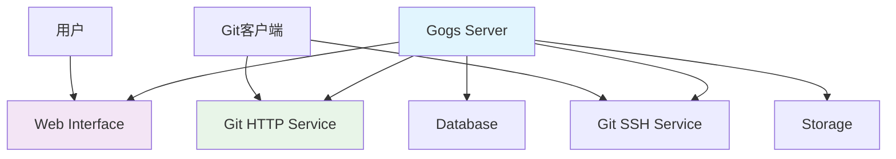

# Gogs

## 1. 概述

Gogs (Go Git Service) 是一个用 Go 语言编写的轻量级、开源的 Git 服务。它设计简单易用，资源占用低，适合个人开发者和小团队使用。Gogs 提供了类似 GitHub 的功能，包括代码托管、Pull Request、Issue 跟踪等。

## 2. 核心概念

### 2.1 架构组件


### 2.2 关键特性
- **轻量级**: 单二进制文件部署，资源占用极低
- **简单易用**: 安装配置简单，学习成本低
- **跨平台**: 支持 Windows、Linux、macOS
- **多数据库**: 支持 SQLite、MySQL、PostgreSQL
- **低要求**: 最低配置要求，适合低性能设备

## 3. 安装与配置

### 3.1 二进制安装
```bash
#!/bin/bash
# install-gogs.sh

# 创建系统用户
sudo adduser \
   --system \
   --shell /bin/bash \
   --gecos 'Git Service' \
   --group \
   --disabled-password \
   --home /home/git \
   git

# 下载 Gogs
cd /tmp
wget https://dl.gogs.io/0.12.3/gogs_0.12.3_linux_amd64.tar.gz
tar -xzf gogs_0.12.3_linux_amd64.tar.gz
sudo mv gogs /home/git/
sudo chown -R git:git /home/git/gogs

# 创建数据目录
sudo mkdir -p /var/lib/gogs/{data,log,custom}
sudo chown -R git:git /var/lib/gogs

# 创建配置文件
sudo tee /home/git/gogs/custom/conf/app.ini << 'EOF'
APP_NAME = Gogs
RUN_USER = git
RUN_MODE = prod

[server]
DOMAIN           = localhost
HTTP_PORT        = 3000
ROOT_URL         = http://localhost:3000/
DISABLE_SSH      = false
SSH_PORT         = 22
START_SSH_SERVER = false
OFFLINE_MODE     = false

[database]
DB_TYPE  = sqlite3
PATH     = /var/lib/gogs/data/gogs.db

[repository]
ROOT = /var/lib/gogs/data/repositories

[session]
PROVIDER = file

[picture]
AVATAR_UPLOAD_PATH = /var/lib/gogs/data/avatars

[attachment]
PATH = /var/lib/gogs/data/attachments

[log]
ROOT_PATH = /var/lib/gogs/log
MODE      = file
LEVEL     = Info
EOF

sudo chown -R git:git /home/git/gogs/custom
```

### 3.2 Docker 安装
```yaml
# docker-compose.yml
version: '3'

services:
  gogs:
    image: gogs/gogs:0.12
    container_name: gogs
    restart: always
    ports:
      - "3000:3000"
      - "10022:22"
    volumes:
      - ./gogs/data:/data
      - ./gogs/logs:/var/log/gogs
      - /etc/timezone:/etc/timezone:ro
      - /etc/localtime:/etc/localtime:ro
    environment:
      - TZ=Asia/Shanghai
    networks:
      - gogs-network

networks:
  gogs-network:
    driver: bridge
```

### 3.3 Systemd 服务配置
```ini
# /etc/systemd/system/gogs.service
[Unit]
Description=Gogs (Go Git Service)
After=syslog.target
After=network.target
After=postgresql.service
After=mysql.service
After=redis.service

[Service]
Type=simple
User=git
Group=git
WorkingDirectory=/home/git/gogs
ExecStart=/home/git/gogs/gogs web
Restart=always
Environment=USER=git HOME=/home/git

[Install]
WantedBy=multi-user.target
```

## 4. 基本操作

### 4.1 首次安装配置
```bash
# 启动 Gogs 服务
sudo systemctl daemon-reload
sudo systemctl enable gogs
sudo systemctl start gogs

# 访问安装页面
echo "访问 http://your-server-ip:3000 完成初始配置"

# 查看服务状态
sudo systemctl status gogs
sudo journalctl -u gogs -f
```

### 4.2 管理员操作
```bash
# 进入 Gogs 安装目录
cd /home/git/gogs

# 使用 Gogs 命令行工具
./gogs admin create-user --name admin --password admin123 --email admin@example.com --admin
./gogs admin list-users
./gogs admin delete-user --id 1

# 备份和恢复
./gogs dump -t tar.gz -o gogs-backup.tar.gz
./gogs restore --from gogs-backup.tar.gz
```

## 5. 配置文件详解

### 5.1 主要配置选项
```ini
# app.ini
[server]
PROTOCOL         = http
DOMAIN           = git.example.com
HTTP_PORT        = 3000
ROOT_URL         = https://git.example.com:3000/
DISABLE_SSH      = false
SSH_PORT         = 22
SSH_ROOT_PATH    = /home/git/.ssh
START_SSH_SERVER = false
OFFLINE_MODE     = false

[database]
DB_TYPE  = mysql
HOST     = 127.0.0.1:3306
NAME     = gogs
USER     = gogs
PASSWD   = your_password
SSL_MODE = disable
PATH     = data/gogs.db

[repository]
ROOT = /var/lib/gogs/data/repositories

[mailer]
ENABLED = true
HOST    = smtp.gmail.com:587
FROM    = your-email@gmail.com
USER    = your-email@gmail.com
PASSWD  = your-password

[service]
REGISTER_EMAIL_CONFIRM = false
ENABLE_NOTIFY_MAIL     = true
DISABLE_REGISTRATION   = false
REQUIRE_SIGNIN_VIEW    = false
ENABLE_CAPTCHA         = true

[picture]
DISABLE_GRAVATAR        = false
ENABLE_FEDERATED_AVATAR = false

[session]
PROVIDER = file

[log]
MODE      = file
LEVEL     = Info
ROOT_PATH = /var/lib/gogs/log

[security]
INSTALL_LOCK = true
SECRET_KEY   = your-secret-key
```
```

### 5.2 数据库配置示例
```ini
# SQLite 配置
[database]
DB_TYPE = sqlite3
PATH    = /var/lib/gogs/data/gogs.db

# MySQL 配置  
[database]
DB_TYPE  = mysql
HOST     = 127.0.0.1:3306
NAME     = gogs
USER     = gogs
PASSWD   = your-mysql-password
SSL_MODE = disable

# PostgreSQL 配置
[database]
DB_TYPE  = postgres
HOST     = 127.0.0.1:5432
NAME     = gogs
USER     = gogs
PASSWD   = your-postgres-password
SSL_MODE = disable
```

## 6. 仓库管理

### 6.1 创建和管理仓库
```bash
# 通过 API 创建仓库
curl -X POST "http://localhost:3000/api/v1/user/repos" \
  -H "Authorization: token your-access-token" \
  -H "Content-Type: application/json" \
  -d '{
    "name": "my-project",
    "description": "My awesome project",
    "private": false,
    "auto_init": true,
    "gitignores": "Node",
    "license": "MIT",
    "readme": "Default"
  }'

# 获取用户仓库列表
curl -X GET "http://localhost:3000/api/v1/user/repos" \
  -H "Authorization: token your-access-token"

# 迁移外部仓库
curl -X POST "http://localhost:3000/api/v1/repos/migrate" \
  -H "Authorization: token your-access-token" \
  -H "Content-Type: application/json" \
  -d '{
    "clone_addr": "https://github.com/username/repo.git",
    "auth_username": "username",
    "auth_password": "password",
    "uid": 1,
    "repo_name": "migrated-repo",
    "mirror": false,
    "private": false
  }'
```

### 6.2 Webhook 配置
```bash
# 创建 Webhook
curl -X POST "http://localhost:3000/api/v1/repos/username/reponame/hooks" \
  -H "Authorization: token your-access-token" \
  -H "Content-Type: application/json" \
  -d '{
    "type": "gogs",
    "config": {
      "url": "https://ci.example.com/webhook",
      "content_type": "json",
      "secret": "webhook-secret"
    },
    "events": [
      "push",
      "pull_request"
    ],
    "active": true
  }'

# 测试 Webhook
curl -X POST "http://localhost:3000/api/v1/repos/username/reponame/hooks/1/test" \
  -H "Authorization: token your-access-token"
```

## 7. 用户和权限管理

### 7.1 用户管理 API
```bash
# 创建用户
curl -X POST "http://localhost:3000/api/v1/admin/users" \
  -H "Authorization: token your-access-token" \
  -H "Content-Type: application/json" \
  -d '{
    "login_name": "newuser",
    "username": "newuser",
    "email": "newuser@example.com",
    "password": "password123",
    "send_notify": true
  }'

# 获取用户列表
curl -X GET "http://localhost:3000/api/v1/admin/users?page=1&limit=10" \
  -H "Authorization: token your-access-token"

# 编辑用户
curl -X PATCH "http://localhost:3000/api/v1/admin/users/1" \
  -H "Authorization: token your-access-token" \
  -H "Content-Type: application/json" \
  -d '{
    "login_name": "updateduser",
    "full_name": "Updated User",
    "email": "updated@example.com",
    "website": "https://example.com",
    "location": "City, Country"
  }'

# 删除用户
curl -X DELETE "http://localhost:3000/api/v1/admin/users/1" \
  -H "Authorization: token your-access-token"
```

### 7.2 组织和管理
```bash
# 创建组织
curl -X POST "http://localhost:3000/api/v1/orgs" \
  -H "Authorization: token your-access-token" \
  -H "Content-Type: application/json" \
  -d '{
    "username": "myorg",
    "full_name": "My Organization",
    "description": "Organization description",
    "website": "https://example.com",
    "location": "City, Country"
  }'

# 添加组织成员
curl -X PUT "http://localhost:3000/api/v1/orgs/myorg/members/username" \
  -H "Authorization: token your-access-token"

# 创建团队
curl -X POST "http://localhost:3000/api/v1/orgs/myorg/teams" \
  -H "Authorization: token your-access-token" \
  -H "Content-Type: application/json" \
  -d '{
    "name": "developers",
    "description": "Development team",
    "permission": "write",
    "includes_all_repositories": false
  }'
```

## 8. 备份与恢复

### 8.1 自动备份脚本
```bash
#!/bin/bash
# gogs-backup.sh

set -e

# 配置变量
BACKUP_DIR="/backup/gogs"
RETENTION_DAYS=30
TIMESTAMP=$(date +%Y%m%d_%H%M%S)
BACKUP_FILE="${BACKUP_DIR}/gogs-backup-${TIMESTAMP}.tar.gz"

# 创建备份目录
mkdir -p "${BACKUP_DIR}"

# 停止 Gogs 服务
sudo systemctl stop gogs

# 执行备份
cd /home/git/gogs
./gogs dump -t tar.gz -o "${BACKUP_FILE}"

# 备份配置文件
sudo tar -czf ${BACKUP_DIR}/config_${TIMESTAMP}.tar.gz -C /home/git/gogs/custom .

# 启动 Gogs 服务
sudo systemctl start gogs

# 清理旧备份
find "${BACKUP_DIR}" -name "gogs-backup-*.tar.gz" -mtime +${RETENTION_DAYS} -delete
find "${BACKUP_DIR}" -name "config_*.tar.gz" -mtime +${RETENTION_DAYS} -delete

echo "备份完成: ${BACKUP_FILE}"

# 上传到云存储（可选）
# aws s3 cp "${BACKUP_FILE}" "s3://my-backup-bucket/gogs/"
```

### 8.2 恢复脚本
```bash
#!/bin/bash
# gogs-restore.sh

set -e

# 配置变量
BACKUP_FILE="/backup/gogs/gogs-backup-20230101_120000.tar.gz"

# 停止 Gogs 服务
sudo systemctl stop gogs

# 执行恢复
cd /home/git/gogs
./gogs restore --from "${BACKUP_FILE}"

# 恢复配置文件（如果需要）
# sudo tar -xzf /backup/gogs/config_20230101_120000.tar.gz -C /home/git/gogs/custom

# 设置权限
sudo chown -R git:git /home/git/gogs
sudo chown -R git:git /var/lib/gogs

# 启动 Gogs 服务
sudo systemctl start gogs

echo "恢复完成"
```

## 9. 监控与维护

### 9.1 健康检查
```bash
#!/bin/bash
# gogs-healthcheck.sh

# 检查服务状态
if ! systemctl is-active --quiet gogs; then
    echo "Gogs 服务未运行"
    exit 1
fi

# 检查端口监听
if ! netstat -tln | grep -q :3000; then
    echo "Gogs 未监听端口 3000"
    exit 1
fi

# 检查 API 访问
if ! curl -f http://localhost:3000/api/v1/version > /dev/null 2>&1; then
    echo "Gogs API 不可访问"
    exit 1
fi

# 检查磁盘空间
DISK_USAGE=$(df /var/lib/gogs | awk 'NR==2 {print $5}' | sed 's/%//')
if [ "$DISK_USAGE" -gt 90 ]; then
    echo "磁盘空间不足: ${DISK_USAGE}%"
    exit 1
fi

echo "Gogs 健康状态正常"
exit 0
```

### 9.2 日志监控
```bash
#!/bin/bash
# gogs-log-monitor.sh

# 监控错误日志
tail -f /var/lib/gogs/log/gogs.log | grep -E "(ERROR|FATAL)"

# 监控访问日志
tail -f /var/lib/gogs/log/access.log | grep -E "(5[0-9]{2}|4[0-9]{2})"

# 自动日志轮转
cat > /etc/logrotate.d/gogs << 'EOF'
/var/lib/gogs/log/*.log {
    daily
    missingok
    rotate 30
    compress
    delaycompress
    notifempty
    create 640 git git
    sharedscripts
    postrotate
        systemctl reload gogs > /dev/null 2>&1 || true
    endscript
}
EOF

chmod +x /etc/logrotate.d/gogs
```

### 9.3 性能优化配置
```ini
# app.ini 性能优化部分
[server]
PROTOCOL = http
DOMAIN   = git.example.com
HTTP_PORT = 3000
ROOT_URL = https://git.example.com:3000/

[database]
DB_TYPE = mysql
HOST    = 127.0.0.1:3306
NAME    = gogs
USER    = gogs
PASSWD  = your-password

[repository]
ROOT = /var/lib/gogs/data/repositories

[cache]
ADAPTER = memory
INTERVAL = 60

[session]
PROVIDER = file
```
