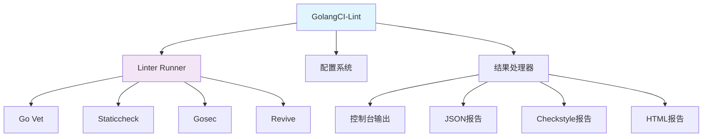

# GolangCI-Lint

## 1. 概述

GolangCI-Lint 是一个 Go 语言的快速、并行、高效的 linter 聚合器，集成了 50+ 个 Go linters，提供统一的配置和运行方式，适合在 CI/CD 流程中使用。

## 2. 核心特性

### 2.1 架构设计


### 2.2 关键优势
- **高性能**: 并行运行 linters，比单独运行快 5-10 倍
- **全面性**: 集成 50+ 个主流 Go linters
- **易用性**: 单一二进制，简单配置
- **灵活性**: 支持自定义 linter 组合
- **CI友好**: 内置多种输出格式，易于集成
- **现代化**: 支持 Go Modules，持续更新

## 3. 安装与配置

### 3.1 安装方法
```bash
#!/bin/bash
# install-golangci-lint.sh

# 方法1: 使用 curl 安装
curl -sSfL https://raw.githubusercontent.com/golangci/golangci-lint/master/install.sh | sh -s -- -b $(go env GOPATH)/bin v1.55.2

# 方法2: 使用 go install
go install github.com/golangci/golangci-lint/cmd/golangci-lint@v1.55.2

# 方法3: 使用包管理器
# macOS
brew install golangci/tap/golangci-lint
# Ubuntu/Debian
sudo apt-get install golangci-lint
# Arch Linux
pacman -S golangci-lint

# 验证安装
golangci-lint --version
```

### 3.2 基础配置
```yaml
# .golangci.yml
run:
  # 并发数
  concurrency: 4
  
  # 超时设置
  timeout: 5m
  
  # 要分析的模块
  modules-download-mode: readonly
  
  # 要检查的目录
  issues-exit-code: 1
  tests: true
  skip-dirs:
    - vendor
    - testdata
    - generated
  skip-files:
    - ".*\\.pb\\.go"
    - ".*\\_generated\\.go"

output:
  # 输出格式
  format: colored-line-number
  
  # 打印问题数量
  print-issued-lines: true
  print-linter-name: true

linters:
  # 启用/禁用 linters
  enable:
    - bodyclose
    - deadcode
    - depguard
    - dogsled
    - errcheck
    - goconst
    - gocritic
    - gofmt
    - goimports
    - gosec
    - govet
    - ineffassign
    - staticcheck
    - typecheck
    - unused
    - varcheck
  
  disable:
    - lll
    - wsl
  
  # 预设配置
  presets:
    - bugs
    - unused
    - performance
    - style

linters-settings:
  goconst:
    min-len: 3
    min-occurrences: 3
  
  gocyclo:
    min-complexity: 15
  
  goimports:
    local-prefixes: github.com/your/project
  
  gosec:
    excludes:
      - G101 # Look for hard coded credentials
      - G404 # Insecure random number source (rand)
  
  govet:
    check-shadowing: true
  
  staticcheck:
    checks:
      - all
      - -ST1000 # Disable capitalization checks
      - -SA1019 # Disable deprecation warnings

issues:
  # 排除特定问题
  exclude-rules:
    - path: _test\\.go
      linters:
        - gocyclo
        - dupl
    
    - path: internal/.*
      linters:
        - gosec
      text: "G104"
    
    - path: generated/.*
      linters:
        - all
```

## 4. 基本使用

### 4.1 命令行使用
```bash
#!/bin/bash
# golangci-lint-usage.sh

# 检查当前目录
golangci-lint run

# 检查特定目录
golangci-lint run ./cmd/... ./pkg/...

# 快速检查 (不缓存)
golangci-lint run --fast

# 显示统计信息
golangci-lint run --out-format=tab --print-issued-lines=false

# 只显示新问题
golangci-lint run --new-from-rev=main

# 指定配置文件
golangci-lint run -c .golangci.prod.yml

# 修复可自动修复的问题
golangci-lint run --fix

# 输出为JSON格式
golangci-lint run --out-format=json > report.json

# 输出为Checkstyle格式
golangci-lint run --out-format=checkstyle > report.xml

# 列出所有可用linters
golangci-lint linters

# 查看帮助
golangci-lint help run
```

### 4.2 常用选项
```bash
# 性能优化选项
golangci-lint run --concurrency=8 --timeout=10m

# 内存限制
golangci-lint run --mem-profile-path=mem.prof --cpu-profile-path=cpu.prof

# 排除测试文件
golangci-lint run --skip-files=".*_test.go"

# 只运行特定linter
golangci-lint run --disable-all -E errcheck -E gosec

# 忽略特定错误
golangci-lint run --exclude="Error return value of .* is not checked"

# 显示详细输出
golangci-lint run -v
```

## 5. CI/CD 集成

### 5.1 GitHub Actions 集成
```yaml
# .github/workflows/golangci-lint.yml
name: Lint

on:
  push:
    branches: [ main, develop ]
  pull_request:
    branches: [ main ]

jobs:
  golangci:
    name: lint
    runs-on: ubuntu-latest
    steps:
      - uses: actions/checkout@v3
      - uses: actions/setup-go@v3
        with:
          go-version: '1.20'
      
      - name: Install golangci-lint
        run: |
          curl -sSfL https://raw.githubusercontent.com/golangci/golangci-lint/master/install.sh | sh -s -- -b $(go env GOPATH)/bin v1.55.2
      
      - name: Run golangci-lint
        run: |
          $(go env GOPATH)/bin/golangci-lint run --out-format=github-actions --timeout=10m
        env:
          GITHUB_TOKEN: ${{ secrets.GITHUB_TOKEN }}
      
      - name: Upload report
        uses: actions/upload-artifact@v3
        with:
          name: lint-report
          path: |
            report.json
            report.xml
```

### 5.2 GitLab CI 集成
```yaml
# .gitlab-ci.yml
stages:
  - test
  - lint

golangci-lint:
  stage: lint
  image: golang:1.20
  variables:
    GOPATH: "$CI_PROJECT_DIR/.go"
    GOCACHE: "$CI_PROJECT_DIR/.cache/go-build"
    GOLANGCI_LINT_CACHE: "$CI_PROJECT_DIR/.cache/golangci-lint"
  before_script:
    - mkdir -p $GOPATH $GOCACHE $GOLANGCI_LINT_CACHE
    - export PATH=$GOPATH/bin:$PATH
    - curl -sSfL https://raw.githubusercontent.com/golangci/golangci-lint/master/install.sh | sh -s -- -b $GOPATH/bin v1.55.2
  script:
    - golangci-lint run --out-format=checkstyle > report.xml
  artifacts:
    reports:
      junit: report.xml
    paths:
      - report.xml
    expire_in: 1 week
```

## 6. 高级配置

### 6.1 自定义 linter 设置
```yaml
# .golangci.yml
linters-settings:
  errcheck:
    # 检查所有错误
    check-type-assertions: true
    check-blank: true
    ignore: |
      fmt:.*
      io:Close
      os:Close
  
  gocritic:
    # 启用更多检查
    enabled-checks:
      - hugeParam
      - rangeExprCopy
      - sloppyReassign
    disabled-checks:
      - whyNoLint
  
  govet:
    enable:
      - shadow
      - composites
    disable:
      - unsafeptr
  
  gosec:
    # 安全扫描配置
    excludes:
      - G101 # 硬编码凭证
      - G104 # 未检查的错误
      - G204 # 子进程执行
    config:
      global:
        nosec: true
        audit: true
  
  staticcheck:
    go: "1.20"
    checks:
      - all
      - -SA1019 # 忽略废弃API警告
  
  unused:
    check-exported: true
```

### 6.2 问题排除规则
```yaml
# .golangci.yml
issues:
  exclude-use-default: false
  
  # 全局排除
  exclude:
    - "Error return value of .* is not checked"
    - "declaration of .* shadows"
  
  # 基于路径的排除规则
  exclude-rules:
    - path: _test\\.go
      linters:
        - gocyclo
        - dupl
    
    - path: internal/mocks/.*
      linters:
        - all
    
    - path: pkg/legacy/.*
      text: "deprecated"
      source: "// TODO: remove in v2"
    
    - path: cmd/server/.*
      linters:
        - gosec
      text: "G204"
    
    - path: proto/.*
      linters:
        - govet
      text: "composites"
```

## 7. 性能优化

### 7.1 大型项目优化
```yaml
# .golangci.yml
run:
  concurrency: 8
  timeout: 15m
  memory-settings:
    # 内存限制
    max-same-issues: 30
    max-from-linter: 50
    max-issues-per-linter: 100
    max-issues: 500
  
  # 增量检查
  new: true
  new-from-rev: origin/main
  new-from-patch: path/to/patch
  
  # 缓存配置
  cache: true
  cache-dir: .cache/golangci-lint
  cache-ttl: 8760h # 1年

# 只检查变更文件
skip-dirs-use-default: true
skip-files-use-default: true
skip-dirs:
  - vendor
  - testdata
  - generated
  - third_party
```

### 7.2 并行化配置
```bash
#!/bin/bash
# run-parallel-lint.sh

# 分模块并行检查
MODULES=$(go list ./... | grep -v vendor)
parallel -j 4 --halt-on-error 1 golangci-lint run {} ::: $MODULES

# 或者使用 xargs
go list ./... | grep -v vendor | xargs -P 4 -n 1 golangci-lint run
```

## 8. 常用 linters 详解

### 8.1 代码质量类
```markdown
### errcheck
- **功能**: 检查未处理的错误返回
- **配置**:
  ```yaml
  linters-settings:
    errcheck:
      check-type-assertions: true
      check-blank: true
      ignore: "fmt:.*,io:Close"
  ```

### gocritic
- **功能**: 高级代码质量检查
- **重要检查项**:
  - `hugeParam`: 大对象应该用指针传递
  - `rangeValCopy`: range循环中不必要的值拷贝
  - `sloppyReassign`: 冗余的变量重新赋值
- **配置**:
  ```yaml
  linters-settings:
    gocritic:
      enabled-checks:
        - hugeParam
        - rangeValCopy
  ```

### gocyclo
- **功能**: 检查函数复杂度
- **配置**:
  ```yaml
  linters-settings:
    gocyclo:
      min-complexity: 15  # 超过15认为复杂
  ```
```

### 8.2 性能类
```markdown
### prealloc
- **功能**: 检测可以预分配的切片
- **示例问题**:
  ```go
  var s []string  // 问题: 应该预分配容量
  for i := 0; i < 10; i++ {
      s = append(s, "a")
  }
  ```

### nestif
- **功能**: 检查嵌套if语句深度
- **配置**:
  ```yaml
  linters-settings:
    nestif:
      min-complexity: 4  # 允许的最大嵌套深度
  ```
```

### 8.3 安全类
```markdown
### gosec
- **功能**: 安全检查
- **重要检查项**:
  - G101: 查找硬编码凭证
  - G201/G202: SQL注入风险
  - G401: 弱加密算法
  - G402: TLS配置问题
- **配置**:
  ```yaml
  linters-settings:
    gosec:
      excludes:
        - G101
        - G104
      config:
        global:
          nosec: true
  ```
```

## 9. 问题修复策略

### 9.1 自动修复
```bash
#!/bin/bash
# fix-issues.sh

# 自动修复可修复的问题
golangci-lint run --fix

# 结合 gofmt 和 goimports
gofmt -s -w .
goimports -w .
golangci-lint run --fix

# 批量添加忽略注释
golangci-lint run --out-format=json | jq -r '.Issues[] | "\(.Pos.Filename):\(.Pos.Line):\(.Pos.Column): \(.Text)"' | while read line; do
    file=$(echo $line | cut -d: -f1)
    line_num=$(echo $line | cut -d: -f2)
    sed -i "${line_num}i //nolint:${linter}" $file
done
```

### 9.2 渐进式修复
```yaml
# .golangci.yml
issues:
  exclude-use-default: false
  exclude:
    - "Error return value of .* is not checked"  # 暂时忽略所有未检查的错误
    
run:
  new: true
  new-from-rev: origin/main  # 只检查新代码
```

## 10. 与其他工具集成

### 10.1 与 pre-commit 集成
```yaml
# .pre-commit-config.yaml
repos:
  - repo: https://github.com/golangci/golangci-lint
    rev: v1.55.2
    hooks:
      - id: golangci-lint
        args: [--fast]
        verbose: true
        additional_dependencies:
          - github.com/securego/gosec/v2@latest
          - github.com/go-critic/go-critic@latest
```

### 10.2 与编辑器集成
```json
// VS Code settings.json
{
    "go.lintTool": "golangci-lint",
    "go.lintFlags": ["--fast"],
    "go.lintOnSave": "package",
    "go.vetFlags": ["--fast"],
    "go.vetOnSave": "package",
    "golangci-lint.executablePath": "${HOME}/go/bin/golangci-lint",
    "[go]": {
        "editor.codeActionsOnSave": {
            "source.organizeImports": true,
            "source.fixAll": true
        }
    }
}
```