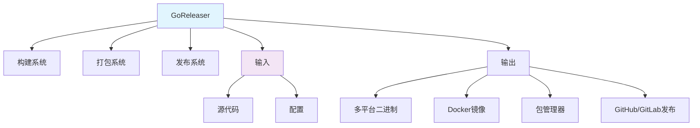

# GoReleaser

## 1. 概述

GoReleaser 是一个 Go 项目的自动化发布工具，用于简化构建、打包和发布 Go 二进制文件的流程。它支持多平台构建、Docker 镜像生成、Homebrew/Linuxbrew 打包、Snapcraft 打包等多种发布方式。

## 2. 核心概念

### 2.1 架构组件


### 2.2 关键特性
- **多平台构建**: 支持 Windows、Linux、macOS 等多种操作系统和架构
- **自动化发布**: 自动发布到 GitHub、GitLab、Gitea 等平台
- **Docker 支持**: 自动构建和推送 Docker 镜像
- **包管理器支持**: 生成 Homebrew、Scoop、Snapcraft 等包
- **签名验证**: 支持对发布文件进行签名
- **高度可配置**: 通过 YAML 文件自定义构建流程

## 3. 安装与配置

### 3.1 安装方法
```bash
#!/bin/bash
# install-goreleaser.sh

# 方法1: 使用 Homebrew (macOS/Linux)
brew install goreleaser/tap/goreleaser

# 方法2: 使用 Scoop (Windows)
scoop bucket add goreleaser https://github.com/goreleaser/scoop-bucket.git
scoop install goreleaser

# 方法3: 下载二进制文件
curl -sL https://goreleaser.com/install.sh | sh

# 方法4: 使用 Go 安装
go install github.com/goreleaser/goreleaser@latest

# 验证安装
goreleaser --version

# 初始化配置
goreleaser init
```

### 3.2 基础配置文件
```yaml
# .goreleaser.yml
before:
  hooks:
    - go mod download
    - go generate ./...

builds:
  - env:
      - CGO_ENABLED=0
    goos:
      - linux
      - darwin
      - windows
    goarch:
      - amd64
      - arm64
    flags:
      - -trimpath
    ldflags:
      - -s -w -X main.version={{.Version}} -X main.commit={{.Commit}}

archives:
  - format: tar.gz
    name_template: "{{ .ProjectName }}_{{ .Version }}_{{ .Os }}_{{ .Arch }}"

checksum:
  name_template: "checksums.txt"

snapshot:
  name_template: "{{ .Tag }}-next"

release:
  github:
    owner: yourusername
    name: yourproject
  prerelease: auto
```

## 4. 构建配置

### 4.1 多平台构建
```yaml
# .goreleaser.yml
builds:
  - id: "cli"
    binary: mycli
    main: ./cmd/cli
    env:
      - CGO_ENABLED=0
    goos:
      - linux
      - darwin
      - windows
      - freebsd
    goarch:
      - amd64
      - arm
      - arm64
      - 386
    goarm:
      - 6
      - 7
    gomips:
      - hardfloat
      - softfloat
    flags:
      - -trimpath
    ldflags:
      - -s -w -X main.version={{.Version}} -X main.commit={{.Commit}}
    tags:
      - netgo
      - osusergo
    asmflags:
      - -trimpath
    gcflags:
      - -trimpath
    mod_timestamp: "{{ .CommitTimestamp }}"
    binary_name: "{{ .ProjectName }}_{{ .Os }}_{{ .Arch }}"
    ignore:
      - goos: darwin
        goarch: 386
      - goos: windows
        goarch: arm64
```

### 4.2 多二进制构建
```yaml
# .goreleaser.yml
builds:
  - id: "cli"
    binary: mycli
    main: ./cmd/cli
    goos: [linux, darwin, windows]
    goarch: [amd64, arm64]
  
  - id: "daemon"
    binary: mydaemon
    main: ./cmd/daemon
    goos: [linux]
    goarch: [amd64, arm64]
  
  - id: "gui"
    binary: mygui
    main: ./cmd/gui
    goos: [windows, darwin]
    goarch: [amd64]
    buildmode: c-shared
    env:
      - CGO_ENABLED=1
```

## 5. 发布配置

### 5.1 GitHub 发布
```yaml
# .goreleaser.yml
release:
  github:
    owner: "yourusername"
    name: "yourproject"
    draft: false
    prerelease: false
    disable: false
    token: "{{ .Env.GITHUB_TOKEN }}"
    api_url: "https://api.github.com"
    replace_existing_drafts: true
    skip_upload: false
    body: |
      ## Changelog
      
      {{ .Changelog }}
      
      ### Installation
      
      ```sh
      brew install yourusername/tap/yourproject
      ```
  
  # 发布资产配置
  extra_files:
    - glob: "docs/**/*"
    - glob: "LICENSE*"
  
  # 发布前钩子
  before:
    hooks:
      - make docs
  
  # 发布后钩子
  after:
    hooks:
      - curl -X POST https://api.example.com/webhook -d '{"version":"{{.Version}}"}'
```

### 5.2 GitLab 发布
```yaml
# .goreleaser.yml
release:
  gitlab:
    owner: "yourgroup"
    name: "yourproject"
    token: "{{ .Env.GITLAB_TOKEN }}"
    api_url: "https://gitlab.com/api/v4"
    milestones:
      - "v1.0"
      - "next"
    body_template: "changelog.md"
    links:
      - name: "Download"
        url: "https://gitlab.com/{{ .ProjectOwner }}/{{ .ProjectName }}/-/releases/{{ .Tag }}"
```

## 6. 包管理器支持

### 6.1 Homebrew 配置
```yaml
# .goreleaser.yml
brews:
  - name: yourproject
    tap:
      owner: yourusername
      name: homebrew-tap
      token: "{{ .Env.GITHUB_TOKEN }}"
    folder: Formula
    homepage: "https://github.com/yourusername/yourproject"
    description: "A command line tool for something"
    license: "MIT"
    install: |
      bin.install "yourproject"
    test: |
      system "#{bin}/yourproject --version"
    dependencies:
      - git
      - zsh
    conflicts_with:
      - otherproject
    caveats: |
      Run `yourproject init` to get started!
    plist: |
      <?xml version="1.0" encoding="UTF-8"?>
      <!DOCTYPE plist PUBLIC "-//Apple//DTD PLIST 1.0//EN" "http://www.apple.com/DTDs/PropertyList-1.0.dtd">
      <plist version="1.0">
      <dict>
        <key>Label</key>
        <string>{{.Binary}}</string>
        <key>ProgramArguments</key>
        <array>
          <string>{{.Binary}}</string>
        </array>
        <key>RunAtLoad</key>
        <true/>
      </dict>
      </plist>
```

### 6.2 Scoop 配置
```yaml
# .goreleaser.yml
scoops:
  - name: yourproject
    bucket:
      owner: yourusername
      name: scoop-bucket
      token: "{{ .Env.GITHUB_TOKEN }}"
    homepage: "https://github.com/yourusername/yourproject"
    description: "A command line tool for something"
    license: "MIT"
    architecture:
      64bit:
        url: "https://github.com/yourusername/yourproject/releases/download/{{ .Tag }}/{{ .ArtifactName }}"
        bin: "{{ .ProjectName }}.exe"
        hash: "{{ .ArtifactHash }}"
      32bit:
        url: "https://github.com/yourusername/yourproject/releases/download/{{ .Tag }}/{{ .ArtifactName }}"
        bin: "{{ .ProjectName }}.exe"
        hash: "{{ .ArtifactHash }}"
    persist:
      - "data"
      - "config"
    shortcuts:
      - name: "YourProject"
        target: "{{.ProjectName}}.exe"
        start_in: "~"
```

## 7. Docker 集成

### 7.1 多架构 Docker 镜像
```yaml
# .goreleaser.yml
dockers:
  - image_templates:
      - "ghcr.io/yourusername/yourproject:{{ .Tag }}"
      - "ghcr.io/yourusername/yourproject:latest"
      - "ghcr.io/yourusername/yourproject:v{{ .Major }}"
      - "ghcr.io/yourusername/yourproject:v{{ .Major }}.{{ .Minor }}"
    dockerfile: Dockerfile
    use: buildx
    build_flag_templates:
      - "--pull"
      - "--platform=linux/amd64,linux/arm64"
      - "--label=org.opencontainers.image.created={{.Date}}"
      - "--label=org.opencontainers.image.version={{.Version}}"
      - "--label=org.opencontainers.image.revision={{.FullCommit}}"
    extra_files:
      - LICENSE
      - README.md
```

### 7.2 多阶段 Docker 构建
```yaml
# .goreleaser.yml
dockers:
  - image_templates:
      - "ghcr.io/yourusername/yourproject:{{ .Tag }}"
    dockerfile: Dockerfile.multi
    goos: linux
    goarch: amd64
    ids: ["cli"]
    build_flag_templates:
      - "--target=cli"
  
  - image_templates:
      - "ghcr.io/yourusername/yourproject-daemon:{{ .Tag }}"
    dockerfile: Dockerfile.multi
    goos: linux
    goarch: amd64
    ids: ["daemon"]
    build_flag_templates:
      - "--target=daemon"
```

## 8. 高级配置

### 8.1 签名与验证
```yaml
# .goreleaser.yml
signs:
  - artifacts: all
    args:
      - "--batch"
      - "--yes"
      - "--local-user"
      - "{{ .Env.GPG_FINGERPRINT }}"
      - "--output"
      - "${signature}"
      - "--detach-sign"
      - "${artifact}"
    signature: "${artifact}.sig"
    ids:
      - "checksum"
      - "source"

# 验证配置
verify:
  - artifacts: all
    signature: "${artifact}.sig"
    args:
      - "--verify"
      - "${signature}"
      - "${artifact}"
```

### 8.2 自定义发布管道
```yaml
# .goreleaser.yml
# 自定义发布步骤
announce:
  - provider: slack
    channel: "#releases"
    message_template: |
      :rocket: New release {{ .ProjectName }} {{ .Tag }} is out!
      
      {{ .ReleaseNotes }}
      
      Download: {{ .ReleaseURL }}
    webhook: "{{ .Env.SLACK_WEBHOOK }}"
  
  - provider: twitter
    message_template: |
      🚀 {{ .ProjectName }} {{ .Tag }} is out!
      
      {{ .ReleaseNotes | truncate 100 }}
      
      Download: {{ .ReleaseURL }}
    consumer_key: "{{ .Env.TWITTER_CONSUMER_KEY }}"
    consumer_secret: "{{ .Env.TWITTER_CONSUMER_SECRET }}"
    access_token: "{{ .Env.TWITTER_ACCESS_TOKEN }}"
    access_token_secret: "{{ .Env.TWITTER_ACCESS_TOKEN_SECRET }}"
  
  - provider: discord
    message_template: |
      **{{ .ProjectName }} {{ .Tag }}** is out!
      
      {{ .ReleaseNotes }}
      
      {{ .ReleaseURL }}
    webhook: "{{ .Env.DISCORD_WEBHOOK }}"
    color: "#5865F2"
```

## 9. CI/CD 集成

### 9.1 GitHub Actions 集成
```yaml
# .github/workflows/release.yml
name: Release

on:
  push:
    tags:
      - "v*"

jobs:
  release:
    name: Create Release
    runs-on: ubuntu-latest
    steps:
      - name: Checkout code
        uses: actions/checkout@v3
        with:
          fetch-depth: 0
      
      - name: Setup Go
        uses: actions/setup-go@v3
        with:
          go-version: '1.20'
      
      - name: Install GoReleaser
        uses: goreleaser/goreleaser-action@v4
        with:
          version: latest
      
      - name: Run GoReleaser
        uses: goreleaser/goreleaser-action@v4
        with:
          args: release --rm-dist
        env:
          GITHUB_TOKEN: ${{ secrets.GITHUB_TOKEN }}
          GPG_FINGERPRINT: ${{ secrets.GPG_FINGERPRINT }}
          DOCKER_USERNAME: ${{ secrets.DOCKER_USERNAME }}
          DOCKER_PASSWORD: ${{ secrets.DOCKER_PASSWORD }}
```

### 9.2 GitLab CI 集成
```yaml
# .gitlab-ci.yml
stages:
  - release

release:
  stage: release
  image: golang:1.20
  rules:
    - if: $CI_COMMIT_TAG =~ /^v\d+\.\d+\.\d+$/
  before_script:
    - curl -sL https://goreleaser.com/install.sh | sh
  script:
    - goreleaser release --rm-dist
  variables:
    GORELEASER_PREVIOUS_TAG: $(git describe --tags --abbrev=0)
    DOCKER_HOST: tcp://docker:2375
  services:
    - docker:20.10-dind
```

## 10. 自定义构建钩子

### 10.1 自定义构建脚本
```yaml
# .goreleaser.yml
before:
  hooks:
    - go mod download
    - go generate ./...
    - make docs
    - ./scripts/prepare-assets.sh

after:
  hooks:
    - ./scripts/notify.sh {{.Version}}
    - curl -X POST https://api.example.com/webhook -d '{"version":"{{.Version}}"}'

build_hooks:
  pre: 
    - ./scripts/pre-build.sh {{.Target}} {{.Path}}
  post:
    - ./scripts/post-build.sh {{.Target}} {{.Path}} {{.Ext}}
```

### 10.2 环境变量注入
```yaml
# .goreleaser.yml
env_files:
  - .env.release

env:
  - CGO_ENABLED=0
  - GOFLAGS=-mod=readonly
  - GO111MODULE=on

builds:
  - env:
      - BUILD_TIME={{ now }}
      - COMMIT_HASH={{ .Commit }}
      - VERSION={{ .Version }}
      - FOO={{ .Env.BAR }}
```

## 11. 多项目配置

### 11.1 多项目发布
```yaml
# .goreleaser.yml
projects:
  - name: cli
    dir: ./cmd/cli
    builds:
      - binary: mycli
        goos: [linux, darwin, windows]
        goarch: [amd64, arm64]
  
  - name: daemon
    dir: ./cmd/daemon
    builds:
      - binary: mydaemon
        goos: [linux]
        goarch: [amd64, arm64]
  
  - name: gui
    dir: ./cmd/gui
    builds:
      - binary: mygui
        goos: [windows, darwin]
        goarch: [amd64]
        buildmode: c-shared
        env:
          - CGO_ENABLED=1

release:
  github:
    owner: yourusername
    name: yourproject
```

## 12. 调试与故障排除

### 12.1 调试配置
```bash
#!/bin/bash
# debug-goreleaser.sh

# 干运行（不实际发布）
goreleaser release --skip-publish --skip-validate --rm-dist

# 详细日志
goreleaser release --debug

# 仅构建特定ID
goreleaser release --id=cli

# 跳过某些步骤
goreleaser release --skip-docker --skip-homebrew

# 加载特定配置文件
goreleaser release --config .goreleaser.prod.yml

# 构建快照版本
goreleaser release --snapshot --rm-dist
```

### 12.2 常见问题解决
```yaml
# .goreleaser.yml
# 解决构建缓存问题
builds:
  - mod_timestamp: "{{ .CommitTimestamp }}"

# 解决Docker构建问题
dockers:
  - build_flag_templates:
      - "--pull"
      - "--no-cache"

# 解决签名问题
signs:
  - args:
      - "--pinentry-mode"
      - "loopback"

# 解决Homebrew推送问题
brews:
  - skip_upload: auto
    download_strategy: GitHubPrivateRepositoryReleaseDownloadStrategy
```
