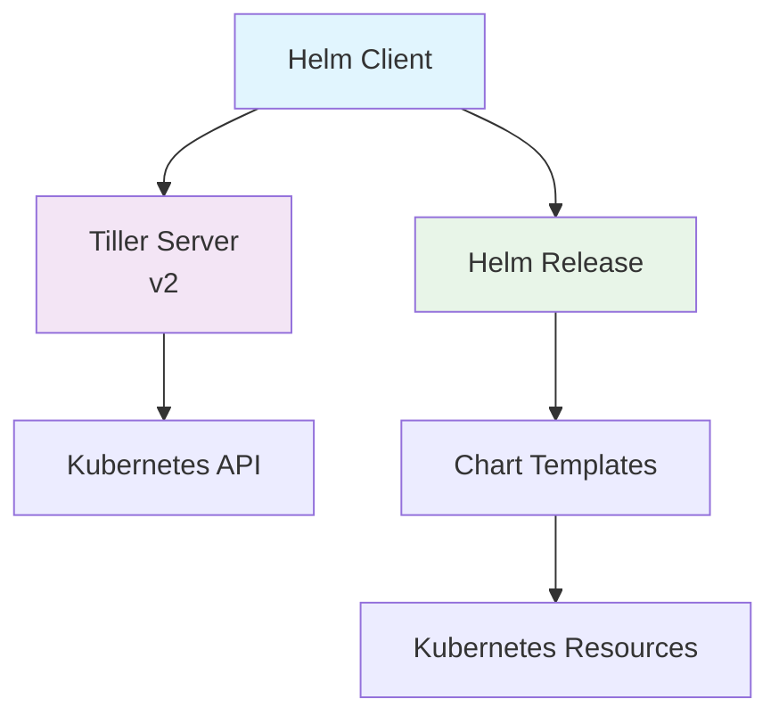

# Helm

## 1. 概述

Helm 是 Kubernetes 的包管理器，用于简化应用程序的部署和管理。它通过称为 Chart 的打包格式来定义、安装和升级复杂的 Kubernetes 应用程序。Helm 提供了模板化、版本控制和依赖管理等功能，是 Kubernetes 生态系统中的重要工具。

## 2. 核心概念

### 2.1 架构组件


### 2.2 关键术语
- **Chart**: Helm 的软件包，包含在 Kubernetes 上运行应用所需的所有资源定义
- **Release**: 在 Kubernetes 集群中运行的 Chart 实例
- **Repository**: Chart 的存储和分发位置
- **Values**: 配置参数，用于定制 Chart 的部署
- **Template**: 使用 Go 模板语言编写的 Kubernetes 资源定义文件

## 3. 快速开始

### 3.1 安装和初始化
```bash
# 安装 Helm
curl https://raw.githubusercontent.com/helm/helm/main/scripts/get-helm-3 | bash

# 添加官方仓库
helm repo add stable https://charts.helm.sh/stable
helm repo update

# 查看可用 Chart
helm search repo stable

# 安装示例应用
helm install my-release stable/nginx

# 查看已安装的 Release
helm list

# 卸载 Release
helm uninstall my-release
```

### 3.2 基础 Chart 结构
```
my-chart/
├── Chart.yaml          # Chart 元数据
├── values.yaml         # 默认配置值
├── charts/             # 依赖的子 Chart
├── templates/          # 模板文件
│   ├── deployment.yaml
│   ├── service.yaml
│   ├── ingress.yaml
│   └── _helpers.tpl    # 辅助模板
└── crds/               # 自定义资源定义
```

## 4. Chart 开发详解

### 4.1 Chart.yaml 配置
```yaml
apiVersion: v2
name: my-app
description: A Helm chart for Kubernetes
type: application
version: 1.0.0
appVersion: "2.0.0"

dependencies:
- name: redis
  version: "16.0.0"
  repository: "https://charts.bitnami.com/bitnami"
  condition: redis.enabled

maintainers:
- name: John Doe
  email: john@example.com
  url: https://example.com

keywords:
- web
- application
- microservices

sources:
- https://github.com/my-org/my-app

annotations:
  category: Database
```

### 4.2 模板开发
```yaml
# templates/deployment.yaml
apiVersion: apps/v1
kind: Deployment
metadata:
  name: {{ include "my-app.fullname" . }}
  labels:
    {{- include "my-app.labels" . | nindent 4 }}
spec:
  replicas: {{ .Values.replicaCount }}
  selector:
    matchLabels:
      {{- include "my-app.selectorLabels" . | nindent 6 }}
  template:
    metadata:
      labels:
        {{- include "my-app.labels" . | nindent 8 }}
        {{- with .Values.podLabels }}
        {{- toYaml . | nindent 8 }}
        {{- end }}
      annotations:
        checksum/config: {{ include (print $.Template.BasePath "/configmap.yaml") . | sha256sum }}
    spec:
      containers:
      - name: {{ .Chart.Name }}
        image: "{{ .Values.image.repository }}:{{ .Values.image.tag | default .Chart.AppVersion }}"
        imagePullPolicy: {{ .Values.image.pullPolicy }}
        ports:
        - containerPort: {{ .Values.service.port }}
        env:
        - name: ENVIRONMENT
          value: {{ .Values.environment | quote }}
        resources:
          {{- toYaml .Values.resources | nindent 12 }}
        {{- with .Values.livenessProbe }}
        livenessProbe:
          {{- toYaml . | nindent 10 }}
        {{- end }}
```

### 4.3 辅助模板
```tpl
# templates/_helpers.tpl
{{/*
Create a default fully qualified app name.
*/}}
{{- define "my-app.fullname" -}}
{{- if .Values.fullnameOverride }}
{{- .Values.fullnameOverride | trunc 63 | trimSuffix "-" }}
{{- else }}
{{- $name := default .Chart.Name .Values.nameOverride }}
{{- if contains $name .Release.Name }}
{{- .Release.Name | trunc 63 | trimSuffix "-" }}
{{- else }}
{{- printf "%s-%s" .Release.Name $name | trunc 63 | trimSuffix "-" }}
{{- end }}
{{- end }}
{{- end }}

{{/*
Common labels
*/}}
{{- define "my-app.labels" -}}
helm.sh/chart: {{ include "my-app.chart" . }}
{{ include "my-app.selectorLabels" . }}
{{- if .Chart.AppVersion }}
app.kubernetes.io/version: {{ .Chart.AppVersion | quote }}
{{- end }}
app.kubernetes.io/managed-by: {{ .Release.Service }}
{{- end }}

{{/*
Selector labels
*/}}
{{- define "my-app.selectorLabels" -}}
app.kubernetes.io/name: {{ include "my-app.name" . }}
app.kubernetes.io/instance: {{ .Release.Name }}
{{- end }}
```

## 5. Values 管理

### 5.1 values.yaml 配置
```yaml
# Default values for my-app
replicaCount: 3

image:
  repository: nginx
  tag: "1.25"
  pullPolicy: IfNotPresent

imagePullSecrets: []
nameOverride: ""
fullnameOverride: ""

service:
  type: ClusterIP
  port: 80
  annotations: {}

ingress:
  enabled: false
  className: ""
  annotations: {}
  hosts:
    - host: chart-example.local
      paths:
        - path: /
          pathType: ImplementationSpecific
  tls: []

resources:
  limits:
    cpu: 500m
    memory: 512Mi
  requests:
    cpu: 250m
    memory: 256Mi

autoscaling:
  enabled: false
  minReplicas: 2
  maxReplicas: 10
  targetCPUUtilizationPercentage: 80
  targetMemoryUtilizationPercentage: 80

nodeSelector: {}

tolerations: []

affinity: {}

environment: "production"

configMaps:
  app-config: |
    logging.level=INFO
    server.port=8080

secrets: {}
```

### 5.2 值文件和覆盖
```bash
# 使用自定义值文件
helm install my-app . -f values/production.yaml

# 覆盖单个值
helm install my-app . --set replicaCount=5
helm install my-app . --set image.tag=2.0.0
helm install my-app . --set "resources.limits.cpu=1"

# 使用多个值文件
helm install my-app . -f values/common.yaml -f values/prod.yaml

# 查看渲染后的模板
helm template my-app . -f values/production.yaml
```

## 6. 高级功能

### 6.1 依赖管理
```yaml
# Chart.yaml 中的依赖配置
dependencies:
- name: postgresql
  version: "12.0.0"
  repository: "https://charts.bitnami.com/bitnami"
  condition: postgresql.enabled
  tags:
    - database
- name: redis
  version: "17.0.0"
  repository: "https://charts.bitnami.com/bitnami"
  condition: redis.enabled
  tags:
    - cache

# 管理依赖
helm dependency update
helm dependency build
helm dependency list
```

### 6.2 Hooks 和生命周期
```yaml
# 数据库迁移 Job
apiVersion: batch/v1
kind: Job
metadata:
  name: {{ include "my-app.fullname" . }}-db-migrate
  annotations:
    "helm.sh/hook": pre-install,pre-upgrade
    "helm.sh/hook-weight": "5"
    "helm.sh/hook-delete-policy": before-hook-creation,hook-succeeded
spec:
  template:
    spec:
      containers:
      - name: migrate
        image: "{{ .Values.migration.image }}:{{ .Values.migration.tag }}"
        command: ["/bin/sh", "-c"]
        args:
        - |
          ./migrate-database.sh
        envFrom:
        - secretRef:
            name: {{ include "my-app.fullname" . }}-secrets
      restartPolicy: OnFailure
```

### 6.3 测试和验证
```yaml
# 测试模板
apiVersion: v1
kind: Pod
metadata:
  name: "{{ include "my-app.fullname" . }}-test-connection"
  annotations:
    "helm.sh/hook": test
    "helm.sh/hook-weight": "10"
    "helm.sh/hook-delete-policy": hook-succeeded
spec:
  containers:
  - name: test-connection
    image: busybox
    command: ['sh', '-c']
    args:
    - |
      until nslookup {{ include "my-app.fullname" . }};
      do
        echo "Waiting for service...";
        sleep 2;
      done
      echo "Service is ready!"
  restartPolicy: Never
```

## 7. CI/CD 集成

### 7.1 GitOps 工作流
```yaml
# GitHub Actions for Helm
name: Helm Deploy

on:
  push:
    branches: [ main ]

jobs:
  deploy:
    runs-on: ubuntu-latest
    steps:
    - uses: actions/checkout@v4
    
    - name: Set up Helm
      uses: azure/setup-helm@v3
      with:
        version: 'v3.12.0'
    
    - name: Configure Kubernetes
      uses: azure/setup-kubectl@v3
      with:
        version: 'v1.27.0'
    
    - name: Add Helm repositories
      run: |
        helm repo add stable https://charts.helm.sh/stable
        helm repo update
    
    - name: Render Helm templates
      run: helm template my-app ./charts/my-app -f values/production.yaml
    
    - name: Deploy to Kubernetes
      run: |
        helm upgrade --install my-app ./charts/my-app \
          --namespace production \
          --create-namespace \
          -f values/production.yaml \
          --atomic \
          --timeout 5m
```

### 7.2 安全最佳实践
```bash
# 使用 secrets 管理敏感数据
helm install my-app . --set database.password=$DB_PASSWORD

# 模板安全检查
helm lint .
helm template . --debug

# 使用 helm-secrets 插件
helm secrets install my-app . -f secrets.yaml

# 验证 Chart 签名
helm verify my-chart-1.0.0.tgz
```

## 8. 运维和监控

### 8.1 Release 管理
```bash
# 查看 Release 状态
helm status my-app
helm get all my-app
helm get values my-app
helm get manifest my-app

# 回滚 Release
helm rollback my-app 1
helm history my-app

# 查看 Release 差异
helm diff upgrade my-app .

# 导出 Release 配置
helm get values my-app -o yaml > values-current.yaml
```

### 8.2 监控和日志
```bash
# 监控 Helm Release
helm list --all
helm list --failed
helm list --pending

# 查看 Release 事件
kubectl get events --field-selector involvedObject.name=my-app

# 使用 Helm dashboard
helm plugin install https://github.com/komodorio/helm-dashboard.git
helm dashboard
```

## 9. 故障排除

### 9.1 常见问题处理
```bash
# 调试模板渲染
helm template . --debug
helm install --dry-run --debug .

# 查看失败 Release
helm list --failed
helm status my-app

# 检查依赖
helm dependency list
helm dependency update

# 清理失败 Release
helm uninstall my-app
helm list --all --namespace my-namespace
```

### 9.2 性能优化
```bash
# 使用模板缓存
helm template . > rendered.yaml
kubectl apply -f rendered.yaml

# 减少 Helm 操作频率
helm upgrade --install --wait --timeout=300s

# 使用 --atomic 参数确保原子性操作
helm upgrade --install --atomic

# 优化 Chart 大小
helm package --dependency-update .
```
