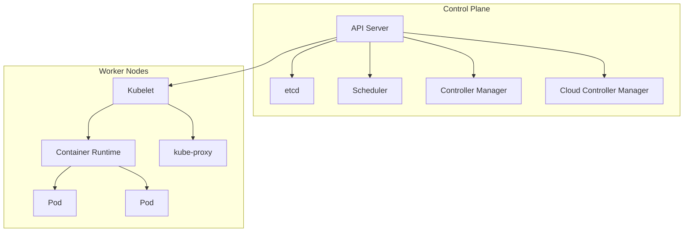

# Kubernetes

## 1. 概述

Kubernetes（简称 K8s）是一个开源的容器编排平台，用于自动化部署、扩展和管理容器化应用程序。它提供了强大的容器编排能力，支持跨多个主机的容器集群管理，是现代化云原生应用的核心基础设施。

## 2. 核心概念

### 2.1 架构组件


### 2.2 关键资源对象
- **Pod**: 最小的部署单元，包含一个或多个容器
- **Deployment**: 管理 Pod 的副本和更新策略
- **Service**: 提供稳定的网络访问端点
- **ConfigMap**: 存储配置数据
- **Secret**: 存储敏感信息
- **Namespace**: 逻辑隔离的虚拟集群

## 3. 快速开始

### 3.1 基础命令
```bash
# 查看集群信息
kubectl cluster-info

# 查看节点状态
kubectl get nodes

# 查看所有资源
kubectl get all --all-namespaces

# 部署应用
kubectl apply -f deployment.yaml

# 查看 Pod 状态
kubectl get pods

# 查看 Pod 详情
kubectl describe pod <pod-name>

# 查看日志
kubectl logs <pod-name>

# 进入容器
kubectl exec -it <pod-name> -- sh
```

### 3.2 简单部署示例
```yaml
# deployment.yaml
apiVersion: apps/v1
kind: Deployment
metadata:
  name: nginx-deployment
  labels:
    app: nginx
spec:
  replicas: 3
  selector:
    matchLabels:
      app: nginx
  template:
    metadata:
      labels:
        app: nginx
    spec:
      containers:
      - name: nginx
        image: nginx:1.25-alpine
        ports:
        - containerPort: 80
---
# service.yaml
apiVersion: v1
kind: Service
metadata:
  name: nginx-service
spec:
  selector:
    app: nginx
  ports:
    - protocol: TCP
      port: 80
      targetPort: 80
  type: LoadBalancer
```

## 4. 核心资源详解

### 4.1 Pod 配置
```yaml
apiVersion: v1
kind: Pod
metadata:
  name: my-app-pod
  labels:
    app: my-app
    environment: production
spec:
  containers:
  - name: app
    image: my-app:1.0.0
    imagePullPolicy: IfNotPresent
    ports:
    - containerPort: 8080
    env:
    - name: NODE_ENV
      value: "production"
    - name: DATABASE_URL
      valueFrom:
        secretKeyRef:
          name: database-secret
          key: connection-string
    resources:
      requests:
        memory: "256Mi"
        cpu: "250m"
      limits:
        memory: "512Mi"
        cpu: "500m"
    livenessProbe:
      httpGet:
        path: /health
        port: 8080
      initialDelaySeconds: 30
      periodSeconds: 10
    readinessProbe:
      httpGet:
        path: /ready
        port: 8080
      initialDelaySeconds: 5
      periodSeconds: 5
  restartPolicy: Always
```

### 4.2 Deployment 策略
```yaml
apiVersion: apps/v1
kind: Deployment
metadata:
  name: my-app-deployment
spec:
  replicas: 3
  strategy:
    type: RollingUpdate
    rollingUpdate:
      maxSurge: 1
      maxUnavailable: 0
  selector:
    matchLabels:
      app: my-app
  template:
    metadata:
      labels:
        app: my-app
        version: "1.0.0"
    spec:
      containers:
      - name: app
        image: my-app:1.0.0
        ports:
        - containerPort: 8080
        lifecycle:
          preStop:
            exec:
              command: ["/bin/sh", "-c", "sleep 30"]
      affinity:
        podAntiAffinity:
          preferredDuringSchedulingIgnoredDuringExecution:
          - weight: 100
            podAffinityTerm:
              labelSelector:
                matchExpressions:
                - key: app
                  operator: In
                  values:
                  - my-app
              topologyKey: kubernetes.io/hostname
```

### 4.3 Service 和 Ingress
```yaml
# service.yaml
apiVersion: v1
kind: Service
metadata:
  name: my-app-service
spec:
  selector:
    app: my-app
  ports:
  - name: http
    port: 80
    targetPort: 8080
    protocol: TCP
  type: ClusterIP
---
# ingress.yaml
apiVersion: networking.k8s.io/v1
kind: Ingress
metadata:
  name: my-app-ingress
  annotations:
    nginx.ingress.kubernetes.io/rewrite-target: /
spec:
  rules:
  - host: myapp.example.com
    http:
      paths:
      - path: /
        pathType: Prefix
        backend:
          service:
            name: my-app-service
            port:
              number: 80
```

## 5. 配置管理

### 5.1 ConfigMap
```yaml
apiVersion: v1
kind: ConfigMap
metadata:
  name: app-config
data:
  app.properties: |
    server.port=8080
    logging.level=INFO
    database.timeout=30s
  nginx.conf: |
    server {
        listen 80;
        server_name localhost;
        location / {
            proxy_pass http://localhost:8080;
        }
    }
```

### 5.2 Secret
```yaml
apiVersion: v1
kind: Secret
metadata:
  name: app-secrets
type: Opaque
data:
  database-url: dGhpcyBpcyBhIHNlY3JldA==  # base64 encoded
  api-key: YW5vdGhlciBzZWNyZXQ=
stringData:
  plain-text: this-is-in-clear-text
```

### 5.3 使用配置
```yaml
apiVersion: apps/v1
kind: Deployment
metadata:
  name: configurable-app
spec:
  template:
    spec:
      containers:
      - name: app
        image: my-app:1.0.0
        env:
        - name: CONFIG_FILE
          value: "/etc/config/app.properties"
        - name: DATABASE_URL
          valueFrom:
            secretKeyRef:
              name: app-secrets
              key: database-url
        volumeMounts:
        - name: config-volume
          mountPath: /etc/config
        - name: secret-volume
          mountPath: /etc/secrets
          readOnly: true
      volumes:
      - name: config-volume
        configMap:
          name: app-config
          items:
          - key: app.properties
            path: app.properties
      - name: secret-volume
        secret:
          secretName: app-secrets
```

## 6. 存储管理

### 6.1 PersistentVolume
```yaml
apiVersion: v1
kind: PersistentVolume
metadata:
  name: pv-volume
spec:
  capacity:
    storage: 10Gi
  volumeMode: Filesystem
  accessModes:
    - ReadWriteOnce
  persistentVolumeReclaimPolicy: Retain
  storageClassName: fast
  hostPath:
    path: /mnt/data
```

### 6.2 PersistentVolumeClaim
```yaml
apiVersion: v1
kind: PersistentVolumeClaim
metadata:
  name: pv-claim
spec:
  storageClassName: fast
  accessModes:
    - ReadWriteOnce
  resources:
    requests:
      storage: 3Gi
```

### 6.3 使用持久化存储
```yaml
apiVersion: apps/v1
kind: Deployment
metadata:
  name: stateful-app
spec:
  template:
    spec:
      containers:
      - name: app
        image: my-app:1.0.0
        volumeMounts:
        - name: data-volume
          mountPath: /data
      volumes:
      - name: data-volume
        persistentVolumeClaim:
          claimName: pv-claim
```

## 7. 高级功能

### 7.1 Horizontal Pod Autoscaler
```yaml
apiVersion: autoscaling/v2
kind: HorizontalPodAutoscaler
metadata:
  name: my-app-hpa
spec:
  scaleTargetRef:
    apiVersion: apps/v1
    kind: Deployment
    name: my-app-deployment
  minReplicas: 2
  maxReplicas: 10
  metrics:
  - type: Resource
    resource:
      name: cpu
      target:
        type: Utilization
        averageUtilization: 50
  - type: Resource
    resource:
      name: memory
      target:
        type: Utilization
        averageUtilization: 60
```

### 7.2 Resource Quotas
```yaml
apiVersion: v1
kind: ResourceQuota
metadata:
  name: compute-resources
spec:
  hard:
    requests.cpu: "2"
    requests.memory: 2Gi
    limits.cpu: "4"
    limits.memory: 4Gi
    pods: "10"
    services: "5"
```

### 7.3 Network Policies
```yaml
apiVersion: networking.k8s.io/v1
kind: NetworkPolicy
metadata:
  name: allow-app-traffic
spec:
  podSelector:
    matchLabels:
      app: my-app
  policyTypes:
  - Ingress
  - Egress
  ingress:
  - from:
    - podSelector:
        matchLabels:
          role: frontend
    ports:
    - protocol: TCP
      port: 8080
  egress:
  - to:
    - podSelector:
        matchLabels:
          role: database
    ports:
    - protocol: TCP
      port: 5432
```

## 8. CI/CD 集成

### 8.1 GitOps with ArgoCD
```yaml
# Application manifest for ArgoCD
apiVersion: argoproj.io/v1alpha1
kind: Application
metadata:
  name: my-app
spec:
  project: default
  source:
    repoURL: https://github.com/my-org/my-app.git
    targetRevision: HEAD
    path: k8s
  destination:
    server: https://kubernetes.default.svc
    namespace: my-app
  syncPolicy:
    automated:
      prune: true
      selfHeal: true
    syncOptions:
    - CreateNamespace=true
```

### 8.2 Kubernetes in CI Pipeline
```yaml
# GitHub Actions for Kubernetes deployment
name: Deploy to Kubernetes

on:
  push:
    branches: [ main ]

jobs:
  deploy:
    runs-on: ubuntu-latest
    steps:
    - uses: actions/checkout@v4
    
    - name: Set up kubectl
      uses: azure/setup-kubectl@v3
      with:
        version: 'v1.27.0'
    
    - name: Configure kubeconfig
      run: |
        echo "${{ secrets.KUBE_CONFIG }}" > kubeconfig.yaml
        export KUBECONFIG=kubeconfig.yaml
    
    - name: Deploy to Kubernetes
      run: |
        kubectl apply -f k8s/
        kubectl rollout status deployment/my-app-deployment
```

## 9. 监控和运维

### 9.1 健康检查
```yaml
livenessProbe:
  httpGet:
    path: /healthz
    port: 8080
    httpHeaders:
    - name: Custom-Header
      value: Awesome
  initialDelaySeconds: 15
  periodSeconds: 20
  timeoutSeconds: 5
  failureThreshold: 3

readinessProbe:
  exec:
    command:
    - cat
    - /tmp/healthy
  initialDelaySeconds: 5
  periodSeconds: 10
```

### 9.2 日志和监控
```bash
# 查看容器日志
kubectl logs -f deployment/my-app-deployment

# 查看资源使用情况
kubectl top pods
kubectl top nodes

# 使用 Prometheus 监控
kubectl apply -f https://github.com/prometheus-operator/kube-prometheus/releases/latest/download/bundle.yaml
```

### 9.3 故障排除
```bash
# 查看事件
kubectl get events --sort-by=.metadata.creationTimestamp

# 查看资源详情
kubectl describe pod <pod-name>
kubectl describe node <node-name>

# 端口转发调试
kubectl port-forward pod/<pod-name> 8080:8080

# 执行调试命令
kubectl debug -it <pod-name> --image=busybox --target=<container-name>
```
