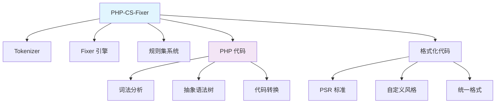

# PHP-CS-Fixer

## 1. 概述

PHP-CS-Fixer 是一个自动化的 PHP 代码风格修复工具。它能够自动检测和修复代码风格问题，确保代码遵循统一的编码标准，提高代码的可读性和维护性。

## 2. 核心概念

### 2.1 架构组件


### 2.2 关键特性
- **自动化修复**: 自动修复代码风格问题
- **多标准支持**: 支持 PSR-1, PSR-2, PSR-12 等标准
- **可配置规则**: 丰富的可配置规则集
- **自定义规则**: 支持创建自定义代码风格规则
- **IDE 集成**: 支持主流 IDE 和编辑器集成
- **CI/CD 集成**: 易于集成到持续集成流程

## 3. 安装与配置

### 3.1 通过 Composer 安装
```bash
#!/bin/bash
# install-php-cs-fixer.sh

# 作为开发依赖安装
composer require --dev friendsofphp/php-cs-fixer

# 全局安装
composer global require friendsofphp/php-cs-fixer

# 验证安装
./vendor/bin/php-cs-fixer --version
php-cs-fixer --version # 全局安装时

# 安装 IDE 集成助手
composer require --dev squizlabs/php_codesniffer
composer require --dev phpmd/phpmd

# 创建配置文件
./vendor/bin/php-cs-fixer fix --config=.php-cs-fixer.php --allow-risky=yes --dry-run
```

### 3.2 配置文件
```php
<?php
// .php-cs-fixer.php

use PhpCsFixer\Config;
use PhpCsFixer\Finder;

$finder = Finder::create()
    ->in([
        __DIR__.'/src',
        __DIR__.'/tests',
        __DIR__.'/app',
    ])
    ->exclude([
        'vendor',
        'storage',
        'bootstrap/cache',
        'node_modules',
    ])
    ->name('*.php')
    ->notName('*.blade.php')
    ->ignoreDotFiles(true)
    ->ignoreVCS(true);

return (new Config())
    ->setFinder($finder)
    ->setRules([
        '@PSR12' => true,
        '@Symfony' => true,
        '@PhpCsFixer' => true,
        
        // 数组规则
        'array_syntax' => ['syntax' => 'short'],
        'array_indentation' => true,
        
        // 空白规则
        'blank_line_after_opening_tag' => true,
        'blank_line_before_statement' => [
            'statements' => ['return', 'throw', 'try', 'if'],
        ],
        
        // 括号规则
        'braces' => [
            'allow_single_line_closure' => true,
            'position_after_functions_and_ops' => 'next',
        ],
        
        // 类规则
        'class_attributes_separation' => [
            'elements' => [
                'const' => 'one',
                'method' => 'one',
                'property' => 'one',
            ],
        ],
        'class_definition' => true,
        
        // 注释规则
        'comment_to_phpdoc' => true,
        'compact_nullable_typehint' => true,
        
        // 函数规则
        'function_declaration' => true,
        'function_typehint_space' => true,
        
        // 导入规则
        'global_namespace_import' => [
            'import_constants' => true,
            'import_functions' => true,
            'import_classes' => true,
        ],
        
        // 缩进规则
        'indentation_type' => true,
        'line_ending' => true,
        
        // 命名空间规则
        'no_leading_namespace_whitespace' => true,
        'no_unused_imports' => true,
        
        // 操作符规则
        'binary_operator_spaces' => [
            'default' => 'single_space',
            'operators' => [
                '=>' => 'align_single_space_minimal',
                '=' => 'align_single_space_minimal',
            ],
        ],
        
        // 字符串规则
        'single_quote' => true,
        'string_line_ending' => false,
        
        // 严格规则
        'declare_strict_types' => false,
        'strict_comparison' => true,
        'strict_param' => true,
        
        // 其他规则
        'no_extra_blank_lines' => true,
        'no_trailing_whitespace' => true,
        'no_whitespace_in_blank_line' => true,
        'ordered_imports' => [
            'sort_algorithm' => 'alpha',
            'imports_order' => ['class', 'function', 'const'],
        ],
        'phpdoc_order' => true,
        'phpdoc_trim' => true,
        'return_type_declaration' => true,
        'ternary_operator_spaces' => true,
        'trailing_comma_in_multiline' => true,
        'trim_array_spaces' => true,
        'unary_operator_spaces' => true,
        'yoda_style' => false,
    ])
    ->setRiskyAllowed(true)
    ->setUsingCache(true)
    ->setCacheFile(__DIR__.'/.php-cs-fixer.cache')
    ->setLineEnding("\n");
```

## 4. 基础使用

### 4.1 基本命令
```bash
#!/bin/bash
# php-cs-fixer-basic-usage.sh

# 检查代码风格（不修改）
./vendor/bin/php-cs-fixer fix --dry-run --verbose

# 修复代码风格
./vendor/bin/php-cs-fixer fix

# 修复特定目录
./vendor/bin/php-cs-fixer fix src
./vendor/bin/php-cs-fixer fix src tests

# 修复特定文件
./vendor/bin/php-cs-fixer fix src/Service/UserService.php

# 使用不同配置
./vendor/bin/php-cs-fixer fix --config=.php-cs-fixer.dist.php

# 显示差异
./vendor/bin/php-cs-fixer fix --diff --dry-run

# 详细输出
./vendor/bin/php-cs-fixer fix --verbose

# 使用缓存
./vendor/bin/php-cs-fixer fix --using-cache=true

# 允许风险修复
./vendor/bin/php-cs-fixer fix --allow-risky=yes

# 格式化输出
./vendor/bin/php-cs-fixer fix --format=json
./vendor/bin/php-cs-fixer fix --format=txt
./vendor/bin/php-cs-fixer fix --format=xml

# 排除文件
./vendor/bin/php-cs-fixer fix --exclude=src/Legacy

# 最大执行时间
./vendor/bin/php-cs-fixer fix --stop-on-violation
```

### 4.2 规则集使用
```bash
#!/bin/bash
# php-cs-fixer-rulesets.sh

# 使用 PSR-12 规则集
./vendor/bin/php-cs-fixer fix --rules=@PSR12

# 使用 Symfony 规则集
./vendor/bin/php-cs-fixer fix --rules=@Symfony

# 使用 PHP-CS-Fixer 规则集
./vendor/bin/php-cs-fixer fix --rules=@PhpCsFixer

# 使用 Doctrine 规则集
./vendor/bin/php-cs-fixer fix --rules=@DoctrineAnnotation

# 组合多个规则集
./vendor/bin/php-cs-fixer fix --rules=@PSR12,@Symfony

# 自定义规则组合
./vendor/bin/php-cs-fixer fix --rules='{
    "array_syntax": {"syntax": "short"},
    "binary_operator_spaces": true,
    "blank_line_after_opening_tag": true,
    "no_unused_imports": true,
    "ordered_imports": true
}'

# 禁用特定规则
./vendor/bin/php-cs-fixer fix --rules='{
    "@PSR12": true,
    "yoda_style": false
}'

# 风险规则
./vendor/bin/php-cs-fixer fix --rules=@PSR12 --allow-risky=yes
```

## 5. 规则配置详解

### 5.1 常用规则配置
```php
<?php
// .php-cs-fixer.dist.php - 详细规则配置

return PhpCsFixer\Config::create()
    ->setRules([
        // 数组规则
        'array_syntax' => ['syntax' => 'short'],
        'array_indentation' => true,
        'trim_array_spaces' => true,
        'whitespace_after_comma_in_array' => true,
        
        // 空白和换行规则
        'blank_line_after_opening_tag' => true,
        'blank_line_before_statement' => [
            'statements' => ['break', 'continue', 'declare', 'return', 'throw', 'try'],
        ],
        'no_extra_blank_lines' => [
            'tokens' => [
                'extra',
                'throw',
                'use',
                'use_trait',
            ],
        ],
        
        // 括号和花括号规则
        'braces' => [
            'allow_single_line_closure' => true,
            'position_after_control_structures' => 'same',
            'position_after_functions_and_ops' => 'next',
        ],
        
        // 类规则
        'class_attributes_separation' => [
            'elements' => [
                'const' => 'one',
                'method' => 'one',
                'property' => 'one',
            ],
        ],
        'class_definition' => true,
        'self_accessor' => true,
        
        // 注释规则
        'comment_to_phpdoc' => true,
        'multiline_comment_opening_closing' => true,
        'no_empty_comment' => true,
        
        // 函数规则
        'function_declaration' => true,
        'function_typehint_space' => true,
        'lambda_not_used_import' => true,
        
        // 导入规则
        'fully_qualified_strict_types' => true,
        'global_namespace_import' => [
            'import_constants' => true,
            'import_functions' => true,
            'import_classes' => true,
        ],
        'no_unused_imports' => true,
        'ordered_imports' => [
            'sort_algorithm' => 'alpha',
            'imports_order' => ['class', 'function', 'const'],
        ],
        
        // 缩进和对齐规则
        'align_multiline_comment' => true,
        'binary_operator_spaces' => [
            'default' => 'single_space',
            'operators' => [
                '=>' => 'align_single_space_minimal',
                '=' => 'align_single_space_minimal',
            ],
        ],
        'indentation_type' => true,
        
        // 命名空间规则
        'no_leading_namespace_whitespace' => true,
        'single_blank_line_before_namespace' => true,
        
        // 操作符规则
        'not_operator_with_successor_space' => true,
        'object_operator_without_whitespace' => true,
        'operator_linebreak' => [
            'only_booleans' => true,
        ],
        
        // PHP 标签规则
        'linebreak_after_opening_tag' => true,
        'no_closing_tag' => true,
        
        // 返回规则
        'return_assignment' => true,
        'return_type_declaration' => true,
        
        // 分号规则
        'multiline_whitespace_before_semicolons' => true,
        'no_empty_statement' => true,
        'space_after_semicolon' => true,
        
        // 字符串规则
        'escape_implicit_backslashes' => true,
        'explicit_string_variable' => true,
        'single_quote' => true,
        
        // 严格规则
        'declare_strict_types' => false,
        'strict_comparison' => true,
        'strict_param' => true,
        
        // 三元操作符规则
        'ternary_operator_spaces' => true,
        'ternary_to_elvis_operator' => true,
        
        // 类型声明规则
        'nullable_type_declaration_for_default_null_value' => true,
        'void_return' => true,
        
        // 变量规则
        'no_unset_on_property' => true,
        'self_static_accessor' => true,
        
        // 空白规则
        'no_spaces_around_offset' => true,
        'no_trailing_whitespace' => true,
        'no_whitespace_in_blank_line' => true,
    ])
    ->setRiskyAllowed(true)
    ->setFinder(
        PhpCsFixer\Finder::create()
            ->exclude('vendor')
            ->exclude('node_modules')
            ->exclude('storage')
            ->in(__DIR__)
    );
```

## 6. 自定义规则开发

### 6.1 自定义 Fixer
```php
<?php
// src/CustomFixers/NoVarDumpFixer.php

namespace App\CustomFixers;

use PhpCsFixer\AbstractFixer;
use PhpCsFixer\FixerDefinition\CodeSample;
use PhpCsFixer\FixerDefinition\FixerDefinition;
use PhpCsFixer\FixerDefinition\FixerDefinitionInterface;
use PhpCsFixer\Tokenizer\Tokens;
use PhpCsFixer\Tokenizer\Token;

final class NoVarDumpFixer extends AbstractFixer
{
    public function getName(): string
    {
        return 'App/no_var_dump';
    }

    public function getDefinition(): FixerDefinitionInterface
    {
        return new FixerDefinition(
            'Remove var_dump, dump, and dd calls from code.',
            [
                new CodeSample(
                    '<?php
var_dump($test);
dump($data);
dd($debug);
'
                ),
            ]
        );
    }

    public function isCandidate(Tokens $tokens): bool
    {
        return $tokens->isTokenKindFound(T_STRING);
    }

    protected function applyFix(\SplFileInfo $file, Tokens $tokens): void
    {
        for ($index = $tokens->count() - 1; $index > 0; --$index) {
            $token = $tokens[$index];

            if (!$token->isGivenKind(T_STRING)) {
                continue;
            }

            $functionName = $token->getContent();
            $forbiddenFunctions = ['var_dump', 'dump', 'dd'];

            if (!in_array($functionName, $forbiddenFunctions, true)) {
                continue;
            }

            // 找到函数调用的开始和结束
            $functionStartIndex = $index;
            $functionEndIndex = $this->findFunctionCallEnd($tokens, $index);

            if (null === $functionEndIndex) {
                continue;
            }

            // 删除函数调用
            $tokens->clearRange($functionStartIndex, $functionEndIndex);
        }
    }

    private function findFunctionCallEnd(Tokens $tokens, int $startIndex): ?int
    {
        $index = $startIndex;
        $parenthesisCount = 0;
        $foundParenthesis = false;

        while ($index < $tokens->count()) {
            $token = $tokens[$index];

            if ($token->isGivenKind(T_OPEN_PARENTHESIS)) {
                $parenthesisCount++;
                $foundParenthesis = true;
            } elseif ($token->isGivenKind(T_CLOSE_PARENTHESIS)) {
                $parenthesisCount--;
            }

            if ($foundParenthesis && 0 === $parenthesisCount) {
                return $index;
            }

            $index++;
        }

        return null;
    }

    public function getPriority(): int
    {
        return -10;
    }
}
```

### 6.2 自定义规则集
```php
<?php
// src/CustomRulesets/StrictRuleset.php

namespace App\CustomRulesets;

use PhpCsFixer\Config;
use PhpCsFixer\Finder;

class StrictRuleset
{
    public static function create(): Config
    {
        $finder = Finder::create()
            ->in([
                __DIR__.'/../../src',
                __DIR__.'/../../tests',
            ])
            ->exclude([
                'vendor',
                'var',
                'tmp',
            ])
            ->name('*.php')
            ->ignoreDotFiles(true)
            ->ignoreVCS(true);

        return (new Config())
            ->setFinder($finder)
            ->setRules([
                '@PSR12' => true,
                '@Symfony' => true,
                
                // 严格类型规则
                'declare_strict_types' => true,
                'strict_comparison' => true,
                'strict_param' => true,
                
                // 现代 PHP 特性
                'array_syntax' => ['syntax' => 'short'],
                'list_syntax' => ['syntax' => 'short'],
                'modernize_types_casting' => true,
                'no_short_bool_cast' => true,
                
                // 代码质量规则
                'no_unused_imports' => true,
                'ordered_imports' => [
                    'sort_algorithm' => 'alpha',
                    'imports_order' => ['class', 'function', 'const'],
                ],
                'single_quote' => true,
                'no_mixed_echo_print' => true,
                
                // 空白和格式规则
                'blank_line_after_opening_tag' => true,
                'no_extra_blank_lines' => true,
                'no_trailing_whitespace' => true,
                'no_whitespace_in_blank_line' => true,
                
                // 自定义规则
                'App/no_var_dump' => true,
            ])
            ->setRiskyAllowed(true)
            ->setUsingCache(true)
            ->setCacheFile(__DIR__.'/../../.php-cs-fixer.cache');
    }
}
```

## 7. IDE 集成

### 7.1 VS Code 配置
```json
// .vscode/settings.json
{
    "php-cs-fixer.enable": true,
    "php-cs-fixer.onsave": true,
    "php-cs-fixer.config": ".php-cs-fixer.php",
    "php-cs-fixer.allowRisky": true,
    "php-cs-fixer.pathMode": "override",
    "php-cs-fixer.verbose": true,
    
    // 排除的文件
    "php-cs-fixer.exclude": [
        "vendor/**",
        "node_modules/**",
        "storage/**",
        "**/Migrations/**"
    ],
    
    // 格式化器配置
    "[php]": {
        "editor.defaultFormatter": "junstyle.php-cs-fixer",
        "editor.formatOnSave": true,
        "editor.codeActionsOnSave": {
            "source.fixAll.php-cs-fixer": true
        }
    },
    
    // PHP 文件关联
    "files.associations": {
        "*.php": "php"
    },
    
    // 扩展配置
    "php-cs-fixer.executablePath": "${workspaceFolder}/vendor/bin/php-cs-fixer",
    "php-cs-fixer.autoFixByBracket": true,
    "php-cs-fixer.autoFixBySemicolon": true,
    
    // 规则覆盖
    "php-cs-fixer.rules": [
        "@PSR12",
        "array_syntax",
        "ordered_imports"
    ]
}
```

### 7.2 PHPStorm 配置
```xml
<!-- .idea/php.xml -->
<?xml version="1.0" encoding="UTF-8"?>
<project version="4">
    <component name="PhpCodeSniffer">
        <option name="toolPath" value="$PROJECT_DIR$/vendor/bin/php-cs-fixer" />
        <option name="configuration" value="$PROJECT_DIR$/.php-cs-fixer.php" />
    </component>
    <component name="PhpCSFixer">
        <option name="configuration" value="$PROJECT_DIR$/.php-cs-fixer.php" />
        <option name="allowRisky" value="true" />
        <option name="onSave" value="true" />
        <option name="showAllRules" value="true" />
    </component>
    <component name="PhpIncludePathManager">
        <include_path>
            <path value="$PROJECT_DIR$/vendor/friendsofphp/php-cs-fixer" />
        </include_path>
    </component>
</project>
```

## 8. 持续集成配置

### 8.1 GitHub Actions 配置
```yaml
# .github/workflows/php-cs-fixer.yml
name: PHP-CS-Fixer

on:
  push:
    branches: [ main, develop ]
  pull_request:
    branches: [ main ]

jobs:
  php-cs-fixer:
    name: Code Style Check
    runs-on: ubuntu-latest
    strategy:
      matrix:
        php: [8.1, 8.2, 8.3]

    steps:
    - name: Checkout code
      uses: actions/checkout@v3
      with:
        fetch-depth: 0

    - name: Setup PHP
      uses: shivammathur/setup-php@v2
      with:
        php-version: ${{ matrix.php }}
        extensions: mbstring, xml, json, intl
        tools: composer
        coverage: none

    - name: Install dependencies
      run: |
        composer install --no-interaction --no-progress --optimize-autoloader
        composer dump-autoload

    - name: Run PHP-CS-Fixer check
      run: |
        ./vendor/bin/php-cs-fixer fix --dry-run --diff --verbose
        
        # 如果检查失败，显示如何修复
        if [ $? -ne 0 ]; then
            echo "Code style issues found. Run './vendor/bin/php-cs-fixer fix' to fix them."
            exit 1
        fi

    - name: Auto-fix code style
      if: matrix.php == '8.2' && github.event_name == 'pull_request'
      run: |
        ./vendor/bin/php-cs-fixer fix --diff
        git config --local user.email "github-actions[bot]@users.noreply.github.com"
        git config --local user.name "github-actions[bot]"
        git add .
        git commit -m "style: auto-fix code style issues" || echo "No changes to commit"
        git push

    - name: Upload fixed code
      if: matrix.php == '8.2' && github.event_name == 'pull_request'
      uses: actions/upload-artifact@v3
      with:
        name: fixed-code
        path: .
```

### 8.2 GitLab CI 配置
```yaml
# .gitlab-ci.yml
stages:
  - test
  - style

php-cs-fixer:
  stage: style
  image: php:8.2-cli
  variables:
    COMPOSER_MEMORY_LIMIT: 2G
  before_script:
    - apt-get update && apt-get install -y git unzip
    - curl -sS https://getcomposer.org/installer | php -- --install-dir=/usr/local/bin --filename=composer
    - composer install --no-interaction --no-progress --optimize-autoloader
  script:
    - ./vendor/bin/php-cs-fixer fix --dry-run --diff --verbose
  artifacts:
    when: on_failure
    paths:
      - ./
    reports:
      codequality: gl-codequality-report.json
  cache:
    paths:
      - vendor/
    key: ${CI_COMMIT_REF_SLUG}
```

## 9. 高级技巧和优化

### 9.1 性能优化配置
```php
<?php
// .php-cs-fixer.php - 性能优化版本

use PhpCsFixer\Config;
use PhpCsFixer\Finder;

$finder = Finder::create()
    ->in([
        __DIR__.'/src',
        __DIR__.'/tests',
    ])
    ->exclude([
        'vendor',
        'var',
        'tmp',
        'node_modules',
        'storage',
        'bootstrap/cache',
    ])
    ->name('*.php')
    ->notName('*.blade.php')
    ->ignoreDotFiles(true)
    ->ignoreVCS(true);

return (new Config())
    ->setFinder($finder)
    ->setRules([
        // 最小规则集，专注于最重要的修复
        '@PSR12' => true,
        'array_syntax' => ['syntax' => 'short'],
        'binary_operator_spaces' => true,
        'blank_line_after_opening_tag' => true,
        'no_unused_imports' => true,
        'ordered_imports' => true,
        'no_extra_blank_lines' => true,
        'no_trailing_whitespace' => true,
    ])
    ->setRiskyAllowed(false) // 禁用风险修复以提高性能
    ->setUsingCache(true)
    ->setCacheFile(__DIR__.'/.php-cs-fixer.cache')
    ->setParallelConfig(
        PhpCsFixer\Runner\Parallel\ParallelConfig::create(
            4,    // 进程数
            20,   // 每个进程的文件数
            600.0 // 超时时间
        )
    );
```

### 9.2 多项目配置
```php
<?php
// php-cs-fixer.multi.php

use PhpCsFixer\Config;
use PhpCsFixer\Finder;

$projects = [
    'project1' => __DIR__.'/projects/project1',
    'project2' => __DIR__.'/projects/project2',
    'project3' => __DIR__.'/projects/project3',
];

$rules = [
    // 基础规则
    '@PSR12' => true,
    'array_syntax' => ['syntax' => 'short'],
    
    // 项目特定规则覆盖
    'project1' => [
        'ordered_imports' => true,
        'strict_param' => true,
    ],
    'project2' => [
        'declare_strict_types' => true,
        'yoda_style' => false,
    ],
    'project3' => [
        'binary_operator_spaces' => [
            'default' => 'align_single_space_minimal',
        ],
    ],
];

$configs = [];

foreach ($projects as $name => $path) {
    $finder = Finder::create()
        ->in([$path])
        ->exclude(['vendor', 'node_modules'])
        ->name('*.php')
        ->ignoreDotFiles(true)
        ->ignoreVCS(true);
    
    $projectRules = array_merge($rules, $rules[$name] ?? []);
    
    $configs[$name] = (new Config())
        ->setFinder($finder)
        ->setRules($projectRules)
        ->setRiskyAllowed(true)
        ->setUsingCache(true)
        ->setCacheFile($path.'/.php-cs-fixer.cache');
}

return $configs;
```
