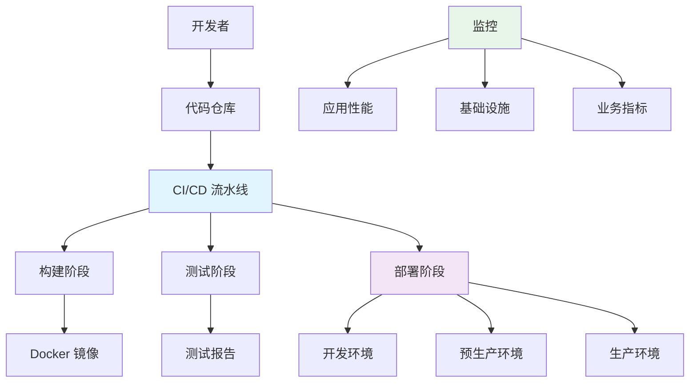

# PHP 项目部署与 CI/CD 实践指南

## 1. 概述

PHP 项目的现代化部署涉及容器化、自动化测试、持续集成和持续部署。本指南涵盖从开发到生产的完整 CI/CD 流程。

## 2. 架构设计

### 2.1 部署架构


### 2.2 技术栈选择
- **运行时**: PHP 8.1+ with FPM, Nginx
- **容器化**: Docker + Docker Compose
- **CI/CD**: GitHub Actions / GitLab CI
- **部署**: Kubernetes / Docker Swarm
- **监控**: Prometheus, Grafana, ELK
- **配置管理**: Ansible, Terraform

## 3. 容器化配置

### 3.1 Dockerfile 配置
```dockerfile
# 多阶段构建：构建阶段
FROM composer:2.4 as builder

WORKDIR /app
COPY . .
RUN composer install \
    --no-dev \
    --no-interaction \
    --no-progress \
    --optimize-autoloader \
    --ignore-platform-reqs

# 多阶段构建：运行时阶段
FROM php:8.2-fpm-alpine

# 安装系统依赖
RUN apk add --no-cache \
    nginx \
    supervisor \
    libzip-dev \
    libpng-dev \
    libjpeg-turbo-dev \
    freetype-dev \
    oniguruma-dev

# 安装 PHP 扩展
RUN docker-php-ext-configure gd --with-freetype --with-jpeg
RUN docker-php-ext-install \
    pdo_mysql \
    mysqli \
    zip \
    gd \
    mbstring \
    opcache

# 配置 PHP
COPY docker/php/php.ini /usr/local/etc/php/conf.d/custom.ini
COPY docker/php/www.conf /usr/local/etc/php-fpm.d/www.conf

# 配置 Nginx
COPY docker/nginx/nginx.conf /etc/nginx/nginx.conf
COPY docker/nginx/conf.d /etc/nginx/conf.d

# 配置 Supervisor
COPY docker/supervisor/supervisord.conf /etc/supervisor/supervisord.conf

# 复制应用代码
COPY --from=builder /app /var/www/html
RUN chown -R www-data:www-data /var/www/html

# 暴露端口
EXPOSE 80

# 启动命令
CMD ["/usr/bin/supervisord", "-c", "/etc/supervisor/supervisord.conf"]
```

### 3.2 Docker Compose 配置
```yaml
version: '3.8'

services:
  app:
    build:
      context: .
      dockerfile: Dockerfile
    image: your-app:${TAG:-latest}
    ports:
      - "8000:80"
    environment:
      - APP_ENV=${APP_ENV:-production}
      - APP_DEBUG=${APP_DEBUG:-false}
      - DB_HOST=db
      - DB_PORT=3306
      - REDIS_HOST=redis
      - REDIS_PORT=6379
    volumes:
      - ./storage:/var/www/html/storage
      - ./bootstrap/cache:/var/www/html/bootstrap/cache
    depends_on:
      - db
      - redis
    networks:
      - app-network

  db:
    image: mysql:8.0
    environment:
      MYSQL_ROOT_PASSWORD: ${DB_ROOT_PASSWORD}
      MYSQL_DATABASE: ${DB_DATABASE}
      MYSQL_USER: ${DB_USERNAME}
      MYSQL_PASSWORD: ${DB_PASSWORD}
    volumes:
      - mysql_data:/var/lib/mysql
    ports:
      - "3306:3306"
    networks:
      - app-network

  redis:
    image: redis:7-alpine
    ports:
      - "6379:6379"
    volumes:
      - redis_data:/data
    networks:
      - app-network

  nginx:
    image: nginx:alpine
    ports:
      - "80:80"
    volumes:
      - ./docker/nginx/conf.d:/etc/nginx/conf.d
      - ./public:/var/www/html/public:ro
    depends_on:
      - app
    networks:
      - app-network

volumes:
  mysql_data:
  redis_data:

networks:
  app-network:
    driver: bridge
```

## 4. CI/CD 流水线配置

### 4.1 GitHub Actions 配置
```yaml
# .github/workflows/ci-cd.yml
name: PHP CI/CD Pipeline

on:
  push:
    branches: [ main, develop ]
  pull_request:
    branches: [ main ]

env:
  APP_NAME: your-php-app
  REGISTRY: ghcr.io
  IMAGE_NAME: ${{ github.repository }}

jobs:
  test:
    name: Run Tests
    runs-on: ubuntu-latest
    services:
      mysql:
        image: mysql:8.0
        env:
          MYSQL_ROOT_PASSWORD: root
          MYSQL_DATABASE: testing
        ports:
          - 3306:3306
        options: --health-cmd="mysqladmin ping" --health-interval=10s --health-timeout=5s --health-retries=3

      redis:
        image: redis:7-alpine
        ports:
          - 6379:6379

    steps:
    - name: Checkout code
      uses: actions/checkout@v3

    - name: Setup PHP
      uses: shivammathur/setup-php@v2
      with:
        php-version: '8.2'
        extensions: mbstring, zip, gd, pdo_mysql
        tools: composer

    - name: Install dependencies
      run: composer install --no-progress --no-interaction

    - name: Run tests
      run: |
        cp .env.testing .env
        php artisan key:generate
        php artisan migrate --force
        php artisan test --verbose
      env:
        DB_HOST: 127.0.0.1
        DB_PORT: 3306
        DB_DATABASE: testing
        DB_USERNAME: root
        DB_PASSWORD: root
        REDIS_HOST: 127.0.0.1
        REDIS_PORT: 6379

  build:
    name: Build and Push
    runs-on: ubuntu-latest
    needs: test
    if: github.event_name == 'push' && (github.ref == 'refs/heads/main' || github.ref == 'refs/heads/develop')
    
    steps:
    - name: Checkout code
      uses: actions/checkout@v3

    - name: Set up Docker Buildx
      uses: docker/setup-buildx-action@v2

    - name: Login to GitHub Container Registry
      uses: docker/login-action@v2
      with:
        registry: ${{ env.REGISTRY }}
        username: ${{ github.actor }}
        password: ${{ secrets.GITHUB_TOKEN }}

    - name: Build and push
      uses: docker/build-push-action@v4
      with:
        context: .
        push: true
        tags: |
          ${{ env.REGISTRY }}/${{ env.IMAGE_NAME }}:latest
          ${{ env.REGISTRY }}/${{ env.IMAGE_NAME }}:${{ github.sha }}
        cache-from: type=gha
        cache-to: type=gha,mode=max

  deploy:
    name: Deploy to Environment
    runs-on: ubuntu-latest
    needs: build
    if: github.event_name == 'push' && github.ref == 'refs/heads/main'
    
    steps:
    - name: Checkout code
      uses: actions/checkout@v3

    - name: Deploy to production
      uses: appleboy/ssh-action@v0.1.10
      with:
        host: ${{ secrets.PRODUCTION_HOST }}
        username: ${{ secrets.PRODUCTION_USER }}
        key: ${{ secrets.PRODUCTION_SSH_KEY }}
        script: |
          cd /opt/${{ env.APP_NAME }}
          docker pull ${{ env.REGISTRY }}/${{ env.IMAGE_NAME }}:${{ github.sha }}
          docker-compose stop app
          docker-compose up -d app
          docker system prune -af
```

### 4.2 GitLab CI 配置
```yaml
# .gitlab-ci.yml
stages:
  - test
  - build
  - deploy

variables:
  APP_NAME: your-php-app
  DOCKER_REGISTRY: registry.gitlab.com/your-namespace/your-project

test:
  stage: test
  image: php:8.2-alpine
  services:
    - name: mysql:8.0
      alias: mysql
    - name: redis:7-alpine
      alias: redis
  variables:
    DB_HOST: mysql
    DB_PORT: 3306
    DB_DATABASE: testing
    DB_USERNAME: root
    DB_PASSWORD: root
    REDIS_HOST: redis
    REDIS_PORT: 6379
  before_script:
    - apk add --no-cache mysql-client redis
    - composer install --no-progress --no-interaction
    - cp .env.testing .env
    - php artisan key:generate
  script:
    - php artisan migrate --force
    - php artisan test --verbose
  after_script:
    - php artisan migrate:reset

build:
  stage: build
  image: docker:20.10
  services:
    - docker:20.10-dind
  variables:
    DOCKER_HOST: tcp://docker:2375
    DOCKER_DRIVER: overlay2
  before_script:
    - docker login -u $CI_REGISTRY_USER -p $CI_REGISTRY_PASSWORD $CI_REGISTRY
  script:
    - docker build -t $DOCKER_REGISTRY:$CI_COMMIT_SHA .
    - docker push $DOCKER_REGISTRY:$CI_COMMIT_SHA
    - docker tag $DOCKER_REGISTRY:$CI_COMMIT_SHA $DOCKER_REGISTRY:latest
    - docker push $DOCKER_REGISTRY:latest
  only:
    - main
    - develop

deploy_production:
  stage: deploy
  image: alpine:3.16
  before_script:
    - apk add --no-cache openssh-client
    - mkdir -p ~/.ssh
    - echo "$PRODUCTION_SSH_KEY" > ~/.ssh/id_rsa
    - chmod 600 ~/.ssh/id_rsa
    - ssh-keyscan -H $PRODUCTION_HOST >> ~/.ssh/known_hosts
  script:
    - ssh $PRODUCTION_USER@$PRODUCTION_HOST "
        cd /opt/$APP_NAME &&
        docker login -u $CI_REGISTRY_USER -p $CI_REGISTRY_PASSWORD $CI_REGISTRY &&
        docker pull $DOCKER_REGISTRY:$CI_COMMIT_SHA &&
        docker-compose stop app &&
        docker-compose up -d app &&
        docker system prune -af
      "
  environment:
    name: production
    url: https://your-app.com
  only:
    - main
```

## 5. 部署策略

### 5.1 蓝绿部署配置
```yaml
# docker-compose.prod.yml
version: '3.8'

services:
  app-blue:
    image: your-app:blue
    deploy:
      replicas: 3
    networks:
      - app-network
    environment:
      - APP_COLOR=blue

  app-green:
    image: your-app:green
    deploy:
      replicas: 0
    networks:
      - app-network
    environment:
      - APP_COLOR=green

  nginx:
    image: nginx:alpine
    ports:
      - "80:80"
    volumes:
      - ./docker/nginx/conf.d:/etc/nginx/conf.d
    depends_on:
      - app-blue
      - app-green
    networks:
      - app-network

networks:
  app-network:
```

### 5.2 Kubernetes 部署配置
```yaml
# k8s/deployment.yaml
apiVersion: apps/v1
kind: Deployment
metadata:
  name: php-app
  namespace: production
spec:
  replicas: 3
  selector:
    matchLabels:
      app: php-app
  strategy:
    type: RollingUpdate
    rollingUpdate:
      maxSurge: 1
      maxUnavailable: 0
  template:
    metadata:
      labels:
        app: php-app
    spec:
      containers:
      - name: app
        image: your-registry/your-app:latest
        ports:
        - containerPort: 9000
        env:
        - name: APP_ENV
          value: "production"
        - name: DB_HOST
          valueFrom:
            secretKeyRef:
              name: app-secrets
              key: db-host
        resources:
          requests:
            memory: "256Mi"
            cpu: "250m"
          limits:
            memory: "512Mi"
            cpu: "500m"
        livenessProbe:
          httpGet:
            path: /health
            port: 9000
          initialDelaySeconds: 30
          periodSeconds: 10
        readinessProbe:
          httpGet:
            path: /health
            port: 9000
          initialDelaySeconds: 5
          periodSeconds: 5

---
apiVersion: v1
kind: Service
metadata:
  name: php-app-service
  namespace: production
spec:
  selector:
    app: php-app
  ports:
  - port: 80
    targetPort: 9000
  type: ClusterIP
```

## 6. 监控与日志

### 6.1 应用监控配置
```yaml
# docker-compose.monitoring.yml
version: '3.8'

services:
  prometheus:
    image: prom/prometheus:latest
    ports:
      - "9090:9090"
    volumes:
      - ./monitoring/prometheus.yml:/etc/prometheus/prometheus.yml
      - prometheus_data:/prometheus
    command:
      - '--config.file=/etc/prometheus/prometheus.yml'
      - '--storage.tsdb.path=/prometheus'
      - '--web.console.libraries=/etc/prometheus/console_libraries'
      - '--web.console.templates=/etc/prometheus/console_templates'
    networks:
      - monitoring

  grafana:
    image: grafana/grafana:latest
    ports:
      - "3000:3000"
    environment:
      - GF_SECURITY_ADMIN_PASSWORD=admin
    volumes:
      - grafana_data:/var/lib/grafana
      - ./monitoring/dashboards:/etc/grafana/provisioning/dashboards
    depends_on:
      - prometheus
    networks:
      - monitoring

  node-exporter:
    image: prom/node-exporter:latest
    ports:
      - "9100:9100"
    networks:
      - monitoring

volumes:
  prometheus_data:
  grafana_data:

networks:
  monitoring:
    driver: bridge
```

### 6.2 PHP-FPM 监控配置
```ini
; php-fpm.conf
[global]
pm.status_path = /status
ping.path = /ping

[www]
pm = dynamic
pm.max_children = 50
pm.start_servers = 5
pm.min_spare_servers = 5
pm.max_spare_servers = 10
pm.max_requests = 500

; 启用性能监控
slowlog = /var/log/php-fpm/slow.log
request_slowlog_timeout = 5s
```

## 7. 安全配置

### 7.1 安全加固配置
```dockerfile
# 安全加固的 Dockerfile
FROM php:8.2-fpm-alpine

# 使用非 root 用户
RUN addgroup -g 1000 -S www && \
    adduser -u 1000 -S www -G www

# 安全配置
RUN apk add --no-cache --virtual .build-deps $PHPIZE_DEPS && \
    apk add --no-cache --virtual .runtime-deps \
        libzip \
        libpng \
        libjpeg-turbo \
        freetype \
        oniguruma

# 安装扩展
RUN docker-php-ext-install \
    pdo_mysql \
    zip \
    gd \
    mbstring \
    opcache

# 清理构建依赖
RUN apk del .build-deps && \
    rm -rf /var/cache/apk/*

# 安全配置
RUN echo "expose_php = Off" >> /usr/local/etc/php/conf.d/security.ini && \
    echo "display_errors = Off" >> /usr/local/etc/php/conf.d/security.ini && \
    echo "log_errors = On" >> /usr/local/etc/php/conf.d/security.ini

# 使用非 root 用户
USER www

WORKDIR /var/www/html

COPY --chown=www:www . .

EXPOSE 9000

CMD ["php-fpm"]
```

### 7.2 Nginx 安全配置
```nginx
# nginx.conf
server {
    listen 80;
    server_name your-app.com;
    
    # 安全头
    add_header X-Frame-Options "SAMEORIGIN" always;
    add_header X-XSS-Protection "1; mode=block" always;
    add_header X-Content-Type-Options "nosniff" always;
    add_header Referrer-Policy "no-referrer-when-downgrade" always;
    add_header Content-Security-Policy "default-src 'self' http: https: data: blob: 'unsafe-inline'" always;
    
    # 隐藏服务器信息
    server_tokens off;
    
    # 文件上传限制
    client_max_body_size 100m;
    
    # 根目录配置
    root /var/www/html/public;
    index index.php index.html;
    
    # 静态文件缓存
    location ~* \.(jpg|jpeg|png|gif|ico|css|js)$ {
        expires 1y;
        add_header Cache-Control "public, immutable";
    }
    
    # PHP 处理
    location ~ \.php$ {
        fastcgi_pass app:9000;
        fastcgi_index index.php;
        fastcgi_param SCRIPT_FILENAME $document_root$fastcgi_script_name;
        include fastcgi_params;
        
        # 安全限制
        fastcgi_param PHP_ADMIN_VALUE "open_basedir=/var/www/html:/tmp";
    }
    
    # 禁止访问敏感文件
    location ~ /\.(?!well-known).* {
        deny all;
    }
    
    location ~ /(vendor|node_modules|storage|env) {
        deny all;
    }
}
```

## 8. 性能优化

### 8.1 PHP 性能优化
```ini
; php.ini
[opcache]
opcache.enable=1
opcache.enable_cli=1
opcache.memory_consumption=128
opcache.interned_strings_buffer=8
opcache.max_accelerated_files=10000
opcache.revalidate_freq=2
opcache.fast_shutdown=1

[realpath_cache]
realpath_cache_size=4096K
realpath_cache_ttl=600

[Session]
session.gc_maxlifetime=1440
session.cookie_lifetime=0
session.use_strict_mode=1
```

### 8.2 Composer 优化
```bash
#!/bin/bash
# optimize-composer.sh

# 生产环境优化
composer install \
    --no-dev \
    --no-interaction \
    --no-progress \
    --optimize-autoloader \
    --ignore-platform-reqs

# 生成类映射
composer dump-autoload --optimize

# 清理缓存
composer clear-cache
```

## 9. 数据库迁移与维护

### 9.1 数据库迁移脚本
```bash
#!/bin/bash
# database-migration.sh

set -e

# 等待数据库就绪
while ! mysqladmin ping -h"$DB_HOST" -P"$DB_PORT" -u"$DB_USERNAME" -p"$DB_PASSWORD" --silent; do
    echo "Waiting for database..."
    sleep 2
done

# 运行迁移
php artisan migrate --force

# 运行数据填充（可选）
if [ "$SEED_DATABASE" = "true" ]; then
    php artisan db:seed --force
fi

# 优化应用
php artisan optimize
php artisan route:cache
php artisan view:cache

echo "Database migration completed successfully!"
```

## 10. 回滚策略

### 10.1 自动化回滚配置
```yaml
# .github/workflows/rollback.yml
name: Rollback Deployment

on:
  workflow_dispatch:
    inputs:
      environment:
        description: 'Environment to rollback'
        required: true
        default: 'production'
      version:
        description: 'Version to rollback to'
        required: false

jobs:
  rollback:
    runs-on: ubuntu-latest
    steps:
    - name: Checkout code
      uses: actions/checkout@v3

    - name: Rollback deployment
      uses: appleboy/ssh-action@v0.1.10
      with:
        host: ${{ secrets.PRODUCTION_HOST }}
        username: ${{ secrets.PRODUCTION_USER }}
        key: ${{ secrets.PRODUCTION_SSH_KEY }}
        script: |
          cd /opt/your-app
          
          # 获取当前版本
          CURRENT_VERSION=$(docker inspect your-app --format '{{.Config.Image}}' | cut -d: -f2)
          
          # 回滚到指定版本或上一个版本
          if [ -n "${{ github.event.inputs.version }}" ]; then
            ROLLBACK_VERSION="${{ github.event.inputs.version }}"
          else
            # 获取上一个版本
            ROLLBACK_VERSION=$(docker images --filter reference=your-registry/your-app --format "{{.Tag}}" | grep -v latest | sort -r | head -2 | tail -1)
          fi
          
          echo "Rolling back from $CURRENT_VERSION to $ROLLBACK_VERSION"
          
          # 执行回滚
          docker pull your-registry/your-app:$ROLLBACK_VERSION
          docker-compose stop app
          docker-compose up -d app
          
          # 验证回滚
          sleep 10
          curl -f http://localhost:8080/health || exit 1
          
          echo "Rollback completed successfully to version $ROLLBACK_VERSION"
```
