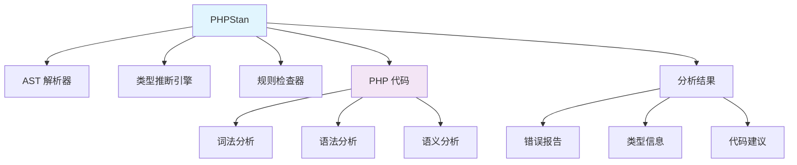

# PHPStan

## 1. 概述

PHPStan 是一个 PHP 静态分析工具，用于在代码运行前发现潜在错误。它通过分析代码类型、语法和逻辑来提供高质量的代码检查，帮助开发者编写更可靠的 PHP 代码。

## 2. 核心概念

### 2.1 架构组件


### 2.2 关键特性
- **静态类型检查**: 在运行前发现类型错误
- **多级别分析**: 支持 0-9 不同严格级别
- **框架支持**: 原生支持 Laravel、Symfony 等框架
- **扩展系统**: 丰富的扩展生态系统
- **IDE 集成**: 支持主流 IDE 和编辑器
- **持续集成**: 易于集成到 CI/CD 流程

## 3. 安装与配置

### 3.1 通过 Composer 安装
```bash
#!/bin/bash
# install-phpstan.sh

# 作为开发依赖安装
composer require --dev phpstan/phpstan

# 全局安装
composer global require phpstan/phpstan

# 安装框架扩展（Laravel 示例）
composer require --dev phpstan/phpstan-laravel

# 安装扩展包
composer require --dev phpstan/extension-installer
composer require --dev phpstan/phpstan-deprecation-rules
composer require --dev phpstan/phpstan-strict-rules

# 验证安装
./vendor/bin/phpstan --version
phpstan --version # 全局安装时

# 安装 PHPStan 扩展
composer require --dev phpstan/phpstan-phpunit
composer require --dev phpstan/phpstan-symfony
composer require --dev phpstan/phpstan-doctrine
```

### 3.2 配置文件
```neon
# phpstan.neon
parameters:
    # 分析级别 (0-9)
    level: 8
    
    # 要分析的路径
    paths:
        - src
        - app
        - tests
    
    # 排除的文件和目录
    excludePaths:
        - src/Migrations/
        - src/Console/
        - tests/fixtures/
        - vendor/
    
    # 文件扩展名
    fileExtensions:
        - php
    
    # 并行处理
    parallel:
        processTimeout: 300.0
        maximumNumberOfProcesses: 4
    
    # 内存限制
    memoryLimit: 2G
    
    # 类型推断设置
    inferPrivatePropertyTypeFromConstructor: true
    checkMissingIterableValueType: false
    
    # 通用设置
    reportUnmatchedIgnoredErrors: false
    treatPhpDocTypesAsCertain: true
    
    # 框架特定配置
    symfony:
        container_xml_path: var/cache/dev/appDevDebugProjectContainer.xml
    
    # 忽略的错误模式
    ignoreErrors:
        - '#Call to an undefined method.*#'
        - '#Access to an undefined property.*#'
        - '#Parameter.*#should be contravariant#'
    
    # 自定义规则
    rules:
        - PHPStan\Rules\Functions\CallToFunctionParametersRule
    
    # 引导文件
    bootstrapFiles:
        - vendor/autoload.php
        - bootstrap/app.php
    
    # 分析器配置
    scanFiles:
        - src/helpers.php
    
    # 通用例外
    universalObjectCratesClasses:
        - stdClass
        - SimpleXMLElement

includes:
    - vendor/phpstan/phpstan-deprecation-rules/rules.neon
    - vendor/phpstan/phpstan-strict-rules/rules.neon
    - vendor/phpstan/phpstan-phpunit/rules.neon
    - vendor/phpstan/phpstan-laravel/rules.neon
```

## 4. 基础使用

### 4.1 基本命令
```bash
#!/bin/bash
# phpstan-basic-usage.sh

# 分析整个项目
./vendor/bin/phpstan analyse

# 分析特定目录
./vendor/bin/phpstan analyse src
./vendor/bin/phpstan analyse src tests

# 分析特定文件
./vendor/bin/phpstan analyse src/Service/UserService.php

# 使用不同级别
./vendor/bin/phpstan analyse --level=5
./vendor/bin/phpstan analyse --level=max

# 生成基准文件（首次运行）
./vendor/bin/phpstan analyse --generate-baseline

# 使用基准文件
./vendor/bin/phpstan analyse --configuration=phpstan-baseline.neon

# 格式化输出
./vendor/bin/phpstan analyse --format=table
./vendor/bin/phpstan analyse --format=json
./vendor/bin/phpstan analyse --format=github

# 详细输出
./vendor/bin/phpstan analyse --verbose
./vendor/bin/phpstan analyse --debug

# 内存限制
./vendor/bin/phpstan analyse --memory-limit=4G

# 并行处理
./vendor/bin/phpstan analyse --procs=4
```

### 4.2 错误级别说明
```bash
#!/bin/bash
# phpstan-levels.sh

# 级别 0: 基本检查
# - 语法错误
# - 未定义的类、函数、常量
./vendor/bin/phpstan analyse --level=0

# 级别 1: 变量存在性检查
# - 未定义的变量
# - 未使用的变量
./vendor/bin/phpstan analyse --level=1

# 级别 2: 返回类型检查
# - 未返回值的函数
# - 错误的返回类型
./vendor/bin/phpstan analyse --level=2

# 级别 3: 赋值类型检查
# - 错误的赋值类型
# - 参数类型不匹配
./vendor/bin/phpstan analyse --level=3

# 级别 4: 数组形状检查
# - 数组访问越界
# - 数组形状不匹配
./vendor/bin/phpstan analyse --level=4

# 级别 5: 方法调用检查
# - 未定义的方法
# - 方法参数不匹配
./vendor/bin/phpstan analyse --level=5

# 级别 6: 属性访问检查
# - 未定义的属性
# - 属性类型不匹配
./vendor/bin/phpstan analyse --level=6

# 级别 7: 函数返回类型检查
# - 函数返回类型推断
./vendor/bin/phpstan analyse --level=7

# 级别 8: 严格类型检查
# - 更严格的类型推断
./vendor/bin/phpstan analyse --level=8

# 级别 9: 最大严格级别
# - 最严格的检查规则
./vendor/bin/phpstan analyse --level=max
```

## 5. 高级配置

### 5.1 框架特定配置
```neon
# phpstan.neon - Laravel 配置
parameters:
    level: 8
    paths:
        - app
        - src
        - tests
    
    # Laravel 特定配置
    Laravel:
        facadeRoots:
            - Illuminate\Support\Facades\Auth
            - Illuminate\Support\Facades\DB
            - Illuminate\Support\Facades\Cache
        
        # 容器绑定
        containerMocks:
            Illuminate\Contracts\Cache\Repository: Illuminate\Cache\Repository
            Illuminate\Contracts\Config\Repository: Illuminate\Config\Repository
        
        # 模型属性
        modelPropertyInferrence: true
        
        # 集合方法
        collectionMethods:
            Illuminate\Support\Collection: true

includes:
    - vendor/phpstan/phpstan-laravel/extension.neon
    - vendor/phpstan/phpstan-laravel/rules.neon
```

### 5.2 自定义规则配置
```neon
# phpstan.neon - 自定义规则
parameters:
    # 自定义规则服务
    services:
        -
            class: App\PHPStan\Rules\CustomRule
            tags:
                - phpstan.rules.rule
        
        -
            class: App\PHPStan\Rules\NamingConventionRule
            tags:
                - phpstan.rules.rule
    
    # 自定义规则配置
    customRules:
        forbidGlobalFunctions: true
        requireTypeHints: true
        enforceNamingConventions: true
    
    # 忽略的类和方法
    excludeClasses:
        - ThirdParty\LegacyClass
        - OldNamespace\*
    
    excludeMethods:
        - App\Service\*::__construct
        - App\Repository\*::find*
    
    # 类型别名
    typeAliases:
        Collection: Illuminate\Support\Collection
        Model: Illuminate\Database\Eloquent\Model
    
    # 动态方法返回类型
    dynamicMethodReturnTypeExtensions:
        -
            class: Illuminate\Support\Collection
            method: first
            type: mixed
        -
            class: Illuminate\Database\Eloquent\Builder
            method: get
            type: Illuminate\Support\Collection
```

## 6. 自定义规则开发

### 6.1 基础规则类
```php
<?php
// src/PHPStan/Rules/CustomRule.php

namespace App\PHPStan\Rules;

use PhpParser\Node;
use PhpParser\Node\Expr\FuncCall;
use PHPStan\Analyser\Scope;
use PHPStan\Rules\Rule;
use PHPStan\Rules\RuleErrorBuilder;

/**
 * @implements Rule<FuncCall>
 */
class CustomRule implements Rule
{
    public function getNodeType(): string
    {
        return FuncCall::class;
    }

    public function processNode(Node $node, Scope $scope): array
    {
        if (!$node->name instanceof Node\Name) {
            return [];
        }

        $functionName = $node->name->toString();
        
        // 禁止使用某些全局函数
        $forbiddenFunctions = [
            'var_dump',
            'dd',
            'dump',
            'exit',
            'die'
        ];

        if (in_array($functionName, $forbiddenFunctions, true)) {
            return [
                RuleErrorBuilder::message(sprintf(
                    'Function %s() is forbidden in production code',
                    $functionName
                ))->line($node->getStartLine())->build(),
            ];
        }

        return [];
    }
}
```

### 6.2 复杂规则示例
```php
<?php
// src/PHPStan/Rules/NamingConventionRule.php

namespace App\PHPStan\Rules;

use PhpParser\Node;
use PhpParser\Node\Stmt\Class_;
use PhpParser\Node\Stmt\Interface_;
use PhpParser\Node\Stmt\Trait_;
use PHPStan\Analyser\Scope;
use PHPStan\Rules\Rule;
use PHPStan\Rules\RuleErrorBuilder;

/**
 * @implements Rule<Class_|Interface_|Trait_>
 */
class NamingConventionRule implements Rule
{
    public function getNodeType(): string
    {
        return Class_::class;
    }

    public function processNode(Node $node, Scope $scope): array
    {
        $errors = [];
        
        if (!$node->name instanceof Node\Identifier) {
            return [];
        }

        $className = $node->name->name;
        
        // 检查类名是否符合规范
        if (!$this->isValidClassName($className)) {
            $errors[] = RuleErrorBuilder::message(sprintf(
                'Class name "%s" does not follow naming conventions. Should use PascalCase.',
                $className
            ))->line($node->getStartLine())->build();
        }

        // 检查接口命名
        if ($node instanceof Interface_ && !str_ends_with($className, 'Interface')) {
            $errors[] = RuleErrorBuilder::message(sprintf(
                'Interface name "%s" should end with "Interface"',
                $className
            ))->line($node->getStartLine())->build();
        }

        // 检查 Trait 命名
        if ($node instanceof Trait_ && !str_ends_with($className, 'Trait')) {
            $errors[] = RuleErrorBuilder::message(sprintf(
                'Trait name "%s" should end with "Trait"',
                $className
            ))->line($node->getStartLine())->build();
        }

        return $errors;
    }

    private function isValidClassName(string $name): bool
    {
        // PascalCase 验证
        return preg_match('/^[A-Z][a-zA-Z0-9]*$/', $name) === 1;
    }
}
```

## 7. 集成与工作流

### 7.1 IDE 集成配置
```json
// .vscode/settings.json
{
    "phpstan.enabled": true,
    "phpstan.level": 8,
    "phpstan.configPath": "phpstan.neon",
    "phpstan.memoryLimit": "2G",
    "phpstan.analyseOnSave": true,
    "phpstan.analyseOnType": false,
    
    // PHPStan 输出配置
    "phpstan.output": {
        "level": "error",
        "formatter": "table"
    },
    
    // 排除的文件
    "phpstan.ignore": [
        "vendor/**",
        "tests/fixtures/**",
        "**/Migrations/**"
    ],
    
    // 与其他扩展的集成
    "[php]": {
        "editor.defaultFormatter": "bmewburn.vscode-intelephense-client"
    }
}
```

### 7.2 Git 钩子集成
```bash
#!/bin/bash
# setup-git-hooks.sh

# 创建 pre-commit 钩子
cat > .git/hooks/pre-commit << 'EOF'
#!/bin/bash

# 运行 PHPStan 检查
STAGED_FILES=$(git diff --cached --name-only --diff-filter=ACM | grep -E '\.(php)$')

if [[ -n "$STAGED_FILES" ]]; then
    echo "Running PHPStan on staged PHP files..."
    
    # 只检查暂存的文件
    ./vendor/bin/phpstan analyse $STAGED_FILES --level=8 --no-progress
    
    if [[ $? -ne 0 ]]; then
        echo "PHPStan found errors. Please fix them before committing."
        exit 1
    fi
    
    echo "PHPStan check passed!"
fi

exit 0
EOF

chmod +x .git/hooks/pre-commit

# 创建 pre-push 钩子
cat > .git/hooks/pre-push << 'EOF'
#!/bin/bash

# 运行完整的 PHPStan 检查
echo "Running full PHPStan analysis before push..."

./vendor/bin/phpstan analyse --level=8 --memory-limit=2G

if [[ $? -ne 0 ]]; then
    echo "PHPStan found errors. Please fix them before pushing."
    exit 1
fi

echo "PHPStan check passed! Ready to push."
exit 0
EOF

chmod +x .git/hooks/pre-push
```

## 8. 持续集成配置

### 8.1 GitHub Actions 配置
```yaml
# .github/workflows/phpstan.yml
name: PHPStan Static Analysis

on:
  push:
    branches: [ main, develop ]
  pull_request:
    branches: [ main ]

jobs:
  phpstan:
    name: PHPStan Analysis
    runs-on: ubuntu-latest
    strategy:
      matrix:
        php: [8.1, 8.2, 8.3]
        level: [8]

    steps:
    - name: Checkout code
      uses: actions/checkout@v3

    - name: Setup PHP
      uses: shivammathur/setup-php@v2
      with:
        php-version: ${{ matrix.php }}
        extensions: mbstring, xml, json, intl
        tools: composer
        coverage: none

    - name: Install dependencies
      run: |
        composer install --no-interaction --no-progress --optimize-autoloader
        composer dump-autoload

    - name: Run PHPStan analysis
      run: |
        ./vendor/bin/phpstan analyse \
          --level=${{ matrix.level }} \
          --memory-limit=2G \
          --no-progress \
          --error-format=github

    - name: Generate baseline (if needed)
      if: matrix.level == '8' && matrix.php == '8.2'
      run: |
        ./vendor/bin/phpstan analyse --generate-baseline
        git add phpstan-baseline.neon

    - name: Upload baseline artifact
      if: matrix.level == '8' && matrix.php == '8.2'
      uses: actions/upload-artifact@v3
      with:
        name: phpstan-baseline
        path: phpstan-baseline.neon

    - name: Run with baseline
      if: matrix.level == '8' && matrix.php == '8.2'
      run: |
        ./vendor/bin/phpstan analyse \
          --configuration=phpstan-baseline.neon \
          --memory-limit=2G
```

### 8.2 GitLab CI 配置
```yaml
# .gitlab-ci.yml
stages:
  - test
  - analysis

phpstan:
  stage: analysis
  image: php:8.2-cli
  variables:
    COMPOSER_MEMORY_LIMIT: 2G
  before_script:
    - apt-get update && apt-get install -y git unzip
    - curl -sS https://getcomposer.org/installer | php -- --install-dir=/usr/local/bin --filename=composer
    - composer install --no-interaction --no-progress --optimize-autoloader
  script:
    - ./vendor/bin/phpstan analyse
      --level=8
      --memory-limit=2G
      --error-format=gitlab
  artifacts:
    when: always
    reports:
      codequality: gl-codequality-report.json
    paths:
      - phpstan-baseline.neon
  cache:
    paths:
      - vendor/
    key: ${CI_COMMIT_REF_SLUG}
```

## 9. 高级技巧和优化

### 9.1 性能优化配置
```neon
# phpstan.neon - 性能优化
parameters:
    # 并行处理配置
    parallel:
        processTimeout: 600.0
        maximumNumberOfProcesses: 8
        jobSize: 20
    
    # 内存优化
    memoryLimit: 4G
    tmpDir: /tmp/phpstan
    
    # 缓存配置
    cache:
        directory: .phpstan/cache
        enabled: true
        # 开发环境禁用缓存
        # enabled: %env::PHPSTAN_CACHE_ENABLED%
    
    # 分析优化
    scanFiles: false
    bootstrapFiles:
        - vendor/autoload.php
    
    # 类型推断优化
    inferPrivatePropertyTypeFromConstructor: true
    checkMissingIterableValueType: false
    checkGenericClassInNonGenericObjectType: false
    
    # 排除大型目录
    excludePaths:
        - vendor/**
        - node_modules/**
        - storage/**
        - public/**
    
    # 特定文件排除
    excludePathsAnalyse:
        - tests/**/fixtures/**
        - src/**/Legacy/**
    
    # 通用对象箱
    universalObjectCratesClasses:
        - stdClass
        - SimpleXMLElement
        - DOMDocument
```

### 9.2 错误处理和忽略
```neon
# phpstan.neon - 错误处理
parameters:
    # 忽略特定错误模式
    ignoreErrors:
        # 忽略未定义的魔法方法
        - '#Call to an undefined method.*#'
        - '#Access to an undefined property.*#'
        
        # 忽略第三方包的错误
        - '#Parameter.*#should be contravariant#'
        - '#Method.*#should return.*#'
        
        # 忽略特定文件的错误
        - message: '#Call to an undefined method.*#'
          path: src/Legacy/OldService.php
        - message: '#Access to an undefined property.*#'
          paths:
            - src/Models/OldModel.php
            - src/Repository/OldRepository.php
        
        # 忽略特定行的错误
        - message: '#Undefined variable.*#'
          path: src/Service/UserService.php
          line: 42
        - message: '#Method.*#should return.*#'
          path: src/Controller/HomeController.php
          lines: [15, 23, 37]
    
    # 报告未匹配的忽略错误
    reportUnmatchedIgnoredErrors: true
    
    # 错误抑制
    suppressErrors:
        - '#Call to deprecated method.*#'
        - '#Use of deprecated constant.*#'
    
    # 基准文件配置
    baseline: phpstan-baseline.neon
    baselineErrors: 0
    
    # 自定义错误格式
    errorFormat: '
        {message}
        in {file}:{line}
        {nodeType}: {nodeText}
    '
    
    # 错误级别覆盖
    errorLevels:
        checkMissingIterableValueType: 0
        checkGenericClassInNonGenericObjectType: 1
```
