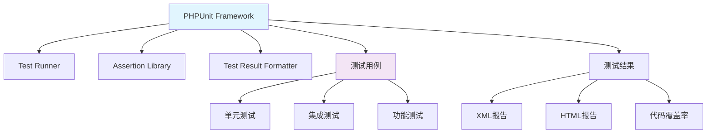

# PHPUnit

## 1. 概述

PHPUnit 是 PHP 编程语言最流行的单元测试框架。它提供了丰富的断言方法和测试功能，帮助开发者编写可靠的测试用例，确保代码质量和功能正确性。

## 2. 核心概念

### 2.1 架构组件


### 2.2 关键特性
- **丰富的断言**: 提供多种断言方法验证预期结果
- **数据供给器**: 支持参数化测试和数据驱动测试
- **测试替身**: 支持 Mock 对象、Stub、Spy 等测试替身
- **代码覆盖率**: 集成代码覆盖率分析
- **扩展性**: 支持通过扩展定制测试行为
- **多种输出格式**: 支持多种测试结果输出格式

## 3. 安装与配置

### 3.1 通过 Composer 安装
```bash
#!/bin/bash
# install-phpunit.sh

# 作为开发依赖安装
composer require --dev phpunit/phpunit ^9.0

# 全局安装
wget -O phpunit https://phar.phpunit.de/phpunit-9.phar
chmod +x phpunit
sudo mv phpunit /usr/local/bin/phpunit

# 验证安装
phpunit --version

# 安装扩展（可选）
composer require --dev phpunit/php-code-coverage
composer require --dev phpunit/phpunit-selenium
```

### 3.2 配置文件
```xml
<!-- phpunit.xml -->
<?xml version="1.0" encoding="UTF-8"?>
<phpunit xmlns:xsi="http://www.w3.org/2001/XMLSchema-instance"
         xsi:noNamespaceSchemaLocation="https://schema.phpunit.de/9.3/phpunit.xsd"
         bootstrap="vendor/autoload.php"
         colors="true"
         verbose="true"
         stopOnFailure="false"
         stopOnError="false"
         executionOrder="random"
         cacheResult="true"
         requireCoverage="false">
    
    <testsuites>
        <testsuite name="Unit Tests">
            <directory suffix="Test.php">./tests/Unit</directory>
        </testsuite>
        <testsuite name="Feature Tests">
            <directory suffix="Test.php">./tests/Feature</directory>
        </testsuite>
        <testsuite name="Integration Tests">
            <directory suffix="Test.php">./tests/Integration</directory>
        </testsuite>
    </testsuites>

    <coverage processUncoveredFiles="true"
              includeUncoveredFiles="true"
              ignoreDeprecatedCodeUnits="true">
        <include>
            <directory suffix=".php">./src</directory>
        </include>
        <exclude>
            <directory>./src/Migrations</directory>
            <directory>./src/Console</directory>
            <file>./src/helpers.php</file>
        </exclude>
        <report>
            <clover outputFile="build/logs/clover.xml"/>
            <html outputDirectory="build/coverage"/>
            <text outputFile="build/coverage.txt"/>
            <xml outputDirectory="build/coverage-xml"/>
        </report>
    </coverage>

    <php>
        <env name="APP_ENV" value="testing"/>
        <env name="BCRYPT_ROUNDS" value="4"/>
        <env name="CACHE_DRIVER" value="array"/>
        <env name="DB_CONNECTION" value="sqlite"/>
        <env name="DB_DATABASE" value=":memory:"/>
        <env name="MAIL_DRIVER" value="array"/>
        <env name="QUEUE_CONNECTION" value="sync"/>
        <env name="SESSION_DRIVER" value="array"/>
        <env name="TELESCOPE_ENABLED" value="false"/>
    </php>

    <logging>
        <testdoxText outputFile="build/testdox.txt"/>
        <testdoxHtml outputFile="build/testdox.html"/>
        <junit outputFile="build/junit.xml"/>
    </logging>

    <groups>
        <exclude>
            <group>slow</group>
            <group>integration</group>
        </exclude>
    </groups>
</phpunit>
```

## 4. 编写测试用例

### 4.1 基础测试类
```php
<?php
// tests/Unit/ExampleTest.php

namespace Tests\Unit;

use PHPUnit\Framework\TestCase;
use App\Services\Calculator;

class ExampleTest extends TestCase
{
    /**
     * 基础测试示例
     */
    public function test_basic_example(): void
    {
        $this->assertTrue(true);
    }

    /**
     * 测试计算器加法
     */
    public function test_calculator_addition(): void
    {
        $calculator = new Calculator();
        $result = $calculator->add(2, 3);
        
        $this->assertEquals(5, $result);
        $this->assertSame(5, $result);
    }

    /**
     * 测试数组包含元素
     */
    public function test_array_contains(): void
    {
        $array = [1, 2, 3, 4, 5];
        
        $this->assertContains(3, $array);
        $this->assertCount(5, $array);
        $this->assertIsArray($array);
    }

    /**
     * 测试异常抛出
     */
    public function test_exception_thrown(): void
    {
        $this->expectException(\InvalidArgumentException::class);
        $this->expectExceptionMessage('Invalid value provided');
        
        $calculator = new Calculator();
        $calculator->divide(10, 0);
    }

    /**
     * 测试输出内容
     */
    public function test_output(): void
    {
        $this->expectOutputString('Hello World');
        
        echo 'Hello World';
    }
}
```

### 4.2 数据供给器测试
```php
<?php
// tests/Unit/DataProviderTest.php

namespace Tests\Unit;

use PHPUnit\Framework\TestCase;
use App\Services\Calculator;

class DataProviderTest extends TestCase
{
    /**
     * 数据供给器：提供测试数据
     */
    public function additionProvider(): array
    {
        return [
            [0, 0, 0],
            [0, 1, 1],
            [1, 0, 1],
            [1, 1, 2],
            [2, 3, 5],
            [10, 20, 30],
            [-1, 1, 0],
            [-1, -1, -2]
        ];
    }

    /**
     * @dataProvider additionProvider
     */
    public function test_addition_with_data_provider(int $a, int $b, int $expected): void
    {
        $calculator = new Calculator();
        $result = $calculator->add($a, $b);
        
        $this->assertSame($expected, $result);
    }

    /**
     * 命名数据供给器
     */
    public function namedDataProvider(): array
    {
        return [
            'zeros' => [0, 0, 0],
            'positive numbers' => [2, 3, 5],
            'negative numbers' => [-1, -1, -2],
            'mixed numbers' => [-1, 1, 0]
        ];
    }

    /**
     * @dataProvider namedDataProvider
     */
    public function test_with_named_data_provider(int $a, int $b, int $expected): void
    {
        $calculator = new Calculator();
        $result = $calculator->add($a, $b);
        
        $this->assertSame($expected, $result);
    }
}
```

## 5. 高级测试功能

### 5.1 测试替身 (Mocking)
```php
<?php
// tests/Unit/MockingTest.php

namespace Tests\Unit;

use PHPUnit\Framework\TestCase;
use App\Services\PaymentGateway;
use App\Services\OrderProcessor;
use App\Models\Order;

class MockingTest extends TestCase
{
    /**
     * 创建 Mock 对象
     */
    public function test_mock_object(): void
    {
        // 创建 PaymentGateway 的 Mock 对象
        $mockGateway = $this->createMock(PaymentGateway::class);
        
        // 配置 Mock 对象的行为
        $mockGateway->method('processPayment')
                    ->willReturn(true);
        
        $mockGateway->method('getTransactionId')
                    ->willReturn('txn_123456');
        
        $orderProcessor = new OrderProcessor($mockGateway);
        $order = new Order(['amount' => 100]);
        
        $result = $orderProcessor->process($order);
        
        $this->assertTrue($result);
    }

    /**
     * 验证方法调用
     */
    public function test_method_call_verification(): void
    {
        $mockGateway = $this->createMock(PaymentGateway::class);
        
        // 期望 processPayment 方法被调用一次
        $mockGateway->expects($this->once())
                   ->method('processPayment')
                   ->with($this->equalTo(100))
                   ->willReturn(true);
        
        $orderProcessor = new OrderProcessor($mockGateway);
        $order = new Order(['amount' => 100]);
        
        $orderProcessor->process($order);
    }

    /**
     * 使用 Mock Builder
     */
    public function test_mock_builder(): void
    {
        $mock = $this->getMockBuilder(PaymentGateway::class)
                    ->disableOriginalConstructor()
                    ->onlyMethods(['processPayment', 'refundPayment'])
                    ->getMock();
        
        $mock->method('processPayment')
             ->willReturn(true);
        
        $mock->method('refundPayment')
             ->willReturn(false);
        
        $this->assertTrue($mock->processPayment(100));
        $this->assertFalse($mock->refundPayment('txn_123'));
    }

    /**
     * 创建 Spy 对象
     */
    public function test_spy_object(): void
    {
        $spy = $this->createSpy(PaymentGateway::class);
        
        $orderProcessor = new OrderProcessor($spy);
        $order = new Order(['amount' => 100]);
        
        $orderProcessor->process($order);
        
        // 验证方法被调用
        $spy->shouldHaveReceived('processPayment')
            ->with(100)
            ->once();
    }
}
```

### 5.2 数据库测试
```php
<?php
// tests/Feature/DatabaseTest.php

namespace Tests\Feature;

use Tests\TestCase;
use Illuminate\Foundation\Testing\DatabaseMigrations;
use Illuminate\Foundation\Testing\DatabaseTransactions;
use App\Models\User;
use App\Models\Order;

class DatabaseTest extends TestCase
{
    use DatabaseMigrations;
    use DatabaseTransactions;

    /**
     * 测试数据库迁移和填充
     */
    public function test_database_migrations(): void
    {
        // 运行迁移
        $this->artisan('migrate');
        
        // 运行填充
        $this->artisan('db:seed');
        
        $userCount = User::count();
        $this->assertGreaterThan(0, $userCount);
    }

    /**
     * 测试模型创建
     */
    public function test_model_creation(): void
    {
        $user = User::factory()->create([
            'name' => 'John Doe',
            'email' => 'john@example.com'
        ]);
        
        $this->assertDatabaseHas('users', [
            'name' => 'John Doe',
            'email' => 'john@example.com'
        ]);
        
        $this->assertInstanceOf(User::class, $user);
    }

    /**
     * 测试数据库事务
     */
    public function test_database_transaction(): void
    {
        $user = User::factory()->create();
        
        $order = Order::factory()->create([
            'user_id' => $user->id,
            'amount' => 100.00
        ]);
        
        $this->assertDatabaseHas('orders', [
            'user_id' => $user->id,
            'amount' => 100.00
        ]);
        
        // 测试关联关系
        $this->assertEquals(1, $user->orders->count());
        $this->assertTrue($user->orders->contains($order));
    }

    /**
     * 测试软删除
     */
    public function test_soft_deletes(): void
    {
        $user = User::factory()->create();
        $user->delete();
        
        $this->assertSoftDeleted('users', [
            'id' => $user->id
        ]);
        
        $this->assertNull(User::find($user->id));
        $this->assertNotNull(User::withTrashed()->find($user->id));
    }
}
```

## 6. 测试组织和运行

### 6.1 测试套件配置
```bash
#!/bin/bash
# run-tests.sh

# 运行所有测试
./vendor/bin/phpunit

# 运行特定测试套件
./vendor/bin/phpunit --testsuite Unit
./vendor/bin/phpunit --testsuite Feature

# 运行特定测试文件
./vendor/bin/phpunit tests/Unit/ExampleTest.php
./vendor/bin/phpunit tests/Feature/UserTest.php

# 运行特定测试方法
./vendor/bin/phpunit --filter test_basic_example
./vendor/bin/phpunit --filter ExampleTest::test_basic_example

# 运行包含特定字符串的测试
./vendor/bin/phpunit --filter "basic example"

# 运行分组测试
./vendor/bin/phpunit --group database
./vendor/bin/phpunit --exclude-group slow

# 生成代码覆盖率报告
./vendor/bin/phpunit --coverage-html coverage/
./vendor/bin/phpunit --coverage-clover build/logs/clover.xml
./vendor/bin/phpunit --coverage-text

# 生成 JUnit 报告
./vendor/bin/phpunit --log-junit build/junit.xml

# 测试执行顺序控制
./vendor/bin/phpunit --order-by=random
./vendor/bin/phpunit --order-by=reverse
```

### 6.2 测试分组和标记
```php
<?php
// tests/Unit/GroupedTest.php

namespace Tests\Unit;

use PHPUnit\Framework\TestCase;

/**
 * @group database
 * @group integration
 * @group slow
 */
class GroupedTest extends TestCase
{
    /**
     * @group critical
     * @group authentication
     */
    public function test_user_authentication(): void
    {
        // 关键的身份验证测试
        $this->assertTrue(true);
    }

    /**
     * @group api
     * @group external
     */
    public function test_external_api_call(): void
    {
        // 外部 API 调用测试
        $this->markTestSkipped('External API tests are disabled in CI');
    }

    /**
     * @group performance
     */
    public function test_performance_benchmark(): void
    {
        // 性能基准测试
        $this->markTestIncomplete('Performance tests need optimization');
    }

    /**
     * @group security
     */
    public function test_security_vulnerabilities(): void
    {
        // 安全漏洞测试
        if (!extension_loaded('xdebug')) {
            $this->markTestSkipped('Xdebug extension required for security tests');
        }
        
        $this->assertTrue(true);
    }
}
```

## 7. 断言方法

### 7.1 常用断言方法
```php
<?php
// tests/Unit/AssertionTest.php

namespace Tests\Unit;

use PHPUnit\Framework\TestCase;

class AssertionTest extends TestCase
{
    public function test_basic_assertions(): void
    {
        // 布尔断言
        $this->assertTrue(true);
        $this->assertFalse(false);
        
        // 空值断言
        $this->assertNull(null);
        $this->assertNotNull('value');
        
        // 相等断言
        $this->assertEquals('expected', 'expected');
        $this->assertSame(123, 123); // 严格相等
        $this->assertNotEquals('unexpected', 'expected');
        
        // 类型断言
        $this->assertIsArray([]);
        $this->assertIsBool(true);
        $this->assertIsFloat(3.14);
        $this->assertIsInt(42);
        $this->assertIsString('hello');
        $this->assertIsObject(new \stdClass());
        
        // 包含断言
        $this->assertContains('needle', ['haystack', 'needle']);
        $this->assertStringContainsString('world', 'hello world');
        
        // 文件断言
        $this->assertFileExists(__FILE__);
        $this->assertDirectoryExists(__DIR__);
        
        // JSON 断言
        $this->assertJson('{"key": "value"}');
        $this->assertJsonStringEqualsJsonString(
            '{"key": "value"}',
            '{"key": "value"}'
        );
    }

    public function test_complex_assertions(): void
    {
        // 对象属性断言
        $object = (object) ['name' => 'John', 'age' => 30];
        $this->assertObjectHasAttribute('name', $object);
        $this->assertObjectHasAttribute('age', $object);
        
        // 类断言
        $this->assertInstanceOf(\stdClass::class, $object);
        $this->assertClassHasAttribute('name', \stdClass::class);
        
        // 正则表达式断言
        $this->assertMatchesRegularExpression('/^hello/', 'hello world');
        
        // 计数断言
        $this->assertCount(2, [1, 2]);
        $this->assertSameSize([1, 2], [3, 4]);
        
        // 异常断言
        $this->expectException(\InvalidArgumentException::class);
        $this->expectExceptionMessage('Invalid parameter');
        $this->expectExceptionCode(100);
        
        throw new \InvalidArgumentException('Invalid parameter', 100);
    }
}
```

## 8. 代码覆盖率

### 8.1 覆盖率配置和生成
```bash
#!/bin/bash
# coverage-generation.sh

# 生成 HTML 覆盖率报告
./vendor/bin/phpunit --coverage-html coverage/

# 生成 Clover XML 报告（用于 CI 集成）
./vendor/bin/phpunit --coverage-clover build/logs/clover.xml

# 生成 Text 覆盖率报告
./vendor/bin/phpunit --coverage-text

# 生成 Cobertura XML 报告
./vendor/bin/phpunit --coverage-cobertura build/logs/cobertura.xml

# 设置覆盖率阈值
./vendor/bin/phpunit --coverage-text --min-coverage 80

# 排除特定目录
./vendor/bin/phpunit --coverage-html coverage/ --exclude-dir=vendor

# 只包含特定目录
./vendor/bin/phpunit --coverage-html coverage/ --include-dir=src

# 使用 PHPUnit 配置文件的覆盖率设置
./vendor/bin/phpunit --configuration phpunit.xml
```

### 8.2 覆盖率分析
```bash
#!/bin/bash
# coverage-analysis.sh

# 安装覆盖率工具
composer require --dev phpunit/php-code-coverage

# 查看覆盖率摘要
./vendor/bin/phpunit --coverage-text

# 生成详细的覆盖率报告
./vendor/bin/phpunit --coverage-html coverage/ --verbose

# 检查特定文件的覆盖率
./vendor/bin/phpunit --coverage-text --filter ExampleTest

# 设置覆盖率阈值（在 phpunit.xml 中）
# <phpunit requireCoverage="true">
#     <coverage>
#         <report>
#             <clover outputFile="clover.xml"/>
#             <text outputFile="coverage.txt" showUncoveredFiles="true"/>
#         </report>
#     </coverage>
# </phpunit>

# 在 CI 中集成覆盖率
# Jenkins, GitLab CI, GitHub Actions 等可以读取 clover.xml

# 使用第三方服务
# 可以集成 Coveralls、Codecov、Scrutinizer 等服务
```

## 9. 最佳实践和优化

### 9.1 测试优化技巧
```php
<?php
// tests/Unit/OptimizedTest.php

namespace Tests\Unit;

use PHPUnit\Framework\TestCase;

class OptimizedTest extends TestCase
{
    /**
     * 使用 setUp 方法进行初始化
     */
    protected function setUp(): void
    {
        parent::setUp();
        
        // 初始化测试依赖
        $this->calculator = new Calculator();
        $this->testData = [1, 2, 3, 4, 5];
    }

    protected function tearDown(): void
    {
        // 清理资源
        unset($this->calculator, $this->testData);
        
        parent::tearDown();
    }

    /**
     * 使用数据供给器减少重复代码
     * @dataProvider calculationDataProvider
     */
    public function test_calculations(int $a, int $b, int $expected): void
    {
        $result = $this->calculator->add($a, $b);
        $this->assertSame($expected, $result);
    }

    public function calculationDataProvider(): array
    {
        return [
            [1, 1, 2],
            [2, 3, 5],
            [0, 0, 0],
            [-1, 1, 0]
        ];
    }

    /**
     * 使用 @depends 进行测试依赖
     */
    public function test_initial_calculation(): int
    {
        $result = $this->calculator->add(2, 3);
        $this->assertSame(5, $result);
        
        return $result;
    }

    /**
     * @depends test_initial_calculation
     */
    public function test_dependent_calculation(int $previousResult): void
    {
        $result = $this->calculator->multiply($previousResult, 2);
        $this->assertSame(10, $result);
    }

    /**
     * 使用 @testWith 注解进行简单数据供给
     * @testWith [1, 1, 2]
     *           [2, 3, 5]
     *           [0, 0, 0]
     */
    public function test_with_annotation(int $a, int $b, int $expected): void
    {
        $result = $this->calculator->add($a, $b);
        $this->assertSame($expected, $result);
    }

    /**
     * 跳过耗时测试
     */
    public function test_skip_slow_test(): void
    {
        if (getenv('CI') === 'true') {
            $this->markTestSkipped('Skipping slow test in CI environment');
        }
        
        // 耗时操作
        sleep(5);
        $this->assertTrue(true);
    }
}
```

### 9.2 持续集成配置
```yaml
# .github/workflows/phpunit.yml
name: PHPUnit Tests

on:
  push:
    branches: [ main, develop ]
  pull_request:
    branches: [ main ]

jobs:
  test:
    runs-on: ubuntu-latest
    strategy:
      matrix:
        php: [8.1, 8.2, 8.3]
        dependency-version: [prefer-lowest, prefer-stable]

    steps:
    - name: Checkout code
      uses: actions/checkout@v3

    - name: Setup PHP
      uses: shivammathur/setup-php@v2
      with:
        php-version: ${{ matrix.php }}
        extensions: mbstring, xml, json, curl, pdo, pdo_mysql
        coverage: xdebug
        tools: composer

    - name: Install dependencies
      run: |
        composer install --no-interaction --no-progress
        composer dump-autoload

    - name: Run PHPUnit tests
      run: |
        ./vendor/bin/phpunit --verbose --coverage-clover build/logs/clover.xml

    - name: Upload coverage to Codecov
      uses: codecov/codecov-action@v3
      with:
        file: ./build/logs/clover.xml
        flags: unittests
        name: codecov-umbrella

    - name: Run tests with coverage check
      run: |
        ./vendor/bin/phpunit --coverage-text --min-coverage 80

    - name: Upload test results
      uses: actions/upload-artifact@v3
      with:
        name: test-results
        path: |
          build/logs/clover.xml
          build/junit.xml
```
