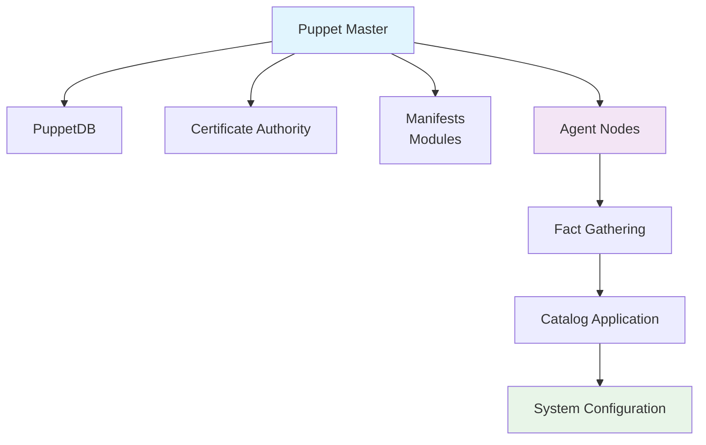

# Puppet

## 1. 概述

Puppet 是一个开源的基础设施即代码（IaC）工具，用于自动化系统配置管理。它采用声明式语言描述系统状态，通过客户端-服务器架构实现大规模环境的配置管理。Puppet 提供跨平台支持，能够管理 Windows、Linux 和 Unix 系统。

## 2. 核心概念

### 2.1 架构组件


### 2.2 关键术语
- **Manifest**: 包含 Puppet 代码的 .pp 文件
- **Module**: 可重用的配置单元集合
- **Resource**: 系统组件的抽象描述（文件、服务、包等）
- **Catalog**: 编译后的配置清单，包含所有资源依赖关系
- **Facter**: 收集节点事实（系统信息）的工具
- **Agent**: 在节点上运行的 Puppet 客户端
- **Master**: 中央配置服务器

## 3. 快速开始

### 3.1 安装和配置
```bash
# 安装 Puppet Server（Master）
# Ubuntu/Debian
wget https://apt.puppet.com/puppet7-release-focal.deb
sudo dpkg -i puppet7-release-focal.deb
sudo apt-get update
sudo apt-get install puppetserver

# CentOS/RHEL
sudo rpm -Uvh https://yum.puppet.com/puppet7-release-el-7.noarch.rpm
sudo yum install puppetserver

# 安装 Puppet Agent
# Ubuntu/Debian
sudo apt-get install puppet-agent

# CentOS/RHEL
sudo yum install puppet-agent

# 配置 Agent
sudo /opt/puppetlabs/bin/puppet config set server puppetmaster.example.com
sudo /opt/puppetlabs/bin/puppet config set certname $(hostname -f)

# 启动 Puppet 服务
sudo systemctl start puppetserver
sudo systemctl start puppet
```

### 3.2 基础命令
```bash
# 测试 Puppet 配置
puppet parser validate manifest.pp

# 应用本地配置
puppet apply manifest.pp

# 查看节点事实
facter
facter osfamily
facter ipaddress

# 管理证书
puppet certificate list
puppet certificate sign node1.example.com

# 运行 Puppet Agent
puppet agent --test
puppet agent --test --noop  # 试运行模式
```

## 4. Manifest 开发

### 4.1 基础资源类型
```puppet
# 包管理
package { 'nginx':
  ensure => present,
}

# 服务管理
service { 'nginx':
  ensure     => running,
  enable     => true,
  hasstatus  => true,
  hasrestart => true,
  require    => Package['nginx'],
}

# 文件管理
file { '/etc/nginx/nginx.conf':
  ensure  => file,
  owner   => 'root',
  group   => 'root',
  mode    => '0644',
  content => template('nginx/nginx.conf.erb'),
  notify  => Service['nginx'],
}

# 目录管理
file { '/var/www/html':
  ensure => directory,
  owner  => 'www-data',
  group  => 'www-data',
  mode   => '0755',
}

# 用户管理
user { 'appuser':
  ensure     => present,
  uid        => 1001,
  gid        => 1001,
  home       => '/home/appuser',
  shell      => '/bin/bash',
  managehome => true,
}

# 组管理
group { 'appgroup':
  ensure => present,
  gid    => 1001,
}
```

### 4.2 条件逻辑和控制结构
```puppet
# 条件语句
case $osfamily {
  'Debian': {
    package { 'apache2':
      ensure => present,
    }
  }
  'RedHat': {
    package { 'httpd':
      ensure => present,
    }
  }
  default: {
    fail("Unsupported OS family: ${osfamily}")
  }
}

# 选择器
$webserver = $osfamily ? {
  'Debian' => 'apache2',
  'RedHat' => 'httpd',
  default  => 'nginx',
}

package { $webserver:
  ensure => present,
}

# 迭代器
$packages = ['curl', 'wget', 'git']
$packages.each |String $pkg| {
  package { $pkg:
    ensure => present,
  }
}
```

## 5. 模块开发

### 5.1 模块结构
```
nginx/
├── manifests/
│   ├── init.pp
│   ├── config.pp
│   └── service.pp
├── templates/
│   └── nginx.conf.erb
├── files/
│   └── default.index.html
├── facts.d/
│   └── custom_fact.rb
├── lib/
│   └── puppet/
│       └── functions/
│           └── custom_function.rb
├── spec/
│   └── classes/
│       └── init_spec.rb
└── metadata.json
```

### 5.2 类定义
```puppet
# manifests/init.pp
class nginx (
  String $version = 'present',
  Integer $worker_processes = 4,
  Integer $worker_connections = 1024,
  String $server_name = $facts['fqdn'],
) {
  package { 'nginx':
    ensure => $version,
  }

  file { '/etc/nginx/nginx.conf':
    ensure  => file,
    content => template('nginx/nginx.conf.erb'),
    notify  => Service['nginx'],
  }

  service { 'nginx':
    ensure    => running,
    enable    => true,
    require   => Package['nginx'],
    subscribe => File['/etc/nginx/nginx.conf'],
  }
}
```

### 5.3 定义类型
```puppet
# manifests/vhost.pp
define nginx::vhost (
  String $domain,
  String $root_dir,
  Integer $port = 80,
  Boolean $ssl = false,
  Array $server_aliases = [],
) {
  $vhost_config = "/etc/nginx/sites-available/${domain}.conf"
  
  file { $vhost_config:
    ensure  => file,
    content => template('nginx/vhost.conf.erb'),
    notify  => Service['nginx'],
  }

  file { "/etc/nginx/sites-enabled/${domain}.conf":
    ensure => link,
    target => $vhost_config,
    notify => Service['nginx'],
  }
}
```

## 6. 模板和文件

### 6.1 ERB 模板开发
```erb
# templates/nginx.conf.erb
user www-data;
worker_processes <%= @worker_processes %>;
pid /run/nginx.pid;

events {
    worker_connections <%= @worker_connections %>;
    multi_accept on;
}

http {
    sendfile on;
    tcp_nopush on;
    tcp_nodelay on;
    keepalive_timeout 65;
    types_hash_max_size 2048;

    include /etc/nginx/mime.types;
    default_type application/octet-stream;

    access_log /var/log/nginx/access.log;
    error_log /var/log/nginx/error.log;

    gzip on;
    gzip_disable "msie6";

    include /etc/nginx/conf.d/*.conf;
    include /etc/nginx/sites-enabled/*;
}
```

### 6.2 Hiera 数据管理
```yaml
# hiera.yaml
---
version: 5
defaults:
  datadir: data
  data_hash: yaml_data
hierarchy:
  - name: "Per-node data"
    path: "nodes/%{trusted.certname}.yaml"
  - name: "Common data"
    path: "common.yaml"

# data/common.yaml
nginx::version: 'present'
nginx::worker_processes: 4
nginx::worker_connections: 1024

# data/nodes/web1.example.com.yaml
nginx::worker_processes: 8
nginx::server_name: 'web1.example.com'
```

## 7. 高级功能

### 7.1 自定义事实
```ruby
# facts.d/custom_fact.rb
Facter.add('application_version') do
  setcode do
    if File.exist?('/opt/app/VERSION')
      File.read('/opt/app/VERSION').chomp
    else
      'unknown'
    end
  end
end

Facter.add('has_ssd') do
  setcode do
    Facter::Core::Execution.execute('cat /sys/block/sda/queue/rotational').chomp == '0'
  end
end
```

### 7.2 自定义函数
```ruby
# lib/puppet/functions/nginx/validate_port.rb
Puppet::Functions.create_function(:'nginx::validate_port') do
  dispatch :validate_port do
    param 'Integer', :port
  end

  def validate_port(port)
    if port < 1 || port > 65535
      raise Puppet::ParseError, "Invalid port number: #{port}"
    end
  end
end
```

### 7.3 资源关系管理
```puppet
# 使用元参数管理关系
package { 'nginx':
  ensure => present,
}

service { 'nginx':
  ensure    => running,
  enable    => true,
  subscribe => Package['nginx'],
}

# 使用 require 和 before
file { '/etc/nginx/nginx.conf':
  ensure  => file,
  require => Package['nginx'],
  before  => Service['nginx'],
}

# 使用 notify 和 subscribe
file { '/etc/nginx/conf.d/app.conf':
  ensure  => file,
  notify  => Service['nginx'],
}

service { 'nginx':
  ensure    => running,
  subscribe => File['/etc/nginx/conf.d/app.conf'],
}
```

## 8. CI/CD 集成

### 8.1 Puppet in Pipeline
```yaml
# .github/workflows/puppet.yml
name: Puppet CI/CD

on:
  push:
    branches: [ main ]
  pull_request:
    branches: [ main ]

jobs:
  validate:
    runs-on: ubuntu-latest
    steps:
    - uses: actions/checkout@v4
    
    - name: Set up Puppet
      run: |
        wget https://apt.puppet.com/puppet7-release-focal.deb
        sudo dpkg -i puppet7-release-focal.deb
        sudo apt-get update
        sudo apt-get install puppet-bolt
        
    - name: Validate syntax
      run: puppet parser validate manifests/**/*.pp
      
    - name: Check style
      run: puppet-lint manifests/**/*.pp
      
    - name: Run unit tests
      run: rspec spec/
      
    - name: Deploy to Puppet Server
      if: github.ref == 'refs/heads/main'
      run: |
        bolt command run 'r10k deploy environment -p' --targets puppetmaster.example.com
      env:
        BOLT_PASSWORD: ${{ secrets.PUPPET_MASTER_PASSWORD }}
```

### 8.2 环境管理
```bash
# 使用 r10k 管理环境
r10k deploy environment production
r10k deploy module nginx

# 使用 Code Manager
puppet-code deploy production --wait

# 使用 Bolt 进行编排
bolt plan run nginx::deploy --targets web_servers
bolt task run package::install name=nginx --targets linux_nodes
```

## 9. 运维和监控

### 9.1 节点管理
```bash
# 查看节点状态
puppet node status
puppet node list
puppet node clean node1.example.com

# 管理证书
puppet cert list
puppet cert sign node1.example.com
puppet cert revoke node1.example.com

# 运行报告
puppet report show <report-id>
puppet report store last

# 资源查询
puppet resource package
puppet resource service nginx
puppet resource file /etc/nginx/nginx.conf
```

### 9.2 性能优化
```puppet
# 使用资源默认值
Package {
  provider => 'apt',
  ensure   => present,
}

File {
  owner => 'root',
  group => 'root',
  mode  => '0644',
}

# 使用资源收集器
Package <| title == 'nginx' |> {
  ensure => latest,
}

# 使用虚拟资源
@package { 'development-tools':
  ensure => present,
}

realize Package['development-tools']
```

### 9.3 监控和调试
```bash
# 调试模式运行
puppet agent --test --debug
puppet apply --debug manifest.pp

# 查看详细日志
tail -f /var/log/puppetlabs/puppetserver/puppetserver.log
tail -f /var/log/puppetlabs/puppet/puppet.log

# 使用 noop 模式测试
puppet agent --test --noop

# 性能分析
puppet metric
puppet agent --test --evaltrace
```
