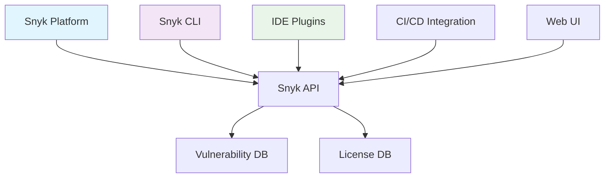

# Snyk

## 1. 概述

Snyk 是一个开发者优先的安全平台，专注于代码依赖漏洞扫描、开源许可证合规性和基础设施即代码（IaC）安全。它通过集成开发环境、代码仓库和CI/CD管道，帮助开发团队在开发早期发现和修复安全漏洞。

## 2. 核心概念

### 2.1 架构组件


### 2.2 关键术语
- **Vulnerability**: 安全漏洞，通常由依赖包引入
- **License Compliance**: 开源许可证合规性检查
- **SBOM**: 软件物料清单（Software Bill of Materials）
- **Fix PR**: 自动创建的修复拉取请求
- **Project**: 被扫描的代码项目
- **Organization**: Snyk 组织单元
- **Integration**: 与第三方服务的集成

## 3. 快速开始

### 3.1 安装和配置
```bash
# 安装 Snyk CLI
# Using npm
npm install -g snyk

# Using Homebrew (macOS)
brew tap snyk/tap
brew install snyk

# Using Docker
docker run -it --rm snyk/snyk-cli:latest

# 认证 Snyk CLI
snyk auth
# 或使用令牌认证
snyk auth <your-token>

# 测试连接
snyk whoami
```

### 3.2 基础命令
```bash
# 测试项目漏洞
snyk test

# 监控项目（上传结果到 Snyk 平台）
snyk monitor

# 修复漏洞
snyk fix

# 查看项目信息
snyk projects

# 查看组织信息
snyk orgs

# 忽略漏洞（生成 .snyk 文件）
snyk ignore --id=VULN_ID --expiry=2024-12-31
```

## 4. 项目扫描

### 4.1 多语言支持
```bash
# JavaScript/TypeScript 项目
snyk test --file=package.json
snyk test --yarn-workspaces

# Java 项目
snyk test --file=pom.xml
snyk test --file=build.gradle

# Python 项目
snyk test --file=requirements.txt
snyk test --file=pyproject.toml

# .NET 项目
snyk test --file=packages.config
snyk test --file=*.csproj

# Go 项目
snyk test --file=go.mod

# Docker 镜像
snyk container test node:18
snyk container test my-app:latest --file=Dockerfile
```

### 4.2 配置选项
```bash
# 指定严重性级别
snyk test --severity-threshold=high

# 仅显示可修复的漏洞
snyk test --json | snyk-to-html --summary

# 排除开发依赖
snyk test --dev=false

# 自定义项目名称
snyk monitor --project-name="my-production-app"

# 策略文件配置
snyk test --policy-path=.snyk-policy
```

## 5. 配置文件

### 5.1 .snyk 策略文件
```yaml
# $schema: https://snyk.io/package/snyk-ignore/schema.json
version: v1.22.0
ignore:
  SNYK-JS-LODASH-567746:
    - '* > lodash@4.17.15':
        reason: 'Temporary ignore for legacy code'
        created: 2024-01-15T00:00:00.000Z
        expires: 2024-06-15T00:00:00.000Z
  SNYK-JS-MINIMIST-559764:
    - '* > minimist@1.2.5':
        reason: 'False positive in our use case'
        created: 2024-01-15T00:00:00.000Z
        
patch:
  'npm:lodash:20240115':
    - lodash@4.17.15 > 4.17.21:
        patched: 2024-01-15T00:00:00.000Z
```

### 5.2 snyk.yaml 配置
```yaml
version: v1.22.0
policy:
  org: my-organization
  project: my-project
  
settings:
  PRIVATE_REGISTRIES:
    - url: registry.example.com
      credentials:
        username: $SNYK_REGISTRY_USER
        password: $SNYK_REGISTRY_PASSWORD
  
  IGNORE_UNPINNED_DEPENDENCIES: true
  
  DETECTION_DEPTH: 5
  
  DETECTION_TIMEOUT: 300
  
  DETECTION_FILE_PATTERNS:
    - '**/package.json'
    - '**/pom.xml'
    - '**/requirements.txt'
```

## 6. CI/CD 集成

### 6.1 GitHub Actions 集成
```yaml
name: Snyk Security Scan

on:
  push:
    branches: [ main ]
  pull_request:
    branches: [ main ]
  schedule:
    - cron: '0 0 * * 0'

jobs:
  snyk-security:
    runs-on: ubuntu-latest
    steps:
    - uses: actions/checkout@v4
    
    - name: Set up Node.js
      uses: actions/setup-node@v3
      with:
        node-version: '18'
        
    - name: Install dependencies
      run: npm ci
      
    - name: Run Snyk to check for vulnerabilities
      uses: snyk/actions/node@master
      env:
        SNYK_TOKEN: ${{ secrets.SNYK_TOKEN }}
      with:
        args: --severity-threshold=high
        
    - name: Run Snyk to monitor project
      uses: snyk/actions/node@master
      env:
        SNYK_TOKEN: ${{ secrets.SNYK_TOKEN }}
      with:
        command: monitor
        args: --project-name=github-actions-project
        
  snyk-container:
    runs-on: ubuntu-latest
    steps:
    - name: Build Docker image
      run: docker build -t my-app .
      
    - name: Run Snyk container test
      uses: snyk/actions/container@master
      env:
        SNYK_TOKEN: ${{ secrets.SNYK_TOKEN }}
      with:
        image: my-app
        args: --file=Dockerfile --severity-threshold=high
```

### 6.2 Jenkins 集成
```groovy
pipeline {
  agent any
  
  environment {
    SNYK_TOKEN = credentials('snyk-token')
  }
  
  stages {
    stage('Build') {
      steps {
        sh 'npm install'
      }
    }
    
    stage('Snyk Test') {
      steps {
        sh 'snyk test --severity-threshold=high'
      }
    }
    
    stage('Snyk Monitor') {
      steps {
        sh 'snyk monitor --project-name=jenkins-project'
      }
    }
    
    stage('Snyk Container') {
      steps {
        sh 'docker build -t my-app .'
        sh 'snyk container test my-app --file=Dockerfile'
      }
    }
  }
  
  post {
    failure {
      emailext body: 'Snyk scan failed with vulnerabilities above threshold',
               subject: 'Snyk Security Alert',
               to: 'dev-team@example.com'
    }
  }
}
```

## 7. 高级功能

### 7.1 基础设施即代码扫描
```bash
# Terraform 扫描
snyk iac test
snyk iac test --file=main.tf
snyk iac test --file=terraform.tfvars

# Kubernetes 扫描
snyk iac test --file=deployment.yaml
snyk iac test --file=kustomization.yaml

# CloudFormation 扫描
snyk iac test --file=cloudformation.yaml

# ARM 模板扫描
snyk iac test --file=azuredeploy.json

# 自定义策略
snyk iac test --policy-path=.snyk-iac-policy
```

### 7.2 容器安全
```bash
# 扫描本地镜像
snyk container test my-app:latest
snyk container test my-app:latest --file=Dockerfile

# 扫描远程仓库
snyk container test registry.example.com/my-app:latest
snyk container test docker.io/library/node:18

# 生成 SBOM
snyk container test my-app:latest --json | snyk-to-html --sbom

# 监控容器镜像
snyk container monitor my-app:latest
snyk container monitor my-app:latest --project-name=container-app
```

### 7.3 API 集成
```bash
# 获取项目漏洞
curl -X GET \
  -H "Authorization: token $SNYK_TOKEN" \
  "https://api.snyk.io/rest/orgs/ORG_ID/projects/PROJECT_ID/issues"

# 创建忽略规则
curl -X POST \
  -H "Authorization: token $SNYK_TOKEN" \
  -H "Content-Type: application/json" \
  -d '{
    "issueId": "SNYK-JS-LODASH-567746",
    "reason": "Temporary ignore",
    "expires": "2024-12-31T00:00:00.000Z"
  }' \
  "https://api.snyk.io/rest/orgs/ORG_ID/projects/PROJECT_ID/ignore"

# 获取组织信息
curl -X GET \
  -H "Authorization: token $SNYK_TOKEN" \
  "https://api.snyk.io/rest/orgs"
```

## 8. 修复和补救

### 8.1 自动修复
```bash
# 自动修复漏洞
snyk fix

# 试运行修复（不实际修改文件）
snyk fix --dry-run

# 指定修复策略
snyk fix --strategy=patch
snyk fix --strategy=upgrade

# 排除特定路径
snyk fix --exclude=src/legacy/**

# 仅修复特定严重性
snyk fix --severity-threshold=high
```

### 8.2 手动修复指导
```bash
# 显示修复详情
snyk test --json | jq '.vulnerabilities[] | select(.fixReason)'

# 查看可升级版本
snyk test --json | jq '.vulnerabilities[] | .upgradePath'

# 生成修复报告
snyk test --json | snyk-to-html --fix

# 导出修复建议
snyk test --json > snyk-report.json
```

## 9. 运维和监控

### 9.1 项目管理
```bash
# 列出所有项目
snyk projects

# 获取项目详情
snyk projects --json | jq '.[] | select(.name | contains("my-app"))'

# 删除项目
snyk projects --delete PROJECT_ID

# 导入项目
snyk projects --import=github.com/my-org/my-repo

# 标记项目环境
snyk projects --tag=environment=production
snyk projects --tag=team=backend
```

### 9.2 监控和告警
```bash
# 设置监控频率
snyk monitor --interval=daily
snyk monitor --interval=weekly
snyk monitor --interval=monthly

# 配置告警设置
snyk projects --alert-setting=high --enabled=true
snyk projects --alert-setting=medium --enabled=false

# 测试通知配置
snyk notifications --test

# 查看监控历史
snyk projects --history=PROJECT_ID
```

### 9.3 企业功能
```bash
# 使用私有注册表
snyk test --registry-url=registry.example.com
snyk test --registry-username=user --registry-password=pass

# 自定义漏洞数据库
snyk test --vuln-db-endpoint=https://internal-vuln-db.example.com

# 代理配置
snyk test --proxy=http://proxy.example.com:8080
snyk test --proxy-username=user --proxy-password=pass

# 离线模式
snyk test --offline
snyk test --offline --cache-dir=./snyk-cache
```
