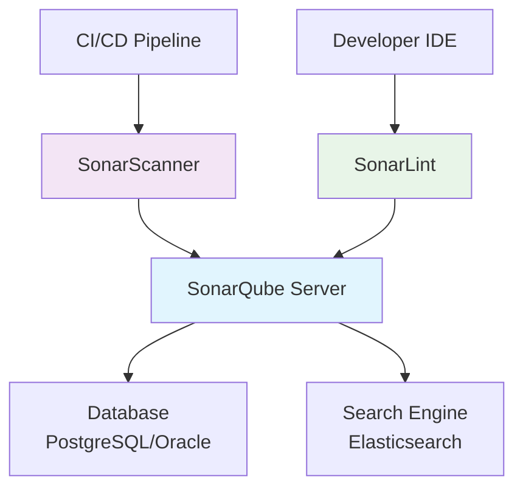

# SonarQube

## 1. 概述

SonarQube 是一个开源的代码质量管理和持续检测平台，用于自动化的代码审查和静态代码分析。它支持多种编程语言，能够检测代码中的 bug、漏洞、代码异味和技术债务，帮助团队持续改进代码质量。

## 2. 核心概念

### 2.1 架构组件


### 2.2 关键术语
- **Quality Gate**: 代码质量门槛，定义项目必须满足的质量标准
- **Quality Profile**: 代码分析规则集合，针对特定语言
- **Issue**: 代码中检测到的问题（Bug、漏洞、代码异味）
- **Metric**: 代码质量度量指标（重复率、覆盖率、复杂度等）
- **Project**: 被分析的项目
- **Scanner**: 执行代码分析的工具

## 3. 快速开始

### 3.1 安装和配置
```bash
# 使用 Docker 快速启动
docker run -d --name sonarqube \
  -p 9000:9000 \
  -p 9092:9092 \
  -v sonarqube_data:/opt/sonarqube/data \
  -v sonarqube_extensions:/opt/sonarqube/extensions \
  sonarqube:community

# 使用 Docker Compose
version: '3.8'
services:
  sonarqube:
    image: sonarqube:community
    ports:
      - "9000:9000"
    environment:
      - SONAR_JDBC_URL=jdbc:postgresql://db:5432/sonar
      - SONAR_JDBC_USERNAME=sonar
      - SONAR_JDBC_PASSWORD=sonar
    volumes:
      - sonarqube_data:/opt/sonarqube/data
      - sonarqube_extensions:/opt/sonarqube/extensions

  db:
    image: postgres:13
    environment:
      - POSTGRES_USER=sonar
      - POSTGRES_PASSWORD=sonar
      - POSTGRES_DB=sonar
    volumes:
      - postgres_data:/var/lib/postgresql/data

volumes:
  sonarqube_data:
  postgres_data:
```

### 3.2 基础配置
```bash
# 安装 SonarScanner
# Linux
wget https://binaries.sonarsource.com/Distribution/sonar-scanner-cli/sonar-scanner-4.8.0.2856-linux.zip
unzip sonar-scanner-4.8.0.2856-linux.zip
export PATH=$PATH:/path/to/sonar-scanner/bin

# 配置 SonarScanner
cat > sonar-scanner/conf/sonar-scanner.properties << EOF
sonar.host.url=http://localhost:9000
sonar.sourceEncoding=UTF-8
sonar.login=admin
sonar.password=admin
EOF
```

## 4. 项目配置

### 4.1 分析配置
```properties
# sonar-project.properties
sonar.projectKey=my-application
sonar.projectName=My Application
sonar.projectVersion=1.0

sonar.sources=src
sonar.tests=test
sonar.sourceEncoding=UTF-8

# Java 项目特定配置
sonar.java.binaries=target/classes
sonar.java.libraries=target/lib/*.jar

# 排除文件
sonar.exclusions=**/generated/**,**/test/**

# 测试配置
sonar.test.inclusions=**/test/**

# 质量配置
sonar.qualitygate.wait=true
```

### 4.2 多模块配置
```properties
# 父项目配置
sonar.projectKey=parent-project
sonar.projectName=Parent Project
sonar.modules=module1,module2

# 模块1配置
module1.sonar.projectKey=module1
module1.sonar.projectName=Module 1
module1.sonar.sources=module1/src
module1.sonar.tests=module1/test

# 模块2配置
module2.sonar.projectKey=module2
module2.sonar.projectName=Module 2
module2.sonar.sources=module2/src
module2.sonar.tests=module2/test
```

## 5. 质量配置

### 5.1 Quality Profile
```xml
<!-- 自定义质量配置文件 -->
<profile>
  <name>My Custom Java Profile</name>
  <language>java</language>
  <rules>
    <rule>
      <repositoryKey>squid</repositoryKey>
      <key>S001</key>
      <priority>MAJOR</priority>
    </rule>
    <rule>
      <repositoryKey>squid</repositoryKey>
      <key>S100</key>
      <priority>MINOR</priority>
    </rule>
  </rules>
</profile>
```

### 5.2 Quality Gate
```json
{
  "name": "Strict Quality Gate",
  "conditions": [
    {
      "metric": "new_bugs",
      "op": "GT",
      "error": "0"
    },
    {
      "metric": "new_vulnerabilities",
      "op": "GT",
      "error": "0"
    },
    {
      "metric": "code_smells",
      "op": "GT",
      "warning": "10",
      "error": "50"
    },
    {
      "metric": "coverage",
      "op": "LT",
      "warning": "90",
      "error": "80"
    },
    {
      "metric": "duplicated_lines_density",
      "op": "GT",
      "warning": "5",
      "error": "10"
    }
  ]
}
```

## 6. CI/CD 集成

### 6.1 Jenkins 集成
```groovy
pipeline {
  agent any
  
  environment {
    SONAR_SCANNER_HOME = tool 'SonarScanner'
  }
  
  stages {
    stage('Build') {
      steps {
        sh 'mvn compile'
      }
    }
    
    stage('Test') {
      steps {
        sh 'mvn test'
      }
    }
    
    stage('SonarQube Analysis') {
      steps {
        withSonarQubeEnv('sonarqube-server') {
          sh '''
            ${SONAR_SCANNER_HOME}/bin/sonar-scanner \
              -Dsonar.projectKey=my-project \
              -Dsonar.sources=src \
              -Dsonar.host.url=http://sonarqube:9000 \
              -Dsonar.login=${SONAR_AUTH_TOKEN}
          '''
        }
      }
    }
    
    stage('Quality Gate') {
      steps {
        timeout(time: 1, unit: 'HOURS') {
          waitForQualityGate abortPipeline: true
        }
      }
    }
  }
}
```

### 6.2 GitHub Actions 集成
```yaml
name: SonarQube Analysis

on:
  push:
    branches: [ main ]
  pull_request:
    branches: [ main ]

jobs:
  sonarqube:
    runs-on: ubuntu-latest
    steps:
    - uses: actions/checkout@v4
      with:
        fetch-depth: 0
        
    - name: Set up JDK
      uses: actions/setup-java@v3
      with:
        java-version: '17'
        distribution: 'temurin'
        
    - name: Cache SonarQube packages
      uses: actions/cache@v3
      with:
        path: ~/.sonar/cache
        key: ${{ runner.os }}-sonar
        restore-keys: ${{ runner.os }}-sonar
        
    - name: Cache Maven packages
      uses: actions/cache@v3
      with:
        path: ~/.m2
        key: ${{ runner.os }}-m2-${{ hashFiles('**/pom.xml') }}
        restore-keys: ${{ runner.os }}-m2
        
    - name: Run SonarQube Analysis
      env:
        SONAR_TOKEN: ${{ secrets.SONAR_TOKEN }}
        GITHUB_TOKEN: ${{ secrets.GITHUB_TOKEN }}
      run: |
        mvn -B verify org.sonarsource.scanner.maven:sonar-maven-plugin:sonar \
          -Dsonar.projectKey=my-project \
          -Dsonar.qualitygate.wait=true
```

## 7. 高级功能

### 7.1 自定义规则
```java
// 自定义 Java 规则示例
@Rule(key = "AvoidHardCodedCredentials")
public class AvoidHardCodedCredentialsRule extends IssuableSubscriptionVisitor {

  private static final Pattern CREDENTIAL_PATTERN = Pattern.compile(
    "(password|secret|token)=['\"][^'\"]+['\"]",
    Pattern.CASE_INSENSITIVE
  );

  @Override
  public List<Tree.Kind> nodesToVisit() {
    return Collections.singletonList(Tree.Kind.STRING_LITERAL);
  }

  @Override
  public void visitNode(Tree tree) {
    StringLiteralTree stringLiteral = (StringLiteralTree) tree;
    String value = stringLiteral.value();
    
    if (CREDENTIAL_PATTERN.matcher(value).find()) {
      reportIssue(tree, "Avoid hard-coded credentials");
    }
  }
}
```

### 7.2 Webhook 配置
```json
{
  "name": "CI Pipeline Webhook",
  "url": "https://ci.example.com/sonarqube/webhook",
  "secret": "my-secret-token",
  "events": [
    "QUALITY_GATE_OK",
    "QUALITY_GATE_FAIL",
    "ANALYSIS_COMPLETED"
  ]
}
```

### 7.3 API 集成
```bash
# 获取项目质量状态
curl -u "admin:admin" "http://localhost:9000/api/qualitygates/project_status?projectKey=my-project"

# 获取问题列表
curl -u "admin:admin" "http://localhost:9000/api/issues/search?componentKeys=my-project"

# 创建自定义指标
curl -u "admin:admin" -X POST "http://localhost:9000/api/metrics/create" \
  -H "Content-Type: application/json" \
  -d '{
    "key": "custom_complexity",
    "name": "Custom Complexity",
    "description": "Custom complexity metric",
    "domain": "Complexity",
    "type": "INT"
  }'
```

## 8. 语言支持

### 8.1 多语言配置
```properties
# JavaScript/TypeScript 项目
sonar.javascript.file.suffixes=.js,.jsx,.ts,.tsx
sonar.typescript.file.suffixes=.ts,.tsx
sonar.javascript.lcov.reportPaths=coverage/lcov.info

# Python 项目
sonar.python.file.suffixes=.py
sonar.python.coverage.reportPaths=coverage.xml
sonar.python.xunit.reportPaths=test-results.xml

# C# 项目
sonar.cs.file.suffixes=.cs
sonar.cs.vstest.reportsPaths=**/TestResults/*.trx
sonar.cs.opencover.reportsPaths=**/coverage.opencover.xml

# Go 项目
sonar.go.file.suffixes=.go
sonar.go.coverage.reportPaths=coverage.out
sonar.go.tests.reportPaths=test-report.xml
```

### 8.2 测试和覆盖率
```bash
# 生成测试覆盖率报告
# Java with JaCoCo
mvn clean test jacoco:report

# JavaScript with Jest
npm test -- --coverage --coverageReporters=lcov

# Python with pytest
pytest --cov=myapp --cov-report=xml

# Go with go test
go test -coverprofile=coverage.out ./...
```

## 9. 运维和监控

### 9.1 系统管理
```bash
# 备份和恢复
# 备份数据库
pg_dump -U sonar sonarqube > sonarqube_backup.sql

# 备份配置和数据
tar -czf sonarqube_backup.tar.gz /opt/sonarqube/data /opt/sonarqube/extensions

# 监控系统健康
curl -u "admin:admin" "http://localhost:9000/api/system/health"

# 查看系统状态
curl -u "admin:admin" "http://localhost:9000/api/system/status"

# 管理用户和权限
curl -u "admin:admin" "http://localhost:9000/api/users/search"
```

### 9.2 性能优化
```properties
# sonar.properties 优化配置
sonar.ce.javaOpts=-Xmx4g -Xms512m
sonar.web.javaOpts=-Xmx2g -Xms512m
sonar.search.javaOpts=-Xmx1g -Xms512m

# 数据库连接池
sonar.jdbc.maxActive=50
sonar.jdbc.maxWait=5000

# 搜索优化
sonar.search.initialTimeout=600
sonar.search.timeout=900

# 分析优化
sonar.ce.workerCount=2
sonar.ce.maxWorkers=4
```

### 9.3 故障排除
```bash
# 查看日志
tail -f /opt/sonarqube/logs/sonar.log
tail -f /opt/sonarqube/logs/ce.log
tail -f /opt/sonarqube/logs/web.log

# 调试模式启动
./bin/sonar.sh console

# 检查数据库连接
sonar check database

# 重置管理员密码
curl -X POST "http://localhost:9000/api/users/change_password" \
  -u "admin:admin" \
  -H "Content-Type: application/x-www-form-urlencoded" \
  -d "login=admin&password=newpassword"
```
