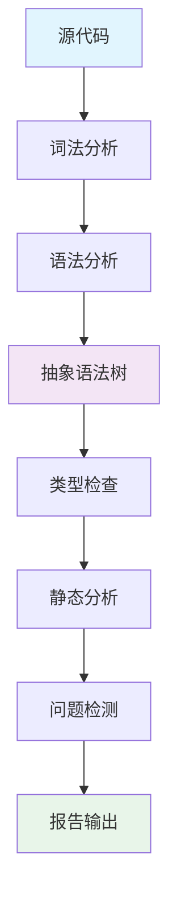

# Staticcheck - Go 静态分析工具

## 1. 概述

Staticcheck 是 Go 语言的一个高级静态分析工具，能够检测代码中的各种问题，包括错误、性能问题、API 误用等。它是 `staticcheck.io` 套件的一部分，提供了比标准 `go vet` 更深入的代码分析能力。

## 2. 核心功能

### 2.1 检测能力矩阵

| 检测类别         | 示例问题                                                                 |
|------------------|--------------------------------------------------------------------------|
| **代码错误**      | 不可达代码、空指针解引用、错误的 defer 用法                              |
| **性能问题**      | 不必要的内存分配、低效的字符串拼接、可以简化的 range 循环                |
| **API 误用**      | 错误的 context 使用、time.Format 错误、sync.WaitGroup 误用               |
| **代码风格**      | 冗余的类型转换、不必要的 else 语句、可以简化的布尔表达式                 |
| **安全问题**      | 硬编码密码、不安全的加密操作、潜在的 SQL 注入                           |
| **并发问题**      | 竞态条件、不正确的 goroutine 使用、通道误用                             |

### 2.2 架构原理



## 3. 安装与配置

### 3.1 安装方法

```bash
#!/bin/bash
# install-staticcheck.sh

# 方法1: 使用 Go 安装
go install honnef.co/go/tools/cmd/staticcheck@latest

# 方法2: 二进制安装 (Linux/macOS)
curl -L -o staticcheck.tar.gz https://github.com/dominikh/go-tools/releases/download/2023.1.3/staticcheck_2023.1.3_linux_amd64.tar.gz
tar -xzf staticcheck.tar.gz
sudo mv staticcheck/staticcheck /usr/local/bin/
rm -rf staticcheck.tar.gz staticcheck

# 方法3: 使用包管理器
# macOS
brew install staticcheck
# Arch Linux
pacman -S staticcheck
# Debian/Ubuntu
sudo apt install staticcheck

# 验证安装
staticcheck --version
```

### 3.2 基础配置

```yaml
# staticcheck.conf
checks = ["all", "-ST1000"]  # 启用所有检查，除了ST1000

# 忽略特定问题
ignore = [
  "github.com/your/project/pkg/.*:SA1019",  # 忽略特定包的SA1019
  "github.com/your/project/cmd/.*:S1002",   # 忽略特定命令的S1002
]

# 自定义检查器设置
initialisms = ["ACL", "API", "CPU", "DNS", "EOF", "GUID", "ID", "IP", "JSON", "RAM", "RPC", "SLA", "SMTP", "SQL", "SSH", "TCP", "TLS", "TTL", "UDP", "UI", "UID", "URI", "URL", "UTF8", "VM", "XML", "XMPP", "XSRF", "XSS"]

# 输出格式
output-format = "json"  # 可选: text, json, stylish, junit

# 排除文件
exclude-dirs = ["vendor", "testdata", "third_party"]
```

## 4. 基本使用

### 4.1 命令行使用

```bash
#!/bin/bash
# staticcheck-usage.sh

# 检查当前目录及子目录
staticcheck ./...

# 检查特定包
staticcheck github.com/your/project/pkg/...

# 指定配置文件
staticcheck -conf staticcheck.conf ./...

# 指定输出格式
staticcheck -f json ./... > report.json
staticcheck -f stylish ./...  # 彩色输出
staticcheck -f junit ./... > report.xml

# 只显示特定严重级别的问题
staticcheck -severity error ./...  # 只显示错误
staticcheck -severity warning,error ./...

# 排除特定检查
staticcheck -checks "all,-SA1019" ./...

# 显示解释
staticcheck -explain SA1019  # 显示SA1019检查的解释

# 与go vet集成
go vet -vettool=$(which staticcheck) ./...
```

### 4.2 常用检查示例

```bash
# 检查未使用的变量和函数
staticcheck -checks U1000 ./...

# 检查简化可能
staticcheck -checks S1000 ./...

# 检查性能问题
staticcheck -checks S1000,S1001,S1002 ./...

# 检查安全问题
staticcheck -checks SA1019,SA2000,SA3000 ./...

# 检查并发问题
staticcheck -checks SA2000,SA2001,SA2002 ./...
```

## 5. 集成到开发流程

### 5.1 预提交钩子

```bash
#!/bin/bash
# pre-commit-staticcheck.sh

# 安装预提交钩子
cat > .git/hooks/pre-commit << 'EOF'
#!/bin/bash

echo "Running staticcheck..."
CHANGED_GO_FILES=$(git diff --cached --name-only --diff-filter=ACM | grep '\.go$')

if [ -n "$CHANGED_GO_FILES" ]; then
    if ! staticcheck $CHANGED_GO_FILES; then
        echo "Staticcheck found issues, commit aborted."
        exit 1
    fi
fi
EOF

chmod +x .git/hooks/pre-commit
```

### 5.2 IDE 集成

#### VS Code 配置
```json
// .vscode/settings.json
{
    "go.lintTool": "staticcheck",
    "go.lintFlags": ["-checks=all"],
    "go.lintOnSave": "package",
    "go.vetFlags": ["-vettool=staticcheck"],
    "go.vetOnSave": "package",
    "go.toolsEnvVars": {
        "STATICCHECK_CONFIG": "${workspaceFolder}/staticcheck.conf"
    }
}
```

#### Goland 配置
1. 打开 `Preferences/Settings > Tools > File Watchers`
2. 添加新的 File Watcher:
   - Scope: `Project Files`
   - Program: `$GOPATH/bin/staticcheck`
   - Arguments: `-checks=all $FilePath$`
   - Output filters: `$FILE_PATH$:$LINE$:$COLUMN$: $MESSAGE$`

## 6. CI/CD 集成

### 6.1 GitHub Actions

```yaml
# .github/workflows/staticcheck.yml
name: Staticcheck

on:
  push:
    branches: [ main, develop ]
  pull_request:
    branches: [ main ]

jobs:
  staticcheck:
    name: Run Staticcheck
    runs-on: ubuntu-latest
    steps:
    - uses: actions/checkout@v3
    
    - name: Set up Go
      uses: actions/setup-go@v3
      with:
        go-version: '1.20'
    
    - name: Install Staticcheck
      run: go install honnef.co/go/tools/cmd/staticcheck@latest
    
    - name: Run Staticcheck
      run: staticcheck -checks=all -severity=warning,error ./...
    
    - name: Upload report
      if: always()
      uses: actions/upload-artifact@v3
      with:
        name: staticcheck-report
        path: |
          staticcheck.out
          report.xml
```

### 6.2 GitLab CI

```yaml
# .gitlab-ci.yml
stages:
  - test
  - analysis

staticcheck:
  stage: analysis
  image: golang:1.20
  script:
    - go install honnef.co/go/tools/cmd/staticcheck@latest
    - staticcheck -f junit ./... > report.xml
    - staticcheck -f json ./... > report.json
  artifacts:
    reports:
      junit: report.xml
    paths:
      - report.json
    expire_in: 1 week
```

## 7. 高级配置

### 7.1 自定义检查器

```yaml
# staticcheck.conf
# 启用自定义检查
checks = [
  "all",
  "-ST1000",  # 忽略文档检查
  "-SA1019",  # 忽略弃用API检查
  "S100*",    # 启用所有简化检查
  "SA*",      # 启用所有静态分析检查
]

# 自定义HTTP检查
http-checks = true
http-timeout = "10s"

# 自定义SQL检查
sql-checks = true
sql-dsn = "user:password@tcp(localhost:3306)/dbname"

# 自定义模板检查
template-checks = true
template-patterns = ["*.tmpl", "*.html"]

# 忽略测试文件
ignore-tests = true
```

### 7.2 忽略特定问题

```go
// 使用注释忽略特定问题
func deprecatedFunction() {
    //lint:ignore SA1019 这个函数虽然废弃但需要保持兼容
    oldPackage.DeprecatedFunction()
}

func unusedFunction() string { //nolint:unused  // 这个函数通过反射调用
    return "implementation"
}

func main() {
    var unusedVar int //nolint:staticcheck  // 这个变量确实需要声明但暂时不用
    
    //lint:ignore SA4006 这个赋值有特殊用途
    x := 1
    x = 2
}
```

## 8. 检查器参考

### 8.1 主要检查类别

| 前缀 | 类别               | 示例检查                                                                 |
|------|--------------------|--------------------------------------------------------------------------|
| SA   | 静态分析           | SA1019: 使用废弃的函数/变量/包                                           |
| S    | 代码简化           | S1002: 可以省略布尔比较                                                  |
| ST   | 风格问题           | ST1005: 错误字符串不应该大写                                              |
| U    | 未使用代码         | U1000: 未使用的变量/常量/函数                                             |
| Q    | 代码质量           | QF1001: 可以合并的变量声明                                                |
| AT   | 原子操作           | AT1001: 非原子操作的使用                                                 |
| CG   | 注释质量           | CG1001: 注释格式问题                                                     |

### 8.2 重要检查项说明

```markdown
### SA1019 - 使用废弃的标识符
**问题**: 使用了被标记为废弃的函数、变量或包  
**修复**: 使用替代的API

### S1008 - 可以简化返回语句
**问题**: 
```go
if condition {
    return true
}
return false
```
**修复**: `return condition`

### ST1003 - 错误的命名风格
**问题**: 不符合Go命名规范的标识符  
**规则**:
- 包内容小写
- 公开标识符使用PascalCase
- 局部变量使用camelCase
- 常量使用ALL_CAPS

### U1000 - 未使用的标识符
**问题**: 定义了但未使用的变量、常量或函数  
**修复**: 删除或使用该标识符

### QF1002 - 可以简化的布尔表达式
**问题**: 
```go
if x == true {...}
```
**修复**: `if x {...}`
```

## 9. 性能优化

### 9.1 大型项目优化

```bash
#!/bin/bash
# staticcheck-large-project.sh

# 并行运行检查
staticcheck -p 4 ./...

# 只检查变更文件
git diff --name-only main... | grep '\.go$' | xargs staticcheck

# 使用RAM磁盘加速
mkdir -p /tmp/ramdisk
sudo mount -t tmpfs -o size=2g tmpfs /tmp/ramdisk
staticcheck -cache /tmp/ramdisk ./...

# 增量检查
staticcheck -incremental ./...

# 排除测试文件
staticcheck -tests=false ./...
```

### 9.2 缓存配置

```yaml
# staticcheck.conf
# 缓存设置
cache = true
cache-dir = "/tmp/staticcheck-cache"
cache-ttl = "24h"

# 内存限制
memory-limit = "4G"

# 并行处理
parallel = true
parallel-workers = 4

# 增量检查
incremental = true
incremental-dir = ".staticcheck-incremental"
```

## 10. 问题修复策略

### 10.1 自动修复

```bash
#!/bin/bash
# staticcheck-fix.sh

# 使用gofmt简化代码
gofmt -s -w $(staticcheck -f '{{.Dir}}' -checks S1000 ./...)

# 使用goreturns移除未使用导入
go install github.com/sqs/goreturns@latest
goreturns -w $(staticcheck -f '{{.Dir}}' -checks U1000 ./...)

# 自动修复可以修复的问题
staticcheck -fix ./...
```

### 10.2 批量忽略策略

```bash
#!/bin/bash
# staticcheck-bulk-ignore.sh

# 1. 生成问题列表
staticcheck -f json ./... > report.json

# 2. 提取需要忽略的问题
jq '.[] | select(.severity == "warning") | .location.file + ":" + (.location.line|tostring) + ":" + (.location.column|tostring) + ":" + .code' report.json > to-ignore.txt

# 3. 添加忽略注释
while read -r line; do
    file=$(echo $line | cut -d: -f1)
    line_num=$(echo $line | cut -d: -f2)
    code=$(echo $line | cut -d: -f4 | tr -d '"')
    
    sed -i "${line_num}i //lint:ignore ${code} // TODO: 需要修复" $file
done < to-ignore.txt
```
