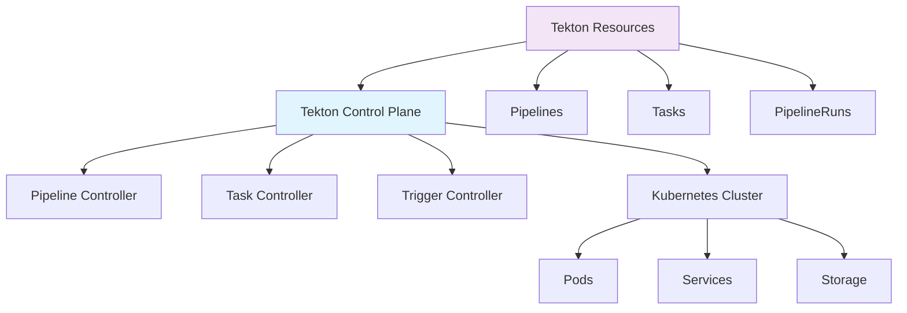

# Tekton

## 1. 概述

Tekton 是一个云原生的持续集成和持续交付（CI/CD）框架，专为 Kubernetes 设计。它提供了一组 Kubernetes 自定义资源定义（CRD），用于定义 CI/CD 流水线，具有高度可扩展性和灵活性。

## 2. 核心概念

### 2.1 架构组件


### 2.2 关键特性
- **云原生**: 专为 Kubernetes 设计，完全容器化
- **可扩展**: 基于 CRD，易于扩展和集成
- **可移植**: 平台无关，可在任何 Kubernetes 集群运行
- **可重用**: 组件化设计，支持任务和流水线重用
- **安全**: 基于 Kubernetes RBAC 的安全模型

## 3. 安装与配置

### 3.1 Tekton 安装
```bash
#!/bin/bash
# install-tekton.sh

# 安装 Tekton Pipelines
kubectl apply --filename https://storage.googleapis.com/tekton-releases/pipeline/latest/release.yaml

# 安装 Tekton Triggers
kubectl apply --filename https://storage.googleapis.com/tekton-releases/triggers/latest/release.yaml

# 安装 Tekton Dashboard（可选）
kubectl apply --filename https://storage.googleapis.com/tekton-releases/dashboard/latest/release.yaml

# 安装 Tekton CLI（tkn）
curl -LO https://github.com/tektoncd/cli/releases/download/v0.31.0/tkn_0.31.0_Linux_x86_64.tar.gz
sudo tar xvzf tkn_0.31.0_Linux_x86_64.tar.gz -C /usr/local/bin/ tkn

# 验证安装
kubectl get pods -n tekton-pipelines --watch
tkn version
```

### 3.2 自定义资源定义
```yaml
# tekton-setup.yaml
apiVersion: v1
kind: Namespace
metadata:
  name: tekton-pipelines
---
apiVersion: v1
kind: ServiceAccount
metadata:
  name: tekton-bot
  namespace: tekton-pipelines
---
apiVersion: rbac.authorization.k8s.io/v1
kind: ClusterRoleBinding
metadata:
  name: tekton-admin
subjects:
- kind: ServiceAccount
  name: tekton-bot
  namespace: tekton-pipelines
roleRef:
  kind: ClusterRole
  name: cluster-admin
  apiGroup: rbac.authorization.k8s.io
```

## 4. 核心资源

### 4.1 Task 定义
```yaml
# task-build.yaml
apiVersion: tekton.dev/v1beta1
kind: Task
metadata:
  name: build-app
spec:
  params:
  - name: image
    type: string
    description: The image to build
  - name: dockerfile
    type: string
    description: The path to the Dockerfile
    default: Dockerfile
  - name: context
    type: string
    description: The build context path
    default: .
  workspaces:
  - name: source
    description: The workspace containing the source code
  steps:
  - name: build
    image: gcr.io/kaniko-project/executor:v1.9.0
    args:
    - --dockerfile=$(params.dockerfile)
    - --destination=$(params.image)
    - --context=$(workspaces.source.path)/$(params.context)
    - --cache=true
    - --cache-ttl=24h
  - name: test
    image: node:18-alpine
    script: |
      #!/bin/sh
      cd $(workspaces.source.path)
      npm install
      npm test
      npm run coverage
    workingDir: $(workspaces.source.path)
```

### 4.2 Pipeline 定义
```yaml
# pipeline-ci.yaml
apiVersion: tekton.dev/v1beta1
kind: Pipeline
metadata:
  name: ci-pipeline
spec:
  params:
  - name: repo-url
    type: string
  - name: revision
    type: string
    default: main
  - name: image
    type: string
  workspaces:
  - name: shared-data
  tasks:
  - name: fetch-source
    taskRef:
      name: git-clone
    params:
    - name: url
      value: $(params.repo-url)
    - name: revision
      value: $(params.revision)
    workspaces:
    - name: output
      workspace: shared-data
  - name: run-tests
    taskRef:
      name: run-tests
    runAfter:
    - fetch-source
    workspaces:
    - name: source
      workspace: shared-data
  - name: build-image
    taskRef:
      name: build-app
    runAfter:
    - run-tests
    params:
    - name: image
      value: $(params.image)
    workspaces:
    - name: source
      workspace: shared-data
  - name: deploy-staging
    taskRef:
      name: deploy-k8s
    runAfter:
    - build-image
    params:
    - name: image
      value: $(params.image)
    - name: environment
      value: staging
```

## 5. 触发器和事件

### 5.1 EventListener 配置
```yaml
# event-listener.yaml
apiVersion: triggers.tekton.dev/v1beta1
kind: EventListener
metadata:
  name: github-listener
spec:
  serviceAccountName: tekton-triggers-github
  triggers:
  - name: github-push-trigger
    interceptors:
    - ref:
        name: "github"
      params:
      - name: "secretRef"
        value:
          secretName: github-secret
          secretKey: token
      - name: "eventTypes"
        value: ["push"]
    bindings:
    - ref: github-push-binding
    template:
      ref: pipeline-template
  - name: github-pr-trigger
    interceptors:
    - ref:
        name: "github"
      params:
      - name: "secretRef"
        value:
          secretName: github-secret
          secretKey: token
      - name: "eventTypes"
        value: ["pull_request"]
    bindings:
    - ref: github-pr-binding
    template:
      ref: pipeline-template
```

### 5.2 TriggerTemplate 配置
```yaml
# trigger-template.yaml
apiVersion: triggers.tekton.dev/v1beta1
kind: TriggerTemplate
metadata:
  name: pipeline-template
spec:
  params:
  - name: git-repository-url
    description: The Git repository URL
  - name: git-revision
    description: The Git revision
    default: main
  - name: git-event-type
    description: The Git event type
  resourcetemplates:
  - apiVersion: tekton.dev/v1beta1
    kind: PipelineRun
    metadata:
      generateName: pipeline-run-
    spec:
      pipelineRef:
        name: ci-pipeline
      params:
      - name: repo-url
        value: $(tt.params.git-repository-url)
      - name: revision
        value: $(tt.params.git-revision)
      - name: image
        value: registry.example.com/app:$(tt.params.git-revision)
      workspaces:
      - name: shared-data
        volumeClaimTemplate:
          spec:
            accessModes:
            - ReadWriteOnce
            resources:
              requests:
                storage: 1Gi
```

## 6. 高级功能

### 6.1 自定义任务和步骤
```yaml
# custom-task.yaml
apiVersion: tekton.dev/v1beta1
kind: Task
metadata:
  name: security-scan
spec:
  params:
  - name: scan-type
    type: string
    description: Type of security scan to perform
    default: all
  workspaces:
  - name: source
    description: Source code workspace
  steps:
  - name: sast-scan
    image: aquasec/trivy:latest
    script: |
      #!/bin/sh
      cd $(workspaces.source.path)
      trivy fs --security-checks vuln,config .
    when:
    - input: $(params.scan-type)
      operator: in
      values: ["sast", "all"]
  - name: dependency-scan
    image: node:18-alpine
    script: |
      #!/bin/sh
      cd $(workspaces.source.path)
      npm audit --audit-level=high
      npx snyk test --severity-threshold=high
    when:
    - input: $(params.scan-type)
      operator: in
      values: ["dependency", "all"]
  - name: container-scan
    image: aquasec/trivy:latest
    script: |
      #!/bin/sh
      trivy image registry.example.com/app:latest
    when:
    - input: $(params.scan-type)
      operator: in
      values: ["container", "all"]
```

### 6.2 条件执行和循环
```yaml
# conditional-pipeline.yaml
apiVersion: tekton.dev/v1beta1
kind: Pipeline
metadata:
  name: conditional-pipeline
spec:
  params:
  - name: environment
    type: string
    default: staging
  - name: run-tests
    type: string
    default: "true"
  tasks:
  - name: test
    taskRef:
      name: run-tests
    when:
    - input: $(params.run-tests)
      operator: in
      values: ["true", "yes"]
  - name: deploy
    taskRef:
      name: deploy-k8s
    params:
    - name: environment
      value: $(params.environment)
    runAfter:
    - test
    when:
    - input: $(params.environment)
      operator: notin
      values: ["production"]
  - name: deploy-production
    taskRef:
      name: deploy-k8s
    params:
    - name: environment
      value: production
    runAfter:
    - test
    when:
    - input: $(params.environment)
      operator: in
      values: ["production"]
```

## 7. 存储和工件

### 7.1 工作空间配置
```yaml
# workspace-pipeline.yaml
apiVersion: tekton.dev/v1beta1
kind: Pipeline
metadata:
  name: workspace-pipeline
spec:
  workspaces:
  - name: source-code
    description: Git repository source code
  - name: build-cache
    description: Build cache directory
  - name: artifacts
    description: Build artifacts output
  tasks:
  - name: clone
    taskRef:
      name: git-clone
    workspaces:
    - name: output
      workspace: source-code
  - name: build
    taskRef:
      name: node-build
    runAfter:
    - clone
    workspaces:
    - name: source
      workspace: source-code
    - name: cache
      workspace: build-cache
    - name: artifacts
      workspace: artifacts
  - name: test
    taskRef:
      name: node-test
    runAfter:
    - build
    workspaces:
    - name: source
      workspace: source-code
```

### 7.2 工件管理
```yaml
# artifact-task.yaml
apiVersion: tekton.dev/v1beta1
kind: Task
metadata:
  name: process-artifacts
spec:
  workspaces:
  - name: artifacts
    description: Artifacts workspace
  - name: reports
    description: Test reports workspace
  steps:
  - name: package-artifacts
    image: alpine:3.14
    script: |
      #!/bin/sh
      cd $(workspaces.artifacts.path)
      tar -czf application.tar.gz .
      mv application.tar.gz $(workspaces.reports.path)/
  - name: generate-report
    image: node:18-alpine
    script: |
      #!/bin/sh
      cd $(workspaces.reports.path)
      npm install -g lighthouse
      lighthouse https://example.com --output=html --output-path=./lighthouse-report.html
  - name: upload-artifacts
    image: curlimages/curl:latest
    script: |
      #!/bin/sh
      curl -X POST \
        -F "file=@$(workspaces.reports.path)/application.tar.gz" \
        -F "file=@$(workspaces.reports.path)/lighthouse-report.html" \
        https://artifacts.example.com/upload
```

## 8. 监控和日志

### 8.1 监控配置
```yaml
# monitoring-pipeline.yaml
apiVersion: tekton.dev/v1beta1
kind: Pipeline
metadata:
  name: monitored-pipeline
spec:
  tasks:
  - name: build
    taskRef:
      name: build-app
  - name: monitor-metrics
    taskRef:
      name: push-metrics
    runAfter:
    - build
    params:
    - name: metric-name
      value: pipeline_duration
    - name: metric-value
      value: $(tasks.build.status.completionTime) - $(tasks.build.status.startTime)
  - name: log-results
    taskRef:
      name: log-pipeline
    runAfter:
    - monitor-metrics
    params:
    - name: pipeline-name
      value: monitored-pipeline
    - name: status
      value: $(tasks.status)
```

### 8.2 日志收集
```yaml
# logging-task.yaml
apiVersion: tekton.dev/v1beta1
kind: Task
metadata:
  name: collect-logs
spec:
  params:
  - name: pipeline-run
    type: string
    description: PipelineRun name
  steps:
  - name: fetch-logs
    image: bitnami/kubectl:latest
    script: |
      #!/bin/sh
      kubectl logs -l tekton.dev/pipelineRun=$(params.pipeline-run) --all-containers=true > /tekton/logs/all-logs.txt
  - name: process-logs
    image: alpine:3.14
    script: |
      #!/bin/sh
      grep -E "(ERROR|WARN|FAIL)" /tekton/logs/all-logs.txt > /tekton/logs/errors.log
      grep -E "duration" /tekton/logs/all-logs.txt > /tekton/logs/performance.log
  - name: upload-logs
    image: curlimages/curl:latest
    script: |
      #!/bin/sh
      curl -X POST \
        -F "file=@/tekton/logs/errors.log" \
        -F "file=@/tekton/logs/performance.log" \
        https://logs.example.com/upload
```

## 9. 最佳实践

### 9.1 资源优化
```yaml
# optimized-pipeline.yaml
apiVersion: tekton.dev/v1beta1
kind: Pipeline
metadata:
  name: optimized-pipeline
spec:
  tasks:
  - name: lightweight-test
    taskRef:
      name: unit-test
    resources:
      limits:
        cpu: "500m"
        memory: "512Mi"
      requests:
        cpu: "250m"
        memory: "256Mi"
  - name: heavy-build
    taskRef:
      name: build-app
    resources:
      limits:
        cpu: "2000m"
        memory: "2Gi"
      requests:
        cpu: "1000m"
        memory: "1Gi"
  - name: parallel-tests
    taskRef:
      name: integration-test
    matrix:
      params:
      - name: browser
        value:
        - chrome
        - firefox
        - safari
    resources:
      limits:
        cpu: "1000m"
        memory: "1Gi"
      requests:
        cpu: "500m"
        memory: "512Mi"
```

### 9.2 安全配置
```yaml
# secure-pipeline.yaml
apiVersion: tekton.dev/v1beta1
kind: Pipeline
metadata:
  name: secure-pipeline
spec:
  tasks:
  - name: secure-scan
    taskRef:
      name: security-scan
    params:
    - name: scan-level
      value: high
  - name: sign-artifacts
    taskRef:
      name: cosign-sign
    runAfter:
    - secure-scan
    params:
    - name: image
      value: registry.example.com/app:latest
    - name: key
      valueFrom:
        secretKeyRef:
          name: cosign-key
          key: private.key
  - name: deploy-secure
    taskRef:
      name: deploy-k8s
    runAfter:
    - sign-artifacts
    params:
    - name: environment
      value: production
    - name: verify-signature
      value: "true"
```
