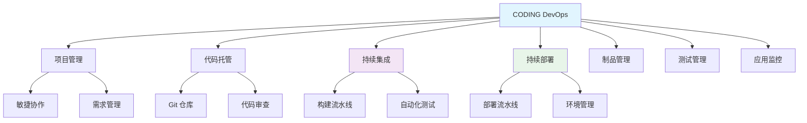

# 腾讯云 CODING DevOps

## 1. 概述

腾讯云 CODING DevOps 是一站式 DevOps 平台，提供从需求管理、代码托管、持续集成、持续部署到应用监控的全生命周期服务。

## 2. 核心概念

### 2.1 平台架构


### 2.2 关键特性
- **全生命周期管理**: 覆盖 DevOps 全流程
- **多云支持**: 支持腾讯云、私有云、混合云部署
- **企业级安全**: 多重安全防护和审计
- **可视化流水线**: 图形化编排 CI/CD 流程
- **丰富的模板**: 预置多种构建和部署模板
- **无缝集成**: 与主流开发工具深度集成

## 3. 项目配置

### 3.1 项目初始化
```yaml
# .coding.yml - 项目配置文件
version: "2.0"
project:
  name: "my-application"
  description: "企业级微服务应用"
  type: "DEV_OPS"
  settings:
    version_control: "git"
    credential_id: "coding-credentials"
    build_config:
      language: "java"
      framework: "spring-boot"
      jdk_version: "11"
      maven_version: "3.8.4"

# 代码库配置
repository:
  type: "git"
  url: "https://e.coding.net/your-team/my-application.git"
  branch_strategy:
    main: 
      protected: true
      required_review: 2
    develop:
      protected: false
      required_review: 1

# 环境配置
environments:
  - name: "development"
    type: "kubernetes"
    cluster: "dev-cluster"
    namespace: "dev"
    variables:
      ENV: "dev"
      DB_URL: "mysql-dev.example.com"
    
  - name: "staging"
    type: "kubernetes"
    cluster: "staging-cluster"
    namespace: "staging"
    variables:
      ENV: "staging"
      DB_URL: "mysql-staging.example.com"
    
  - name: "production"
    type: "kubernetes"
    cluster: "prod-cluster"
    namespace: "production"
    variables:
      ENV: "prod"
      DB_URL: "mysql-prod.example.com"
```

### 3.2 权限配置
```yaml
# coding-permissions.yml
teams:
  - name: "developers"
    permissions:
      - "repository:read"
      - "repository:write"
      - "ci:execute"
      - "artifact:read"
    members:
      - "user1@company.com"
      - "user2@company.com"

  - name: "qa"
    permissions:
      - "repository:read"
      - "test:execute"
      - "artifact:read"
    members:
      - "qa1@company.com"
      - "qa2@company.com"

  - name: "operations"
    permissions:
      - "cd:execute"
      - "monitoring:read"
      - "environment:manage"
    members:
      - "ops1@company.com"
      - "ops2@company.com"

# 项目角色
roles:
  - name: "project-admin"
    permissions:
      - "*:*"
  
  - name: "maintainer"
    permissions:
      - "repository:*"
      - "ci:*"
      - "cd:*"
      - "test:*"
  
  - name: "developer"
    permissions:
      - "repository:write"
      - "ci:execute"
      - "test:execute"
```

## 4. 持续集成 (CI)

### 4.1 构建流水线配置
```yaml
# .coding-ci.yml
version: "2.0"
name: "Java Application CI"
description: "Java应用持续集成流水线"

stages:
  - name: "代码检查"
    steps:
      - name: "代码质量扫描"
        type: "script"
        script:
          - echo "Running code quality checks..."
          - mvn checkstyle:check
          - mvn pmd:check
          - mvn spotbugs:check
        
      - name: "安全扫描"
        type: "script"
        script:
          - echo "Running security scans..."
          - trivy fs .
          - git secrets --scan

  - name: "编译构建"
    steps:
      - name: "编译项目"
        type: "script"
        script:
          - echo "Building application..."
          - mvn clean compile -DskipTests
        
      - name: "运行测试"
        type: "script"
        script:
          - echo "Running tests..."
          - mvn test -Dmaven.test.failure.ignore=true
        
      - name: "生成制品"
        type: "script"
        script:
          - echo "Packaging artifact..."
          - mvn package -DskipTests
          - mkdir -p target/artifact
          - cp target/*.jar target/artifact/
          - cp Dockerfile target/artifact/

  - name: "制品管理"
    steps:
      - name: "上传制品"
        type: "artifact"
        artifact:
          name: "app-${CI_COMMIT_SHORT_SHA}"
          files:
            - "target/artifact/*"
          type: "generic"
        
      - name: "构建Docker镜像"
        type: "docker_build"
        dockerfile: "Dockerfile"
        image: "registry.cn-shanghai.aliyuncs.com/your-namespace/app:${CI_COMMIT_SHORT_SHA}"
        tags:
          - "latest"
          - "${CI_COMMIT_SHORT_SHA}"

triggers:
  push:
    branches:
      - "main"
      - "develop"
    paths:
      - "src/**"
      - "pom.xml"
  
  pull_request:
    branches:
      - "main"
      - "develop"
  
  schedule:
    - cron: "0 2 * * *"  # 每天凌晨2点
    - cron: "0 0 * * 0"  # 每周日零点

variables:
  MAVEN_OPTS: "-Dmaven.repo.local=/cache/.m2/repository"
  JAVA_OPTS: "-Xmx2g -Xms1g"

cache:
  paths:
    - "/cache/.m2/repository"
    - "/cache/node_modules"
    - "/cache/go/pkg"
```

### 4.2 多语言构建模板
```yaml
# coding-templates.yml
templates:
  - name: "java-spring-boot"
    description: "Java Spring Boot应用模板"
    steps:
      - name: "setup-java"
        image: "maven:3.8-openjdk-11"
        script:
          - mvn --version
          - java --version
      
      - name: "build"
        script:
          - mvn clean compile
      
      - name: "test"
        script:
          - mvn test
      
      - name: "package"
        script:
          - mvn package -DskipTests

  - name: "nodejs-react"
    description: "Node.js React应用模板"
    steps:
      - name: "setup-node"
        image: "node:16-alpine"
        script:
          - node --version
          - npm --version
      
      - name: "install"
        script:
          - npm install
      
      - name: "build"
        script:
          - npm run build
      
      - name: "test"
        script:
          - npm test

  - name: "go-microservice"
    description: "Go微服务模板"
    steps:
      - name: "setup-go"
        image: "golang:1.20"
        script:
          - go version
      
      - name: "build"
        script:
          - go build -o app ./cmd/main.go
      
      - name: "test"
        script:
          - go test ./...
      
      - name: "lint"
        script:
          - go vet ./...
          - golangci-lint run
```

## 5. 持续部署 (CD)

### 5.1 部署流水线配置
```yaml
# .coding-cd.yml
version: "2.0"
name: "Production Deployment"
description: "生产环境部署流水线"

stages:
  - name: "预部署检查"
    steps:
      - name: "环境验证"
        type: "script"
        script:
          - echo "验证Kubernetes集群连接..."
          - kubectl cluster-info
          - kubectl get nodes
      
      - name: "资源检查"
        type: "script"
        script:
          - echo "检查集群资源..."
          - kubectl get pods -n ${NAMESPACE}
          - kubectl get deployments -n ${NAMESPACE}

  - name: "部署应用"
    steps:
      - name: "部署到Kubernetes"
        type: "kubernetes_deploy"
        manifest: "deployment.yaml"
        namespace: "${NAMESPACE}"
        strategy: "rolling"
        timeout: "300s"
      
      - name: "验证部署"
        type: "script"
        script:
          - echo "验证部署状态..."
          - kubectl rollout status deployment/app -n ${NAMESPACE} --timeout=300s
          - kubectl get pods -n ${NAMESPACE} -l app=app

  - name: "后置处理"
    steps:
      - name: "运行健康检查"
        type: "script"
        script:
          - echo "运行健康检查..."
          - curl -f http://app.${NAMESPACE}.svc.cluster.local:8080/health
      
      - name: "发送通知"
        type: "webhook"
        url: "https://api.example.com/notifications"
        method: "POST"
        body: |
          {
            "event": "deployment_success",
            "application": "app",
            "environment": "${NAMESPACE}",
            "version": "${CI_COMMIT_SHORT_SHA}",
            "timestamp": "$(date -Iseconds)"
          }

environments:
  - name: "staging"
    namespace: "staging"
    variables:
      REPLICAS: "2"
      CPU_LIMIT: "500m"
      MEMORY_LIMIT: "512Mi"
  
  - name: "production"
    namespace: "production"
    variables:
      REPLICAS: "3"
      CPU_LIMIT: "1000m"
      MEMORY_LIMIT: "1Gi"

approvals:
  - stage: "部署应用"
    environment: "production"
    required: true
    approvers:
      - "ops-lead@company.com"
      - "tech-director@company.com"
    timeout: "24h"
```

### 5.2 Kubernetes 部署配置
```yaml
# deployment.yaml
apiVersion: apps/v1
kind: Deployment
metadata:
  name: app
  namespace: ${NAMESPACE}
  labels:
    app: app
    environment: ${ENV}
spec:
  replicas: ${REPLICAS}
  selector:
    matchLabels:
      app: app
  strategy:
    type: RollingUpdate
    rollingUpdate:
      maxSurge: 1
      maxUnavailable: 0
  template:
    metadata:
      labels:
        app: app
        version: ${CI_COMMIT_SHORT_SHA}
    spec:
      containers:
      - name: app
        image: ${IMAGE}:${CI_COMMIT_SHORT_SHA}
        ports:
        - containerPort: 8080
        resources:
          requests:
            cpu: 100m
            memory: 128Mi
          limits:
            cpu: ${CPU_LIMIT}
            memory: ${MEMORY_LIMIT}
        livenessProbe:
          httpGet:
            path: /health
            port: 8080
          initialDelaySeconds: 30
          periodSeconds: 10
        readinessProbe:
          httpGet:
            path: /health
            port: 8080
          initialDelaySeconds: 5
          periodSeconds: 5
        env:
        - name: ENVIRONMENT
          value: ${ENV}
        - name: VERSION
          value: ${CI_COMMIT_SHORT_SHA}

---
apiVersion: v1
kind: Service
metadata:
  name: app-service
  namespace: ${NAMESPACE}
spec:
  selector:
    app: app
  ports:
  - port: 80
    targetPort: 8080
  type: ClusterIP
```

## 6. 制品管理

### 6.1 制品仓库配置
```yaml
# artifact-management.yml
repositories:
  - name: "docker-registry"
    type: "docker"
    url: "registry.cn-shanghai.aliyuncs.com"
    credentials: "docker-credentials"
    policies:
      retention_days: 30
      max_versions: 100
      allow_overwrite: false

  - name: "maven-repository"
    type: "maven"
    url: "https://maven.coding.net/repository"
    credentials: "maven-credentials"
    policies:
      retention_days: 90
      max_versions: 500

  - name: "npm-registry"
    type: "npm"
    url: "https://npm.coding.net"
    credentials: "npm-credentials"
    policies:
      retention_days: 60
      max_versions: 200

  - name: "generic-artifacts"
    type: "generic"
    path: "/artifacts"
    policies:
      retention_days: 365
      max_versions: 1000

# 制品发布策略
release_policies:
  - name: "auto-release"
    conditions:
      - branch: "main"
        environment: "production"
    actions:
      - type: "promote"
        from: "staging"
        to: "production"
      - type: "notify"
        channel: "slack"
        message: "New version released to production"

  - name: "manual-release"
    conditions:
      - branch: "develop"
        environment: "staging"
    actions:
      - type: "require_approval"
        approvers: ["qa-lead@company.com"]
      - type: "promote"
        from: "development"
        to: "staging"
```

## 7. 测试管理

### 7.1 自动化测试配置
```yaml
# testing-pipeline.yml
version: "2.0"
name: "Automated Testing"
description: "自动化测试流水线"

stages:
  - name: "单元测试"
    steps:
      - name: "运行单元测试"
        type: "script"
        script:
          - mvn test -Dtest=**/*Test.java
        reports:
          junit: "target/surefire-reports/*.xml"
      
      - name: "代码覆盖率"
        type: "script"
        script:
          - mvn jacoco:report
        reports:
          coverage: "target/site/jacoco/**/*.xml"

  - name: "集成测试"
    steps:
      - name: "启动测试环境"
        type: "script"
        script:
          - docker-compose -f docker-compose.test.yml up -d
          - ./wait-for-services.sh
      
      - name: "运行集成测试"
        type: "script"
        script:
          - mvn test -Dtest=**/*IT.java -Dgroups=integration
        reports:
          junit: "target/failsafe-reports/*.xml"
      
      - name: "清理环境"
        type: "script"
        script:
          - docker-compose -f docker-compose.test.yml down

  - name: "性能测试"
    steps:
      - name: "运行性能测试"
        type: "script"
        script:
          - mvn gatling:test
        reports:
          performance: "target/gatling/**/*.log"

  - name: "安全测试"
    steps:
      - name: "漏洞扫描"
        type: "script"
        script:
          - trivy image ${IMAGE}:${CI_COMMIT_SHORT_SHA}
          - zap-baseline.py -t http://app:8080
        reports:
          security: "**/trivy-report.json"

test_environments:
  - name: "integration-test"
    type: "docker-compose"
    compose_file: "docker-compose.test.yml"
    services:
      - "postgres:13"
      - "redis:7"
      - "app:latest"
  
  - name: "performance-test"
    type: "kubernetes"
    namespace: "perf-test"
    resources:
      cpu: "2"
      memory: "4Gi"
```

## 8. 监控与告警

### 8.1 应用监控配置
```yaml
# monitoring-config.yml
monitoring:
  metrics:
    enabled: true
    interval: "30s"
    endpoints:
      - path: "/actuator/prometheus"
        port: 8080
    
  logging:
    enabled: true
    level: "INFO"
    exporters:
      - type: "elasticsearch"
        url: "http://elasticsearch:9200"
      - type: "loki"
        url: "http://loki:3100"
    
  tracing:
    enabled: true
    provider: "jaeger"
    url: "http://jaeger:14268/api/traces"
    
  alerts:
    - name: "high-cpu-usage"
      condition: "cpu_usage > 80%"
      duration: "5m"
      severity: "warning"
      receivers:
        - "slack#dev-alerts"
        - "email#ops-team"
    
    - name: "service-down"
      condition: "up == 0"
      duration: "2m"
      severity: "critical"
      receivers:
        - "sms#on-call"
        - "slack#dev-alerts"
    
    - name: "high-latency"
      condition: "response_time > 1000ms"
      duration: "10m"
      severity: "warning"
      receivers:
        - "slack#dev-alerts"

dashboard:
  enabled: true
  templates:
    - name: "application-overview"
      title: "应用概览"
      metrics:
        - "cpu_usage"
        - "memory_usage"
        - "request_rate"
        - "error_rate"
    
    - name: "business-metrics"
      title: "业务指标"
      metrics:
        - "order_count"
        - "user_activity"
        - "conversion_rate"
```

## 9. 权限与安全

### 9.1 安全策略配置
```yaml
# security-policy.yml
security:
  access_control:
    - resource: "repository"
      actions: ["read", "write"]
      conditions:
        - branch: "main"
          required_approvals: 2
        - branch: "develop"
          required_approvals: 1
    
    - resource: "environment:production"
      actions: ["deploy"]
      conditions:
        - required_approvals: 2
        - allowed_users: ["ops-team@company.com"]
    
  secrets_management:
    providers:
      - name: "coding-secrets"
        type: "coding"
      
      - name: "vault"
        type: "hashicorp-vault"
        url: "https://vault.example.com"
        auth: "kubernetes"
    
    policies:
      - name: "db-credentials"
        path: "database/*"
        allowed_environments: ["production", "staging"]
      
      - name: "api-keys"
        path: "api/*"
        allowed_environments: ["production"]
  
  compliance:
    rules:
      - name: "no-hardcoded-secrets"
        type: "git-secrets"
        pattern: "(?i)password|secret|key|token"
        severity: "high"
      
      - name: "vulnerability-scan"
        type: "trivy"
        severity: "critical"
        allowed_count: 0
      
      - name: "code-coverage"
        type: "jacoco"
        threshold: 80%
        severity: "medium"
```

## 10. 流水线优化

### 10.1 性能优化配置
```yaml
# pipeline-optimization.yml
optimization:
  cache_strategy:
    enabled: true
    paths:
      - "/cache/.m2/repository"
      - "/cache/node_modules"
      - "/cache/go/pkg"
      - "/cache/python/packages"
    policy: "pull-push"
  
  parallel_execution:
    enabled: true
    max_parallel: 4
    stages:
      - name: "代码检查"
        parallel: true
        steps: ["代码质量扫描", "安全扫描"]
      
      - name: "测试"
        parallel: true
        steps: ["单元测试", "集成测试", "性能测试"]
  
  resource_management:
    default:
      cpu: 2
      memory: "4Gi"
    stages:
      - name: "编译构建"
        resources:
          cpu: 4
          memory: "8Gi"
      
      - name: "性能测试"
        resources:
          cpu: 8
          memory: "16Gi"
  
  retry_policy:
    enabled: true
    max_attempts: 3
    backoff: "exponential"
    stages:
      - name: "部署应用"
        retry: true
        conditions:
          - "network_error"
          - "timeout"
```
