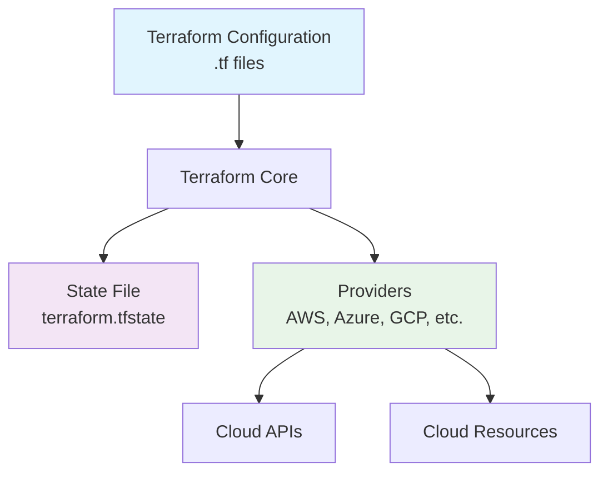

# Terraform

## 1. 概述

Terraform 是一个开源的基础设施即代码（IaC）工具，由 HashiCorp 开发。它允许用户使用声明式配置语言（HCL）来定义、配置和管理云基础设施资源。Terraform 支持多云和混合云环境，提供一致的工作流来管理基础设施生命周期。

## 2. 核心概念

### 2.1 架构组件


### 2.2 关键术语
- **Provider**: 基础设施提供商（AWS、Azure、GCP等）的插件
- **Resource**: 基础设施组件（实例、网络、存储等）的定义
- **Module**: 可重用的配置单元
- **State**: 当前基础设施状态的记录
- **Plan**: 执行前的变更预览
- **Apply**: 执行配置变更
- **Variable**: 输入参数
- **Output**: 输出值

## 3. 快速开始

### 3.1 安装和配置
```bash
# 安装 Terraform
# Linux
curl -fsSL https://apt.releases.hashicorp.com/gpg | sudo apt-key add -
sudo apt-add-repository "deb [arch=amd64] https://apt.releases.hashicorp.com $(lsb_release -cs) main"
sudo apt-get update && sudo apt-get install terraform

# macOS
brew install terraform

# 验证安装
terraform version

# 初始化工作目录
terraform init

# 验证配置
terraform validate

# 查看执行计划
terraform plan

# 应用配置
terraform apply
```

### 3.2 基础配置
```hcl
# main.tf
terraform {
  required_version = ">= 1.0.0"
  
  required_providers {
    aws = {
      source  = "hashicorp/aws"
      version = "~> 4.0"
    }
  }

  backend "s3" {
    bucket = "my-terraform-state"
    key    = "terraform.tfstate"
    region = "us-east-1"
  }
}

# 配置 AWS provider
provider "aws" {
  region = "us-east-1"

  default_tags {
    tags = {
      Environment = "production"
      ManagedBy   = "terraform"
    }
  }
}

# 创建 VPC
resource "aws_vpc" "main" {
  cidr_block           = "10.0.0.0/16"
  enable_dns_hostnames = true
  enable_dns_support   = true

  tags = {
    Name = "main-vpc"
  }
}
```

## 4. 资源配置详解

### 4.1 网络资源
```hcl
# 创建子网
resource "aws_subnet" "public" {
  count             = 3
  vpc_id            = aws_vpc.main.id
  cidr_block        = cidrsubnet(aws_vpc.main.cidr_block, 8, count.index)
  availability_zone = element(["us-east-1a", "us-east-1b", "us-east-1c"], count.index)

  tags = {
    Name = "public-subnet-${count.index + 1}"
  }
}

# 创建安全组
resource "aws_security_group" "web" {
  name        = "web-sg"
  description = "Security group for web servers"
  vpc_id      = aws_vpc.main.id

  ingress {
    from_port   = 80
    to_port     = 80
    protocol    = "tcp"
    cidr_blocks = ["0.0.0.0/0"]
  }

  ingress {
    from_port   = 443
    to_port     = 443
    protocol    = "tcp"
    cidr_blocks = ["0.0.0.0/0"]
  }

  egress {
    from_port   = 0
    to_port     = 0
    protocol    = "-1"
    cidr_blocks = ["0.0.0.0/0"]
  }

  tags = {
    Name = "web-security-group"
  }
}
```

### 4.2 计算资源
```hcl
# 创建 EC2 实例
resource "aws_instance" "web" {
  count         = 2
  ami           = "ami-0c55b159cbfafe1f0"
  instance_type = "t3.micro"
  subnet_id     = aws_subnet.public[count.index].id

  vpc_security_group_ids = [aws_security_group.web.id]
  key_name               = aws_key_pair.deployer.key_name

  user_data = <<-EOF
              #!/bin/bash
              apt-get update
              apt-get install -y nginx
              systemctl start nginx
              EOF

  tags = {
    Name = "web-server-${count.index + 1}"
  }

  lifecycle {
    create_before_destroy = true
    ignore_changes        = [ami]
  }
}

# 创建密钥对
resource "aws_key_pair" "deployer" {
  key_name   = "deployer-key"
  public_key = file("~/.ssh/id_rsa.pub")
}
```

### 4.3 存储资源
```hcl
# 创建 S3 Bucket
resource "aws_s3_bucket" "data" {
  bucket = "my-app-data-${random_id.suffix.hex}"
  acl    = "private"

  versioning {
    enabled = true
  }

  server_side_encryption_configuration {
    rule {
      apply_server_side_encryption_by_default {
        sse_algorithm = "AES256"
      }
    }
  }

  lifecycle_rule {
    enabled = true

    transition {
      days          = 30
      storage_class = "STANDARD_IA"
    }

    transition {
      days          = 60
      storage_class = "GLACIER"
    }
  }
}

# 随机后缀用于唯一性
resource "random_id" "suffix" {
  byte_length = 4
}
```

## 5. 模块化设计

### 5.1 模块结构
```
modules/
└── vpc/
    ├── main.tf
    ├── variables.tf
    ├── outputs.tf
    └── README.md
```

### 5.2 模块定义
```hcl
# modules/vpc/main.tf
resource "aws_vpc" "this" {
  cidr_block           = var.cidr_block
  enable_dns_hostnames = var.enable_dns_hostnames
  enable_dns_support   = var.enable_dns_support

  tags = merge(
    var.tags,
    {
      Name = var.name
    }
  )
}

resource "aws_subnet" "public" {
  count = length(var.public_subnets)

  vpc_id            = aws_vpc.this.id
  cidr_block        = var.public_subnets[count.index]
  availability_zone = element(var.availability_zones, count.index)

  tags = merge(
    var.tags,
    {
      Name = "${var.name}-public-${count.index + 1}"
    }
  )
}
```

### 5.3 模块使用
```hcl
# 使用自定义模块
module "vpc" {
  source = "./modules/vpc"

  name               = "main-vpc"
  cidr_block         = "10.0.0.0/16"
  public_subnets     = ["10.0.1.0/24", "10.0.2.0/24", "10.0.3.0/24"]
  availability_zones = ["us-east-1a", "us-east-1b", "us-east-1c"]
  tags = {
    Environment = "production"
  }
}

# 使用官方模块
module "eks" {
  source  = "terraform-aws-modules/eks/aws"
  version = "~> 19.0"

  cluster_name    = "my-cluster"
  cluster_version = "1.27"

  vpc_id     = module.vpc.vpc_id
  subnet_ids = module.vpc.public_subnets

  eks_managed_node_groups = {
    default = {
      min_size     = 1
      max_size     = 3
      desired_size = 2

      instance_types = ["t3.medium"]
    }
  }
}
```

## 6. 变量和输出

### 6.1 变量定义
```hcl
# variables.tf
variable "region" {
  description = "AWS region"
  type        = string
  default     = "us-east-1"
}

variable "instance_type" {
  description = "EC2 instance type"
  type        = string
  default     = "t3.micro"

  validation {
    condition     = contains(["t3.micro", "t3.small", "t3.medium"], var.instance_type)
    error_message = "Invalid instance type. Must be t3.micro, t3.small, or t3.medium."
  }
}

variable "subnet_cidrs" {
  description = "List of subnet CIDR blocks"
  type        = list(string)
  default     = ["10.0.1.0/24", "10.0.2.0/24"]
}

variable "tags" {
  description = "Resource tags"
  type        = map(string)
  default     = {}
}
```

### 6.2 输出定义
```hcl
# outputs.tf
output "vpc_id" {
  description = "VPC ID"
  value       = aws_vpc.main.id
}

output "public_subnets" {
  description = "List of public subnet IDs"
  value       = aws_subnet.public[*].id
}

output "web_instance_ips" {
  description = "Public IP addresses of web instances"
  value       = aws_instance.web[*].public_ip
}

output "s3_bucket_arn" {
  description = "S3 bucket ARN"
  value       = aws_s3_bucket.data.arn
  sensitive   = true
}
```

## 7. 状态管理

### 7.1 远程状态
```hcl
# backend.tf
terraform {
  backend "s3" {
    bucket         = "my-terraform-state-bucket"
    key            = "production/terraform.tfstate"
    region         = "us-east-1"
    encrypt        = true
    dynamodb_table = "terraform-lock"
  }
}
```

### 7.2 工作区管理
```bash
# 创建工作区
terraform workspace new development
terraform workspace new staging
terraform workspace new production

# 切换工作区
terraform workspace select development

# 列出工作区
terraform workspace list

# 删除工作区
terraform workspace delete staging
```

### 7.3 状态操作
```bash
# 查看状态
terraform state list
terraform state show aws_instance.web[0]

# 导入现有资源
terraform import aws_instance.web i-1234567890abcdef0

# 移动资源
terraform state mv aws_instance.old aws_instance.new

# 删除资源状态
terraform state rm aws_instance.removed
```

## 8. CI/CD 集成

### 8.1 Terraform in Pipeline
```yaml
# .github/workflows/terraform.yml
name: Terraform CI/CD

on:
  push:
    branches: [ main ]
  pull_request:
    branches: [ main ]

env:
  TF_VERSION: 1.5.0
  AWS_REGION: us-east-1

jobs:
  terraform:
    runs-on: ubuntu-latest
    environment: production

    steps:
    - name: Checkout code
      uses: actions/checkout@v4

    - name: Setup Terraform
      uses: hashicorp/setup-terraform@v2
      with:
        terraform_version: ${{ env.TF_VERSION }}

    - name: Terraform Format
      run: terraform fmt -check

    - name: Terraform Init
      run: terraform init
      env:
        AWS_ACCESS_KEY_ID: ${{ secrets.AWS_ACCESS_KEY_ID }}
        AWS_SECRET_ACCESS_KEY: ${{ secrets.AWS_SECRET_ACCESS_KEY }}

    - name: Terraform Validate
      run: terraform validate

    - name: Terraform Plan
      run: terraform plan -out=tfplan
      env:
        AWS_ACCESS_KEY_ID: ${{ secrets.AWS_ACCESS_KEY_ID }}
        AWS_SECRET_ACCESS_KEY: ${{ secrets.AWS_SECRET_ACCESS_KEY }}

    - name: Terraform Apply
      if: github.ref == 'refs/heads/main'
      run: terraform apply -auto-approve tfplan
      env:
        AWS_ACCESS_KEY_ID: ${{ secrets.AWS_ACCESS_KEY_ID }}
        AWS_SECRET_ACCESS_KEY: ${{ secrets.AWS_SECRET_ACCESS_KEY }}
```

### 8.2 安全最佳实践
```hcl
# 使用敏感变量
variable "db_password" {
  description = "Database password"
  type        = string
  sensitive   = true
}

# 使用数据源获取机密
data "aws_secretsmanager_secret" "db_credentials" {
  name = "database/credentials"
}

data "aws_secretsmanager_secret_version" "db_credentials" {
  secret_id = data.aws_secretsmanager_secret.db_credentials.id
}

# 使用 IAM 角色而不是访问密钥
provider "aws" {
  region = "us-east-1"
  
  assume_role {
    role_arn = "arn:aws:iam::123456789012:role/TerraformRole"
  }
}
```

## 9. 运维和监控

### 9.1 执行和调试
```bash
# 详细输出
terraform plan -verbose
terraform apply -verbose

# 调试模式
TF_LOG=DEBUG terraform plan
TF_LOG=TRACE terraform apply

# 保存执行计划
terraform plan -out=plan.tfplan
terraform apply plan.tfplan

# 刷新状态
terraform refresh

# 销毁资源
terraform destroy
terraform destroy -target=aws_instance.web
```

### 9.2 性能优化
```hcl
# 使用并行处理
provider "aws" {
  region = "us-east-1"
  
  # 增加并行度
  parallelism = 20
}

# 使用数据源缓存
data "aws_ami" "latest_amazon_linux" {
  most_recent = true
  owners      = ["amazon"]

  filter {
    name   = "name"
    values = ["amzn2-ami-hvm-*-x86_64-gp2"]
  }
}

# 使用 depends_on 优化依赖
resource "aws_instance" "web" {
  depends_on = [aws_security_group.web]
  
  # ... 其他配置
}
```

### 9.3 监控和审计
```bash
# 查看变更历史
terraform plan -out=plan.tfplan
terraform show -json plan.tfplan > plan.json

# 使用 terraform-docs 生成文档
terraform-docs markdown table ./

# 使用 checkov 进行安全扫描
checkov -d ./

# 使用 tfsec 进行安全分析
tfsec ./
```